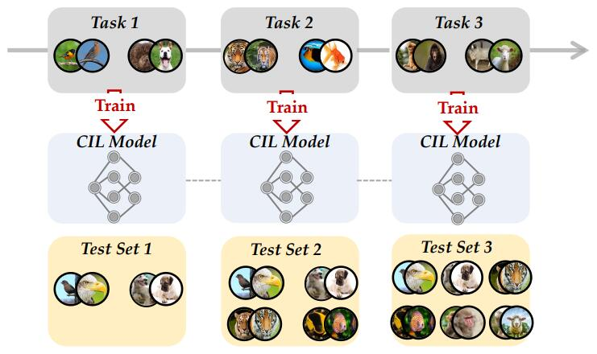
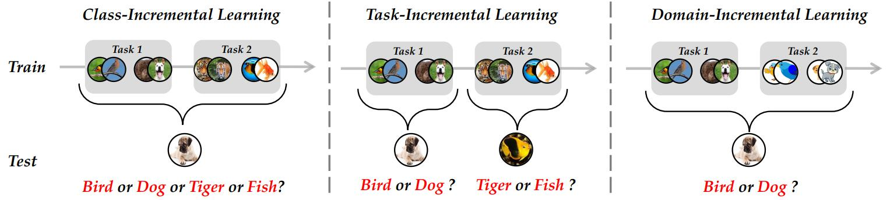

# [Deep Class-Incremental Learning: A Survey](https://arxiv.org/abs/2302.03648)

## Abstract

深度模型（例如卷积神经网络和 Vision Transformer）在封闭世界的许多视觉任务上取得了令人印象深刻的成就。然而，在我们不断变化的世界里，新类总是会不断出现，这需要学习系统能够持续获取新的知识。例如，机器人需要理解新的指令，舆情监测系统每天都需要分析新兴话题。类增量学习 (CIL) 使学习者能够逐步地融入新类别的知识，并在所有见过的类别之间构建一个通用分类器。然而，当直接用新类别的实例训练模型时，会出现一个致命的问题 - 模型倾向于灾难性地遗忘先前类别特征，其性能会急剧下降。机器学习界已经做出了许多努力来解决灾难性遗忘问题。本文全面综述了深度类增量学习的最新进展，并从数据中心、模型中心和算法中心三个方面总结了这些方法。我们还对 16 种方法在基准图像分类任务中进行了严格统一的评估，以期通过实证研究发现不同算法的特征。此外，我们注意到当前的比较协议忽略了内存预算对模型存储的影响，这可能会导致不公平的比较和偏差的结果。因此，我们提倡在评估过程中对齐内存预算进行公平比较，并引入几种与内存无关的性能度量。用于重现这些评估的源代码可在 https://github.com/zhoudw-zdw/CIL_Survey/ 获得。

## 1 INTRODUCTION

近年来，深度学习领域发展迅速，深度神经网络在许多领域已经取得甚至超越人类水平的性能 [1, 2, 3]。深度网络的典型训练过程需要预先收集数据集，例如大规模图像 [4] 或文本 [5]，网络会经历预先收集数据集的多个训练周期。然而，在开放世界中，训练数据通常是流式格式 [6, 7]。由于存储限制 [8, 9] 或隐私问题 [10, 11]，这些流式数据无法长时间保存，需要模型仅使用新类别的实例进行增量更新。这些需求促进了类增量学习 (CIL) 领域的繁荣，旨在持续地在所有已见过的类别之间构建一个整体分类器。CIL 中的致命问题称为灾难性遗忘，即直接用新类别优化网络会抹掉先前类别的知识，并导致性能不可逆转地下降。因此，如何有效抵抗灾难性遗忘成为构建 CIL 模型的核心问题。

**图 1**： 类增量学习的设置。非重叠类别依次出现，模型需要逐步学习并分类所有类别。在每个任务的学习过程之后，模型都会在所有见过的类别上进行评估。理想的模型在新学习的类别上应该表现良好，并且在没有灾难性遗忘的情况下记住以前的类别。

图 1 描绘了 CIL 的典型设置。训练数据以流式格式依次出现。在每个时间戳，我们可以获得一个新的训练数据集（图中称为“任务”），并需要用新类别更新模型。例如，模型在第一个任务中学习“鸟”和“狗”，在第二个任务中学习“老虎”和“鱼”，在第三个任务中学习“猴子”和“羊”等等。然后，模型将在所有见过的类别之间进行测试，以评估它是否能够区分它们。一个好的模型应该在描述新类特征和保持先前学习的旧类模式之间取得平衡。这种权衡也称为神经系统中的“稳定性-可塑性困境” [12]，其中稳定性表示维持先前知识的能力，可塑性表示适应新模式的能力。

**图 2**：类增量学习 (CIL)、任务增量学习 (TIL) 和 领域增量学习 (DIL) 的设置。CIL 和 TIL 共享相同的训练协议，而 TIL 在推理阶段要容易得多，即只需要在对应的标签空间内进行分类。DIL 指的是分布变化的数据流，其中新任务包含来自不同领域的相同类别，例如卡通和剪贴画。

除了类增量学习之外，还有一些其他的细粒度设定来解决增量学习问题，例如任务增量学习 (TIL) 和领域增量学习 (DIL)。我们在图 2 中展示了这三种协议。TIL 与 CIL 的设置类似，两者都观察到新任务中的新类。然而，区别在于推理阶段，CIL 要求模型区分所有类别。相比之下，TIL 只需要在对应任务空间内对实例进行分类。换句话说，它不需要跨任务的辨别能力。因此，TIL 比 CIL 更简单，可以看作是 CIL 的一个特例。另一方面，DIL 关注的是概念漂移或分布变化的情景 [13, 14]，其中新任务包含来自不同领域但具有相同标签空间的实例。在这种情况下，新领域对应于剪贴画格式的图像。在本文中，我们将重点放在 CIL 设置上，这是一个更具挑战性的开放世界场景。

在深度学习蓬勃发展之前，也存在关于类增量学习 (CIL) 的研究 [15]。典型的方法试图用传统机器学习模型解决灾难性遗忘问题。然而，它们大多数只针对两个任务内的增量学习，即模型仅通过单个新阶段进行更新。此外，数据采集和处理的快速发展要求模型能够掌握传统机器学习模型无法处理的长期和大规模的数据流。具有强大表示能力的深度神经网络非常适合这些需求。因此，基于深度学习的类增量学习正成为机器学习和计算机视觉领域的热门话题。

有多篇相关的综述讨论了增量学习问题。例如，[11] 侧重于任务增量学习 (TIL) 问题，并提供了全面的综述。[19] 是类增量学习领域的相关综述，但仅讨论和评估了 2020 年之前的各种方法。然而，随着类增量学习领域的快速发展，许多优秀的作品正日益涌现，这些作品大大提升了基准设置的性能 [20, 21, 22, 23]。另一方面，随着 Vision Transformer (ViT) [24] 和预训练模型的兴起，关于 ViT 在类增量学习中的应用的热烈讨论正引起社区的关注。其他综述要么专注于特定领域，要么缺乏对最新技术进展的性能演变的研究。因此，迫切需要提供一个包含流行方法的最新综述，以加快类增量学习领域的发展。

在本文中，我们旨在从数据中心、模型中心和算法中心三个方面对深度类增量学习方法进行全面综述。我们还提供了基准数据集（即 CIFAR100 [31] 和 ImageNet100/1000 [4]）上不同类型方法之间的整体比较。另一方面，我们强调了类增量学习模型评估中的一个重要因素，即内存预算，并提倡在相同预算下对不同方法进行公平比较。相应地，我们通过与预算无关的度量标准整体评估类增量学习模型的可扩展性。总而言之，本综述的贡献可以总结如下：

- 我们提供了深度类增量学习的全面综述，涵盖问题定义、基准数据集和不同系列的类增量学习方法。我们通过分类表格 (表 1) 和时间顺序图 (图 3) 对这些算法进行分类和排序，以便全面概览当前最先进的方法。
- 我们对几种公开数据集上的不同方法进行了严格统一的比较，包括传统的基于 CNN 的方法和现代的基于 ViT 的方法。我们还将讨论见解并总结共同的规则，以启发未来的研究。
- 为了促进现实世界的应用，类增量学习模型不仅应该部署在高性能计算机上，还应该部署在边缘设备上。因此，我们提倡通过强调内存预算的影响来整体评估不同方法。相应地，我们对不同方法在特定预算下以及几种新的性能度量上进行了全面评估。

本文其余部分安排如下。首先，我们在第 2 节给出类增量学习的问题定义。然后，我们在第 3 节按分类对当前的类增量学习方法进行整理，并在第 4 节提供全面的评估。最后，我们在第 5 节总结类增量学习的未来方向，然后结束本文。

## 2 PRELIMINARIES

在本节中，我们首先给出类增量学习的问题定义。我们还将讨论其他的一些变体和类增量学习模型分解。然后，我们将介绍类增量学习中常用的辅助集合，即示例集。

### 2.1 Problem Formulation

**定义 1. 类增量学习**旨在从不断演化的包含新类的数据流中学习 [32]。假设存在一个由 $B$ 个训练任务组成的序列 $\set{\mathcal{D}^1, \mathcal{D}^2, \cdots, \mathcal{D}^B}$ ，这些任务没有重叠的类别，其中 $\large \mathcal{D}^b = \set{(\mathbf{x}_i^b, y_i^b)}_{i=1}^{n_b}$ 表示第 $b$ 个增量步骤，包含 $n_b$ 个训练实例。 $\mathbf{x}_b^i \in \R^D$ 是类别 $y_b^i \in Y_b$ 的一个实例， $Y_b$ 是任务 $b$ 的标签空间，其中对于 $b \neq b^{\prime} , Y_b \cap Y_{b^{\prime}} = \varnothing$ 。训练任务 $b$ 时只能访问来自 $\mathcal{D}^b$ 的数据。CLI 的最终目标是持续构建一个可以对所有类别进行分类的模型。换句话说，模型不仅应该获取当前任务 $\mathcal{D}^b$ 的知识，还应该保留来自先前任务的知识。每次任务完成后，训练后的模型都会在所有见过的类别 $\mathcal{Y}_b = Y_1 \cup \cdots \cup Y_b$ 上进行评估。形式上，类增量学习的目标是拟合一个模型 $f(x) : X → \mathcal{Y}_b$ ，该模型使期望风险最小化：
$$
\large f^{*} = \arg \min_{f \in \mathcal{H}} \mathbb{E}_{(x,y) \sim \mathcal{D}_t^1 \cup \cdots \mathcal{D}_t^b} \mathbb{I}(y \neq f(\mathbf{x})), \tag{1}
$$
其中 $\mathcal{H}$ 是假设空间， $\mathbb{I}(\cdot)$ 是指示函数，如果表达式成立则输出 1，否则输出 0。 $\mathcal{D}_t^b$ 表示任务 $b$ 的数据分布。一个好的 CIL 模型需要满足公式 1，能够区分所有类别，不仅在新类别上表现良好，还能保留以前类别的知识。

