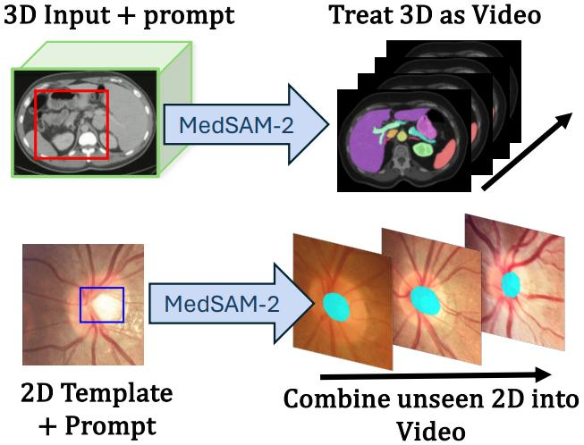
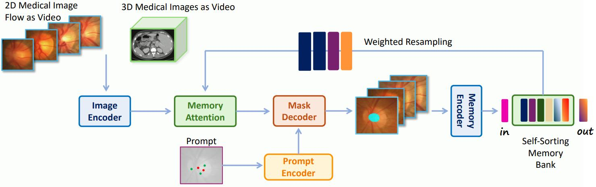

# [Medical SAM 2: Segment medical images as video via Segment Anything Model 2](https://arxiv.org/abs/2408.00874)

## Abstract

医学图像分割在临床诊断和治疗计划中起着至关重要的作用，然而，现有的模型在泛化以及统一处理 2D 和 3D 数据方面常常面临挑战。在本文中，我们介绍了 Medical SAM 2 (MedSAM-2)，这是一种通用的自动跟踪模型，用于通用的 2D 和 3D 医学图像分割。其核心概念是利用 Segment Anything Model 2 (SAM2) 的流程，将所有 2D 和 3D 医学分割任务视为视频对象跟踪问题。为了将其付诸实践，我们提出了一种新颖的自排序记忆库机制，该机制基于置信度和差异性动态选择信息丰富的嵌入，而无需考虑时间顺序。这种机制不仅显著提高了 3D 医学图像分割的性能，还为 2D 图像解锁了单提示分割 (One-Prompt Segmentation) 的能力，允许从单个提示跨多个图像进行分割，而无需考虑时间关系。我们在五个 2D 任务和九个 3D 任务上评估了 MedSAM-2，包括白细胞、视杯、视网膜血管、下颌骨、冠状动脉、肾肿瘤、肝肿瘤、乳腺癌、鼻咽癌、前庭神经鞘瘤、纵隔淋巴结、大脑动脉、下牙槽神经和腹部器官，并将其与任务定制、通用和交互式分割设置中的最先进 (SOTA) 模型进行了比较。我们的研究结果表明，MedSAM-2 优于各种现有模型，并在多个基准测试中刷新了新的 SOTA。代码已在项目页面上发布：https://supermedintel.github.io/Medical-SAM2/。

**图 1**：

## 1. Introduction

人工智能已显著改变了各个行业，而医疗保健领域也正因医学图像理解的进步 [10, 38, 64–66] 而面临巨大的变革。医学图像分割涉及将图像划分为有意义的区域，对于诊断、治疗计划和图像引导手术 [72–74] 等应用至关重要。尽管使用卷积神经网络 (CNN) 和 Vision Transformer (ViT) 等深度学习模型进行自动化分割的方法取得了进展，但仍存在重大挑战 [4, 57]。一个主要问题是模型的泛化能力；在特定目标（如某些器官或组织）上训练的模型通常难以适应其他目标或模态。此外，许多深度学习架构是为 2D 图像设计的，而医学成像数据通常以 3D 格式存在（例如，CT、MRI），这在将这些模型应用于 3D 数据时造成了差距 [17, 50]。

最近，可提示分割模型的发展，特别是 Segment Anything Model (SAM) [38] 及其增强版本 SAM 2 [55]，在解决某些挑战方面显示出了希望。SAM 通过利用用户提供的提示来分割对象，而无需对特定目标进行预先训练，从而在图像分割任务中展现了卓越的零样本能力。然而，这种方法需要用户对每个图像进行交互，这在数据量庞大的临床环境中可能非常耗时且不切实际 [48]。SAM 2 将 SAM 的功能扩展到视频，引入了实时对象跟踪，并减少了用户交互时间。然而，它仍然依赖于帧之间的时间关系，限制了其在无序医学图像中的适用性，并且未能完全解决医学图像分割中的泛化挑战。

在这项工作中，我们介绍了 MedSAM-2，一种用于通用医学图像分割的通用自动跟踪模型。MedSAM-2 通过将医学图像视为视频并结合新颖的**自排序记忆库**来应对这些挑战。这种机制基于置信度和差异性动态选择信息丰富的嵌入，使模型能够有效地处理无序的医学图像。通过重新思考 SAM 2 中的记忆机制，MedSAM-2 不仅提高了 3D 医学图像分割的性能，还为 2D 医学图像解锁了单提示分割 (One-Prompt Segmentation) 的能力 [70]。这种能力使模型能够从单个提示泛化到跨多个图像进行分割，而无需考虑时间关系，从而显著减少了用户交互并提高了临床医生的便利性。

我们评估了 MedSAM-2 在 14 个不同的基准数据集上的性能，涵盖了 25 个不同的验证任务。与之前的全监督分割模型和基于 SAM 的交互式模型相比，MedSAM-2 在所有测试方法中都表现出卓越的性能，并在 2D 和 3D 医学图像分割任务中都取得了最先进的结果。具体而言，在单提示分割设置下，MedSAM-2 优于之前的基于基础模型的分割模型，从而展示了其卓越的泛化能力。我们的贡献可以总结如下：

**贡献**。(i) 我们推出了 MedSAM-2，这是第一个基于 SAM2 的通用自动跟踪模型，用于通用医学图像分割，能够以最少的用户干预统一处理 2D 和 3D 医学成像任务。(ii) 我们提出了一种新颖的自排序记忆库机制，该机制基于置信度和差异性动态选择信息丰富的嵌入，从而增强了模型处理无序医学图像的能力并提高了泛化能力。(iii) 我们评估了 MedSAM-2 在 15 个不同的基准数据集上的性能，包括 25 个不同的任务，结果表明，与之前的全监督和基于 SAM 的交互式模型相比，其性能更优。

**图 2**：

## 2. Related Works

**医学图像分割**。传统上，医学图像分割模型是任务特定的，为特定的目标（如特定的器官或组织）设计和优化 [12, 14]。这些为特定任务定制的模型利用每个任务的独特特征来实现高性能。例如，不确定性感知模块已被用于处理眼底图像中视杯分割的模糊性 [35]。然而，对任务特定模型的依赖带来了重大挑战。为每个分割任务设计和训练独特的模型既费力又耗时。此外，许多深度学习架构是为 2D 图像设计的，而医学成像数据通常以 3D 格式存在（例如，CT、MRI），这在将这些模型应用于 3D 数据时造成了差距 [17, 24–26, 50]。为了解决这些局限性，开发能够处理多任务和多模态的通用医学图像分割模型引起了越来越多的兴趣 [28, 72, 74]。这些模型旨在跨不同目标进行泛化，而无需进行任务特定的调整。然而，由于医学图像的性质各异，其外观、分辨率和解剖结构可能差异很大，因此实现鲁棒的泛化仍然是一个重大挑战。另一方面，我们的 MedSAM-2 是一种通用模型，可以处理多个领域，并可用于 2D 和 3D 医学图像分割。

**提示分割一切模型 (SAM)**。分割一切模型 (SAM) [38] 的引入标志着图像分割领域的重大进步。SAM 利用用户提供的提示来分割图像中的对象，而无需对特定目标进行预先训练，从而展示了卓越的零样本能力。在医学成像领域，SAM 的早期应用涉及对模型进行微调以适应不同的医学分割任务 [15, 18, 58, 73]。然而，这些方法仍然需要用户对每个图像进行交互，这在数据量庞大的临床环境中可能是不切实际的。为了减少对大量用户提示的依赖，研究人员探索了少样本和零样本分割方法 [20, 44, 52, 71]，从而能够以最少的标注样本适应新任务。例如，UniSeg [11] 仅需要少量标注样本即可在推理过程中处理整个未见过的分割任务。单提示分割 (One-Prompt Segmentation) [70] 进一步将 SAM 的交互式设置与零样本分割相结合，仅需要一个模板样本的视觉提示即可在后续样本中分割相似的目标，而无需重新训练。尽管如此，这些模型仍然主要关注 2D 医学图像，并且尚未针对 3D 医学成像的独特需求进行定制。我们的 MedSAM-2 使用自排序记忆库，使模型能够在无序医学图像上更好地泛化，同时以最少的提示要求利用 SAM 2 丰富的上下文视频预训练。

## 3. Method

我们介绍了 MedSAM-2，这是一个基于 SAM 2 [55] 的先进分割模型，专为医学图像分割任务定制。

### 3.1. Preliminaries on Segment Anything Model (SAM 2)

SAM 2 [55] 是一种可提示视觉分割模型，专为图像和视频任务设计。给定一个帧或图像的输入序列 $\large{\mathbf{X}} = \set{\mathbf{x}_t}_{t=1}^T$ 和可选的提示 $\large \mathbf{P} = \set{\mathbf{P}_t}_{t=1}^T$ ，该模型为每个帧 $\mathbf{x}_t$ 预测分割掩码 $\large \mathbf{Y} = \set{\mathbf{y}_t}_{t=1}^T$ 。该架构包括一个图像编码器 $\large \mathcal{E}_{\mathrm{img}}$ ，用于将每个帧 $\mathbf{x}_t$ 编码为特征嵌入 $\large \mathbf{F}_t = \mathcal{E}_{\mathrm{img}}(\mathbf{x}_t)$ ；一个提示编码器 $\large \mathcal{E}_{\mathrm{prompt}}$ ，用于处理用户提示 $\large \mathbf{P}_t$ ，生成嵌入 $\large \bf{Q}_t = \mathcal{E}_{\mathrm{prompt}} (\mathbf{P}_t)$ ；一个记忆库 $\large \mathcal{M}_t$ ，用于存储帧 $\mathbf{x}_t$ 之前的 $K$ 个过去的嵌入 $\large \mathbf{E}_i$ ；一个记忆注意力机制 $\mathcal{A}$ ，用于组合 $\large \mathbf{F}_t, \mathcal{M}_t, \mathbf{Q}_t$ ；以及一个掩码解码器 $\mathcal{D}$ ，用于预测分割掩码 $\mathbf{y}_t$ 。从数学上讲，分割过程可以表示为：

$$
\large \begin{matrix}
\mathbf{y}_t =& \mathcal{D}(\mathcal{A}(\mathbf{F}_t,\mathcal{M}_t,\mathbf{Q}_t)), \ \mathrm{for} \ t = 1, \cdots, T, \\
\mathcal{M}_t =& \left \{ \mathbf{E}_i \ | \ i \in \set{\max(j,0)}_{j=t-K-1}^{t-1} \right \},
\end{matrix} \tag{1}
$$

### 3.2. MedSAM-2: Self-Sorting SAM2 for Medical Imaging

尽管 SAM2 在自然图像上取得了巨大的成功，但直接将其应用于医学图像并非易事。在医学成像中，由于采集协议和方向各异，切片或图像的顺序可能没有意义。此外，2D 医学图像通常是无序的，而 3D 成像中的每个方向都可以被视为一个独立的序列，需要以不同的顺序进行整合。为了解决这个问题，我们提出了一种**自排序记忆库** $\large \mathcal{M}_t^{\mathrm{sort}}$ ，它动态地选择和保留最具信息量的嵌入，而不是像 SAM 2 [55] 中那样简单地使用最近的 $K$ 帧。

**基于置信度和差异性的记忆库更新**。 在每个时间步 $t$，我们基于 $\large \mathcal{M}_{t-1}^{\mathrm{sort}}$ 和前一帧的嵌入 $\large \mathbf{E}_{t-1}$ 来更新自排序记忆库 $\large \mathcal{M}_t^{\mathrm{sort}}$ 。首先，模型预测分割掩码 $\large \mathbf{y}_{t-1}$ 并计算帧 $t − 1$ 的 IOU 置信度分数 $\large c_{t-1}$ ，该分数由模型本身估计。如果置信度分数满足 $\large c_{t-1} \geq c_{\mathrm{thresh}}$ ，我们考虑将 $\large \mathbf{E}_{t-1}$ 添加到记忆库中。我们形成一个候选集 $\large \mathcal{C} = \mathcal{M}_{t-1}^{\mathrm{sort}} \cup \set{\mathbf{E}_{t-1}}$ 。为了保持多样性，我们计算 $\mathcal{C}$ 中每个嵌入的总差异性：

$$
\large D_i = \sum_{\mathbf{E}_j \in \mathcal{C}, j \neq i} 1 - \mathrm{sim}(\mathbf{E}_i, \mathbf{E}_j), \ \forall \mathbf{E}_i \in \mathcal{C} = \mathcal{M}_{t-1}^{\mathrm{sort}} \cup \set{\mathbf{E}_{t-1}}, \tag{2}
$$

其中 $\mathrm{sim}(\cdot, \cdot)$ 是相似度函数 (例如, 余弦相似度)。然后选择总差异最高的 $K$ 个嵌入来形成新的记忆库：

$$
\large \mathcal{M}_t^{\mathrm{sort}} = \mathrm{TopK}_{\mathbf{E}_i \in \mathcal{C}} (D_i), \tag{3}
$$
如果置信度条件不满足 $\large c_{t-1} < c_{\mathrm{thresh}}$ ，我们保持记忆库不变 $\large \mathcal{M}_t^{\mathrm{sort}} = \mathcal{M}_{t-1}^{\mathrm{sort}}$ 。

**重采样记忆库**。在计算帧 $t$ 的注意力之前，我们对记忆库进行重采样，以强调与当前嵌入 $\mathbf{F}_t$ 相似的嵌入，从而增强相关性。这是通过为与 $\mathbf{F}_t$ 更相似的嵌入分配更高的选择概率来实现的。我们使用相似性函数 $\mathrm{sim}(\cdot, \cdot)$ (例如，余弦相似性) 计算 $\mathbf{F}_t$ 与记忆库 $\mathcal{M}_t^{\mathrm{sort}}$ 中每个嵌入 $\mathbf{E}_i$ 之间的相似性分数：

$$
\large p_{i,t} = \frac{\mathrm{sim}(\mathbf{F}_t, \mathbf{E}_i)}{\sum_{\mathbf{E}_j \in \mathcal{M}_t^{\mathrm{sort}}} \mathrm{sim} (\mathbf{F}_t, \mathbf{E}_j) }, \ \forall \mathbf{E}_i \in \mathcal{M}_t^{\mathrm{sort}}. \tag{4}
$$

使用概率分布 $\large \set{p_{i,j}}$ ，我们进行有放回的重采样以创建重要性加权的记忆库 $\large \tilde{\mathcal{M}}_t^{\mathrm{sort}}$ 。具体来说，我们从 中$\mathcal{M}_t^{\mathrm{sort}}$ 采样 $K$ 个嵌入，其中每个嵌入 $\mathbf{E}_i$ 以概率 $p_{i,t}$ 独立选择：

$$
\large \tilde{\mathcal{M}}_t^{\mathrm{sort}} = \set{ \mathbf{E}_{i_k} \ | \ i_k \sim \mathrm{Categorical}(\set{p_{i,t}}), k = 1, \cdots, K }. \tag{5}
$$

这种重采样过程有效地优先考虑与当前嵌入 $\mathbf{F}_t$ 更相似的嵌入，从而增强了记忆库在注意力机制中的相关性。

**MedSAM-2 流程**。MedSAM-2 中的分割过程将自排序记忆库和重采样的嵌入融入到 SAM 2 中。使用来自第一帧的固定提示 $\mathbf{P}_1$ ，我们将公式 (1) 修改为：

$$
\large \mathbf{y}_t = \mathcal{D} \left (  \mathcal{A} \left (  \mathbf{F}_t, \tilde{\mathcal{M}}_t^{\mathrm{sort}}, \mathbf{Q}1  \right )  \right ), \ \mathrm{for} \ t = 1, \cdots, T, \tag{6}
$$

其中 $\large \mathbf{F}_t = \mathcal{E}_{\mathrm{img}} (\mathbf{x}_t), \mathbf{Q}_1 = \mathcal{E}_{\mathrm{prompt}}(\mathbf{P}_1)$ ，而 $\large \tilde{\mathcal{M}}_t^{\mathrm{sort}}$ 是来自公式 (5) 的重采样记忆库。这种修改使得 MedSAM-2 能够有效地处理无序的医学图像，利用信息丰富且相关的嵌入进行分割，从而在使用标准分割损失 [48] 进行训练后，提高在 2D 和 3D 医学成像任务中的性能。

**自排序之所以有效是因为熵和互信息**。通过利用自排序记忆库，我们确保记忆库包含最可靠和信息最丰富的嵌入，而不管它们的时间顺序如何。这种自排序机制不仅处理了医学图像的无序性，而且由于基于置信度而不是固有的时间顺序的“学习洗牌”引入了更高的随机性，因此迫使提取的特征具有更高的熵。根据最大熵原理 [34]，这种增加的熵与记忆库特征和输出之间互信息的增加相一致，从而提高了模型的鲁棒性和泛化能力。因此，该模型能够更好地处理无序的医学图像。我们在附录中通过数学方法展示了自排序如何通过增加熵和互信息来提高学习的泛化能力。

### 3.3. Unified Approach for 2D and 3D Images

MedSAM-2 利用自排序记忆库来提高鲁棒性，并有效地利用 2D 和 3D 医学成像分割任务中的上下文信息。这种统一的框架使 MedSAM-2 能够在各种医学成像场景中有效执行，为 2D 医学图像解锁了“单提示分割”能力，并提高了 3D 分割的性能。

**MedSAM-2 用于 3D 医学成像**。对于 3D 医学图像，例如表示为体积 $V \in \mathbb{R}^{H \times W \times D}$ 的 MRI 或 CT 扫描，我们将该体积视为沿各种方向的 2D 切片序列，类似于视频中的帧。我们定义了六个方向来处理 3D 体积：

1. **轴向 (Axial)** ： $\large \mathbf{X}^{(1)} = \set{ \mathbf{x}_t = \mathbf{V}(:,:,t)}_{t=1}^D$
2. **冠状位 (Coronal)**： $\large \mathbf{X}^{(2)} = \set{ \mathbf{x}_t = \mathbf{V}(:,t,:)}_{t=1}^H$
3. **矢状位 (Sagittal)**： $\large \mathbf{X}^{(3)} = \set{ \mathbf{x}_t = \mathbf{V}(t,:,:)}_{t=1}^W$
4. **反向轴向 (Reverse Axial)**： $\large \mathbf{X}^{(4)} = \set{ \mathbf{x}_t = \mathbf{V}(:,:,D-t+1)}_{t=1}^D$
5. **反向冠状位 (Reverse Coronal)**： $\large \mathbf{X}^{(5)} = \set{ \mathbf{x}_t = \mathbf{V}(:,H-t+1,:)}_{t=1}^H$
6. **反向矢状位 (Reverse Sagittal)**： $\large \mathbf{X}^{(3)} = \set{ \mathbf{x}_t = \mathbf{V}(W-t+1,:,:)}_{t=1}^W$

结合所有方向处理体积 $\large \mathbf{X} = \bigcup_{o=1}^6 \mathbf{X}^{(o)}$ 使模型暴露于不同的解剖学视角，增强了其泛化能力和捕获各向异性结构的能力。然而，选择这些方向的最佳顺序仍然未知。因此，我们的自排序记忆库像之前一样，基于平均方向特征及其置信度对来自不同方向的嵌入进行排序。这使得我们的 MedSAM-2 模型能够共同捕获 3D 上下文并获得自排序机制的益处。

在推理过程中，模型以组合输入 $\mathbf{X}$ 在多个方向上处理输入数据，获得分割预测，其中 3D 体积的最终输出通过聚合这些预测获得： $\large \mathbf{Y}_{3D} = \mathrm{Aggregate}(\set{ \mathbf{Y}^{(o)} }_{o=1}^6)$，其中 Aggregate 是逐像素应用的函数，例如平均或多数投票。

**MedSAM-2 用于单提示 2D 分割**。对于可能由缺乏时间连接的独立切片或图像组成的 2D 医学图像，我们将图像集视为伪视频序列。通过使用 MedSAM-2 的记忆机制按顺序处理它们，我们实现了单提示分割能力 [70]，其中在单个图像模板 $(\mathbf{X}_1,\mathbf{P}_1)$ 上提供提示允许模型将分割传播到整个集合。我们的 MedSAM-2 方法利用自排序记忆库将提示与每个帧中的内在特征更紧密地关联起来，从而提高泛化性和效率。这种单提示分割的能力比通用交互式视频对象分割 (iVOS) [48] 的限制更少，后者的目标是为任何单个输入图像 $\mathbf{x}_i$ 和提示 $\mathbf{P}_i$ 学习一个通用函数来预测输出掩码 $\mathbf{y}_i$ 。

## 4. Experimen

## 5. Results

## 6. Conclusion

在这项工作中，我们介绍了 MedSAM-2，一种用于 2D 和 3D 医学图像的通用自动跟踪分割模型。通过将医学图像视为视频并结合新颖的自排序记忆库，MedSAM-2 有效地处理了无序的医学图像，并增强了跨各种任务的泛化能力。这项创新解锁了单提示分割能力，使得 MedSAM-2 能够从单个提示泛化到分割多个无时间关系图像中的相似结构。在 14 个基准数据集和 25 个任务上的全面评估表明，MedSAM-2 在 2D 和 3D 医学图像分割方面始终优于最先进的模型。它在实现卓越性能的同时，减少了对持续用户交互的需求，这使其在临床环境中尤其具有优势。

## Appendix

### A. Why Does Self-Sorting Work?

MedSAM-2 中自排序记忆库 $\large \mathcal{M}_t^{\mathrm{sort}}$ 的有效性可以通过信息论的视角来理解，特别是从熵和互信息的角度。

令 $x_t$ 表示时间 $t$ 的输入图像，令 $Y_t$ 表示时间 $t$ 的预测分割掩码，令 $Z_t$ 表示时间 $t$ 的真实标签。互信息 $I(Y_t;Z_t|x_t)$ 衡量了预测分割掩码包含关于真实标签的信息量：

$$
\large I(Y_t;Z_t|x_t) = I(\mathcal{D}(\mathcal{A}(\mathbf{F}_t(x_t),\mathcal{M}_t,\mathbf{Q}_t));Z_t|x_t) \tag{7}
$$

在给定输入图像 $x_t$ 的情况下， $\mathbf{F}_t$ 和 $\mathbf{Q}_t$ 都保持不变。因此，唯一的变量是所选的记忆库 $\mathcal{M}_t$ 。因此，在以 $x_t$ 为条件的情况下，增加 $\mathcal{M}_t$ 和 $Y_t$ 之间的互信息将导致改进的预测掩码。

通过利用互信息和条件熵之间的关系，可以推导出以下分解：

$$
\large I(M_t;Z_t|x_t) = H(Z_t) - H(Z_t|M_t,x_t) \tag{8}
$$

其中 $H(Z_t|x_t)$ 表示在给定输入图像的情况下真实标签的熵，而 $H(Z_t|M_t,x_t)$ 表示在给定已知 $M_t$ 的情况下真实标签 $Z_t$ 的条件熵，定义为：

$$
\large H(Z_t|M_t,x_t) = - \sum_{x \in \mathcal{X}, y \in \mathcal{Y}} p(x,y) \log \frac{p(x,y)}{p(x)} \tag{9} 
$$
$$
\large = \mathbb{E}[-\log \frac{p(x,y)}{p(x)}] \tag{10}
$$
$$
\large = \mathbb{E}[-\log(p(y|x))] \tag{11}
$$

由于 $-\log(p(y|x))$ 可以解释为在给定 $x$ 的值的情况下描述随机变量 $y$ 所需的信息量，因此条件熵 $H(Z_t|M_t,x_t)$ 可以被视为在给定所选记忆库 $M_t$ 的情况下描述真实标签 $Z_t$ 所需的预期信息。

通过基于最高的置信度分数选择嵌入，自排序记忆库旨在通过最小化 H(Zt|Mt, xt) 来最大化 I(Mt;Zt|xt)。假设 H(Zt|xt) 是常数，高置信度的嵌入提供了关于输出的更多信息，从而减少了描述 Zt 所需的信息。这种减少导致更小的 H(Zt|Mt, xt)，并因此增加了互信息。互信息的增加表明模型能够基于存储在记忆库中的嵌入做出更准确和可靠的预测。

此外，自排序机制在记忆嵌入的选择中引入了可变性，因为它不限于最近的帧，而是基于置信度分数从所有过去的帧中进行选择。这种可变性增强了记忆库 Mt 中信息的多样性，从而可能减少推断 Zt 所需的额外信息，尤其是在帧变化快速且显著的上下文中。因此，自排序机制可以产生更小的 H(Zt|Mt, xt)，从而增加互信息 I(Mt;Zt|xt)。

记忆嵌入中增加的熵增强了模型的泛化能力。根据最大熵原理 [34]，考虑更广泛特征分布的模型不太可能过度拟合训练数据中的特定模式，并且能够更好地处理未见过数据中的可变性。通过增加记忆嵌入与输出之间的互信息以及记忆嵌入本身的熵，自排序记忆库提高了 MedSAM-2 的鲁棒性和泛化能力。

因此，该模型更适合处理无序的医学图像，因为它利用最具信息量和多样性的嵌入进行分割。这导致在使用标准分割损失 [48] 进行训练后，在各种医学成像任务中性能得到增强。

### B. Experimental Details

### C. Data

#### C.1. Data Preprocessing

原始的 3D 数据集包含各种以 DICOM、NRRD 或 MHD 格式存储的 CT 和 MRI 图像。为了确保统一性和兼容性，所有图像（无论模态如何）都被转换为广泛使用的 NIfTI 格式。此转换还包括灰度图像，如 X 射线和超声，而描绘内窥镜、皮肤镜、眼底和病理学的 RGB 图像则被转换为 PNG 格式。对于涉及多个分割目标的任务，每个目标都被视为一个单独的任务来预测二元分割掩码。在预测多个目标的推理阶段，我们预测一个具有固定阈值（平均为 0.5）的软分割掩码，以过滤掉不确定的预测。

值得注意的是，图像强度在不同模态之间差异很大。例如，CT 图像的范围从 -2000 到 2000，MRI 值的范围从 0 到 800，内窥镜/超声图像的范围从 0 到 255，而某些模态的值已经在 0 到 1 的范围内。为了协调这种差异性，我们对每种模态系统地进行了强度归一化。训练和推理期间的默认归一化涉及独立地归一化每个图像，方法是减去其均值并除以其标准差。对于 MRI、X 射线、超声、乳房 X 光摄影和光学相干断层扫描 (OCT) 图像，在归一化之前，强度值被裁剪到 0.5% 到 99.5% 的百分位数之间。如果裁剪导致平均尺寸减少 25% 或更多，则会生成中心非零体素的掩码，并且归一化仅限于此掩码，忽略周围的零体素。对于 CT 图像，首先使用窗宽和窗位值对亨氏单位进行归一化，然后再应用标准归一化。此外，由于 CT 强度值定量地反映了组织特性，我们对所有图像应用了全局归一化方案。具体来说，这包括将强度值裁剪到前景体素的 0.5% 到 99.5% 的百分位数，然后使用全局前景均值和标准差进行归一化。

为了标准化图像尺寸，首先将提供的样本裁剪到其非零区域，然后统一调整大小为 256 × 256。在调整大小期间，我们对图像使用双三次插值，对掩码使用最近邻插值，以确保所有图像的平滑标准化和兼容性。对于 3D 图像，我们通常在分辨率最高的两个轴上进行操作。如果所有三个轴都是各向同性的，则使用后两个轴进行切片提取。通道被复制三倍以确保处理过程中的一致性。对于基于切片的处理，不需要沿平面外轴进行重采样。

具有多个类别的掩码被处理成每个类别的单独掩码。包含多个连通分量的掩码被分解，而仅包含一个连通分量的原始掩码则被保留。此外，目标区域小于总图像面积的 0.153%（相当于调整大小为 256×256 分辨率后小于 100 像素的区域）的掩码被排除。这项有意的决定确保数据集仅包含重要且定义明确的目标区域。标准化的预处理流程始终应用于所有比较的方法，以确保公平和无偏的比较。

#### C.2. Data Augmentation

在训练期间，我们利用一系列数据增强技术，这些技术在 CPU 上动态计算。应用了空间增强，包括旋转、缩放、高斯噪声、高斯模糊、强度和对比度调整、低分辨率模拟、伽马校正和翻转。为了增强图像的可变性，大多数增强都涉及从预定义范围中随机选择参数。这些增强的应用遵循随机原则，并遵守预定义的概率。跨数据集保持一致的增强参数。每个增强都单独应用于模板样本和查询样本。

增强技术的详细信息如下：

1. **旋转：** 以 0.15 的概率应用于所有图像。旋转角度从 [−25, 25] 的范围内均匀采样。
2. **缩放：** 通过将图像坐标乘以缩放因子来实现缩放。小于 1 的缩放因子会导致“缩小”效果，而大于 1 的值会产生“放大”效果。缩放因子以 0.15 的概率从 [0.7, 1.4] 的范围内均匀采样。
3. **高斯噪声：** 以 0.15 的概率独立地向每个样本添加零中心高斯噪声。噪声方差从 [0, 0.1] 的范围内采样，考虑到归一化后的样本强度接近于零均值和单位方差。
4. **高斯模糊：** 以每个样本 0.15 的概率应用模糊。对于每个任务，每种模态以 0.5 的概率发生模糊。对于每种模态，高斯核大小从 [0.5, 1.5] 的范围内均匀采样。
5. **强度调整：** 以 0.15 的概率将强度乘以从 [0.65, 1.2] 范围内均匀采样的因子来修改强度。或者，可以使用 1 − 图像来翻转强度。强度增强不应用于标签。乘法后，值被裁剪到原始强度范围。
6. **低分辨率：** 以每个样本 0.25 的概率以及相关模态 0.5 的概率应用。此增强使用最近邻插值将触发的模态按从 [1, 2] 范围内均匀采样的因子进行下采样，然后使用三次插值将其重新采样到原始大小。
7. **伽马增强：** 以 0.15 的概率应用。首先将图像强度缩放到 0 到 1 的范围，然后进行非线性强度变换，定义为 xnew = xγold，其中 γ 从 [0.7, 1.5] 的范围内均匀采样。然后将强度缩放回其原始范围。此增强在强度翻转后应用，也以 0.15 的概率进行。
8. **空间翻转：** 以 0.5 的概率沿所有轴翻转样本。
