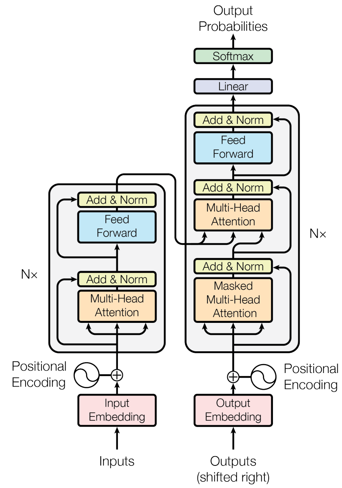
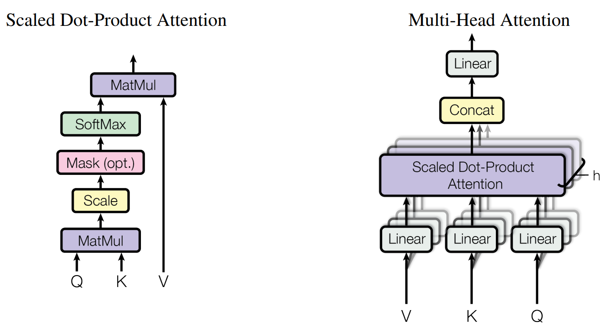

# Attention Is All You Need

## Abstract

主要的序列转录模型是基于复杂的循环/或卷积神经网络，包含一个编码器和一个解码器。最好的模型也通过一个注意力机制连接着编码器和编码器。我们提出一个新的简单的网络架构，Transformer，仅仅基于注意力机制，完全不需要循环和卷积。在两个机器翻译任务上的实验表明这些模型在质量上优于其他模型，同时具有更好的并行性，并且需要的时间明显更少。我们的模型在 WMT 2014 English-to-German 翻译任务上取得了 28.4 [BLEU]()，比现有的最佳模型，包括集成，提高了 2 BLEU 以上。在 WMT 2014 English-to-French 翻译任务上，我们的模型在 8 个 GPUs 上训练了 3.5 天后，建立了一个新的单模型 start-of-the-art BLEU，分数为 41.8，这是现有文献中最好的模型的训练成本的一小部分。通过将 Transformer 成功地应用到大型的和有限的训练数据的 English constituency parsing (英语成分句法分析)，我们证明了 Transformer 是可以很好地泛化到其他任务。

## 1 Introduction

循环神经网络，特别是长短期记忆 (LSTM) 和门控循环神经网络，已经被牢牢地确定为序列建模和转录问题 (如语言建模和机器翻译) 的 state-of-the-art 方法。此后，许多工作继续推动循环语言模型的边界和编码器-解码器的架构。

循环模型通常沿着输入和输出序列的符号位置分解计算。在计算时间内将 positions 与 steps 对齐，它们生成一系列隐藏状态 $h_t$，作为前一个隐藏状态 $h_{t-1}$ 和位置 $t$ 的输入的函数。这种内在的时许性妨碍了训练样本内的并行化，并行化在序列长度较长时很重要，因为内存的约束限制了跨样本的批处理。最近的工作通过因子分解技巧 [21] 和条件计算 [32] 在计算效率方面取得了显著的提升，同时后者也提升了模型性能。然而，顺序计算的基本约束仍然存在。

注意力机制已经成为各种任务中的引人注目的序列建模和转录模型的不可或缺的一部分，它允许对依赖关系建模，而不考虑它们在输入或输出序列的距离。然而，在所有的情况下，除了 [27]，这种注意力机制是与循环神经网络一起使用的。

在本文中，我们提出了 Transformer，一种避开循环神经层而完全依赖注意力机制来绘制输入和输出之间的全局依赖的的模型架构。Transformer 允许有明显更多的并行化，并在 8 个 P100 GPUs 上训练 12 个小时后，在翻译质量上达到了一个新的 state-of-the-art。

## 2 Background

减少时序的计算的目标也构成了 Extended Neural GPU、ByteNet 和 ConvS2S 的基础，所有这些都使用卷积神经网络作为基础构建块，并行计算所有输入和输出位置的隐藏表示。在这些模型中，将任意两个来自输入或者输出位置的信号关联起来所需的操作数随着位置之间的距离而增长，对于 ConS2S 是线性增长，对于 ByteNet 是对数级增长。这使得学习相隔遥远的位置之间的依赖变得更加困难。在 Transformer 中，这被减少到一个常量级的操作数，虽然是以降低有效分辨率为代价的，但由于对注意力加权的位置的平均，我们在 3.2 节中使用多头注意力抵消了这种影响。

自注意力，有时也被叫做内部注意力，是一种将单个序列的不同位置关联起来的一种注意力机制，以便计算该序列的表示。自注意力已经成功地被应用于多种任务，包括阅读理解、摘要总结、文本蕴含和学习任务无关的句子表示。

端到端的记忆网络是基于一个循环注意力机制而不是序列对齐的循环，并已被证明在简单语言问题问答和语言建模任务种表现得好。

然而，据我们所知，Transformer 是第一个不使用序列对齐的 RNNs 或卷积，完全依赖自注意力来计算其输入和输出的表示的语言转录模型。在下面的章节，我们将描述 Transformer，自注意力的动机和讨论它相对于 [17, 18] 和 [9] 这些模型的优势。

## 3 Model Architecture

大多数有竞争性的神经序列转录模型都有一个编码器-解码器结构。解码器映射一个符号表示的输入序列 $(x_1,\cdots,x_n)$ 到一个连续表示的序列 $\bold{z} = (z_1, \cdots, z_n)$。给定 $\bold{z}$，解码器生成一个符号的输出序列 $(y_1,\cdots,y_m)$，每次一个元素。在每个步骤中，模型都是自回归的，在生成下一个符号时使用先前生成的符号作为额外的输入。

Transformer 遵循这种整体架构，编码器和解码器都是将自注意力和逐点的、完全连接的层一个个堆叠在一起的，分别展示在图 1 的左半和右半部分。

**图 1：** Transformer-模型架构

### 3.1 Encoder and Decoder Stacks

**编码器：** 编码器由一个 N = 6 个相同的层的堆叠组成。每层有两个子层。第一层是一个多头自注意力机制，而第二层是一个简单的，逐位置完全连接的前馈网络。我们在两个子层周围分别使用一个残差连接，然后使用层归一化。即每个子层的输出是 $\rm LayerNorm(x + Sublayer(x))$，其中 $\rm Sublayer(x)$ 是由子层自身实现的函数。为了方便这些残差连接，这个模型中的所有子层以及嵌入层都产生维度 $d_{model} = 512$ 的输出。

**解码器：** 解码器也是由一个 N = 6 个相同的层的堆叠组成。除了每个解码器中的两个子层，解码器插入第三个子层，它在编码器堆叠的输出上执行多头注意力。与编码器类似，我们在每个子层周围采用残差连接，然后使用层归一化。我们也修改解码器堆叠中的自注意力子层，以防止位置参与后续的位置。这种遮蔽，再加上输出嵌入被偏移了一个位置，确保了位置 $i$ 的预测仅能够依赖位置小于 $i$ 的已知输出。

### 3.2 Attention

注意力函数可以被描述为将一个查询 (query) 和一组键值 (key-value) 对映射到一个输出。其中查询、键、值和输出都是向量。输出是计算值的加权和，其中分配给每个值的权重是由查询与相对应的键通过一个 compatibility 函数计算。

**图 2：** (左) 缩放的点积注意力。(右) 由几个并行运行注意力层组成的多头注意力。

#### 3.2.1 Scaled Dot-Product Attention

我们将我们特别关注的注意力称为 "缩放的点积注意力"。输入由 $d_k$ 维的查询和键，和 $d_v$ 维的值组成。我们计算查询与所有的键的点积，将结果除以 $\sqrt{d_k}$ ，并应用 softmax 函数来获得值的权重。

实践中，我们同时在一组查询上计算注意力函数，将它们打包成一个矩阵 $Q$。键和值也打包成矩阵 $K$ 和 $V$。我们计算输出矩阵如下：
$$
{\rm Attention}(Q,K,V) = {\rm softmax}(\frac{QK^T}{\sqrt{d_k}})V \tag{1}
$$
最常用的两个注意力函数是加性注意力和点积 (乘法的) 注意力。点积注意力与我们的算法相同，除了缩放因子 $\frac{1}{\sqrt{d_k}}$。加性注意力使用一个具有单一隐藏层的前馈网络计算 compatibility 函数。虽然这两种方法的理论复杂度相似，但实际上点积注意力更快且空间效率更高，因为它能用高度优化的矩阵乘法代码来实现。

当 $d_k$ 的值较小时，这两种机制的表现相似，但当 $d_k$ 较大时，加性注意力优于没有缩放的点积注意力。我们怀疑当 $d_k$ 较大时，点积会变得很大，将 softmax 函数推到了梯度极小的区域。为了抵消这种影响，我们用 $\frac{1}{\sqrt{d_k}}$ 缩放点积。

#### 3.2.2 Multi-Head Attention

与其对 $d_{model}$ 维的键、值和查询执行单一的注意力函数，我们发现将查询、键和值分别用不同的、学习到的 $d_k,d_k,d_v$ 维的线性的投影线性地投影 h 次是有益的。然后在每个这些投影后的查询、键和值上，我们并行地执行注意力函数，产生 $d_v$ 维的输出值。这些值被连接起来并再一次被投影，从而得到最终的值，如图 2 所示。

多头注意力允许模型联合地处理来自不同位置的不同表示子空间的信息。对于单头注意力，平均会抑制这种情况。
$$
{\rm MultiHead}(Q,K,V) = {\rm Concat(head_1,\cdots,head_h)}W^O \\
{\rm where \ head_i} = {\rm Attention}(QW^Q_i,KW^K_i,VW^V_i)
$$
其中投影维参数矩阵 $W^Q_i \in \mathbb{R}^{d_{model} \times d_k}, W^K_i \in \mathbb{R}^{d_{model} \times d_k}, W^V_i \in \mathbb{R}^{d_{model} \times d_v}, W^O \in \mathbb{R}^{hd_v \times d_{model}}$ 。

在这项工作中，我们采用 $h = 8$ 个并行的注意力层，或称为 "头"。对于每一个，我们使用 $d_k = d_v = d_{model} / h = 64$。由于每个头的维度减少，总体的计算成本与使用完整维度的单头注意力的计算成本相似。

#### 3.2.3 Applications of Attention in our Model

Transformer 以三种不同的方式使用多头注意力：

- 在 "编码器-解码器注意力" 层，查询来自前一解码器层，memory 键和值来自编码器的输出。这允许解码器中的每个位置都能处理输入序列中的全部位置。这模拟了序列到序列模型 (如 [38, 2, 9]) 中经典的编码器-解码器注意力机制。
- 编码器包含自注意力层。在自注意力层中，所有的键、值和查询都来自相同的地方，在本例中是编码器中前一层的输出。编码器中的每个位置都能处理编码器的前一层中的所有位置。
- 类似地，解码器中的自注意力层允许解码器中的每个位置处理直到 (包括) 该位置的所有位置。我们需要在解码器中防止信息向左流动，以保持自回归特性。我们在点积注意力内通过遮掩 (设为 $-\infty$) 对应不合法的 softmax 的输入中所有的值来实现这一点。见图 2。

### 3.3 Position-wise Feed-Forward Networks

除了注意力子层，我们的编码器和解码器中的每个层都包含一个全连接的前馈网络，它独立地并同等地应用在每个位置。它由两个线性编号组成，中间隔着一个 ReLU 激活。
$$
{\rm FFN}(x) = \max(0, xW_1 + b_1)W_2 + b_2 \tag{2}
$$
虽然跨越不同位置的线性变换是相同的，但从一层到另一层使用不同的参数。描述它的另外一种方法是使用两个核大小为 1 的卷积。输入和输出的维度是 $d_{model} = 512$，内层的维度是 $d_{ff} = 2048$ 。

### 3.4 Embeddings and Softmax

与其他序列转录模型相似，我们使用学习后的嵌入将输入词元和输出词元转换为 $d_{model}$ 维向量。我们也使用常见的学习后的线性变换和 softmax 函数将解码器输出转换为下一个词元的预测概率。在我们的模型中，我们在两个嵌入层和 pre-softmax 线性变换之间共享相同的权重矩阵，与 [30] 相似。在嵌入层中，我们将这些权重乘以 $\sqrt{d_{model}}$ 。

### 3.5 Positional Encoding

由于我们的模型没有循环层和卷积层，为了让模型利用序列的时序性，我们必须注入一些关于序列中词元的相对位置或绝对位置的信息。为此，我们将 "位置编码" 添加到编码器和解码器堆叠的底部的输入嵌入中。位置编码具有与嵌入一样的维度 $d_{model}$ ，因此两者可以相加。位置编码有很多选择，学习的和固定的。

在本工作中，我们使用不同频率的 sine 和 cosine 函数：
$$
PE(pos,2i) = sin(pos/10000^{2i/d_{model}}) \\
PE(pos,2i+1) = cos(pos/10000^{2i/d_{model}})
$$
其中 $pos$ 是位置，$i$ 是维度。也就是说，位置编码的每一维度对应着一个正弦信号。波长从 $2\pi$ 到 $10000 \cdot 2\pi$ 形成一个几何级数。我们选择这个函数是因为我们假设它允许模型很容易地学会按相对位置处理，因为对于任意固定偏移 $k$，$PE_{pos+k}$ 可以被表示为 $PE_{pos}$ 的一个线性函数。

我们还尝试了使用学习过的位置嵌入来代替，发现这两个版本产生了几乎相同的结果 (见表 3 行(E))。我们选择正弦信号版本，因为它可以让模型推断出比训练中遇到的序列长度更长的序列。

## 4 Why Self-Attention

## 7 Conclusion

本工作中，我们提出了 Transformer，第一个完全基于注意力的序列转录模型，用多头自注意力替换了编码器-解码器架构中最常用的循环层。

对于翻译任务，Transformer 能比基于循环层或卷积层的架构显著地训练得更快。在 WMT 2014 English-to-German 和 WMT 2014 English-to-French 翻译任务中，我们取得了一个新的 state-of-the-art。在前一个任务中，我们最好的模型胜过所有之前报告的集成 (ensembles)。

我们对基于注意力的模型的未来感到兴奋，并计划将其应用到其他任务。我们计划将 Transformer 扩展到涉及文本以外的输入和输出形态的问题，并研究局部的、受限的注意力机制，以有效地处理大量的输入和输出，如图像、音频和视频。使生成的不那么时序化是我们的另一研究目标。
