# [Group Normalization](https://arxiv.org/pdf/1803.08494.pdf)

## Abstract

Batch Normalization (BN) 是深度学习发展中的一个里程碑技术，使得各种网络可以进行训练。然而，沿批次维度进行归一化会引入问题——当批量大小变小时，BN 的误差会迅速增加，这是由于批次统计估计不准确导致的。这限制了 BN 在训练更大的模型和将特征迁移到包括检测、分割和视频在内的计算机视觉任务中的使用，这些任务由于内存消耗的限制需要小批次。在本文中，我们提出了 Group Normalization (GN) 作为 BN 的简单替代方法。GN 将通道分成组，并在每个组内计算均值和方差以进行归一化。GN 的计算与批量大小无关，其精度在广泛的批次大小范围内保持稳定。在 ImageNet 上训练的 ResNet-50 中，当使用批量大小为 2 时，GN 的误差比其 BN 对应物低 10.6%；当使用典型批量大小时，GN 与 BN 相当，并且优于其他归一化变体。此外，GN 可以自然地从预训练转移到微调。在 COCO 中，对于目标检测和分割 GN 优于基于 BN 的对应物，在 Kinetics 中进行视频分类也是如此，这表明 GN 可以在各种任务中有效地替代强大的 BN。现代库中只需几行代码即可轻松实现 GN。

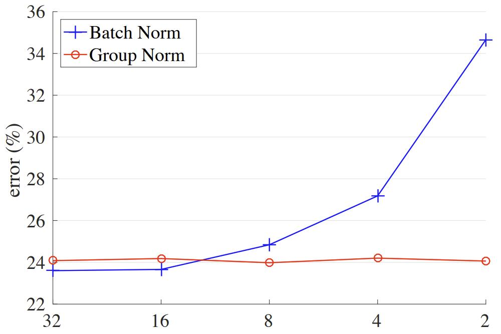

图 1：**ImageNet 分类错误 vs. 批量大小**。这是一个在 ImageNet 训练集上使用 8 个 worker (GPU) 训练的，在验证集上评估的 ResNet-50 模型。

## 1. Introduction

Batch Normalization (Batch Norm 或 BN) 已被证明是深度学习中非常有效的组件，大大推动了计算机视觉和其他领域的前沿。BN 通过在 (小) 批次内计算的均值和方差对特征进行归一化。许多实践已经证明，这有助于优化和使非常深的网络收敛。批次统计的随机不确定性也起到了正则化器的作用，可以有益于泛化。BN 已经成为许多最先进的计算机视觉算法的基础。

尽管 BN 取得了巨大的成功，但它也存在缺点，这些缺点也是由于其沿批次维度进行归一化的不同行为引起的。特别是，BN 需要使用足够大的批量大小 (例如，每个 worker 的批量大小为 32) 。小批量会导致批次统计估计不准确，并且减小 BN 的批量大小会大大增加模型误差 (图 1) 。因此，许多最近的模型是使用超出普通批量大小的批次大小进行训练的。训练模型对于 BN 的有效性的重度依赖反过来又限制了人们探索受内存限制的更高容量模型。

> 在本文的背景下，我们使用“批次大小”来指代每个 worker (例如GPU) 的样本数。BN 的统计信息是针对每个 worker 计算的，但不会在 worker 之间广播，这是许多库中的标准做法。

在计算机视觉任务中，包括检测、分割、视频识别和其他基于它们构建的高级系统，对批量大小的限制更为严格。例如，Fast/er 和 Mask R-CNN 框架因为分辨率更高而使用 1 或 2 张图像的批量大小，在这种情况下，BN 通过转换为线性层被“冻结”；在使用 3D 卷积进行视频分类时，时空特征的存在引入了时间长度和批量大小之间的权衡。使用 BN 往往需要这些系统在模型设计和批量大小之间做出妥协。

本文提出了 Group Normalization (GN) 作为 BN 的一种简单替代方案。我们注意到许多经典特征，如 SIFT 和 HOG 是分组特征，涉及分组归一化。例如，HOG 向量是几个由归一化的方向直方图表示空间单元的结果。类似地，我们提出 GN 作为一种将通道分成组并在每个组内归一化特征的层 (图 2) 。GN 不利用批次维度，其计算与批次大小无关。

GN 在广泛的批量大小范围内表现非常稳定 (图 1) 。在样本批量大小为 2 的情况下，使用 GN 的 ResNet-50 的在 ImageNet 中误差比其 BN 对应物低了 10.6%。在常规批量大小下，GN 和 BN 相当 (差异约为0.5%) ，并且优于其他归一化变体。此外，尽管批量大小可能会改变，但 GN 可以自然地从预训练转移到微调。在 COCO 目标检测和分割的 Mask R-CNN 上以及 Kinetics 视频分类的 3D 卷积网络上 GN 优于其 BN 对应物。GN 在 ImageNet、COCO 和 Kinetics 中的有效性证明了 GN 是在这些任务中占据主导地位的 BN 的一种有竞争力的替代方案。

现有的方法，例如 Layer Normalization (LN)  和 Instance Normalization (IN) (图 2) ，也避免了沿批次维度进行归一化。这些方法对于训练序列模型 (RNN/LSTM) 或生成模型 (GANs) 非常有效。但是，正如我们将通过实验展示的那样，LN 和 IN 在视觉识别方面的成功有限，而 GN 的结果更好。相反，GN 可以代替 LN 和 IN，因此适用于序列或生成模型。这超出了本文的重点，但对未来的研究具有启示性。

## 2. Related Work

**归一化：** 众所周知，对输入数据进行归一化可以加快训练。为了归一化隐藏特征，已经基于特征分布的强假设推导出了初始化方法 [33、14、19]，但这些假设在训练过程中可能会失效。

在 BN 的发展之前，深度网络中的归一化层已经被广泛使用。局部响应归一化 (LRN) 是 AlexNet 和后续模型中的一个组件。与最近的方法 BN、LN、IN 不同，LRN 为每个像素计算小的邻域内的统计信息。

Batch Normalization 沿批次维度执行更全局的归一化 (并且同样重要的是，它建议对所有层执行此操作) 。但是，“批次”的概念并不总是存在，或者可能会随时间而变化。例如，在推理时按批次归一化是不合法的，因为均值和方差是从训练集中预先计算出来的，通常是通过运行时求平均；因此，在测试时不执行归一化。当目标数据分布发生变化时，预先计算的统计信息也可能会发生变化。这些问题导致了训练、迁移和测试时的不一致性。另外，正如前面所述，减小批量大小可能会对估计的批量统计信息产生巨大影响。

已经提出了几种避免利用批次维度归一化方法。层归一化 (LN) 沿通道维度操作，实例归一化 (IN) 执行类似 BN 的计算，但仅针对每个样本 (图 2) 。除了对特征进行操作外，权重归一化 (WN) 还提出了对滤波器权重进行归一化。这些方法不会受到批次维度引起的问题的影响，但它们在许多视觉识别任务中无法接近 BN 的准确性。我们将在剩余部分的上下文中与这些方法进行比较

**解决小批量：** Ioffe 提出了 Batch Renormalization (BR)，缓解了 BN 在小批量情况下的问题。BR 引入了两个额外的参数，约束了 BN 的估计均值和方差在一定范围内，减少了它们在批量大小较小时的漂移。BR 在小批量区间内的准确性优于 BN。然而，BR 也是批次相关的，当批量大小减小时，它的准确性仍然会降低。

还有一些尝试避免使用小批量的方法。[43] 中的目标检测器执行同步的 BN，其均值和方差是跨多个 GPU 计算的。然而，这种方法并没有解决小批量的问题；相反，它将算法问题迁移到工程和硬件需求上，使用与 BN 要求成比例的 GPU 数量。此外，同步的 BN 计算阻止了使用异步求解器 (ASGD) ，这是一种在工业中广泛使用的大规模训练的实用解决方案。这些问题可能会限制使用同步的 BN 的范围。

我们的归一化方法本质上避免了批量统计计算。

**分组计算：** AlexNet 提出了分组卷积，将模型分成两个 GPU。最近，将组作为模型设计的一个维度已经得到了更广泛的研究。ResNeXt 的工作研究了深度、宽度和组之间的权衡，并表明增加更多的组在相似的计算成本下可以提高准确性。MobileNet 和 Xception 利用逐通道的 (也称为“逐深度的”) 卷积，这是一个组数等于通道数的分组卷积。ShuffleNet 提出了一种通道打乱操作，该操作重新排列分组特征的轴。这些方法都涉及将通道维度分成组。尽管与这些方法有关，但 GN 不需要组卷积。GN 是一种通用层，正如我们在标准的 ResNets 中评估的那样。

# 3. Group Normalization

视觉表示的通道并不完全独立。SIFT、HOG 和 GIST 的经典特征是设计上的分组表示，其中每组通道是由某种直方图构造的。这些特征通常通过每个直方图或每个方向的分组归一化进行处理。高级特征，如 VLAD 和 Fisher Vectors (FV)，也是分组特征，其中一个组可以被认为是相对于一个聚类计算的子向量。

类似地，不必将深度神经网络特征视为非结构化向量。例如，对于网络的 $\mathrm{conv}_1$ (第一个卷积层) ，可以合理地期望一个滤波器及它的水平翻转在自然图像上展现出类似的滤波器响应分布。如果 $\mathrm{conv}_1$ 恰好学习了这一对滤波器，或者如果水平翻转 (或其他变换) 通过设计被加入到架构中的，那么这些滤波器的相应通道可以一起进行归一化。

更高层次的特征更加抽象，其行为也不那么直观。但是，除了方向 (SIFT、HOG 或 [11、8]) 之外，还有许多因素可能导致分组，例如频率、形状、照明、纹理等。它们的系数可以相互依赖。事实上，在神经科学中一个被广泛接受的计算模型是跨细胞响应进行归一化，“具有各种感受野中心 (覆盖视野) 和各种时空频率调谐”；这不仅可以发生在主视觉皮层中，还可以发生在“整个视觉系统”中。受这些工作的启发，我们提出了新的深度神经网络通用分组归一化方法。

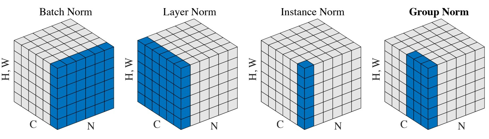

图 2：**归一化方法**。每个子图显示一个特征映射张量，其中 N 是批处理轴，C 是通道轴，(H，W) 是空间轴。蓝色像素由相同的均值和方差归一化，这些均值和方差是通过聚合这些像素的值计算得出的。

### 3.1. Formulation

首先，我们描述了特征归一化的一般公式，然后在此公式中介绍 GN。包括 BN、LN、IN 和 GN 在内的一系列特征归一化方法执行以下计算： 

$$
\large \hat{x}_i = \frac{1}{\sigma_i}(x_i - \mu_i). \tag{1}
$$

$x$ 是由一个层计算的特征， $i$ 是一个索引。 对于 2D 图像， $i = (i_N, i_C, i_H, i_W)$ 是一个 4D 向量，按 $(N, C, H, W)$ 顺序索引特征，其中 $N$ 是批量大小轴，$C$ 是通道轴， $H$ 和 $W$ 是空间高度和宽度轴。

> $x_i$ 是第 i 层的特征， $\hat{x}_i$ 是第 i 层归一化后的特征

公式 (1) 中的 $\mu$ 和 $\sigma$ 是由下式计算的均值和标准差 (std)：

$$
\large \mu_i = \frac{1}{m}\sum_{k \in S_i}x_k,  \quad \sigma_i = \sqrt{\frac{1}{m}\sum_{k \in S_i}(x_k - \mu_i)^2 + \epsilon}, \tag{2}
$$

> 注意标准差的**有偏估计**和**无偏估计**，这里使用的是无偏估计。

其中 $\epsilon$ 是一个小常数。 $S_i$ 是计算平均值和标准差的像素集合， $m$ 是该集合的大小。许多类型的特征归一化方法主要区别在于如何定义集合 $Si$ (图2) ，讨论如下。在 **Batch Norm** 中，集合 $S_i$ 定义为：

$$
\large S_i = \{ k \mid k_C = i_C \}, \tag{3}
$$

其中 $i_C$ 和 $k_C$ 表示沿 $C$ 轴对 $i$ (和 $k$ ) 进行子索引。表示共享相同通道索引的像素一起进行归一化，即对于每个通道，BN 沿 $(N, H, W)$ 轴计算 $\mu$ 和 $\sigma$ 。在 **Layer Norm** 中，集合是：

$$
\large S_i = \{ k \mid k_N = i_N \}, \tag{4}
$$

表示 LN 沿着 $(C, H, W)$ 计算每个样本的 $\mu$ 和 $\sigma$ 。在 **Instance Norm** 中，集合是：

$$
\large S_i = \{ k \mid k_N = i_N, k_C = i_C \}, \tag{5}
$$

这意味着 IN 沿 $(H, W)$ 轴计算每个样本和每个通道的 $µ$ 和 $σ$ 。BN、LN 和 IN 之间的关系如图 2 所示。

如 BN 中所属，==BN、LN 和 IN 的所有方法都学习了一个逐通道的线性变换，以补偿可能丢失的表示能力：==

$$
\large y_i = \gamma \hat{x}_i + \beta, \tag{6}
$$

其中 $\gamma$ 和 $\beta$ 是可训练的 scale 和 shift (在所有情况下都由 $i_C$ 索引，我们为简化符号而省略)。 

**Group Norm：** 形式上，Group Norm 层计算在如下定义的集合 $S_i$ 中的 $\mu$ 和 $\sigma$ ：

$$
\large S_i = \{ k \mid k_N = i_N, \lfloor \frac{k_C}{C/G} \rfloor = \lfloor \frac{i_C}{C/G}  \rfloor \}, \tag{7}
$$

其中 $G$ 是组数，它是一个预定义的超参数 (默认情况下 $G=32$ )。 $C/G$ 是每组通道数。$\lfloor \cdot \rfloor$ 是向下取整，$\lfloor \frac{k_C}{C/G} \rfloor = \lfloor \frac{i_C}{C/G} \rfloor$ 意味着索引 $i$ 和 $k$ 在通道的同一组中，假设每组通道沿 $C$ 轴按顺序存储。GN 沿 $(H, W)$ 轴和一组 $\frac{C}{G}$ 的通道计算 $\mu$ 和 $\sigma$ 。GN 的计算如图2 (最右侧) 所示，它是 2 个组 (G=2)，每个组都有 3 个通道的简单情况。给定公式 (7) 中的 $S_i$ ，GN 层由公式 (1)，(2) 和 (6) 定义。具体而言，同一组中的像素通过相同的 $\mu$ 和 $\sigma$ 一起进行归一化。==GN 还学习每个通道的 $\gamma$ 和 $beta$ 。==

> 注意： $\gamma$ 和 $\beta$ 的元素数量等于通道数

**与先前的工作的关系：** LN、IN 和 GN 都沿批处理轴执行独立的计算。GN 的两个极端情况等价于 LN 和 IN (图 2) 。

与层归一化的关系。如果我们将组数设置为 $G = 1$，则 GN 变为 LN。LN 假设层中的所有通道都做出“相似的贡献”。与 LN 中研究的全连接层不同，这种假设在存在卷积时可能不太有效。GN 比 LN 受限制较少，因为每组通道 (而不是所有通道) 被认为受到共享均值和方差的影响；模型仍然具有学习每个组的不同分布的灵活性。这导致 GN 比 LN 具有更好的表示能力，在实验中表现为更低的训练和验证误差 (图4) 。

与实例归一化的关系。如果我们将组数设置为 $G = C$ (即每组一个通道) ，则 GN 变为 IN。但是 IN 只能依赖于空间维度来计算均值和方差，而错过了利用通道依赖性的机会。

### 3.2 Implementation

GN 可以在支持自动微分的 PyTorch 和 TensorFlow 中通过几行代码轻松实现。下面代码展示了基于 TensorFlow的 GN 代码。实际上，我们只需要指定如何计算均值和方差 (“矩”)，沿着由归一化方法定义的适当轴即可。

```python
def GroupNorm(x, gamma, beta, G, eps=1e−5):
    # x: input features with shape [N,C,H,W]
    # gamma, beta: scale and offset, with shape [1,C,1,1]
    # G: number of groups for GN
    N, C, H, W = x.shape
    x = tf.reshape(x, [N, G, C // G, H, W])
    mean, var = tf.nn.moments(x, [2, 3, 4], keep dims=True)
    x = (x − mean) / tf.sqrt(var + eps)
    x = tf.reshape(x, [N, C, H, W])
    return x ∗ gamma + beta
```

## 4. Experiments

### 4.1 Image Classification in ImageNet

我们在有1000个类别的 ImageNet 分类数据集中进行实验。我们使用 ResNet 模型在大约 128 万张训练图像上进行训练，并在 5 万个验证图像上进行评估。

**实现细节：** 按照标准做法，我们使用 8 个 GPU 来训练所有模型，并且在每个 GPU 内计算 BN 的批次均值和方差。我们使用 [19] 的方法来初始化所有模型的所有卷积。我们使用 1 来初始化所有 $\gamma$ 参数，除了每个残差块的最后一个归一化层，我们使用 [16] 中的 0 来初始化 $\gamma$ (这样残差块的初始状态就是恒等式)。对于所有权重层，包括 $\gamma$ 和 $\beta$ (与[[ResNet][20], [16][16] 不同，但与 [17][17] 相同)，我们使用 0.0001 的权重衰减。我们对所有模型训练 100 轮，并在 30、60 和 90 轮时将学习率衰减 10 倍。在训练期间，我们采用了 [58] 的数据增强方法，如[17] 所实现。我们在验证集中评估 $224 \times 224$ 像素的中心裁剪的 top-1 分类错误率。为了减少随机变化，我们报告最后 5 轮的中位数错误率。其他实现细节遵循 [17]。我们的基线是使用 BN 训练的 ResNet。为了与 LN、IN 和 GN 进行比较，我们将 BN 替换为特定变体。我们为所有模型设置相同的超参数。我们默认设置 $G = 32$ 。

**比较特征归一化方法:** 我们首先使用 32 张图像 (每个GPU) 的常规批量大小进行实验。BN 在这个区间内成功地工作，因此这是可进行比较的一个强有力的基线。图 4 显示了错误曲线，表 1 显示了最终结果。

图 4 显示，所有这些归一化方法都能收敛。LN 与 BN 相比有 1.7% 的小退化。这是一个令人鼓舞的结果，因为它表明沿着卷积网络的所有通道 (由LN完成) 进行归一化是相当好的。IN 也使模型收敛，但比 BN 差 4.8%。

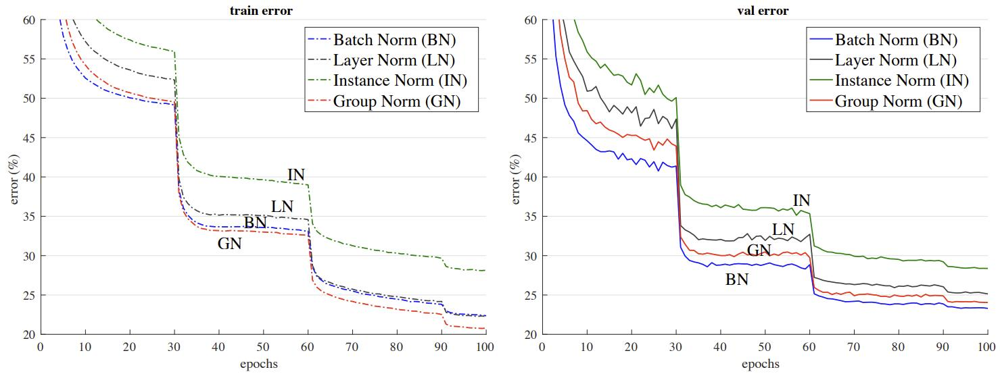

图 4：使用 32 张图像/GPU 的批量大小的错误曲线的比较。我们展示了 ImageNet 训练错误 (左) 和 验证错误 (右) vs. 训练轮数。模型是 ResNet-50。

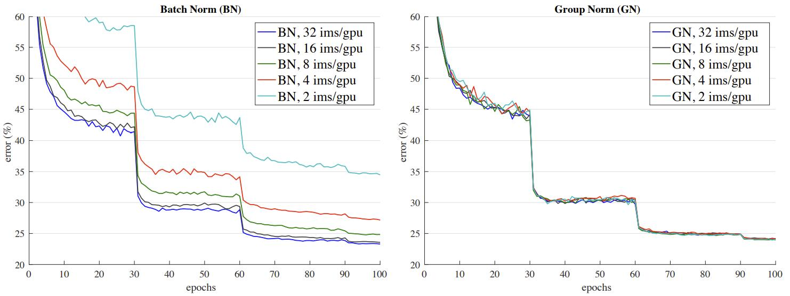

图 5：对批量大小的敏感性：使用 32、16、8、4、2 图像/GPU 训练的使用 BN (左) 和 GN (右) 的ResNet-50 的验证误差。

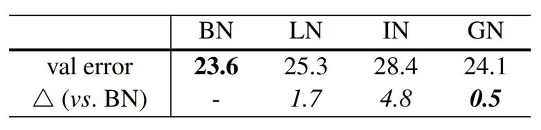

表 1：使用 32 张图像/GPU 的批处理大小进行训练 ResNet-50 在 ImageNet 验证集中的错误率 (％) 。错误曲线如图 4 所示。

在 BN 工作良好的情况下，GN 能够接近 BN 的准确性，在验证集中有 0.5% 的轻微退化。实际上，图4 (左) 显示GN 的训练误差低于 BN，表明 GN 对于使优化变容易是有效的。GN 略高的验证误差意味着 GN 失去了一些 BN 的正则化能力。这是可以理解的，因为 BN 的均值和方差计算引入了由随机批量采样引起的不确定性，这有助于正则化。GN (和 LN / IN) 中缺少这种不确定性。但是，将 GN 与合适的正则化器相结合可能会改善结果。这可以成为未来的研究课题。

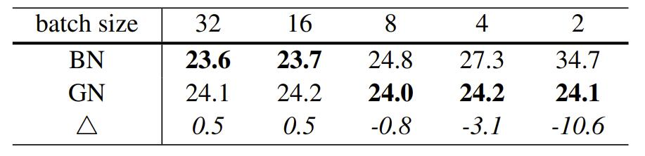

表 2：对批量大小的敏感性。我们展示了在 ImageNet 中 ResNet-50 的验证错误率 (%)。最后一行显示了 BN 和 GN 之间的差异。错误曲线如图 5 所示。此表在图 1 中可视化。

**小的批量大小：** 尽管 BN 在某些情况下受益于随机性，但当批量大小变小且不确定性变大时，其误差会增加。我们在图 1、图 5 和表 2 中展示了这一点。

我们评估每个 GPU 32、16、8、4、2 张图像的批量大小。在所有情况下，BN 的均值和方差都是在每个 GPU 内计算的，而不是同步的。所有模型都在 8 个GPU上进行训练。在这组实验中，我们采用线性学习率缩放规则来适应批量大小的变化——对于32个批量大小，我们使用 0.1 的学习率，对于 N 的批量大小，我们使用 0.1 N/32 的学习率。如果总批量大小发生变化 (通过更改GPU数量) ，但每个 GPU 批量大小不变，则此线性缩放规则对 BN 效果很好。我们对所有情况保持相同数量的训练轮数 (图 5，x轴) 。所有其他超参数都没有改变。

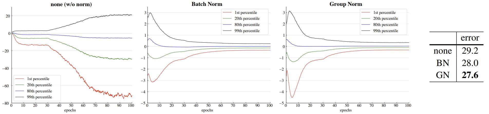

图 6：VGG-16 的 $\mathrm{conv_{5\_3}}$ 输出 (在归一化和ReLU之前) 的特征分布的演变，显示为响应的 {1、20、80、99} 百分位数。右侧的表格显示了 ImageNet 验证错误率 (％) 。模型使用每个 GPU 32 张图像进行训练。

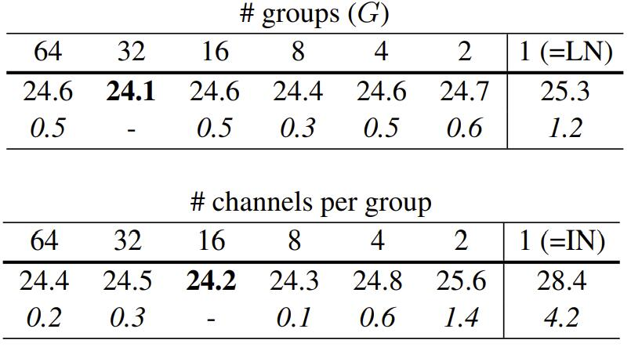

表 3：组数划分。我们展示了使用每 GPU 32 张图像进行训练的 ResNet-50 在 ImageNet 中的验证错误率 (％) 。  (顶部) ：给定数量的组。  (底部) ：每组给定数量的通道。最后一行显示了与最佳数量的差异。

图 5 (左) 显示，BN 的误差在小批量大小下显着增加。 GN 的行为更加稳定，对批量大小不敏感。实际上，图 5 (右) 显示，GN 在从 32 到 2 的宽范围的批量大小下具有非常相似的曲线 (受随机变化的影响) 。在批量大小为 2 的情况下，GN 的错误率比其 BN 对应物低 10.6％ (24.1％ 与 34.7％) 。

这些结果表明，批量均值和方差估计可能过于随机和不准确，特别是当它们在 4 或 2 张图像上计算时。但是，如果从 1 张图像计算统计数据，则此随机性将消失，在这种情况下，BN 在训练时变得类似于 IN。我们看到，在批量大小为 2 时，IN 的结果 (28.4％) 比 BN 好 (34.7％) 。 

表 2 中 GN 的稳健结果证明了 GN 的优势。它允许消除 BN 所施加的批量大小约束，这可以提供更多内存 (例如16倍或更多) 。这将使得受到内存瓶颈限制的更高容量的模型的训练成为可能。我们希望这将为架构设计创造新机会。

**与 Batch Renorm (BR) 的比较：** BR 引入了两个额外的参数 ( $r$ 和 $d$ ) ，用于约束 BN 的估计均值和方差。它们的值由 $r_{max}$ 和 $d_{max}$ 控制。为了将 BR 应用于 ResNet-50，我们仔细选择了这些超参数，并发现 $r_{max} = 1.5$ 和 $d_{max} = 0.5$ 对 ResNet-50 效果最好。使用批量大小为4，使用 BR 训练的 ResNet-50 具有 26.3％ 的错误率。这比 BN 的 27.3％ 要好，但仍比 GN 的 24.2％ 高 2.1％。 

**组数划分：** 到目前为止，所有呈现的 GN 模型都是使用 $G = 32$ 进行训练的。接下来，我们评估不同的分组方式。对于给定的固定组数，我们研究了所有 G 值下 GN 的表现 (表 3，上) 。在极端情况下，当 $G = 1$ 时，GN等效于 LN，并且其错误率高于所有 $G > 1$的情况。 

我们还评估了固定每组通道数 (表 3，下) 。请注意，由于层可以具有不同的通道数，在此设置中，组数 G 可以在层之间发生变化。在极端情况下，当 $G = 1$ 时，GN等效于 LN。即使每组使用 2 个通道，GN 的错误率也远低于 IN (25.6％ 与 28.4％) 。这个结果显示了在执行归一化时分组通道的效果。

**更深的模型：** 我们还在 ResNet-101 [20]上将 GN 与 BN 进行了比较。使用批量大小为 32，我们使用 BN 的 ResNet-101 的基线具有 22.0％ 的验证错误率，而使用 GN 的对应物为 22.4％，稍差0.4％。使用批量大小为2，使用 GN 的 ResNet-101 的错误率为 23.0％。考虑到非常小的批量大小，这仍然是一个相当稳定的结果，并且比BN 对应物的 31.9％ 好 8.9％。 

**VGG模型的结果和分析：** 为了研究 GN / BN 与无归一化的比较，我们考虑可以在没有归一化层的情况下进行健康训练的 VGG-16。我们在每个卷积层之后应用 BN 或 GN。图 6 显示了 $\mathrm{conv_{5\_3}}$ (最后一个卷积层) 特征分布的演变。 GN 和 BN 在定性上表现相似，而与不使用归一化的变体存在明显差异；这种现象也适用于所有其他卷积层。 这种比较表明，执行归一化对于控制特征分布至关重要。

 对于 VGG-16，GN 比 BN 好0.4％ (图 6，右) 。这可能意味着 VGG-16 从 BN 的正则化效果中受益较少，并且在这种情况下 GN (导致较低的训练误差) 优于 BN。

### 4.2 Object Detection and Segmentation in COCO

接下来，我们评估微调模型以迁移到目标检测和分割。这些计算机视觉任务通常受益于更高分辨率的输入，因此在常见实践中批量大小往往很小 (1 或 2 张图像/ GPU) 。作为结果，BN 被转换为线性层 $y = \frac{\gamma}{\sigma} (x − \mu) + \beta$ ，其中 $\mu$ 和 $\sigma$ 是从预训练模型中预先计算并冻结的。我们将其表示为 BN* ，实际上在微调期间不执行归一化。我们还尝试了一种变体，即对 BN 进行微调 (执行归一化且未冻结) ，发现它效果不佳 (批量大小为 2 时减少了约 6 个AP) ，因此我们忽略了这种变体。 

我们在 Mask R-CNN 基线上进行实验，该基线的实现在 Detectron 的公开可用代码库中。我们使用端到端变体，并使用与 [Detectron](https://github.com/facebookresearch/detectron) 中相同的超参数。我们在微调期间用 GN 替换 BN*，使用相应的 ImageNet 预训练模型。在微调期间，我们对 $\gamma$ 和 $\beta$ 参数使用 0 的权重衰减，这对于在调整 $\gamma$ 和 $\beta$ 时获得良好的检测结果非常重要。我们使用1 张图像/ GPU 和 8 张图像/GPU 进行微调。 

这些模型是在 COCO train2017 集中训练并在 COCO val2017 集 (又名为 minival) 中进行评估。对于边界框检测 $AP^{bbox}$ 和实例分割 $AP^{mask}$ ，我们报告标准的 COCO 指标平均精度 (AP) 、 $AP_{50}$ 和 $AP_{75}$。

**C4 骨干的结果：** 表 4 显示了在使用 $\mathrm{conv}_4$ 骨干 (C4) 的 Mask R-CNN 上 GN 与 BN* 的比较。这种 C4 变体使用 ResNet 的层直到  $\mathrm{conv}_4$ 层来提取特征映射，以及 ResNet 的  $\mathrm{conv}_5$  层作为分类和回归的感兴趣区域 (RoI) 头。由于它们是从预训练模型继承的，因此骨干和头都涉及归一化层。

在这个基线上，GN 比 BN* 提高了 1.1 框 AP 和 0.8 掩码 AP。我们注意到，预训练的 GN 模型在 ImageNet 中略逊于 BN (24.1％对23.6％) ，但对于微调 GN 仍然优于 BN* 。BN*  (冻结) 在预训练和微调之间存在不一致性，这可能解释了退化。

我们还尝试了 LN 变体，并发现它比 GN 差 1.9 框 AP 和比 BN* 差 0.8 框AP。尽管 LN 也独立于批量大小，但其表现能力弱于 GN。

**FPN骨干的结果：** 接下来，我们使用特征金字塔网络 (FPN) 的 Mask R-CNN上比较 GN 和 BN* ，这是当前在 COCO 中最先进的框架。与 C4 变体不同，FPN 利用所有预训练层构建金字塔，并添加随机初始化的层作为头。在FPN 中，输出框的头 (box head) 由两个隐藏的全连接层 (2fc) 组成。我们发现，将 2fc 框头替换为 4conv1fc (类似于[48]) 可以更好地利用 GN。结果比较如表 5 所示。

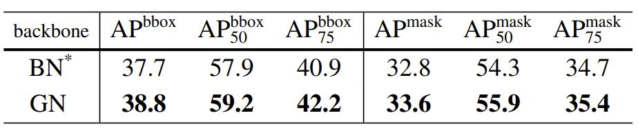

表 4：使用具有 ResNet-50 C4 的 Mask R-CNN 在 COCO 中目标检测和分割的消融结果。 BN* 意味着 BN 被冻结。

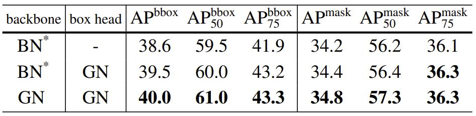

表 5：使用具有 ResNet-50 FPN 和 4conv1fc 边界框头的 Mask R-CNN 在 COCO 中目标检测和分割的消融结果。 BN* 意味着 BN 被冻结。

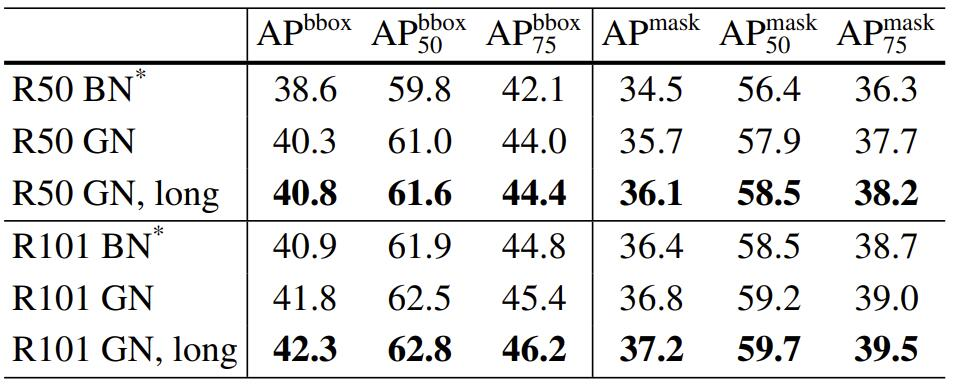

表 6：使用 Mask R-CNN 和 FPN 在 COCO 中目标检测和分割的结果。这里 BN* 意味着默认的 Detectron 基线，而 GN 被应用于骨干、框头和掩码头。这些结果的代码在 https://github.com/facebookresearch/Detectron/tree/main/projects/GN

作为基线，BN* 使用 4conv1fc 头具有 38.6 框AP，与使用相同预训练模型的 2fc 对应项 (38.5 AP) 相当。通过将 GN 添加到框头的所有卷积层中 (但仍使用 BN* 骨干) ，我们将框 AP 增加了 0.9 到 39.5 (表 5 第 2 行) 。这种消融表明，GN 对于检测的改进很大程度上来自于头的归一化 (这也是 C4 变体所做的) 。相反，将 BN 应用于框头 (每个图像有 512 个 RoI) 并不能提供令人满意的结果，并且差了约 9 AP ——在检测中，RoI 批次从同一图像中采样，它们的分布不是独立同分布，而非独立同分布也是降低 BN 批次统计估计的问题。GN 不会受到这个问题的影响。

接下来，我们将 FPN 骨干替换为基于 GN 的对应项，即在微调期间使用 GN 预训练模型 (表 5 第 3 行) 。仅将GN 应用于骨干就贡献了 0.5 AP 增益 (从 39.5 到 40.0) ，表明 GN 有助于特征迁移。

表 6 显示了 GN 的完整结果 (应用于骨干，框头和掩码头) ，与基于 BN* 的标准 Detectron 基线进行了比较。使用与 Detectron 相同的超参数，GN 比 BN* 增加了健康的边际。此外，我们发现 GN 在 Detectron 的默认训练计划下没有得到完全训练，因此我们还尝试将迭代次数从 180k 增加到 270k (BN* 没有受益于更长的训练) 。我们最终的 ResNet-50 GN 模型 (“long”，表 6) 比其 BN* 变体好 2.2 框 AP 和 1.6 掩码 AP。

**从头开始训练 Mask R-CNN：** GN 使我们能够轻松地研究从头开始训练目标检测器 (而无需任何预训练) 。我们在表 7 中展示了结果，其中 GN 模型进行了 270k 次迭代的训练。据我们所知，我们的数字 (41.0 框 AP 和 36.4 掩码 AP) 是迄今为止在 COCO 中报告的最佳的从头开始训练的结果；它们甚至可以与表 6 中的 ImageNet 预训练的结果竞争。作为参考，使用同步的 BN，[34] 使用 R50 获得了 34.5 框 AP 的从头开始的结果 (表 7) ，并使用特别的骨干获得了 36.3 框 AP。

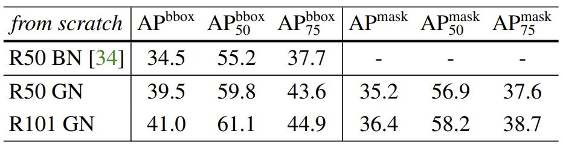

表 7：使用 Mask R-CNN 和 FPN 在 COCO 中从头开始训练的检测和分割结果。这里的BN结果来自[34]，BN在[43]上跨GPU同步，且未被冻结。

### 4.3 Video Classification in Kinetics

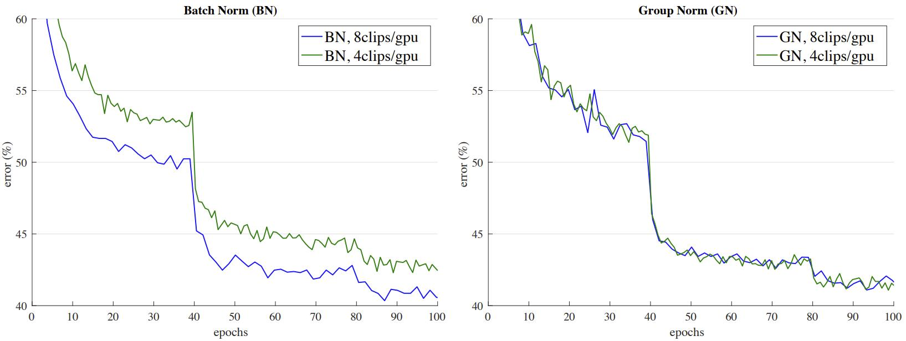

图 7：在输入长度为 32 帧的 Kinetics 中的错误曲线。我们展示了使用批量大小为 8 和 4 个剪辑/GPU 的 ResNet-50 I3D 的 BN (左) 和GN (右) 的验证错误。监视的验证错误是与训练集相同的数据增强下的 1 剪辑错误，而表 8 中的最终验证准确性是没有数据增强的 10 剪辑测试。

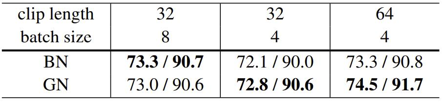

表 8：在 Kinetics 中的视频分类结果：ResNet-50 I3D 基线的 top-1 / top-5 准确率 (%)。

最后，我们在 Kinetics 数据集中评估视频分类。许多视频分类模型将特征扩展到 3D 时空维度。这需要大量内存，并对批量大小和模型设计施加约束。 

我们使用 Inflated 3D (I3D) 卷积网络进行实验。我们使用 [62] 中描述的 ResNet-50 I3D 基线。这些模型是从ImageNet 预训练的。对于 BN 和 GN，我们将归一化从 (H, W) 扩展到 (T, H, W) ，其中 T 是时间轴。我们在400 类的 Kinetics 训练集中进行训练，并在验证集中进行评估。我们使用标准的 10-clip 测试报告了 top-1 和 top-5 分类准确性，该测试从定期采样的 10 个剪辑中平均 softmax 分数。 

我们研究了两种不同的时间长度：32 帧和 64 帧输入剪辑。 32 帧剪辑从原始视频定期采样，帧间隔为 2，而 64 帧剪辑则连续采样。该模型在时空上完全卷积，因此 64 帧变体消耗约为 2 倍多的内存。由于内存限制，对于 32 帧变体，我们研究了 8 个或 4 个剪辑/GPU 的批量大小，对于 64 帧变体，4 个剪辑/GPU。

**32 帧输入的结果：** 表 8 (列 1、2) 显示了在 Kinetics 中使用 32 帧剪辑的视频分类准确性。对于批量大小为 8，GN 的 top-1 准确率和 top-5 准确率比 BN 略差 0.3% 和 0.1%。这表明当 BN 工作良好时，GN 与 BN 具有竞争力。对于较小的批量大小 4，GN 的准确性保持相似 (72.8 / 90.6 vs. 73.0 / 90.6) ，但比 BN 的 72.1 / 90.0 更好。当批量大小从 8 降至 4 时，BN 的准确性降低了 1.2%。

 图 7 显示了错误曲线。当批量大小从 8 降至 4 时，BN 的错误曲线 (左) 有明显的差距，而 GN 的错误曲线 (右) 非常相似。

**64 帧输入的结果：** 表 8 (列3) 显示了使用 64 帧剪辑的结果。在这种情况下，BN 的结果为 73.3 / 90.8。这些数字似乎是可以接受的 (与32帧，批量大小 8 的 73.3 / 90.7 相比) ，但时间长度 (64 vs. 32) 和批量大小 (4 vs. 8) 之间的权衡可能已被忽略。将表 8 中的列 3 与列 2 进行比较，我们发现时间长度实际上具有积极影响 (+1.2%) ，但被 BN 较小批量大小的负面影响所掩盖。

GN 不会受到这种权衡的影响。GN 的 64 帧变体具有74.5 / 91.7 的准确性，显示出健康的增益，优于其 BN 对应物和所有 BN 变体。GN 有助于模型从时间长度中受益，而使用相同批量大小的较长的剪辑可将 top-1 准确率提高1.7% (top-5 1.1%) 。 

GN 在检测、分割和视频分类方面的改进表明，GN 是在这些任务中强大且目前占主导地位的 BN 技术的强有力替代品。

## 5. Discussion and Future Work

我们提出了 GN 作为一种没有利用批次维度的有效的归一化层。我们已经在各种应用中评估了 GN 的行为。但是，我们注意到，BN 已经非常有影响力，许多最先进的系统及其超参数都是为其设计的，这可能不是基于 GN 的模型的最佳选择。重新设计系统或为 GN 搜索新超参数可能会产生更好的结果。

此外，我们还表明，GN 与 LN 和 IN 有关，这是两种用于训练循环 (RNN / LSTM) 或生成 (GAN) 模型特别成功的归一化方法。这提示我们在将来研究这些领域中的 GN。我们还将研究 GN 在学习表征强化学习 (RL) 任务方面的性能，例如 [54]，其中 BN 在训练非常深的模型 ResNet 方面发挥了重要作用。

## Reference

[16]: https://arxiv.org/pdf/1706.02677.pdf	"Accurate, Large Minibatch SGD: Training ImageNet in 1 Hour"
[17]: https://github.com/facebookarchive/fb.resnet.torch	"Training and investigating Residual Nets"
[20]: https://arxiv.org/pdf/1512.03385.pdf	"ResNet"


