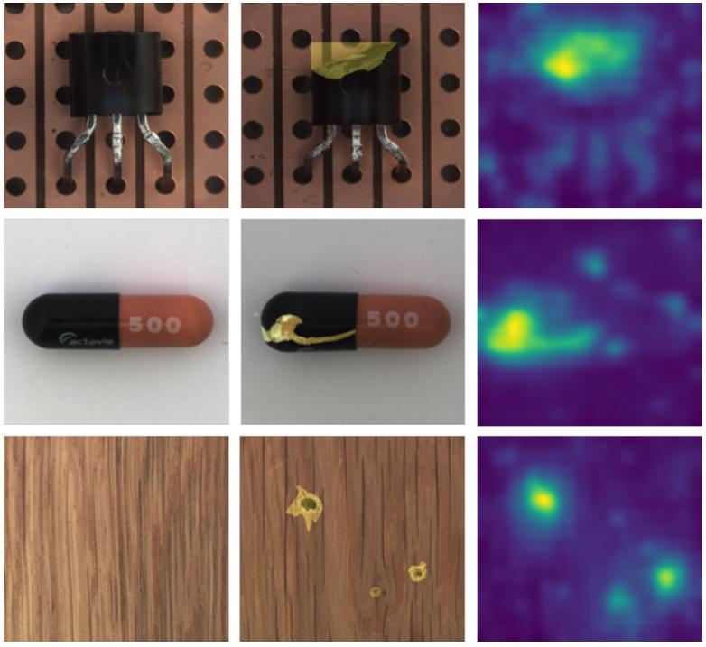
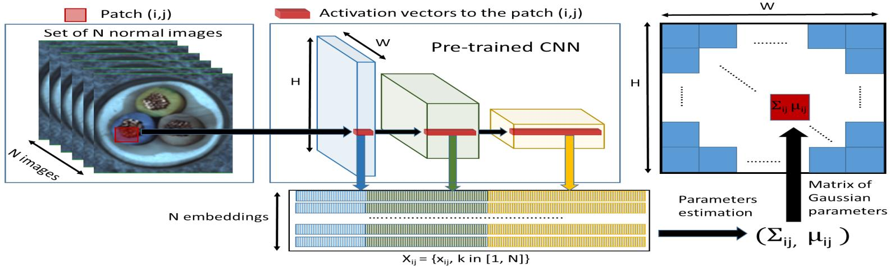

# [PaDiM: a Patch Distribution Modeling Framework for Anomaly Detection and Localization](https://arxiv.org/abs/2011.08785)

## Abstract

我们提出了一种新的补丁分布建模框架 PaDiM，用于在单类学习设置中同时检测和定位图像中的异常。PaDiM 利用预训练的卷积神经网络 (CNN) 进行补丁嵌入，并利用多元高斯分布来获得正常类别的概率表示。它还利用 CNN 不同语义级别之间的相关性来更好地定位异常。在 MVTec AD 和 STC 数据集上，PaDiM 在异常检测和定位方面均优于当前最先进的方法。为了与现实世界的视觉工业检测相匹配，我们扩展了评估协议，以评估异常定位算法在非对齐数据集上的性能。PaDiM 的最先进性能和低复杂度使其成为许多工业应用的良好候选者。

**图 1**：

## I. INTRODUCTION

人类能够在一组同质的自然图像中检测出异质或意想不到的模式。这项任务被称为异常或新颖性检测，具有广泛的应用，其中包括视觉工业检测。然而，异常在生产线上是非常罕见的事件，并且手动检测非常繁琐。因此，异常检测自动化将通过避免注意力下降并方便人工操作员的工作来实现持续的质量控制。在本文中，我们专注于异常检测，特别是异常定位，主要是在工业检测的背景下。在计算机视觉中，异常检测包括为图像赋予一个异常分数。异常定位是一项更复杂的任务，它为每个像素或每个像素块分配一个异常分数以输出异常图。因此，异常定位产生更精确和可解释的结果。图 1 显示了我们方法生成的用于定位 MVTec 异常检测 (MVTec AD) 数据集 [1] 中图像异常的异常图示例。

异常检测是正常类别和异常类别之间的二元分类。然而，由于我们经常缺乏异常示例，而且更重要的是，异常可能具有意想不到的模式，因此无法使用完全监督的方式训练模型来完成这项任务。因此，异常检测模型通常在单类学习设置中进行估计，即当训练数据集仅包含来自正常类别的图像，并且在训练期间没有可用的异常示例时。在测试时，与正常训练数据集不同的示例被分类为异常。

最近，已经提出了几种方法来在单类学习设置中结合异常定位和检测任务 [2]–[5]。然而，它们要么需要可能很繁琐的深度神经网络训练 [3]，[6]，要么在测试时对整个训练数据集使用 K 近邻 (K-NN) 算法 [7]，[4]，[5]。KNN 算法的线性复杂度会随着训练数据集大小的增长而增加时间和空间复杂度。这两个可扩展性问题可能会阻碍异常定位算法在工业环境中的部署。

为了缓解上述问题，我们提出了一种新的异常检测和定位方法，名为 PaDiM（补丁分布建模）。它利用预训练的卷积神经网络 (CNN) 进行嵌入提取，并具有以下两个特性：

- 每个补丁位置都用一个多元高斯分布来描述；
- PaDiM 考虑了预训练 CNN 不同语义级别之间的相关性。

凭借这种新的高效方法，PaDiM 在 MVTec AD [1] 和上海科技大学校园 (STC) [8] 数据集上，在异常定位和检测方面均优于现有的最先进方法。此外，在测试时，它具有较低的时间和空间复杂度，且与数据集训练大小无关，这对于工业应用来说是一项优势。我们还扩展了评估协议，以在更真实的条件下（即在非对齐数据集上）评估模型性能。

## II. RELATED WORK

异常检测和定位方法可以分为基于重建的方法和基于嵌入相似性的方法。

基于重建的方法广泛应用于异常检测和定位。诸如自编码器 (AE) [1]，[9]–[11]，变分自编码器 (VAE) [3]，[12]–[14] 或生成对抗网络 (GAN) [15]–[17] 等神经网络架构仅在正常训练图像上进行训练。因此，由于异常图像无法很好地重建，因此可以识别出它们。在图像级别，最简单的方法是将重建误差作为异常分数 [10]，但是来自潜在空间 [16]，[18]，中间激活 [19] 或判别器 [17]，[20] 的附加信息可以帮助更好地识别异常图像。然而，为了定位异常，基于重建的方法可以将像素级重建误差 [1] 或结构相似性 [9] 作为异常分数。或者，异常图可以是根据潜在空间生成的视觉注意力图 [3]，[14]。尽管基于重建的方法非常直观且可解释，但它们的性能受到限制，因为 AE 有时也可以为异常图像产生良好的重建结果 [21]。

基于嵌入相似性的方法使用深度神经网络提取描述整个图像以进行异常检测 [6]，[22]–[24] 或描述图像补丁以进行异常定位 [2]，[4]，[5]，[25] 的有意义的向量。尽管如此，仅执行异常检测的基于嵌入相似性的方法给出了有希望的结果，但通常缺乏可解释性，因为无法知道异常图像的哪个部分导致了高异常分数。在这种情况下，异常分数是测试图像的嵌入向量与来自训练数据集的表示正常性的参考向量之间的距离。正常参考可以是包含来自正常图像的嵌入的 n 球体的中心 [4]，[22]，高斯分布的参数 [23]，[26] 或整个正常嵌入向量集 [5]，[24]。SPADE [5] 使用了最后一种选择，它在异常定位方面报告了最佳结果。然而，它在测试时对一组正常嵌入向量运行 K 近邻算法，因此推理复杂度与数据集训练大小呈线性关系。这可能会阻碍该方法在工业上的部署。

我们的方法 PaDiM 生成用于异常定位的补丁嵌入，类似于上述方法。然而，PaDiM 中的正常类别通过一组高斯分布来描述，这些高斯分布还对所使用的预训练 CNN 模型的语义级别之间的相关性进行建模。受 [5]，[23] 的启发，我们选择 ResNet [27]，Wide-ResNet [28] 或 EfficientNet [29] 作为预训练网络。由于这种建模，PaDiM 优于当前最先进的方法。此外，它的时间复杂度很低，并且在预测阶段与训练数据集的大小无关。

## III. PATCH DISTRIBUTION MODELING

### A. Embedding extraction

预训练的 CNN 能够输出用于异常检测的相关特征 [24]。因此，我们选择仅使用预训练的 CNN 来生成补丁嵌入向量，从而避免繁琐的神经网络优化。PaDiM 中的补丁嵌入过程与 SPADE [5] 中的类似，如图 2 所示。在训练阶段，正常图像的每个补丁都与其在预训练 CNN 激活图中的空间对应激活向量相关联。然后，将来自不同层的激活向量连接起来，以获得携带来自不同语义级别和分辨率信息的嵌入向量，从而编码细粒度和全局上下文。由于激活图的分辨率低于输入图像，因此许多像素具有相同的嵌入，然后在原始图像分辨率中形成没有重叠的像素补丁。因此，输入图像可以划分为$(i,j) \in [1, W] \times [1,H]$ 位置的网格，其中 $W \times H$ 是用于生成嵌入的最大激活图的分辨率。最后，此网格中的每个补丁位置 $(i,j)$ 都与如上所述计算的嵌入向量 $\large x_{ij}$ 相关联。

生成的补丁嵌入向量可能携带冗余信息，因此我们实验性地研究了减小其大小的可能性（第五节 A 部分）。我们注意到，随机选择少量维度比经典的 Principal Component Analysis (PCA) 算法 [30] 更有效。这种简单的随机降维显着降低了我们模型在训练和测试时的复杂度，同时保持了最先进的性能。最后，测试图像的补丁嵌入向量在下一小节中描述的正常类别的学习参数化表示的帮助下，用于输出异常图。

**图 2**：

### B. Learning of the normality

为了学习位置 $(i,j)$ 处的正常图像特征，我们首先计算来自 $N$ 个正常训练图像的在 $(i,j)$ 处的补丁嵌入向量集合 $\large X_{ij} = \set{x_{ij}^k, k \in [1, N]}$ ，如图 2 所示。为了总结此集合所携带的信息，我们假设 $X_{ij}$ 由一个多元高斯分布 $\mathcal{N}(\mu_{ij}, \sum_{ij})$ 生成，其中 $\mu_{ij}$ 是 $X_{ij}$ 的样本均值，样本协方差 $\sum_{ij}$ 的估计如下：

$$
\large \sum_{ij} = \frac{1}{N - 1} \sum_{k=1}^N (\mathbf{x_{ij}^k} - \mathbf{\mu_{ij}})(\mathbf{x_{ij}^k} - \mathbf{\mu_{ij}})^T + \epsilon I \tag{1}
$$

其中正则化项 $I$ 使样本协方差矩阵 $\sum_{ij}$ 满秩且可逆。最后，如图 2 中高斯参数矩阵所示，每个可能的补丁位置都与一个多元高斯分布相关联。

我们的补丁嵌入向量携带来自不同语义级别的信息。因此，每个估计的多元高斯分布 $\mathcal{N}(\mu_{ij}, \sum_{ij})$ 也捕获了来自不同级别的信息，并且 $\sum_{ij}$ 包含了层间相关性。我们通过实验表明（第五节 A 部分），对预训练 CNN 不同语义级别之间的这些关系进行建模有助于提高异常定位性能。

### C. Inference : computation of the anomaly map

受 [23]，[26] 的启发，我们使用马氏距离 [31] $M(x_{ij})$ 来为测试图像中位置 $x_{ij}$ 的补丁赋予异常分数。 $M(x_{ij})$ 可以解释为测试补丁嵌入 $x_{ij}$ 与学习到的分布 $\mathcal{N}(\mu_{ij}, \sum_{ij})$ 之间的距离，其中 $M(x_{ij})$ 的计算如下：

$$
\large M(x_{ij}) = \sqrt{(x_{ij} - \mu_{ij})^T\sum_{ij}^{-1}(x_{ij} - \mu_{ij})} \tag{2}
$$

因此，可以计算形成异常图的马氏距离矩阵 $\large M = (M(x_{ij}))_{1<i<W,1<j<H}$ 。此图中较高的分数表示异常区域。整个图像的最终异常分数是异常图 $M$ 的最大值。最后，在测试时，我们的方法没有基于 K-NN 的方法 [4]–[6]，[25] 的可扩展性问题，因为我们不必计算和排序大量距离值来获得补丁的异常分数。

## V. RESULTS

## VI. CONCLUSION

我们提出了一个名为 PaDiM 的框架，用于在基于分布建模的单类学习设置中进行异常检测和定位。它在 MVTec AD 和 STC 数据集上取得了最先进的性能。此外，我们还将评估协议扩展到非对齐数据，初步结果表明 PaDiM 在这些更真实的数据上具有鲁棒性。PaDiM 的低内存和时间消耗以及易用性使其适用于各种应用，例如视觉工业控制。
