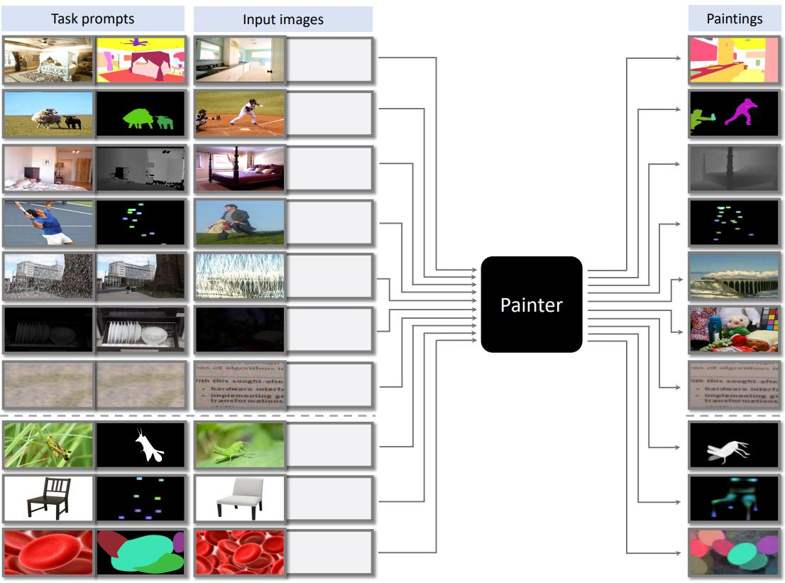
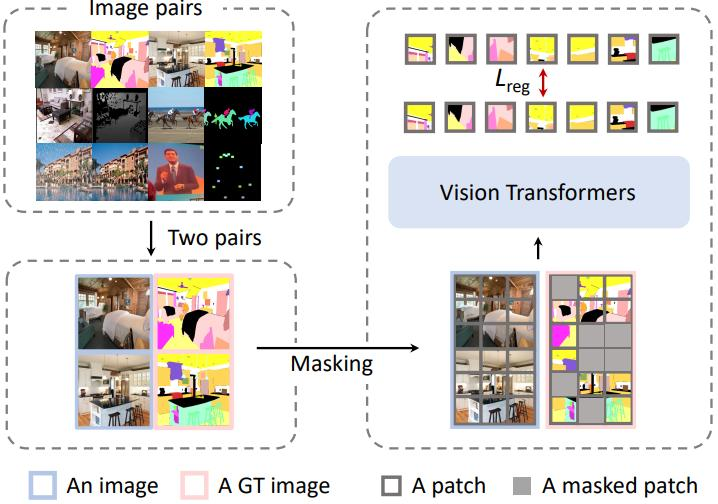

# [Images Speak in Images: A Generalist Painter for In-Context Visual Learning](https://arxiv.org/abs/2212.02499)

## Abstract

上下文学习作为自然语言处理领域的一种新范式，使得模型仅需少量提示和示例即可快速适应各种任务。但在计算机视觉领域，上下文学习的难点在于任务的输出表示形式差异很大，因此，如何定义视觉模型能够理解并迁移到领域外任务的通用任务提示尚不清楚。在这项工作中，我们提出了 Painter，一个通过“图像”中心化解决方案来解决这些障碍的通用模型，也就是说，将核心视觉任务的输出重新定义为图像，并将任务提示也指定为图像。有了这个想法，我们的训练过程非常简单，它对输入和输出图像对的拼接执行标准的掩码图像建模 (masked image modeling)。这使得模型能够执行以可见图像块为条件的任务。因此，在推理过程中，我们可以采用来自同一任务的一对输入和输出图像作为输入条件，以指示要执行哪个任务。我们的通用模型 Painter 在七个具有代表性的视觉任务（从高层视觉理解到低层图像处理）上，无需任何额外的技巧，即可实现与成熟的特定任务模型相比具有竞争力的性能。此外，Painter 在几个具有挑战性的任务上显著优于最近的通用模型。



**图 1**：

## 1. Introduction

训练一个能够同时执行各种任务的通用模型，甚至在给定提示和极少量示例的情况下也能执行新任务，是朝着通用人工智能迈出的重要一步。在自然语言处理领域，上下文学习 [2, 7, 18] 的出现为此方向提供了一条新路径，它使用语言序列作为通用接口，并允许模型仅通过少量提示和示例即可快速适应各种以语言为中心的任务。

到目前为止，在计算机视觉领域，上下文学习很少被探索，并且如何实现它仍然不清楚。这可以归因于两种模态之间的差异。其中一个差异是，自然语言处理任务主要包括语言理解和生成，因此它们的输出空间可以统一为离散的语言标记序列。但视觉任务是对原始视觉输入在不同粒度和角度上的抽象。因此，视觉任务在输出表示形式上差异很大，导致了各种特定于任务的损失函数和架构设计。第二个区别是，自然语言处理任务的输出空间甚至与输入相同。因此，任务指令和示例的输入/输出（它们都是语言标记序列）可以直接用作输入条件（也称为任务提示），大型语言模型可以简单地处理这些条件。然而，在计算机视觉领域，如何定义视觉模型能够理解并迁移到领域外任务的通用任务提示或指令尚不清楚。最近的一些尝试 [6, 9, 10, 27, 35, 41] 通过遵循自然语言处理中的解决方案来解决这些难题。它们或多或少地通过离散化视觉任务的连续输出空间，并使用语言或专门设计的离散标记作为任务提示，将视觉问题转化为自然语言处理问题。

然而，我们认为图像本身就是一种自然的通用视觉感知接口，即“图像诉说图像”。在这项工作中，我们通过一种以视觉为中心的解决方案来解决上述障碍。核心观察是，大多数密集预测视觉问题都可以公式化为图像修复，即：

给定一个输入图像，预测就是修复期望但缺失的输出“图像”。

因此，我们需要一个看起来像“图像”的 3 通道张量表示作为视觉任务的输出，并使用一对图像来指定任务提示。在这里，我们展示了几个用于训练的代表性视觉任务，包括深度估计、人体关键点检测、语义分割、实例分割、图像去噪、图像去雨和图像增强，并使用 3 通道张量（又名“输出图像”）统一它们的输出空间。我们为每个任务精心设计了数据格式，例如实例分割的实例掩码和逐像素离散标签，深度估计的逐像素连续值，以及姿态估计的高精度坐标。包含更多任务非常简单，因为我们只需要构建新的数据对并将它们添加到训练集中，而无需修改模型架构或损失函数。

基于这种统一，我们使用极其简单的训练过程训练了一个通用模型 Painter。在训练期间，我们将来自同一任务的两张图像拼接成一张更大的图像，它们对应的输出图像也进行相同的操作。然后，我们对输出图像的像素应用掩码图像建模 (MIM)，并将输入图像作为条件。通过这种学习过程，我们使模型能够执行以可见图像块为条件的任务，即以视觉信号为上下文的上下文预测能力。

因此，训练好的模型能够进行上下文推理。也就是说，我们直接使用来自同一任务的输入/输出配对图像作为输入条件，以指示要执行哪个任务。上下文推理的示例在图 1 中进行了说明，包括七个领域内示例（顶部七行）和三个领域外示例（底部三行）。这种任务提示的定义不需要像几乎所有先前的方法那样深入理解语言指令，并且使得执行领域内和领域外的视觉任务都非常灵活。

我们的模型无需任何额外的技巧，即可在几个基本视觉任务上实现与成熟的特定任务模型相比具有竞争力的性能，这些任务涵盖了从高层视觉理解到低层图像处理，具体来说，包括 NYUv2 [37] 上的深度估计、ADE-20K [54] 上的语义分割、COCO [31] 上的人体关键点检测、COCO [31] 上的全景分割以及三个低层图像恢复任务。值得注意的是，在 NYUv2 的深度估计任务上，我们的模型取得了最先进的性能，以巨大的优势超越了之前最好的结果，而之前的最好结果在架构和损失函数上都有繁重且专门的设计。与其他通用模型相比，Painter 在几个具有挑战性的任务上取得了显著的改进。

## 2. Related Work

**统一建模**：Transformer [40] 的出现为在不同模态之间共享基本建模模块提供了可能性。到目前为止，Transformer 已被广泛应用于语言 [7,12,32]、视觉 [4,8,9,14,33]、语音 [13, 17, 24] 和多模态 [23, 34, 38] 领域。Perceiver [22] 和 Perceiver-IO [21] 是首次尝试在不同领域使用完全相同的 Transformer 架构，例如自然语言和视觉理解处理、星际争霸 II 和多模态领域。如果输入可以转换为标记序列，则可以采用 Transformer 来建模不同标记之间的关系。

**视觉通用模型**：由于 Transformer 的通用建模能力，一些工作致力于统一视觉领域中的不同任务，从而产生了几个视觉通用模型 [9, 10, 27, 35, 55]。DETR [8] 首次采用 Transformer 作为目标检测的特定任务头部。基于此，Pix2Seq [9] 将目标检测的输出空间定义为离散空间，并以自回归的方式执行此任务。由于目标检测的基础性，Pix2Seq 为使用离散空间统一不同的视觉任务提供了方向，从而激发了许多后续工作。Unified-IO [35] 和 OFA [41] 都将各种不同的输入和输出统一为离散标记序列，对视觉、视觉与语言以及自然语言处理任务以序列到序列的方式执行联合建模，并使用具有数十亿参数的 T5 风格架构 [36]，其中 Unified-IO 比 OFA 统一了更多任务，模型规模也更大。Pix2Seq v2 [10] 在与 Pix2Seq 相同的已定义离散空间中统一了目标检测、实例分割、关键点估计和图像描述。UViM [27] 使用相同的建模方法统一了像素标记任务，但为不同的任务（如全景分割、深度估计和着色）训练了单独的模型。

值得注意的是，从我们的角度来看，视觉信号的输入本质上是连续的，因此，我们尝试使几个代表性视觉任务的输出空间像图像一样连续，以减少离散化引起的量化误差，并进一步通过掩码图像建模实现上下文视觉学习。

**上下文学习**：GPT-3 [7] 首次定义了一种新的学习范式，即上下文学习，其中一系列自然语言处理任务可以被公式化为给定提示和示例的文本补全任务。上下文学习赋予模型执行即时计算推理或在训练中不太可能出现的新颖模式识别的新能力。Flamingo [2] 将大型语言模型的输入扩展到不仅包括文本，还包括图像和视频，但仍然使用语言作为通用接口，使得模型可以在给定提示和示例的情况下执行许多视觉-语言任务，例如图像描述、视觉问答、光学字符识别 (OCR) 等。在其他领域，直接引入上下文学习能力似乎并非易事。AD [28] 使用算法蒸馏将上下文能力与强化学习相结合。在计算机视觉领域，一项并发工作 [6] 对视觉文章中的图表和信息图进行修复，但仅适用于像语言领域一样在离散空间上进行预测，并在前景分割、单目标检测和着色方面展示了上下文能力。虽然工作 [6] 证明了视觉任务中上下文学习的概念，但没有报告在标准基准数据集上的结果。因此，该方法在真实世界数据集上的表现仍然不清楚。相比之下，我们的模型在七个多样化且具有挑战性的视觉任务（包括深度估计、关键点估计、语义分割、全景分割、图像去噪、图像去雨和图像增强）上，通过对像素进行掩码图像建模表现良好，并且在这些任务上也表现出极具竞争力的性能。

## 3. Approach

我们框架的核心思想是将大多数视觉任务（如深度估计、语义分割、实例分割、关键点检测和图像恢复）重新表述为图像修复问题。为此，我们将这些任务的输出空间重新定义为“图像”。

### 3.1. Redefining Output Spaces as “Images”

我们将大小为 $H \times W \times 3$ 的输入图像表示为 $\mathbf{x}$ ，不同任务 $t$ 的标准任务真值定义为 $\mathbf{y}^t$ ，其大小各不相同，我们将这些任务输出仍然在图像空间中重新定义为 $\hat{\mathbf{y}}^t$，其大小为 $H \times W \times 3$ 。我们的理念是保持像素之间的空间关系不变，并且输出图像的每个像素仍然代表相应输入图像像素在该任务中的输出，但以 RGB 空间表示。也就是说，具有三个维度的 $\large \hat{\mathbf{y}}_{i,j}^t$ 表示输入像素 $\mathbf{x}_{i,j}$ 的对应真值。我们选择了七个具有代表性的视觉任务，它们的输出类型各不相同，例如深度估计、语义分割、关键点检测和全景分割。在这里，我们展示了如何将每个任务的逐像素真值重新定义为类似于 RGB 空间的 3 通道张量。请注意，理论上，固定数量的输出通道可以满足我们的目的。我们选择 3 个通道是为了构成一个图像。

**单目深度估计**是一个具有弱语义的密集预测任务，旨在估计给定输入 RGB 图像的逐像素深度值（相对于相机的距离）。对于 NYUv2 [37]，逐像素真值深度 $\mathbf{y}_{i,j}^t$ 是范围在 [0, 10] 米之间的实数值。在这里，我们将真值从实数值范围 [0, 10] 映射到整数范围 [0, 255]，计算公式为 $\large \hat{\mathbf{y}}_{i,j,0}^t = \lfloor \mathbf{y}_{i,j}^t \times \frac{255}{10} \rfloor $ ，并使三个通道 $\hat{\mathbf{y}}_{i,j,0}^t, \hat{\mathbf{y}}_{i,j,1}^t, \hat{\mathbf{y}}_{i,j,2}^t$ 的值相同。在推理时，我们直接平均三个通道的输出，然后执行与训练相反的线性变换，以获得范围在 [0, 10] 之间的深度估计。

**语义分割**是一项具有强语义的密集预测任务，旨在预测给定输入图像的逐像素语义标签。给定一个包含 $L$ 个类别的语义分割任务，我们让 RGB 空间以相同的间隔表示这 $L$ 个类别。我们用 $b$ 进制系统将 $L$ 表示为一个三位数，其中 $b = \lceil L^{\frac{1}{3}} \rceil$ ， $\hat{\mathbf{y}}_{i,j,0}^t, \hat{\mathbf{y}}_{i,j,1}^t, \hat{\mathbf{y}}_{i,j,2}^t$ 分别表示其百位、十位和个位，间隔定义为 $m = \lfloor \frac{256}{b} \rfloor$ 。例如，ADE-20K [54] 包含 150 个语义类别和一个背景类别，因此我们将基数设置为 $b = 6$ ，间隔设置为 $m = 42$ 。输出通道定义为 $\large \hat{\mathbf{y}}_{i,j,0}^t = \lfloor \frac{l}{b^2} \rfloor \times m, \hat{\mathbf{y}}_{i,j,1}^t = \lfloor \frac{l}{b} \rfloor \bmod b \times m, \hat{\mathbf{y}}_{i,j,2}^t = l \bmod b \times m$ ，其中 $l$ 表示对应的类别，是范围在 [0, L) 的整数值。在推理时，我们使用间隔 $m$ 对每个像素的输出进行离散化，并获得其对应的类别。

**关键点检测**是一项细粒度的定位任务，旨在同时检测物体（例如，人）并定位其详细的关键点。我们遵循最近基于热图的自上而下流程 [46]，因此对于人体关键点检测，它被定义为一项 17 类别的点定位任务。对于每个关键点，我们需要将其定位到对应的像素，这是一个非常细粒度的任务。我们将此任务分解为 17 类关键点分类（使用 $\hat{\mathbf{y}}_{i,j,1}^t, \hat{\mathbf{y}}_{i,j,2}^t$ 这两个通道）和类别无关的关键点定位（使用 $\hat{\mathbf{y}}_{i,j,0}^t$ 这个通道）的组合。对于 17 类分类任务，我们将每个关键点定义为一个 9×9 像素的正方形，并使用与语义分割相同的方法定义每个正方形的颜色。对于类别无关的点定位任务，我们定义了 17 个正方形，每个正方形都是一个 17×17 的高斯分布热图，其中中心像素的值最大为 255，代表着真值关键点的位置。在推理时，我们从 3 通道输出图像中获得每个关键点的类别和位置作为最终结果。

**全景分割**是语义分割任务和实例分割任务的结合。因此，为了便于重新定义输出空间和优化，我们分别执行这两个任务，然后结合它们的结果以获得全景分割的结果。

在这里，我们介绍类别无关实例分割的输出空间重定义。对于此任务，我们直接将图像中每个实例掩码的颜色更改为相同的颜色，因此不同的实例使用不同的颜色。理论上，我们可以为不同的实例随机选择颜色，但我们发现这种设置会使模型难以优化。为了解决这个优化问题，我们遵循 SOLO [42] 的方法，根据每个实例掩码中心在图像中的绝对位置为其分配颜色。我们从概念上将图像划分为 16×20×20 的块，分别对应于三个通道。我们为每个块分配一个固定的颜色，然后如果掩码的中心位于该块中，则相应地着色该掩码。在推理时，我们将每种颜色视为一个核，用于计算其与图像中每个像素的距离，然后设置一个阈值以获得最终的掩码。为了获得每个实例掩码的类别，我们直接将每个实例掩码内语义分割结果中占多数的类别分配为其类别。

**图像恢复**以损坏的图像作为输入，并输出相应的干净图像。在本文中，我们研究了三个具有代表性的图像恢复任务，包括图像去噪、图像去雨和低光图像增强。由于输入和输出本质上都在 RGB 空间中定义，因此这些任务可以在我们的 Painter 模型中无缝统一，无需任何转换。



**图 2**：掩码图像建模 (MIM) 框架的训练流程。

### 3.2. A Masked Image Modeling Framework

基于上述代表性视觉任务的输出空间重定义，这些任务的输入和输出都是图像。因此，在这里我们直接应用标准的掩码图像建模 (MIM) 流程 [5, 19, 48] 进行训练，如图 2 所示。这个框架由三个主要组成部分构成：输入格式、架构和损失函数。

**输入格式**：在训练期间，每个输入样本是将来自同一任务的两对图像连接起来，这些图像对已经分别应用了数据增强，如图 2 的左侧部分所示。每对图像包含一个图像及其对应的任务输出，任务输出也被重新定义为图像。我们随机掩盖任务输出图像，并训练模型以重建缺失的像素。对于被掩盖的区域，我们遵循自然语言处理社区 [32, 38] 和先前的工作 [5, 19, 48]，使用可学习的 token 向量来替换每个被掩盖的图像块。我们采用块状掩盖策略，发现 75% 的掩盖率效果良好。

**架构**：我们采用原始的 Vision Transformer (ViT) [14] 作为编码器，它由堆叠的 Transformer 块组成，例如，ViT-large 有 24 个块。我们连接从这些块均匀采样的 4 个特征图，并使用一个简单的三层头部将每个图像块的特征映射到其原始分辨率，例如 16 × 16 × 3。具体来说，头部由一个线性层（1×1 卷积）、一个 3×3 卷积层和另一个线性层组成。

由于每个输入样本都包含输入图像及其输出图像，因此输入分辨率可能比传统的训练过程更大，计算成本也更高。为了解决这个问题，我们建议通过合并输入图像和输出图像的早期特征来降低计算成本。具体来说，我们将输入图像和输出图像并行地输入到模型中，然后在几个块之后（默认情况下是 3 个块）逐个图像块地添加它们的特征。这种设计节省了近一半的计算成本，但我们发现性能没有下降。

**损失函数**：我们使用简单的回归损失来训练 Painter。具体来说，对被掩盖的像素计算 $\text{smooth} - \ell1$ [16] 损失。我们也在实验中考虑了 $\ell1$ 和 $\ell2$ 损失，发现 $\text{smooth} - \ell1$ 损失取得了最佳性能。

### 3.3. In-Context Inference

我们首次设计了一种上下文推理过程，该过程非常灵活，可以执行领域内和领域外的视觉任务。由于视觉任务的输入和输出空间已被统一为图像，我们可以直接使用来自同一任务的输入/输出配对图像作为输入条件（任务提示）来指示要执行哪个任务，并将它们与输入图像和一个掩盖的图像连接起来，以完成相应的任务。示例在图 1 中显示。这种任务提示的定义不需要像以前的方法那样深入理解语言指令，而是使用视觉信号作为上下文，视觉模型可以理解这种上下文，并且与视觉领域的本质非常吻合。

此外，不同的任务提示会导致不同的结果。因此，如何选择或生成更合适的任务提示可能是一个新的探索方向。在这里，我们提出了两个简单的基线方法，并将更多的探索留作未来的工作。第一个基线是通过选择获得更好的提示，即我们以启发式的方式遍历整个训练集，并为每个任务选择表现最佳的示例对。第二个基线是生成任务提示。我们将任务提示定义为可学习的张量，冻结整个模型，然后使用训练损失来优化任务提示。我们在可视化实验中将这两种解决方案与随机对应方案进行了比较，如 §4.3 所示。

## 4. Experiments

### 4.1. Settings


### 4.2. Results


### 4.3. Prompt Tuning


### 4.4. Generalization


## 5. Discussion and Conclusion

在这项工作中，我们首次探索了如何执行上下文视觉学习，并提出了一种以视觉为中心的解决方案，其中上下文被定义为视觉信号。因此，模型被赋予了基于来自该任务的配对数据执行任务的能力，即上下文推理。我们的方法在一组具有代表性的多样化七个任务上取得了极具竞争力的性能。

这项工作并非没有缺点。首先，与专门的模型相比，我们的方法在困难的全景分割任务上仍有很大的提升空间。此外，由于我们的方法是基于视觉信号作为上下文设计的，因此这种通用接口似乎不太适合建模语言信号。如何将离散的语言信号建模为连续的信号似乎是一个令人印象深刻的方向，并且最近已经开始出现一些相关工作。

虽然以前也有一些方法希望使用通用接口来解决多个视觉任务，但我们可能是第一个赋予模型在上下文中学习和完成任务的能力，这确实有机会处理领域外的任务。我们希望这项工作能够引起人们对这个有前途的方向的关注，并且我们相信视觉领域中最好的“GPT-3 时刻”尚未到来。

## Appendix

### A. Additional Implementation Details

在本节中，我们提供了不同任务的数据准备和姿态处理的更多细节。提供了 PyTorch 风格的伪代码，以更好地说明实现细节。它们可以通过实现中的几个操作来完成。对于每个任务，与专门的方法相比，Painter 不涉及更复杂的后处理。

语义分割 如正文第 3.1 节所述，我们使用 RGB 空间中的不同颜色来表示不同的语义类别。为此，我们将背景和忽略区域定义为黑色，即颜色为 (0, 0, 0) 的像素，并使用图 S1 中详细说明的伪代码生成前景类别的颜色。

在推理过程中，为了将输出图像解码为每个像素代表一个类别 ID 的单通道 ID 图，我们计算每个输出像素与每个语义类别的预定义颜色之间的 L1 距离，并将距离最近的颜色的 ID 作为预测的类别。后处理的伪代码如图 S2 所示。

```python
def generate colors dict(b, K):
    # b: the number of used values in a single channel
    # K: the number of classes
    m = 255 // b # get margin
    colors = []
    for class id in range(K):
        # compute margin multiplier
        r mult = class id // b∗∗2
        g mult = (class id %
        b mult = class id %
        # compute r, g, b values
        r = 255 − r mult ∗ m
        g = 255 − g mult ∗ m
        b = 255 − b mult ∗ m
        colors.append((r, g, b))
	return colors
```

**图 S1**：

```python
def forward(image, colors):
    # image: (H, W, 3)
    # colors: (K, 3), where K is the number of classes
    # get distance between pixels and pre−defined colors
    dist = (image.view(H, W, 1, 3) − colors.view(1, 1, K, 3)
	    ).abs().sum(−1) # (H, W, K)
    segm = dist.argmin(dim=−1) # (H, W)
    return segm
```

**图 S2**：

**关键点检测**：对于关键点检测，输出图像的 R 通道表示类别无关的热图，G/B 通道表示关键点类别。如图 S3 所示，我们将输出图像转换为 17 通道的热图，并遵循常用的后处理方法 [39, 46] 来获得最终的关键点位置。

```python
def forward(image, colors):
    # image: (H, W, 3)
    # colors: (K, 3), where K is the number of keypoints
    # r for heatmaps and gb for keypoint classes
    r = images[..., 0] # (H, W)
    gb = images[..., 1:] # (H, W, 2)
    # get keypoint class of each pixel
    dist = (gb.view(H, W, 1, 2) − colors.view(1, 1, K, 2)).
	    abs().sum(−1) # (H, W, K)
    segm = dist.argmin(dim=−1) # (H, W)
    for idx in range(K):
        mask = segm == idx
        heatmap = mask ∗ r # (H, W)
        heatmaps.append(heatmap)
    heatmaps = stack(heatmaps) # (K, H, W)
    return heatmaps

```

**图 S3**：

全景分割 如第 3.2 节所述，我们将全景分割任务分解为语义分割和类别无关实例分割。在训练期间，语义分割子任务使用与 ADE-20K [54] 上的语义分割相同的设置，只是在分配颜色时我们将基数 b 设置为 7。与语义分割的颜色生成过程类似，我们为类别无关实例分割中使用的每个位置类别 [42] 生成颜色。每个实例掩码的颜色由其中心的位置决定。

在推理过程中，可以使用图 S2 中描述的后处理获得语义 ID 图，而类别无关的实例掩码是通过对预测颜色与位置类别的预定义颜色之间的距离进行阈值处理生成的。采用 Matrix NMS [43] 来移除重复的实例预测。我们应用语义预测中像素的多数投票来获得每个实例掩码的语义类别，如图 S4 所示。最后，我们遵循 Panoptic FPN [26] 来合并语义分割和实例分割的预测结果，以获得全景分割结果。

**图像恢复**：用于图像恢复的数据集的详细统计信息如表 S1 所示。

### B. Additional Results

在本节中，我们报告了对我们框架的几个组件进行的消融实验结果，实验在 ADE-20K 的语义分割任务上进行，使用了较短的 3k 次迭代的训练计划，其他超参数保持不变。

**合并图像块**：在训练期间，每个输入样本都包含输入图像和输出图像，这导致了较高的内存成本并显着减慢了训练过程。我们通过合并输入图像和输出图像的早期特征，即在三个块之后逐个图像块地添加它们的特征，从而减少了近一半的计算成本。表 S2a 显示，这种新设计甚至带来了性能的提升。我们认为，这种设计通过将输入和输出堆叠在一起，进一步提供了它们之间的像素级对应关系。但在原始设置中，这些关系需要由模型学习，这会使优化更加困难，尤其是在较短的训练计划中。

**编码器**：我们采用具有不同模型大小的标准 Vision Transformer (ViT) [14] 作为编码器，包括 ViT-base 和 ViT-large。结果如表 S2b 所示。我们发现使用 ViT-L 的模型比使用 ViT-B 的模型性能高出很多。这个观察结果是符合直觉的，通常来说，更大的模型会产生更好的性能。对于通用模型，它们可以使用更多的数据，但在方法设计上具有较少的特定任务先验知识，因此可能需要比特定任务模型更大的模型容量。

**头部**：我们使用一个轻量级的三层头部，它由一个线性层（1×1 卷积）、一个 3×3 卷积层和另一个线性层组成，用于将每个图像块的特征映射到其原始分辨率，例如 16 × 16 × 3。每个图像块的特征是从 Transformer 块均匀采样的 4 个特征图的连接。如表 S2c 所示，与仅使用线性层的基线相比，轻量级头部取得了明显的提升。

**损失函数**：Painter 使用简单的像素回归损失来学习所有任务。在表 S2d 中，我们比较了不同的回归损失函数，包括 ℓ1、ℓ2 和 smooth-ℓ1。我们默认采用 smooth-ℓ1 损失，因为它取得了最佳性能，并且在训练过程中也更稳定。

### C. Additional Visualization

