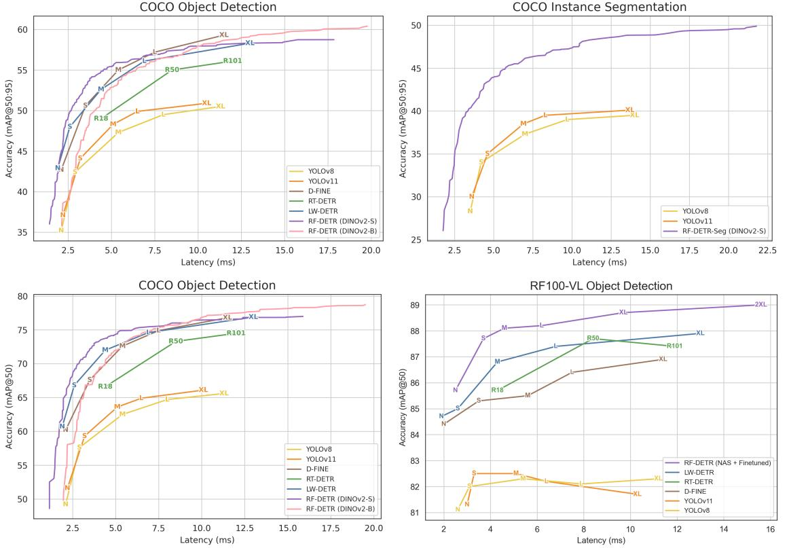
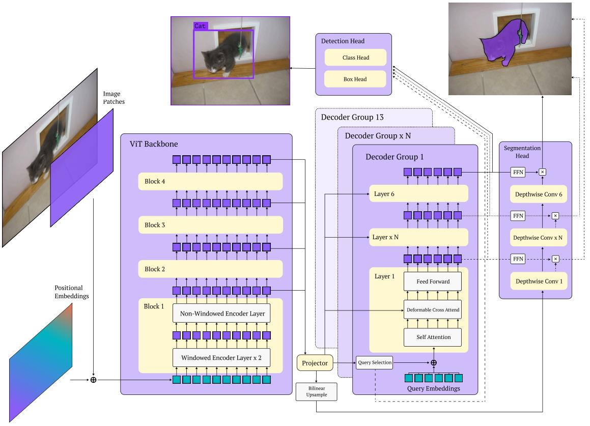
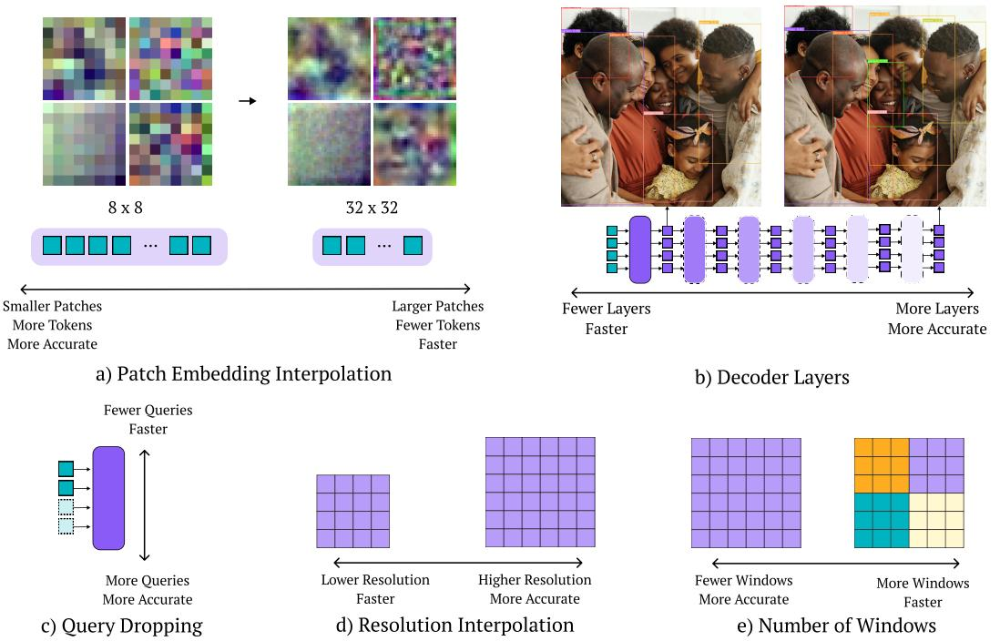
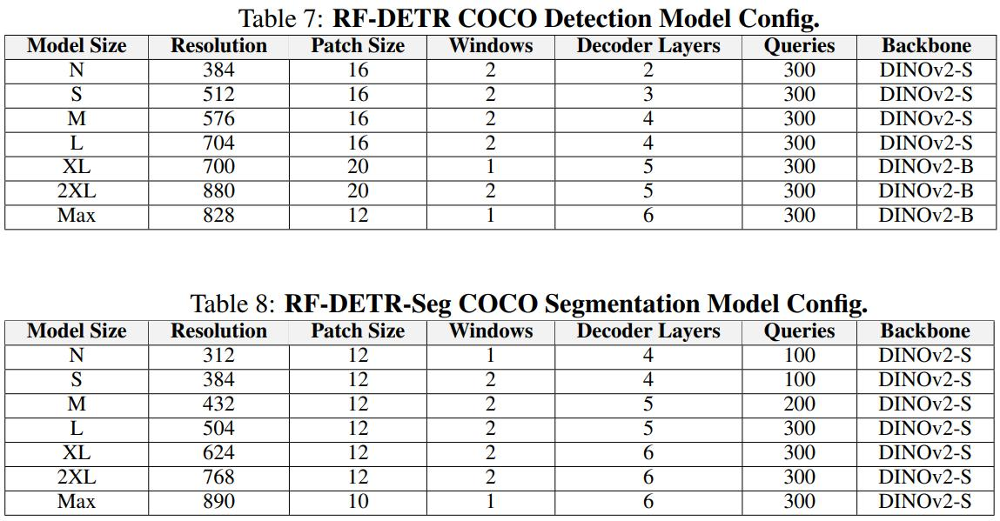

# [RF-DETR: NEURAL ARCHITECTURE SEARCH FOR REAL-TIME DETECTION TRANSFORMERS](https://arxiv.org/abs/2511.09554)

开放词汇检测器在 COCO 上取得了令人印象深刻的性能，但往往无法泛化到包含其预训练中通常未见过的分布外类别的真实世界数据集。我们引入了 RF-DETR，而不是简单地针对新领域微调重量级的视觉语言模型（VLM），这是一种轻量级的专用检测 Transformer，通过权重共享神经架构搜索（NAS）为任何目标数据集发现精度-延迟 Pareto 曲线 (accuracy-latency Pareto curves)。我们的方法在目标数据集上微调预训练的基础网络，并在无需重新训练的情况下评估数千种具有不同精度-延迟权衡的网络配置。此外，我们重新审视了 NAS 的“可调旋钮”，以提高 DETR 向多样化目标领域的迁移能力。值得注意的是，RF-DETR 在 COCO 和 Roboflow100-VL 上显著改进了以往最先进的实时方法。RF-DETR (nano) 在 COCO 上达到了 48.0 AP，在延迟相似的情况下比 D-FINE (nano) 高出 5.3 AP，而 RF-DETR (2x-large) 在 Roboflow100-VL 上比 GroundingDINO (tiny) 高出 1.2 AP，同时运行速度快 20 倍。据我们所知，RF-DETR (2x-large) 是第一个在 COCO 上超过 60 AP 的实时检测器。我们的代码可在 [GitHub](https://github.com/roboflow/rf-detr) 上获取。

## 1 INTRODUCTION

目标检测是计算机视觉中的一个基础问题，近年来已日趋成熟（Felzenszwalb 等人，2009；Lin 等人，2014；Ren 等人，2015）。像 GroundingDINO（Liu 等人，2023）和 YOLO-World（Cheng 等人，2024）这样的开放词汇检测器在汽车、卡车和行人等常见类别上取得了显著的零样本性能。然而，最先进的视觉语言模型（VLM）仍然难以泛化到其预训练中通常未见过的分布外类别、任务和成像模态（Robicheaux 等人，2025）。在目标数据集上微调 VLM 可以显著提高域内性能，但代价是运行效率（由于重量级文本编码器）和开放词汇泛化能力的降低。相比之下，像 D-FINE（Peng 等人，2024）和 RT-DETR（Zhao 等人，2024）这样的专用（即封闭词汇）目标检测器实现了实时推理，但在性能上不如微调后的 VLM（如GroundingDINO）。在本文中，我们通过结合互联网规模的预训练与实时架构来革新专用检测器，从而实现最先进的性能和快速推理。

**专用检测器是否针对COCO过度优化**？目标检测的持续进步很大程度上归功于像 PASCAL VOC（Everingham 等人，2015）和 COCO（Lin 等人，2014）这样的标准化基准。然而，我们发现最近的专用检测器通过使用定制的模型架构、学习率调度器和增强调度器，隐式地过拟合了 COCO，而代价是牺牲了现实世界的性能。值得注意的是，像 YOLOv8（Jocher 等人，2023）这样的最先进目标检测器在数据分布与 COCO 显著不同的现实世界数据集（例如每张图像的目标数量、类别数量和数据集大小）上泛化能力较差。为了解决这些局限性，我们提出了 RF-DETR，这是一种免调度器的方法，利用互联网规模的预训练来泛化到现实世界的数据分布。为了更好地使我们的模型适配各种硬件平台和数据集特征，我们在端到端目标检测和分割的背景下重新审视了神经架构搜索（NAS）。

**重新思考面向DETR的神经架构搜索（NAS）**。NAS 通过在预定义的搜索空间内探索架构变体来发现精度与延迟之间的权衡。NAS此前已在图像分类（Tan & Le，2019；Cai 等人，2019）以及检测器主干网络（Tan 等人，2020）和 FPNs（Ghiasi 等人，2019）等模型子组件的背景下进行过研究。与以往的工作不同，我们要探索的是面向目标检测和分割的端到端权重共享 NAS。受OFA（Cai 等人，2019）启发，我们的关键见解是，我们可以在训练期间改变模型输入（如图像分辨率）和架构组件（如图块大小）。此外，权重共享 NAS 允许我们修改推理配置（如解码器层数和查询令牌数），从而在无需微调的情况下专门化我们强大的基础模型。我们在验证集上使用网格搜索评估所有模型配置。重要的是，我们的方法在基础模型在目标数据集上完全训练好之前，不会评估搜索空间。因此，所有可能的子网（即搜索空间内的模型配置）无需进一步微调即可获得强大的性能，显著降低了针对新硬件进行优化的计算成本。有趣的是，我们发现训练期间未明确见过的子网仍然可以达到高性能（附录F），这表明 RF-DETR 可以泛化到未见过的架构。将 RF-DETR 扩展用于分割也相对简单，只需要添加一个轻量级的实例分割头。我们将此模型称为 RF-DETR-Seg。值得注意的是，这也使我们能够利用端到端权重共享 NAS 来发现用于实时实例分割的 Pareto 最优架构。

**标准化延迟评估**。我们在 COCO（Lin 等人，2014）和 Roboflow100-VL（RF100-VL）（Robicheaux 等人，2025）上评估了我们的方法，并在实时检测器中实现了最先进的性能。RF-DETR (nano) 在运行时间相当的情况下，在 COCO 上比 D-FINE (nano) 高出5%的AP，而 RF-DETR (2x-large) 在 RF100-VL 上击败了 GroundingDINO (tiny)，且运行时间仅为后者的一小部分。RF-DETR-Seg (nano) 在 COCO 上优于 YOLOv11-Seg (x-large)，同时运行速度快4倍。然而，将 RF-DETR 的延迟与先前的工作进行比较仍然具有挑战性，因为各论文报告的延迟评估存在显著差异。值得注意的是，每个新模型都会在其硬件上重新测试先前工作的延迟，以进行公平比较。例如，D-FINE 报告的 LW-DETR（Chen 等人，2024a）的延迟评估比最初报告的快25%。我们发现这种缺乏可复现性的主要原因可归咎于推理过程中的 GPU 功率限制。我们发现，在前向传播之间进行缓冲可以限制功率超支并标准化延迟评估（表1）。

**贡献**。我们提出了三个主要贡献。首先，我们介绍了RF-DETR，这是一系列基于 NAS 的免调度器检测和分割模型，在 RF100-VL（Robicheaux 等人，2025）上的表现优于以往的最先进技术，在 COCO（Lin 等人，2014）上优于延迟≤ 40毫秒的实时方法（图1）。据我们所知，RF-DETR 是第一个在 COCO 上超过 60 mAP 的实时检测器。接下来，我们探索了权重共享NAS的“可调旋钮”，以改善端到端目标检测的精度-延迟权衡（图3）。值得注意的是，我们使用权重共享NAS使我们能够利用大规模预训练并有效地迁移到小数据集（表4）。最后，我们重新审视了当前用于测量延迟的基准测试协议，并提出了一种简单的标准化程序以提高可复现性。

**图 1**：精度-延迟 Pareto 曲线。我们在 COCO 检测验证集（左上、左下）、COCO 分割验证集（右上）和 RF100-VL 测试集（右下）上绘制了实时检测器的 Pareto 精度-延迟前沿。由于 RF100-VL 包含 100 个不同的数据集，我们为 N、S、M、L、XL、2XL 配置选择目标延迟，搜索延迟在目标值 10% 以内的 RF-DETR 模型，并报告它们微调至收敛后的平均性能。重要的是，RF-DETR 在 COCO 上的连续 Pareto 曲线上的所有点均源自单次训练运行。

## 2 RELATED WORKS

**神经架构搜索（NAS）**自动识别具有不同精度-延迟权衡的模型架构系列（Zoph & Le, 2016; Zoph et al., 2018; Real et al., 2019; Cai et al., 2018a）。早期的 NAS方法（Zoph & Le, 2016; Real et al., 2019）主要侧重于最大化精度，很少考虑效率。因此，发现的架构（例如 NASNet 和 AmoebaNet）通常计算成本高昂。最近的硬件感知 NAS 方法（Cai et al., 2018b; Tan et al., 2019; Wu et al., 2019）通过将硬件反馈直接纳入搜索过程来解决这一限制。然而，这些方法必须为每个新的硬件平台重复搜索和训练过程。相比之下，OFA（Cai et al., 2019）提出了一种权重共享 NAS，通过同时优化数千个具有不同精度-延迟权衡的子网，将训练和搜索解耦。当代方法通常通过简单地用 NAS 主干替换现有检测框架中的标准主干来评估用于目标检测的 NAS。与先前的工作不同，我们直接优化端到端目标检测精度，以便为任何目标数据集找到 Pareto 最优的精度-延迟权衡。

**实时目标检测器**对于安全关键和交互式应用具有重大意义。历史上，像 Mask-RCNN（He et al., 2017）和 Hybrid Task Cascade（Chen et al., 2019）这样的两阶段检测器以牺牲延迟为代价实现了最先进的性能，而像 YOLO（Redmon et al., 2016）和SSD（Liu et al., 2016）这样的单阶段检测器则以牺牲精度换取最先进的运行时间。然而，现代检测器（Zhao et al., 2024）重新审视了这种精度-延迟权衡，同时在两个轴上进行改进。最近的 YOLO 变体在架构、数据增强和训练技术上进行了创新（Redmon et al., 2016; Wang et al., 2023; 2024; Jocher et al., 2023; 2024），以在保持快速推理的同时提高性能。尽管它们效率很高，但大多数YOLO 模型依赖于非极大值抑制（NMS），这引入了额外的延迟。相比之下，DETR（Carion et al., 2020）移除了像 NMS 和锚框这样的手工设计组件。然而，早期的 DETR 变体（Zhu et al., 2020; Zhang et al., 2022a; Meng et al., 2021; Liu et al., 2022）以牺牲运行时间为代价获得了强大的精度，限制了其在实时应用中的使用。最近的工作如 RT-DETR（Zhao et al., 2024）和 LW-DETR（Chen et al., 2024a）已成功将高性能 DETR 适配用于实时应用。在 LW-DETR 的基础上，RF-DETR 是第一个在 COCO 上达到超过 60 AP 的实时检测器。

**视觉语言模型**是在来自网络的、大规模弱监督图像-文本对上训练的。这种互联网规模的预训练是开放词汇目标检测的关键推动因素（Liu et al., 2023; Cheng et al., 2024）。GLIP（Li et al., 2022）将检测构建为使用单个文本查询的短语定位，而 Detic（Zhou et al., 2022）利用 ImageNet 级别的监督（Russakovsky et al., 2015）来增强长尾检测。MQ-Det（Xu et al., 2024）通过一个可学习的模块扩展了 GLIP，从而实现多模态提示。最近的 VLM 展示了强大的零样本性能，并经常作为黑盒模型应用于多样化的下游任务中（Ma et al., 2023; Peri et al., 2023; Khurana et al., 2024; Osep et al., 2024; Takmaz et al., 2025）。然而，Robicheaux 等人（2025）发现，当在预训练中通常未见过的类别上进行评估时，这些模型表现不佳，需要进一步微调。此外，许多视觉语言模型速度极慢，使其难以用于实时任务。相比之下，RF-DETR 结合了实时检测器的快速推理与 VLM 的互联网规模先验，从而在 RF100-VL 上以及在 COCO 上所有延迟≤ 40毫秒的情况下实现了最先进的性能。

## 3 RF-DETR: WEIGHT-SHARING NAS WITH FOUNDATION MODELS

在本节中，我们描述了基础模型的架构（图2），并展示了权重共享 NAS 的“可调旋钮”（图3）。此外，我们强调了手工设计的学习率和增强调度器的局限性，并提倡一种免调度器的方法。

**图 2**：RF-DETR 架构。RF-DETR 使用预训练的 ViT 主干网络来提取输入图像的多尺度特征。我们交错使用窗口化和非窗口化注意力块，以平衡精度和延迟。值得注意的是，可变形交叉注意力层和分割头都对投影器的输出进行双线性插值，从而允许特征的空间组织保持一致。最后，我们在所有解码器层应用检测和分割损失，以利于推理时的解码器丢弃。

**图 3**：NAS 搜索空间。在评估 RF-DETR  Pareto 曲线上的不同工作点时，我们改变（a）图块大小，（b）解码器层数，（c）查询数量，（d）图像分辨率，以及（e）每个注意力块的窗口数量。除了并行训练数千种网络配置外，我们发现这种“架构增强”还可以作为正则化器并提高泛化能力。

**融合互联网规模先验**。RF-DETR 通过简化其架构和训练过程来改进 LW-DETR（Chen等人，2024a），以提高对多样化目标领域的泛化能力。首先，我们将 LW-DETR 的 CAEv2（Zhang等人，2022b）主干替换为 DINOv2（Oquab等人，2023）。我们发现，使用 DINOv2 的预训练权重初始化我们的主干网络显著提高了在小数据集上的检测精度。值得注意的是，CAEv2 的编码器有 10 层，图块大小为 16，而 DINOv2 的编码器有 12 层。我们的 DINOv2 主干拥有更多层，比 CAEv2慢，但我们使用 NAS（下文讨论）弥补了这一延迟。最后，我们通过在多尺度投影器中使用层归一化 (LN) 代替批归一化 (BN)，通过梯度累积促进了在消费级 GPU 上的训练。

**实时实例分割**。受 Li 等人（2023）启发，我们添加了一个轻量级实例分割头，以联合预测高质量的分割掩码。我们的分割头对编码器的输出进行双线性插值，并学习一个轻量级投影器以生成像素嵌入图。具体而言，我们为检测和分割头对同一个低分辨率特征图进行上采样，以确保其包含相关的空间信息。与 MaskDINO （Li等人，2023）不同，为了最小化延迟，我们没有在分割头中融合多尺度主干特征。最后，我们将所有投影的查询令牌嵌入（在每个解码器层的输出处经 FFN 变换）与像素嵌入图计算点积，以生成分割掩码。有趣的是，我们可以将这些像素嵌入解释为分割原型（Bolya等人，2019）。受 LW-DETR 关于预训练改进 DETR 这一观察的启发，我们在带有 SAM2（Ravi等人，2024）实例掩码伪标签的 Objects-365（Shao等人，2019）上预训练 RF-DETR-Seg。

**端到端神经架构搜索**。我们的权重共享 NAS 评估了数千种具有不同输入图像分辨率、图块大小、窗口注意力块、解码器层和查询令牌的模型配置。在每次训练迭代中，我们均匀采样一个随机模型配置并执行梯度更新（附录A）。这使得我们的模型能够并行高效地训练数千个子网，类似于使用 dropout 的集成学习（Srivastava等人，2014）。我们发现这种权重共享 NAS 方法在训练期间也充当了正则化器，有效地执行了“架构增强”。据我们所知，RF-DETR 是将端到端权重共享 NAS 应用于目标检测和分割的首例。我们在下面描述每个组件。

- 图块大小。较小的图块会导致较高的精度，但计算成本也更高。我们采用 FlexiVIT 风格（Beyer等人，2023）的变换在训练期间在图块大小之间进行插值。
- 解码器层数。与最近的 DETR（Peng等人，2024；Zhao等人，2024）类似，我们在训练期间对所有解码器层的输出应用回归损失。因此，我们可以在推理期间丢弃任何（或所有）解码器块。有趣的是，在推理期间移除整个解码器实际上将 RF-DETR 变成了单阶段检测器。值得注意的是，截断解码器也会缩小分割分支的大小，从而允许对分割延迟进行更大的控制。
- 查询令牌数量。查询令牌学习用于边界框回归和分割的空间先验。我们在测试时丢弃查询令牌（根据编码器输出处每个令牌对应类别对数几率的最大 S 形函数值排序，见附录 B），以改变最大检测数量并降低推理延迟。 Pareto 最优的查询令牌数量隐式编码了关于目标数据集中每张图像平均对象数量的统计数据。
- 图像分辨率。较高的分辨率提高了小目标检测性能，而较低的分辨率改善了运行时间。我们预分配 N 个位置嵌入，对应于最大图像分辨率除以最小图块大小，并针对较小的分辨率或较大的图块大小对这些嵌入进行插值。
- 每个窗口注意力块的窗口数量。窗口注意力将自注意力限制为仅处理固定数量的相邻令牌。我们可以增加或减少每个块的窗口，以平衡精度、全局信息混合和计算效率。

在推理时，我们选取特定的模型配置，以在精度-延迟 Pareto 曲线上选择一个工作点。重要的是，不同的模型配置可能具有相似的参数量，但延迟却显著不同。与Cai 等人（2019）类似，我们发现在 COCO 上微调 NAS 挖掘的模型益处不大（附录G），但注意到在 RF100-VL 上微调 NAS 挖掘的模型有适度改进。这种额外的微调是可选的，对于实际部署通常是不必要的。我们认为 RF-DETR 受益于在 RF100-VL 上的额外微调，因为“架构增强”正则化需要超过 100 个 epoch 才能在小数据集上收敛。值得注意的是，先前的权重共享 NAS 方法（Cai等人，2019）分阶段训练，并且每个阶段使用不同的学习率调度器。然而，这种调度器对模型收敛做出了严格的假设，这在多样化的数据集中可能不成立。

**训练调度器和增强偏差模型性能**。最先进的检测器通常需要仔细的超参数调整，以在标准基准测试中最大化性能。然而，这种定制的训练过程隐式地使模型偏向于某些数据集特征（例如图像数量）。与 DINOv3（Simeoni等人，2025）一致，我们观察到余弦调度假设已知（固定）的优化范围，这对于像 RF100-VL 中那样的多样化目标数据集是不切实际的。数据增强通过假定数据集属性的先验知识引入了类似的偏差。例如，先前的工作利用激进的数据增强（如垂直翻转、随机翻转、随机调整大小、随机裁剪、YOLOXHSV 随机增强和 CachedMixUp）来增加有效数据集大小。然而，像垂直翻转这样的某些增强可能会在安全关键领域对模型预测产生负面偏差。例如，自动驾驶车辆中的行人检测器不应使用垂直翻转进行训练，以避免因水坑倒影而产生的误检。因此，我们将增强限制为水平翻转和随机裁剪。最后，LW-DETR 应用逐图像随机调整大小增强，其中每张图像都被填充以匹配批次中最大的图像。结果，大多数图像都有明显的填充，这引入了窗口伪影，并浪费了在填充区域上的计算。相比之下，我们在批次级别调整图像大小，以最小化每批次的填充像素数量，并确保所有位置编码分辨率在训练时被看到的概率相等。

## 4 EXPERIMENTS

我们在 COCO 和 RF100-VL 上评估 RF-DETR，并证明我们的方法在所有实时方法中实现了最先进的精度。此外，我们识别了标准基准测试协议中的不一致性，并提出了一个简单的标准化程序以提高可复现性。跟随 LW-DETR（Chen等人，2024a），我们将具有相似延迟的模型归入同一大小分组，而不是根据参数数量进行分组。

**数据集和指标**。我们在 COCO 上评估 RF-DETR 以便与先前工作进行公平比较，并在 RF100-VL 上评估以评估对具有显著不同数据分布的现实世界数据集的泛化能力。由于 RF100-VL 的 100 个数据集的多样性，我们认为该基准测试的整体性能是向任何目标领域迁移能力的代理。我们使用 pycocotools 报告平均精度均值（mAP）等标准指标，并提供 AP50、AP75、APSmall、APMedium 和 APLarge 的细分分析。此外，我们通过在配备 Tensor-RT 10.4 和 CUDA 12.4 的 NVIDIA T4 GPU 上测量 GFLOPs、参数数量和推理延迟来评估效率。

**标准化延迟基准测试**。尽管其已成熟，但目标检测器的基准测试在先前工作中仍然不一致。例如，基于 YOLO 的模型在计算延迟时通常省略非极大值抑制（NMS），导致与端到端检测器的比较不公平。此外，基于 YOLO 的分割模型测量生成原型预测的延迟，而不是直接可用的逐对象掩码（Jocher等人，2024），导致运行时间测量存在偏差。此外，D-FINE报告的LW-DETR延迟评估比Chen等人（2024b）报告的快25%。我们观察到这种差异可归因于可检测到的功率限制事件，特别是当GPU过热时（表1）。相比之下，只需在连续前向传播之间暂停200毫秒即可很大程度上缓解功率限制，产生更稳定的延迟测量（附录K）。最后，我们发现先前的工作通常使用FP16量化模型报告延迟，但使用FP32模型评估精度。然而，简单的量化可能会显著降低性能（在某些情况下性能降至接近0 AP）。为了确保公平比较，我们要提倡使用同一模型制品报告精度和延迟。我们在GitHub上发布了独立的基准测试工具。

**在 COCO 上评估 RF-DETR 和 RF-DETR-Seg**。COCO（Lin等人，2014）是目标检测和实例分割的旗舰基准。在表2中，我们将RF-DETR与领先的实时和开放词汇检测器进行了比较。RF-DETR (nano)比D-FINE (nano)和LW-DETR (nano)均高出超过5 AP。我们在小型和中型尺寸上也看到了类似的趋势。值得注意的是，RF-DETR也显著优于YOLOv8和YOLOv11。RF-DETR (nano)与YOLOv8和YOLOv11 (medium)的性能相当。我们使用mmdetection实现的GroundingDINO，并包含其报告的AP，因为他们没有发布在COCO上微调的GroundingDINO模型制品。我们使用发布的开放词汇模型对mmGroundingDINO的参数数量、GFLOPS和延迟进行基准测试。在表3中，我们将RF-DETR-Seg与实时实例分割模型进行了比较。RF-DETR-Seg (nano)在所有尺寸上均优于YOLOv8和YOLOv11。此外，RF-DETR-Seg (nano)比FastInst高出5.4%，同时运行速度快近十倍。同样，RF-DETR (x-large)超过了GroundingDINO (tiny)，RF-DETR-Seg (large)优于MaskDINO (R50)，且运行时间仅为它们的一小部分。

**在 RF100-VL 上评估 RF-DETR**。RF100-VL是一个由100个不同数据集组成的具有挑战性的检测基准。我们在表4中报告了所有100个数据集的平均延迟、FLOPs和精度。我们的结果显示，RF-DETR (2x-large)优于GroundingDINO和LLMDet，而所需的运行时间仅为它们的一小部分。有趣的是，RT-DETR在AP50上优于D-FINE（建立在RT-DETR之上），这表明D-FINE的超参数可能过拟合了COCO。我们还注意到，RF-DETR受益于扩展到更大的主干网络尺寸（附录E）。相比之下，YOLOv8和YOLOv11的表现始终不如基于DETR的检测器，并且将这些模型系列扩展到更大尺寸并不能提高它们在RF100-VL上的性能（图1）。

**神经架构搜索的影响**。我们在表3中对权重共享NAS的影响进行了消融研究。我们发现，与LW-DETR相比，采用更温和的超参数集（例如更大的批量大小、更低的学习率以及用层归一化替换批归一化）会使性能比LW-DETR降低1.0%。值得注意的是，用层归一化替换批归一化会损害性能，但对于在消费级硬件上进行训练是必要的。然而，将LW-DETR的CAEv2主干替换为DINOv2可将性能提高2%。较低的学习率特别有助于保留DINOv2的预训练知识，而额外的Objects-365预训练轮次进一步补偿了较慢的优化速度。我们带有权重共享NAS的最终模型在不增加延迟的情况下比LW-DETR提高了2%。

**主干架构和预训练的影响**。我们研究了RF-DETR中不同主干架构的影响。我们发现DINOv2实现了最佳性能，比CAEv2高出2%。有趣的是，尽管参数比SigLIPv2少，SAM2的Hiera-S主干却慢得多。这与Hiera声称其明显快于性能相当的ViT的说法相反。然而，Hiera并未在Flash Attention内核的背景下探索延迟，而这些内核在TensorRT等编译器中得到了高度优化。此外，现有的基础模型系列通常不发布轻量级的ViT变体（如ViT-S或ViT-T），这使得很难将此类模型重新用于实时应用。

**重新思考标准精度基准测试实践**。遵循先前的工作，我们在验证集上报告所有COCO结果。然而，仅依赖验证集进行模型选择和评估可能会导致过拟合。例如，D-FINE（建立在RT-DETR之上）在COCO的验证集上进行了广泛的超参数扫描，并报告了其最佳模型。然而，在RF100-VL上评估此配置显示，D-FINE在测试集上的表现不如RT-DETR。相比之下，我们的方法在RF100-VL和COCO上的所有实时检测器中均实现了最先进的性能，证明了我们权重共享NAS的鲁棒性。除了在COCO上进行评估外，我们提倡未来的检测器也应在具有公共验证集和测试集划分的数据集（如RF100-VL）上进行评估。

**局限性**。尽管在推理过程中控制了功率限制和GPU过热，但由于TensorRT在编译期间的非确定性行为，我们的延迟测量仍有多达0.1毫秒的方差。具体而言，TensorRT可能会引入功率限制，进而影响生成的引擎并导致延迟的随机波动。虽然给定TensorRT引擎的测量结果通常是一致的，但重新编译相同的ONNX制品可能会产生略微不同的延迟结果。因此，我们仅报告小数点后一位精度的延迟。

## 5 CONCLUSION

在本文中，我们介绍了 RF-DETR，这是一种基于 NAS 的最先进方法，用于针对多样化的目标数据集和硬件平台微调专用端到端目标检测器。我们的方法在 COCO 和 RF100-VL 上优于先前最先进的实时方法，在 COCO 上比 D-FINE (nano) 提高了 5% 的AP。此外，我们强调当前的架构、学习率调度器和增强调度器是为了最大化 COCO 上的性能而定制的，这表明社区应该在多样化的大规模数据集上对模型进行基准测试，以防止隐式过拟合。最后，我们指出了由于功率限制导致的延迟基准测试中的巨大差异，并提出了一种标准化协议以提高可复现性。

## Appendix

### A IMPLEMENTATION DETAILS

**训练超参数**。RF-DETR 扩展了 LW-DETR (Chen et al., 2024a) 以用于神经架构搜索。我们在下面重点介绍我们训练过程中的主要差异。首先，我们使用 SAM2 (Ravi et al., 2024) 对 Objects-365 (Shao et al., 2019) 进行伪标签标注，以便我们能够在相同的数据上预训练分割和检测头。我们使用 1e-4 的学习率（LW-DETR使用4e-4），以及128的批量大小（LW-DETR使用相同的大小）。与 DINOv3 (Simeoni et al. ´ , 2025) 类似，我们使用 EMA 调度器，因为这是 EMA 运行所必需的。然而，与 DINOv3 不同，我们省略了学习率热身。我们裁剪所有大于 0.1 的梯度，并应用 0.8 的逐层乘法衰减，以保留 DINOv2 主干网络中的信息（尤其是早期层）。我们将窗口注意力块放置在层 {0, 1, 3, 4, 6, 7, 9, 10} 之间，而LW-DETR将其窗口注意力块放置在层 {0, 1, 3, 6, 7, 9} 之间。虽然我们拥有相同数量的窗口，但连续的窗口块不需要额外的重塑操作，这使得我们的实现效率略高。此外，我们使用比 LW-DETR（0.7到1.4倍尺度）更多的多尺度分辨率（0.5 到 1.5 倍尺度）进行训练，以确保增强围绕默认尺度对称。值得注意的是，我们在 NAS 搜索空间中将分辨率作为一个“可调旋钮”，而 LW-DETR 将其用作一种数据增强形式。我们的模型训练和推理代码可在 GitHub 上获取。

**延迟评估**。我们通过使用相同的模型制品测量检测精度和延迟，来确保模型之间的公平评估。为了进一步标准化推理，我们在 TensorRT 中采用 CUDA graphs，它预先排队所有内核，而不是要求 CPU 在执行期间串行启动它们。这种优化可以加速某些网络，具体取决于模型使用的内核数量和类型。我们观察到 RT-DETR、 LW-DETR 和 RF-DETR 受益于这种优化。此外，CUDA graphs 将 LW-DETR 置于与 D-FINE 相同的延迟-精度曲线上，因为 CUDA graphs 加速了 LW-DETR，但没有使 D-FINE 受益。我们在 GitHub 上发布了独立的延迟基准测试工具。

**COCO 中的 Pareto 最优模型配置**。我们在表 7 和表 8 中展示了 Pareto  最优的 RF-DETR 和 RF-DETR-Seg 配置。我们在附录 L 中重点介绍了关于 RF-DETR Pareto 最优架构的显著趋势。

**参数采样网格**。最后，我们在下面展示了用于训练和推理的采样网格。重要的是，我们仅在推理期间丢弃解码器层和查询。我们在训练期间均匀采样配置，并在推理期间对所有配置执行网格搜索，以找到 Pareto 最优的模型配置。RF-DETR 的总训练时间大约是非 NAS 基线的两到四倍，具体取决于目标数据集。然而，RF-DETR 可以从这一次单次训练运行中生成所有尺寸配置，而其他非 NAS 基线必须为每个新模型尺寸重新训练。我们在架构搜索期间评估了 6,468 种网络配置（11种分辨率 * 7种图块大小 * 7个解码器层 * 3种窗口 * 4种查询设置）。我们估计此搜索大约需要 10,000 个 GPU 小时（200 个 T4 GPU * 48小时）。

**训练配置**

- 图像分辨率：320, 384, 448, 512, 576, 640, 704, 768, 832, 896, 960
- 图块大小：8, 10, 12, 16, 20, 24, 32
- 解码器层数：6
- 窗口数量：1, 2, 4
- 查询数量：300

**推理配置**

- 图像分辨率：320, 384, 448, 512, 576, 640, 704, 768, 832, 896, 960
- 图块大小：8, 10, 12, 14, 16, 20, 24, 32
- 解码器层数：0, 1, 2, 3, 4, 5, 6
- 窗口数量：1, 2, 4
- 查询数量：50, 100, 200, 300