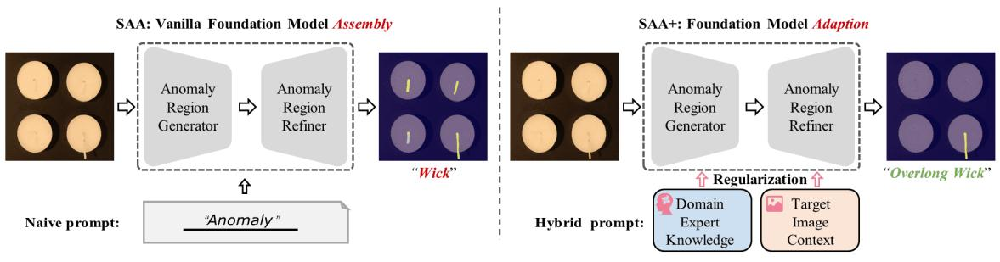
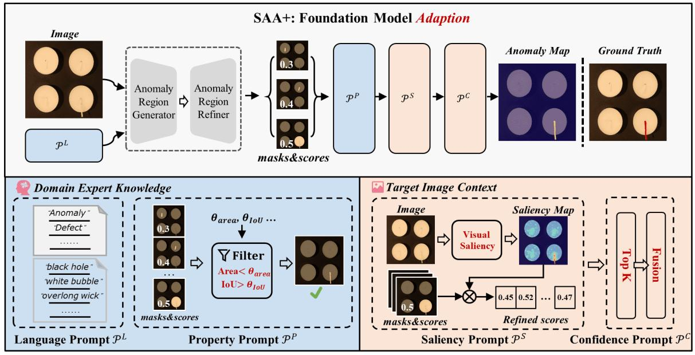

# [Segment Any Anomaly without Training via Hybrid Prompt Regularization](https://arxiv.org/abs/2305.10724)

我们提出了一种新颖的框架，即分割任何异常+ (Segment Any Anomaly +, SAA+)，用于零样本异常分割，它采用混合提示正则化来提高现代基础模型的适应性。现有的异常分割模型通常依赖于特定领域的微调，这限制了它们在无数种异常模式中的泛化能力。在这项工作中，受到像万物可分割这样的基础模型强大的零样本泛化能力的启发，我们首先探索了它们的组合，以利用多样化的多模态先验知识进行异常定位。对于非参数基础模型在异常分割中的适应，我们进一步引入了源自领域专家知识和目标图像上下文的混合提示作为正则化。我们提出的 SAA+ 模型在零样本设置下，在多个异常分割基准数据集上取得了最先进的性能，包括 VisA、MVTec-AD、MTD 和 KSDD2。我们将会在 https://github.com/caoyunkang/Segment-Any-Anomaly 上发布代码。

## 1 Introduction

异常分割模型 [1, 2, 3] 在各个领域都引起了极大的兴趣，例如，工业质量控制 [4, 5] 和医疗诊断 [6]。可靠异常分割的关键在于区分异常数据和正常数据的分布。具体来说，本文考虑图像上的零样本异常分割 (Zero-Shot Anomaly Segmentation, ZSAS)，这是一种有前景但尚未被充分探索的设置，在这种设置下，训练期间不为目标类别提供正常或异常图像。

由于训练所需的异常样本稀缺，许多工作致力于无监督或自监督的异常分割，其目标是在训练期间学习正常样本的表示。然后，可以通过计算测试样本与学习到的正常分布之间的差异来分割异常。具体而言，这些模型，包括基于自编码器的重建 [7, 8, 9, 10, 11, 12]、单类分类 [13, 14, 15] 和基于内存的正常分布 [3, 2, 16, 17, 18] 方法，通常需要为某些有限的类别训练单独的模型。然而，在现实世界的场景中，有数百万种工业产品，为单个对象收集大型训练集并不划算，这阻碍了它们在需要高效部署的场景中的应用，例如生产的初始阶段。

最近，基础模型，例如 SAM [19] 和 CLIP [20]，通过提示 [21, 22] 检索存储在这些模型中的先验知识，展现出强大的零样本视觉感知能力。在这项工作中，我们希望探索如何在零样本设置下调整基础模型以实现异常分割。为此，如图 1 所示，我们首先构建一个简单的基线，即分割任何异常 (Segment Any Anomaly, SAA)，通过级联提示引导的目标检测 [23] 和分割基础模型 [19]，它们分别作为异常区域生成器和异常区域细化器。遵循解锁基础模型知识的实践 [24, 25]，使用朴素的语言提示，例如 “defect” 或 “anomaly”，来分割目标图像中期望的异常。具体而言，语言提示用于提示异常区域生成器生成期望异常区域的提示条件 (prompt-conditioned) 框级 (box-level) 区域。然后，这些区域在异常区域细化器中进行细化，以产生最终的预测，即异常分割的掩码。

**图 1**：为了在无需训练的情况下分割任何异常，我们首先构建了一个简单的基线模型 (SAA)，通过一个朴素的类别无关语言提示（例如，“异常”）提示到一个级联的异常区域生成器（例如，一个提示引导的目标检测基础模型 [23]）和异常区域细化器（例如，一个分割基础模型 [19]）模块中。然而，SAA 显示出严重的误报问题，它错误地检测出所有的“灯芯”，而不是真实的异常区域（“过长的灯芯”）。因此，我们在改进后的模型 (SAA+) 中进一步使用混合提示来加强正则化，这成功地帮助识别了异常区域。

然而，如图 1 所示，朴素的基础模型组装（SAA）往往会导致大量的误报，例如，SAA 错误地将所有灯芯都视为异常，而只有过长的灯芯才是真正的异常，我们将此归因于朴素语言提示带来的歧义。首先，当面对基础模型的预训练数据分布与用于异常分割的下游数据集之间的领域差异时，传统的语言提示可能会失效。其次，目标的“异常”程度取决于对象上下文，这对于朴素的粗粒度语言提示（例如“异常区域”）来说很难准确表达。

因此，为了超越朴素的语言提示，我们在我们改进的框架中分别融入了领域专家知识和目标图像上下文，即分割任何异常+ (Segment Any Anomaly +, SAA+)。一方面，专家知识提供了与开放世界场景中的目标相关的异常的详细描述。我们利用更具体的描述作为上下文提示，有效地对齐了预训练数据集和目标数据集中的图像内容。另一方面，我们利用目标图像上下文来可靠地识别和自适应地校准异常分割预测 [26, 27]。通过利用目标图像中丰富的上下文信息，我们可以准确地将对象上下文与最终的异常预测相关联。

从技术上讲，除了朴素的类别无关提示之外，我们还利用领域专家知识来构建面向目标的异常语言提示，即类别特定的语言表达。此外，由于语言无法精确地检索具有某些对象特征（例如数量、大小和位置）的区域 [28, 29]，我们引入了阈值滤波器形式的对象属性提示。这些提示有助于识别和移除不满足期望属性的候选区域。此外，为了充分利用目标图像上下文，我们建议利用图像显著性和区域置信度排序作为提示，通过考虑图像内区域之间的相似性（例如欧几里得距离）来建模区域的异常程度。最后，我们进行了全面的实验，以确认我们的混合提示在将基础模型适应于零样本异常分割方面的有效性。具体来说，我们的最终模型 (SAA+) 在零样本设置下，在各种异常分割数据集上取得了新的最先进的性能。

总而言之，我们的主要贡献是： 

- 我们提出了 SAA 框架用于异常分割，允许在无需训练的情况下协作组装各种基础模型。
- 我们引入了混合提示作为一种正则化技术，利用领域专家知识和目标图像上下文来调整基础模型以进行异常分割。这导致了 SAA+ 的开发，它是我们框架的增强版本。
- 我们的方法在多个基准数据集（包括 VisA、MVTec-AD、KSDD2 和 MTD）上的零样本异常分割中取得了最先进的性能。值得注意的是，SAA/SAA+ 在检测纹理相关的异常方面表现出了卓越的能力，而无需任何标注。

## 2 Related work

**异常分割**。由于工业环境中异常图像的获取有限且成本高昂，目前关于异常分割的大部分研究都集中在使用正常图像的无监督方法上。基于重建的方法，例如 [7, 8, 9, 10, 11, 12] 中提出的方法，通过训练一个编码器-解码器模型来重建图像以进行分割，从而对异常进行评分。通过比较输入图像和重建版本，这些方法可以预测异常的位置。另一方面，基于特征嵌入的方法通常采用教师-学生架构 [30, 31, 32, 33, 34, 35, 36, 1]、单类分类技术 [13, 14, 15] 或基于内存的正常分布 [3, 2, 16]，通过识别正常和异常图像之间特征分布的差异来分割异常。

最近，研究人员开始探索 ZSAS [37, 38, 39, 40] 的潜力，该方法消除了训练过程中对正常或异常图像的需求。其中，WinClip [25] 开创了基础模型（例如视觉—语言模型）在 ZSAL 任务中的潜力。与 WinClip [25] 通过文本-视觉相似性分割异常不同，我们提出生成提议并对其异常程度进行评分，从而实现更好的分割性能。

**基础模型**。基础模型在零样本环境下展现出解决各种视觉任务的令人印象深刻的能力。具体来说，这些模型可以通过在大型数据集 [41] 上进行训练来学习强大的表示。虽然早期的工作 [20, 42] 侧重于开发鲁棒的图像级识别能力，但最近的工作 [43, 44, 45, 46, 47, 23] 引入了基础模型或其在密集视觉任务中的应用。例如，Grounding DINO [23] 使用任意文本作为查询，实现了令人鼓舞的开放集对象检测能力。最近，SAM [19] 展示了在开放世界中提取高质量对象分割掩码的强大能力。受到这些基础模型成功的鼓舞，我们希望探索如何在不对下游异常分割数据集进行任何训练的情况下，调整这些现成的模型来检测异常。

**提示工程**。提示工程是一种广泛采用的技术，涉及调整基础模型以适应下游任务。通常，这种方法涉及将一组可学习的令牌附加到输入中。先前的研究已经调查了使用文本输入 [48]、视觉输入 [49, 50, 51] 以及文本和视觉同时输入 [52, 53, 54] 进行提示。尽管提示方法在将基础模型适应各种下游任务方面非常有效，但它们不能用于 ZSAS，因为它们需要训练数据，而 ZSAS 中没有可用的训练数据。相比之下，一些方法采用不需要任何训练的启发式提示 [55]，这使得它们更适用于没有任何数据的任务。在本文中，我们提出使用源自领域专家知识和目标图像上下文的混合提示进行 ZSAS。

## 3 SAA: Vanilla Foundation Model Assembly for ZSAS

### 3.1 Problem Definition: Zero-shot Anomaly Segmentation (ZSAS)

ZSAS 的目标是对新对象执行异常分割，而无需任何相应的对象训练数据。ZSAS 旨在基于一个空训练集 $\empty$ 创建一个异常图 $\mathbf{A} \in [0, 1]^{h \times w \times 1}$ ，以便识别包含新颖对象的图像 $\mathbf{I} \in \mathbb{R}^{h \times w \times 3}$ 中各个像素的异常程度。ZSAS 任务有潜力显著减少对训练数据的需求并降低与现实世界检查部署相关的成本。

### 3.2 Baseline Model Assembly: Segment Any Anomaly (SAA)

对于 ZSAS，我们首先构建一个简单的基础模型集成，即分割任何异常 (Segment Any Anomaly, SAA)，如图 1 所示。具体来说，给定一个用于异常分割的特定查询图像，我们首先使用语言作为初始提示，通过一个由语言驱动的视觉基础模型（即 GroundingDINO [23]）实现的异常区域生成器来粗略地检索粗略的异常区域提议。然后，通过一个使用提示驱动的分割基础模型（即 SAM [19]）实现的异常区域细化器，将异常区域提议细化为像素级高质量的分割掩码。

#### 3.2.1 Anomaly Region Generator

随着最近语言—视觉模型的蓬勃发展，一些基础模型 [24, 23, 46] 逐渐获得了通过语言提示检索图像中对象的能力。给定描述要检测的期望区域的语言提示 $\mathcal{T}$ ，例如 “anomaly”，基础模型可以为查询图像 $\mathbf{I}$ 生成期望的区域。在此，我们将区域检测器的架构基于用于视觉定位的文本引导的开放集对象检测架构。具体来说，我们采用一个在大型语言—视觉数据集 [41] 上预训练的 GroundingDINO [23] 架构。这样的网络首先分别通过文本编码器和视觉编码器提取语言提示和查询图像的特征。然后，通过跨模态解码器以边界框的形式生成粗略的对象区域。给定边界框级别的区域集合 $\mathcal{R}^{B}$ 及其对应的置信度分数集合 $\mathcal{S}$ ，异常区域生成器（Generator）的模块可以公式化为：

$$
\large \mathcal{R}^B, \mathcal{S} \coloneqq \mathrm{Generator}(\mathbf{I}, \mathcal{T}), \tag{1}
$$

#### 3.2.2 Anomaly Region Refiner

为了生成像素级的异常分割结果，我们提出了异常区域细化器，以将边界框级别的异常区域候选细化为异常分割掩码集合。为此，我们使用了一个用于开放世界视觉分割的复杂基础模型，即 SAM [19]。该模型主要包括一个基于 ViT [56] 的骨干网络和一个提示条件的掩码解码器。具体来说，该模型在一个包含十亿个细粒度掩码的大型图像分割数据集 [19] 上进行训练，这使其在开放集分割设置下具有高质量的掩码生成能力。提示条件的掩码解码器接受各种类型的提示作为输入。我们将边界框候选 RB 视为提示，并获得像素级的分割掩码 $\mathcal{R}$ 。异常区域细化器（Refiner）的模块可以公式化如下：

$$
\large \mathcal{R} \coloneqq \mathrm{Refiner}(\mathbf{I}, \mathcal{R}^{B}), \tag{2}
$$

至此，我们获得了以高质量分割掩码形式表示的区域集合 $\mathcal{R}$ ，以及相应的置信度分数 $\mathcal{S}$ 。总而言之，我们将框架（SAA）总结如下：

$$
\large \mathcal{R}, \mathcal{S} = \mathrm{SAA}(\mathrm{I}, \mathcal{T}_n), \tag{3}
$$

其中 $\mathcal{T}_n$ 是一个朴素的类别无关语言提示，例如 SAA 中使用的 “anomaly”。

### 3.3 Analysis on the ZSAS Performance of Vanilla Foundation Model Assembly

我们进行了一些初步实验来评估朴素基础模型组装用于 ZSAS 的有效性。尽管该解决方案简单直观，但我们观察到了语言歧义问题。具体来说，某些语言提示（例如 “anomaly”）可能无法检测到期望的异常区域。例如，如图 1 所示，SAA 在使用 “anomaly” 提示时错误地将所有“灯芯”识别为异常。

我们将这种语言歧义归因于预训练的语言—视觉数据集与目标 ZSAS 数据集之间的领域差距，这意味着某些语言提示在不同的数据集中可能具有不同的含义并与不同的图像内容相关联。此外，在那些大型数据集中几乎没有任何像 “anomaly” 这样的形容词表达，因此这种提示设计在理解什么是异常区域方面表现不佳。此外，确切的 “anomaly” 是特定于对象的，并且会因对象而异。例如，它表示皮革上的划痕或榛子上的裂缝。语言歧义问题导致 ZSAS 数据集中出现严重的误报。

我们建议引入由领域专家知识和目标图像上下文生成的混合提示，以减少语言歧义，从而获得更好的 ZSAS 性能。

**图 2**：**提出的分割任何异常+ (SAA+) 框架概述**。我们通过混合提示正则化将基础模型应用于零样本异常分割。具体来说，除了朴素的类别无关语言提示外，正则化还来自领域专家知识（包括更详细的类别特定语言和对象属性提示）以及目标图像上下文（包括视觉显著性和置信度排序相关的提示）。

## 4 SAA+: Foundation Model Adaption via Hybrid Prompt Regularization

为了解决 SAA 中的语言歧义并提高其在 ZSAS 上的能力，我们提出了一个升级版本，称为 SAA+，它结合了混合提示，如图 2 所示。除了利用从预训练的基础模型中获得的知识外，SAA+ 还利用领域专家知识和目标图像上下文来生成更准确的异常区域掩码。我们在下面提供有关这些混合提示的更多详细信息。

### 4.1 Prompt Generated from Domain Expert Knowledge

遵循提示学习 [48, 54] 的趋势，我们以语言的形式初始化提示，该提示解锁了基础模型的知识。然而，仅使用朴素的语言提示“anomaly”时，领域差距导致的语言歧义问题尤为严重。为了解决这个问题，我们利用包含有关目标异常区域的有用先验信息的领域专家知识。具体来说，尽管专家可能无法为新产品提供潜在的开放世界异常的完整列表，但他们可以根据其过去在类似产品上的经验识别一些候选对象。领域专家知识使我们能够将朴素的“anomaly”提示细化为更具体的提示，这些提示更详细地描述了异常状态。除了语言提示外，我们还引入了属性提示，以弥补现有基础模型 [28] 对“计数”和“面积”等特定属性的感知不足 [28]。

#### 4.1.1 Anomaly Language Expression as Prompt

为了描述潜在的开放世界异常，我们建议设计更精确的语言提示。这些提示分为两种类型：类别无关提示和类别特定提示。

**类别无关提示** ( $\mathcal{T}_a$ ) 是描述不特定于任何特定类别的异常的一般提示，例如“anomaly”和“defect”。尽管预训练数据集和目标 ZSAS 数据集之间存在领域差距，但我们的实验分析 (5.3) 表明，这些通用提示提供了令人鼓舞的初始性能。

**类别特定提示** ( $\mathcal{T}_s$ ) 是基于类似产品的异常模式的专家知识设计的，以补充更具体的异常细节。我们使用预训练的视觉语言数据集中已使用的提示，例如“black hole”和“white bubble”，来查询期望的区域。这种方法将查找异常区域的任务重新定义为定位具有特定异常状态表达的对象，这比在对象上下文中识别“anomaly”更容易利用基础模型。

通过使用从领域专家知识导出的异常语言提示 $\large \mathcal{P}^L = \set{\mathcal{T}_a, \mathcal{T}_s}$ 提示 SAA，我们生成更精细的异常区域候选 R 和相应的置信度分数 S。

#### 4.1.2 Anomaly Object Property as Prompt

当前的基础模型 [23, 57] 在查询具有特定属性描述的对象（例如大小或位置）方面存在局限性，而这些属性对于描述异常（例如“电缆左侧的小黑洞”）非常重要。为了结合这种关键的专家知识，我们建议使用以规则而不是语言形式表达的异常属性提示。具体来说，我们考虑异常的位置和面积。

**异常位置。** 异常的精确定位在区分真阳性和假阳性异常方面起着至关重要的作用。通常，在推理过程中，异常预计位于感兴趣的对象内部。然而，由于背景环境的影响，异常有时可能会出现在被检查对象之外。为了解决这个挑战，我们利用基础模型的开放世界检测能力来确定被检查对象的位置。随后，我们计算潜在异常区域与被检查对象之间的交并比 (IoU)。通过应用专家导出的 IoU 阈值（表示为 $\theta_{IoU}$ ），我们过滤掉 IoU 值低于此阈值的异常候选。此过程确保保留的异常候选更有可能代表位于被检查对象内的真实异常。

**异常面积。** 异常的大小（由其面积反映）也是一个可以提供有用信息的属性。一般来说，异常应该小于被检查对象的大小。专家可以为所考虑的特定类型的异常提供合适的阈值 $\theta_{area}$ 。然后可以过滤掉面积与 $\theta_{area}$ · ObjectArea 不匹配的候选对象。

通过结合两个属性提示 $\large \mathcal{P}^{P} = \set{\theta_{area}, \theta_{IoU}}$ ，我们可以使用过滤函数 (Filter) 过滤候选区域集合 $\mathcal{R}$ 以获得子集选定候选区域 $\mathcal{R}^P$ 以及相应的置信度分数 $\mathcal{S}^P$ ：

$$
\large \mathcal{R}^{P}, \mathcal{S}^{P} = \mathrm{Filter}(\mathcal{R}, \mathcal{P}^P), \tag{4}
$$

### 4.2 Prompts Derived from Target Image Context

除了结合领域专家知识外，我们还可以利用输入图像本身提供的信息来提高异常区域检测的准确性。在这方面，我们提出了两个由图像上下文引起的提示。

#### 4.2.1 Anomaly Saliency as Prompt

由于预训练的语言—视觉数据集 [41] 和目标异常分割数据集 [4, 58] 之间的领域差距，使用提示 “defect” 等由基础模型 [23] 生成的预测可能不可靠。为了校准各个预测的置信度分数，我们提出了模仿人类直觉的异常显著性提示。具体来说，人类可以通过异常区域与其周围区域的差异 [40] 来识别异常区域，即视觉显著性包含指示异常程度的宝贵信息。因此，我们通过计算对应像素特征 ( $\mathrm{f}$ ) 与其 N 个最近邻居之间的平均距离来计算输入图像的显著性映射 ( $\mathrm{s}$ )：

$$
\large s_{ij} = \frac{1}{N} \sum_{\mathrm{f} \in N_p(\mathrm{f}_{ij})} (1 - \langle\mathrm{f}_{ij}, \mathrm{f}\rangle), \tag{5}
$$

其中 $(i, j)$ 表示像素位置， $N_p(\mathrm{f}_{ij})$ 表示对应像素的 N 个最近邻居，$\langle \cdot, \cdot \rangle$ 表示余弦相似度。我们使用来自大型图像数据集 [59] 的预训练 CNN 来提取图像特征，确保特征的描述性。显著性图指示一个区域与其他区域的差异程度。显著性提示 $\mathcal{P}^S$ 定义为相应区域掩码内的指数平均显著性值：

$$
\large \mathcal{P}^S= \left \{  \exp(\frac{\sum_{ij} \mathrm{r}_{ij} \mathrm{s}_{ij}}{\sum_{ij} \mathrm{r}_{ij}}) \ | \ \mathrm{r} \in \mathcal{R}^P \right \}, \tag{6}
$$

显著性提示提供了异常区域置信度的可靠指示。这些提示用于重新校准基础模型生成的置信度分数，基于异常显著性提示 $\mathcal{P}^S$ 产生新的重新缩放的分数 $\mathcal{S}^S$ 。这些重新缩放的分数提供了一个综合度量，该度量同时考虑了从基础模型导出的置信度和区域候选的显著性。该过程公式化如下：

$$
\large \mathcal{S}^S = \set{p \cdot s \ | \ p \in \mathcal{P}^S, s \in \mathcal{S}^P}, \tag{7}
$$

#### 4.2.2 Anomaly Confidence as Prompt

通常，被检查对象中的异常区域数量是有限的。因此，我们提出异常置信度提示 $\mathcal{P}^C$ ，以根据图像内容识别具有最高置信度分数的 K 个候选对象，并使用它们的平均值进行最终的异常区域检测。这通过选择置信度分数最高的 K 个候选区域来实现，如下所示：

$$
\large \mathcal{R}^C, \mathcal{S}^C = \mathrm{Top}_K (\mathcal{R}^P, \mathcal{S}^S), \tag{8}
$$

将单个区域及其对应的分数表示为 $\mathrm{r}^C$ 和 $\mathrm{s}^C$ ，然后我们使用这 K 个候选区域来估计最终的异常图：

$$
\large \mathbf{A}_{ij} = \frac{\sum_{\mathbf{r}^C \in \mathcal{R}^C} \mathbf{r}_{ij}^C \cdot s^C}{\sum_{\mathbf{r}^C \in \mathcal{R}^C} \mathbf{r}_{ij}^C}, \tag{9}
$$

通过提出的混合提示（ $\mathcal{P}^L, \mathcal{P}^P, \mathcal{P}^S, \mathcal{P}^C$ ），SAA 在我们的最终框架（即分割任何异常+，SAA+）中得到正则化，从而产生更可靠的异常预测。