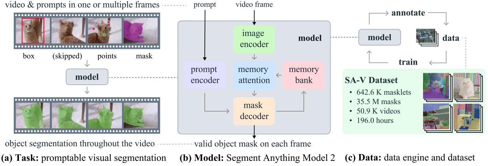
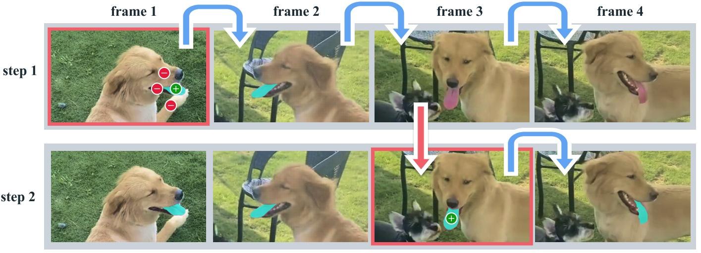
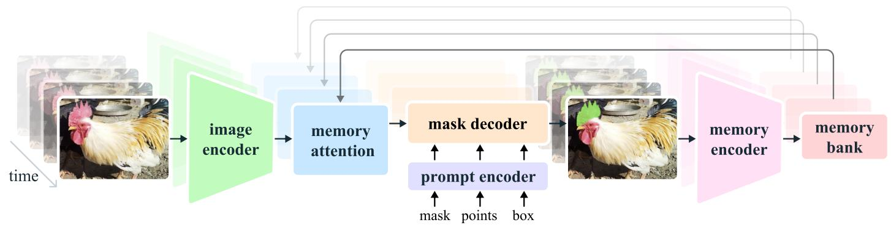
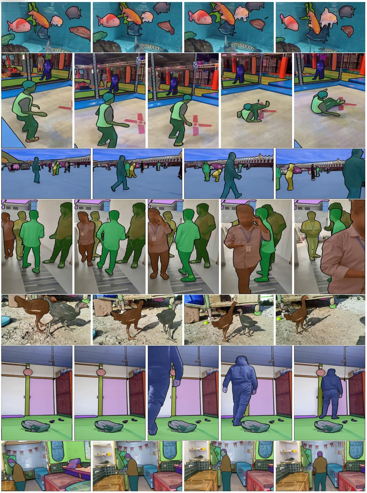
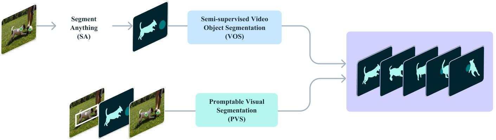
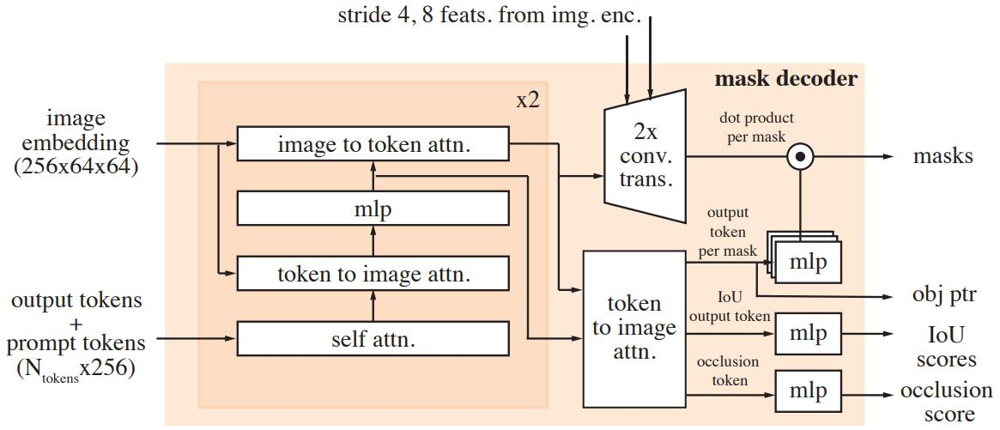

# [SAM 2: Segment Anything in Images and Videos](https://arxiv.org/abs/2408.00714)

## Abstract

我们推出了 Segment Anything 2（SAM 2），这是一个旨在解决图像和视频中可提示视觉分割的基础模型。我们构建了一个数据引擎，通过用户交互改进模型和数据，收集了迄今为止最大的视频分割数据集。我们的模型是一个简单的 Transformer 架构，具有用于实时视频处理的流式内存 。基于我们的数据训练的 SAM 2在各种任务中都表现出强大的性能。在视频分割方面，我们观察到更高的准确率，并且交互次数比以前的方法减少了 3 倍。在图像分割方面，我们的模型比 Segment Anything Model（SAM）更准确且速度快 6 倍。我们相信，我们的数据、模型和见解将为视频分割及相关感知任务设立一个重要里程碑。我们将发布主要模型、数据集以及用于模型训练和演示的代码。

Demo: https://sam2.metademolab.com 

Code: https://github.com/facebookresearch/sam2 

Website: https://ai.meta.com/sam2

## 1 Introduction

Segment Anything (SA) 引入了一个用于图像中可提示分割的基础模型（Kirillov 等人，2023）。然而，图像只是现实世界的一个静态快照，在这个世界里视觉片段可能呈现出复杂的运动，随着多媒体内容的快速增长，现在有很大一部分是以具有时间维度的形式记录的，尤其是在视频数据中。增强现实/虚拟现实（AR/VR）、机器人技术、自动驾驶汽车和视频编辑中的许多重要应用都需要超出图像级分割的时间定位。我们认为，一个通用的视觉分割系统应该同时适用于图像和视频。

视频中的分割旨在确定实体的时空范围，这带来了超越图像的独特挑战。由于运动、变形、遮挡、光照变化和其他因素，实体的外观可能会发生显著变化。由于相机运动、模糊和分辨率较低等原因，视频的质量通常低于图像。此外，有效处理大量帧是一个关键挑战。虽然 SA 成功解决了图像中的分割问题，但现有的视频分割模型和数据集在提供类似“分割视频中的任何内容”的能力方面仍有不足。

我们推出了 Segment Anything Model 2（SAM 2），这是一个统一的视频和图像分割模型（我们将图像视为单帧视频）。我们的工作包括任务、模型和数据集（见图 1）。

我们专注于可提示视觉分割（PVS）任务，该任务将图像分割推广到视频领域。该任务将视频任意帧上的点、框或掩码作为输入，以定义感兴趣的分割区域，其时空掩码（即“masklet”）需要被预测。一旦预测了掩码，就可以通过在额外帧上提供提示来迭代地细化它。

我们的模型（§4）能够在单个图像和跨越视频帧中生成感兴趣对象的分割掩码。SAM 2 配备了一个存储有关对象及其之前交互信息的记忆模块，使其能够在整个视频中生成掩码预测，并根据从先前观察到的帧中存储的对象记忆上下文有效地纠正这些预测。我们的流式架构是 SAM 向视频领域的自然扩展，一次处理一帧视频，并配备了记忆注意力模块以关注目标对象的先前记忆。**当应用于图像时，记忆为空，模型表现如同 SAM**。

**图 1**：我们推出了 Segment Anything Model 2 (SAM 2)，旨在通过我们的基础模型 (b) 解决可提示视觉分割任务 (a)，该模型在通过我们的数据引擎 (c) 收集的大规模 SA-V 数据集上进行训练。SAM 2 能够通过利用存储先前提示和预测的流式记忆，在单个或多个视频帧上通过提示（点击、框或掩码）交互式地分割区域。

我们采用了一个数据引擎（§5），通过让模型与标注员在循环中协作，交互式地标注新数据和具有挑战性的数据以生成训练数据。与大多数现有的视频分割数据集不同，我们的数据引擎不限于特定类别的物体，而是旨在为任何具有有效边界的物体分割提供训练数据，包括物体的部件和子部件。相较于现有的模型辅助方法，配备 SAM 2 的循环数据引擎在同等质量下速度提升了 8.4 倍。我们的最终 Segment Anything Video（SA-V）数据集（§5.2）包含跨越 50.9K 个视频的 35.5M 张掩码，是现有任何视频分割数据集掩码数量的 53 倍。SA-V 数据集在小物体和部件的挑战性场景中表现突出，这些物体和部件在视频中可能被遮挡后重新出现。我们的 SA-V 数据集具有地理多样性，对 SAM 2 的公平性评估表明，在基于感知性别的视频分割性能上差异极小，并且在我们评估的三个感知年龄组中表现差异也很小。

我们的实验（§6）表明，SAM 2 在视频分割体验上实现了跨越式提升。SAM 2 在减少 3 倍交互次数的同时，仍能实现更高的分割精度。此外，SAM 2 在多个评估设置下的视频目标分割基准测试中超越了先前工作，并在图像分割基准测试中比 SAM 表现更优，同时速度提升 6 倍。通过广泛的零样本基准测试（包括 17 项视频分割和 37 项单图像分割测试），SAM 2 在多种视频和图像分布场景中均展现出有效性。

我们以宽松的开源许可协议发布研究成果，包括 SA-V 数据集（知识共享署名4.0国际许可协议，CC BY 4.0）、SAM 2 模型检查点、训练代码（Apache 2.0 许可）以及交互式在线演示代码（Apache 2.0 许可）。

## 2 Related work

**图像分割**。Segment Anything（SAM，Kirillov 等人，2023） 提出了一个可提示的图像分割任务，目标是根据输入提示（如指向目标物体的边界框或点）生成有效的分割掩码。基于 SA-1B 数据集训练的 SAM 模型实现了零样本分割能力，使其能够广泛应用于多种场景。近期研究进一步扩展了 SAM 的功能，例如引入高精度输出 tokens 以训练精细掩码（Ke 等人，2024），或提升 SAM 的效率（Xiong等人，2023；Zhang等人，2023a；Zhao等人，2023）。更广泛而言，SAM 已被用于各种应用，包括医疗影像（Ma等人，2024；Deng等人，2023；Mazurowski等人，2023；Wu等人，2023a）、遥感（Chen等人，2024；Ren等人，2024）、运动分割（Xie等人，2024）及伪装物体检测（Tang等人，2023）等领域。

**交互式视频对象分割（iVOS）**。交互式视频对象分割是一项关键任务，旨在通过用户引导（如涂鸦、点击或边界框）高效获取视频中的物体分割结果（掩码片段）。一些早期的方法（Wang等人，2005；Bai & Sapiro，2007；Fan等人，2015）采用图优化算法引导标注过程。最近的方法（Heo等人，2020；Cheng等人，2021b；Delatolas等人，2024）通常采用模块化设计，将用户输入转换为单帧的掩码表示，再传播至其他帧。

基于点击的输入更易于收集（Homayounfar等人，2021），用于交互式视频分割。最近的研究结合了 SAM 与基于掩码（Cheng等人，2023b；Yang等人，2023；Cheng等人，2023c）或点（Rajič等人，2023）的视频跟踪器。然而，这些方法存在局限性：跟踪器可能不适用于所有物体，SAM 在视频帧上的表现不佳，且缺乏机制在推理过程中交互式修正模型错误，除重新标注每帧并重启跟踪外。

我们的工作与上述研究共享同一目标——实现交互式视频对象分割，但我们构建了一个统一的强模型，直接支持交互式视频分割提示，并通过大规模多样化数据集推进这一目标。

**视频对象分割（VOS）**。VOS 任务以视频首帧的物体掩码为输入，要求在后续帧中准确跟踪该物体（Pont-Tuset等人，2017）。由于首帧的掩码可视为仅在第一帧提供的监督信号，因此该任务被称为“半监督 VOS”。因其在视频编辑或机器人领域的应用价值，VOS 备受关注。

早期基于深度学习的方法经常通过在线微调首帧（Caelles等人，2016；Perazzi等人，2016；Yoon等人，2017；Maninis等人，2017；Hu等人，2018a；Bhat等人，2020；Robinson等人，2020）或所有帧（Voigtlaender & Leibe，2017）来适配目标物体。为加速推理，离线训练的模型被提出，其条件仅基于首帧（Hu等人，2018b；Chen等人，2018）或结合前一帧（Oh等人，2018；Yang等人，2018，2020）。多条件机制进一步扩展至所有帧，采用循环神经网络（RNN，Xu等人，2018a）和Transformer（Oh等人，2019；Cheng等人，2021a；Li等人，2022a；Yang等人，2021b，2024；Cheng & Schwing，2022；Yang & Yang，2022；Wang等人，2022；Cheng等人，2023a；Goyal等人，2023；Zhang等人，2023b；Wu等人，2023b）。

半监督 VOS 可以当作我们提出的“可提示视觉分割（PVS）”任务的特例，仅需首帧的掩码提示。值得注意的是，VOS 中首帧高质量掩码的标注在实际应用中极具挑战性且耗时。

**视频分割数据集**。许多数据集被提出以支持 VOS 任务。早期 VOS 数据集，如 DAVIS（Pont-Tuset等人，2017；Caelles等人，2019）虽标注质量高，但规模有限，难以支撑深度学习方法。YouTube-VOS（Xu等人，2018b）是首个大规模 VOS 数据集。随着算法性能趋于饱和，研究者开始通过增加任务难度来推动进展，关注例如遮挡（Qi等人，2022；Ding等人，2023）、长视频（Hong等人，2023，2024）、极端形变（Tokmakov等人，2022）、物体多样性（Wang等人，2021b，2023）或场景多样性（Athar等人，2022）。

我们发现，现有视频分割数据集难以满足“在视频中分割任何物体”的需求。它们的标注通常仅覆盖完整物体（而非部件），且数据集常围绕特定类别（如人物、车辆、动物）构建。相比之下，我们发布的 SA-V 数据集不仅关注完整物体，还广泛覆盖物体部件，并包含超过现有数据集一个数量级的掩码。

## 3 Task: promptable visual segmentation

我们的 PVS 任务允许在视频的任意一帧上向模型提供提示。提示可以是正/负点击、边界框或掩码，用于定义需要分割的对象或细化模型预测的结果。为了提供交互式体验，当在特定帧上接收到提示时，模型应立即对该帧上的目标对象生成有效的分割掩码。在接收到初始提示（可在同一帧或不同帧上提供后），模型应将这些提示进行传播，从而在整个视频范围内获取目标对象的掩码，并在每一帧视频中定位目标的分割掩码。用户还可以在任意帧上提供额外提示以在整个视频中细化分割结果（示例如图 2 所示）。关于任务的更多细节，请参考 §B。

SAM 2（§4）被应用于 PVS 任务中，作为构建我们 SA-V 数据集（§5）的数据收集工具。我们在多个帧上模拟交互式视频分割场景，通过传统半监督 VOS 设置（其中标注仅限于第一帧）以及在 SA 基准测试上的图像分割任务对模型（§6）进行评估。

**图 2**：使用 SAM 2 进行交互式分割。步骤 1 (选择) ：我们在第 1 帧中提示 SAM 2 以获得目标对象（舌头）的分割结果。绿色/红色点分别表示肯定/否定提示。SAM 2 自动将分割结果传播到后续帧（蓝色箭头）以形成掩码。如果 SAM 2 在第 2 帧之后丢失了对象，我们可以通过在新帧中提供额外的提示（红色箭头）来更正掩码。步骤 2 (细化) ：在第 3 帧中单击一次就足以恢复对象并将其传播以获得正确的掩码。分离的 SAM + 视频跟踪器方法需要在第 3 帧中进行多次点击（如第 1 帧中所示）才能正确地重新标注对象，因为分割是从头开始的。借助 SAM 2 的记忆，单击一次即可恢复舌头。

## 4 Model

SAM 2 (图 3) 可以视为 SAM 在视频（和图像）领域的扩展，其通过在单帧上接收点、边界框或掩码提示，定义需要进行时空分割的对象空间范围。在空间维度上，模型行为与 SAM 类似。一个可提示且轻量级的掩码解码器会以图像嵌入和提示（如有）为输入，输出对应帧的分割掩码。用户可以在同一帧上多次添加提示以细化掩码。

SAM 2解码器所使用的帧嵌入并非直接来自图像编码器，而是基于过去预测和提示帧的记忆进行条件化生成。提示帧也可能相对于当前帧“来自未来”。记忆编码器根据当前预测生成帧记忆，并将其存储在记忆库中供后续帧使用。记忆注意力操作从图像编码器获取每帧嵌入，并在记忆库将其条件化，随后传递给掩码解码器以形成预测。

以下是各组件的详细描述及训练方法，更多信息请参见附录D。

**图 3**：SAM 2 架构。 对于给定的帧，分割预测以当前提示和/或先前观察到的记忆为条件。视频以流式方式处理，图像编码器一次处理一帧，并交叉关注来自先前帧的目标对象的记忆。掩码解码器（可选地也接受输入提示）预测该帧的分割掩码。最后，记忆编码器转换预测和图像编码器嵌入（图中未显示），以供未来帧使用。

**图像编码器**。 为实现实时处理任意长度视频，我们采用流式处理方式，在视频帧可用时对其进行处理。图像编码器在整个交互过程中仅运行一次，其作用是为每一帧提供无条件的 tokens（特征嵌入）。我们采用基于 MAE（He等人，2022）预训练的分层 Hiera（Ryali等人，2023；Bolya等人，2023）图像编码器，它是分层的，允许我们在解码时使用多尺度特征。

**记忆注意力**。 记忆注意力的作用是以过去帧的特征和预测以及任何新提示为条件来调节当前帧的特征。我们堆叠 L 个 Transformer 块，第一个块以当前帧的图像编码为输入。每个块执行自注意力，然后对存储在记忆库（见下文）中的（提示/未提示）帧和对象指针（见下文）的记忆进行交叉注意力，然后是 MLP。我们对自注意力和交叉注意力使用原生的注意力操作，使我们能够从高效注意力内核 (Dao, 2023) 的最新发展中受益。

**提示编码器与掩码解码器**。我们的提示编码器与 SAM 的相同，可以通过点击（肯定或否定）、框或掩码进行提示，以定义给定帧中对象的范围。稀疏提示（如点击）通过位置编码与每种类型的学习嵌入相加表示，而掩码则通过卷积嵌入并与帧嵌入相加。

解码器设计基本遵循 SAM 架构，堆叠“双向” Transformer 块以更新提示和帧嵌入。与 SAM 类似，对于模糊提示（如单次点击）可能导致多个兼容掩码的情况，我们预测多个掩码。这种设计对于确保模型输出有效的掩码非常重要。在视频场景中，模糊性可能跨越多帧，因此模型会在每帧预测多个掩码。若后续未收到消除歧义的提示，则模型仅传播当前帧预测 IoU 最高的掩码。

与 SAM 中始终存在要分割的有效对象（给定肯定提示）不同，在 PVS 任务中，某些帧可能不存在有效目标对象（例如因遮挡）。为此，我们新增一个预测头部，判断当前帧是否存在目标对象。另一创新是跳过连接：直接从分层图像编码器（绕过记忆注意力）引入高分辨率嵌入，用于掩码解码（详见 §D）。

**记忆编码器**。记忆编码器通过卷积模块对输出掩码进行下采样，并与图像编码器的无条件帧嵌入（图 3 中未显示）逐元素相加，随后通过轻量级卷积层融合信息，生成记忆。

**记忆库**。 记忆库通过维护最多 N 个最近帧的记忆的 FIFO 队列来保留有关视频中目标对象的过去预测的信息，并在最多 M 个提示帧的 FIFO 队列中存储来自提示的信息。例如，在视频对象分割（VOS）任务中，其中初始掩码是唯一的提示，记忆库始终保留第一帧的记忆以及最多 N 个最近（未提示）帧的记忆。这两组记忆都存储为空间特征图。

除了空间记忆之外，我们还存储一个对象指针列表作为轻量级向量，基于每个帧的掩码解码器输出 tokens 来表示要分割对象的高级语义信息。我们的记忆注意力交叉关注空间记忆特征和这些对象指针。

我们将时间位置信息嵌入到 N 个最近帧的记忆中，允许模型表示短期对象运动，但不嵌入到提示帧的记忆中，因为来自提示帧的训练信号更稀疏，并且更难推广到推理设置，其中提示帧可能来自与训练期间看到的非常不同的时间范围。

**训练。** 该模型在图像和视频数据上联合训练。与之前的工作类似 (Kirillov et al., 2023; Sofiiuk et al., 2022)，我们模拟了模型的交互式提示。我们对 8 帧的序列进行采样，并随机选择最多 2 帧进行提示，并概率性地接收使用训练期间的真实掩码和模型预测采样的校正点击。训练任务是按顺序（和“交互式地”）预测真实掩码。模型的初始提示可以是真实掩码（概率为 0.5）、从真实掩码采样的肯定点击（概率为 0.25）或边界框输入（概率为 0.25）。有关更多详细信息，请参见 §D。

## 5 Data

为了发展在视频中“分割任何事物”的能力，我们构建了一个数据引擎来收集一个大型且多样的视频分割数据集。我们在循环中采用了一个交互式模型，与标注人员协同工作。与 Kirillov 等人 (2023) 类似，我们不对标注的小掩码施加语义约束，而是同时关注整个对象（例如，一个人）和部分（例如，一个人的帽子）。我们的数据引擎经历了三个阶段，每个阶段都根据提供给标注员的模型辅助程度进行分类。接下来，我们将描述每个数据引擎阶段和我们的 SA-V 数据集。

### 5.1 Data engine

**第一阶段：逐帧 SAM。** 初始阶段使用基于图像的交互式 SAM (Kirillov et al., 2023) 来辅助人工标注。标注员的任务是使用 SAM 以每秒 6 帧 (FPS) ) 标注视频每帧中目标对象的掩码，并使用像素级精确的手动编辑工具，如“画笔”和“橡皮擦”。没有涉及跟踪模型来辅助将掩码在时间上传播到其他帧。由于这是一种逐帧方法，并且所有帧都需要从头开始进行掩码标注，因此该过程很慢，在我们的实验中，每帧的平均标注时间为 37.8 秒。然而，这为每帧产生了高质量的空间标注。在此阶段，我们收集了 1.4K 个视频中的 16K 个掩码。我们进一步使用这种方法来标注我们的 SA-V 验证集和测试集，以减轻评估期间 SAM 2 可能存在的偏差。

**第二阶段：SAM + SAM 2 掩码**。第二阶段在循环中添加了 SAM 2，其中 SAM 2 仅接受掩码作为提示。我们将此版本称为 SAM 2 掩码。标注员像第一阶段一样使用 SAM 和其他工具在第一帧中生成空间掩码，然后使用 SAM 2 掩码将标注的掩码在时间上传播到其他帧，以获得完整的时空掩码。在任何后续视频帧中，标注员都可以通过使用 SAM、“画笔”和/或“橡皮擦”从头开始标注掩码，然后使用 SAM 2 掩码重新传播，重复此过程直到掩码正确为止，从而在空间上修改 SAM 2 掩码所做的预测。SAM 2 掩码最初在第一阶段数据和公开可用的数据集上进行训练。在第二阶段，我们使用收集的数据在标注循环中重新训练和更新了两次 SAM 2 掩码。在第二阶段，我们收集了 63.5K 个掩码。标注时间降至 7.4 秒/帧，比第一阶段快约 5.1 倍。

尽管标注时间有所改进，但这种方法需要在没有先前记忆的情况下从头开始标注中间帧的掩码。然后，我们进一步开发了功能齐全的 SAM 2，它能够在一个统一模型中进行交互式分割和掩码传播。

**第三阶段：SAM 2**。在最后阶段，我们使用功能齐全的 SAM 2，它接受各种类型的提示，包括点和掩码。SAM 2 受益于跨越时间维度的对象记忆来生成掩码预测。这意味着标注员只需要偶尔向 SAM 2 提供细化点击，以编辑中间帧中预测的掩码，而不是使用没有这种记忆上下文的空间 SAM 从头开始标注。在第三阶段，我们使用收集的标注重新训练和更新了五次 SAM 2。在循环中使用 SAM 2 后，每帧的标注时间降至 4.5 秒，比第一阶段快约 8.4 倍。在第三阶段，我们收集了 197.0K 个掩码。

**质量验证**。为了保持高标准的标注质量，我们引入了一个验证步骤。另一组标注员的任务是将每个标注的掩码的质量验证为“令人满意”（正确且一致地跟踪所有帧中的目标对象）或“不令人满意”（目标对象定义明确且边界清晰，但掩码不正确或不一致）。不令人满意的掩码被送回标注流程进行细化。任何跟踪未明确定义对象的掩码都被完全拒绝。

**自动掩码生成**。确保标注的多样性对于实现我们模型的“任何事物”能力非常重要。由于人工标注员通常可能更关注显着对象，我们使用自动生成的掩码（称为“自动”）来扩充标注。这具有双重目的：增加标注的覆盖范围并帮助识别模型失败的案例。为了生成自动掩码，我们在第一帧中使用规则的点网格提示 SAM 2，并生成候选掩码。然后将这些发送到掩码验证步骤进行过滤。标记为“令人满意”的自动掩码被添加到 SA-V 数据集中。标记为“不令人满意”（即模型失败案例）的掩码被采样并呈现给标注员，以便在循环中使用 SAM 2 进行细化（数据引擎的第三阶段）。这些自动掩码涵盖了大的显着中心对象，也涵盖了背景中各种大小和位置的对象。

**分析**。表 1 通过受控实验（详细信息见附录 E.2.2）比较了每个数据引擎阶段的标注协议。我们比较了每帧的平均标注时间、每个掩码的平均手动编辑帧百分比以及每个点击帧的平均点击次数。对于质量评估，我们将第一阶段掩码对齐分数定义为 IoU 与第一阶段相应掩码相比超过 0.75 的掩码百分比。选择第一阶段数据作为参考，因为它具有逐帧高质量的手动标注。循环中使用 SAM 2 的第三阶段带来了更高的效率和相当的质量：它比第一阶段快 8.4 倍，具有最低的编辑帧百分比和每帧点击次数，并实现了更好的对齐。

在表 2 中，我们展示了在每个阶段结束时使用可用数据训练的 SAM 2 的性能比较，保持迭代次数不变，因此仅衡量额外数据的影响。我们使用在第一帧上使用 3 次点击提示的标准 J & F 准确率指标（越高越好）在我们的 SA-V 验证集以及 9 个零样本基准（详细信息见附录 F.1）上进行评估。我们注意到，在迭代包含每个阶段的数据后，不仅在域内的 SA-V 验证集上，而且在 9 个零样本基准上都取得了持续的改进。

### 5.2 SA-V dataset

我们使用数据引擎收集的 SA-V 数据集包含 50.9K 个视频和 642.6K 个掩码。在表 3 中，我们将 SA-V 的组成与常见的 VOS 数据集在视频数量、小掩码数量和掩码数量方面进行了比较。值得注意的是，标注的掩码数量比任何现有的 VOS 数据集多 53 倍（不包括自动生成的掩码也多 15 倍），为未来的工作提供了大量的资源。我们以宽松的许可发布 SA-V。

**视频**。我们收集了一组由众包工作者拍摄的 50.9K 个新视频。视频包含 54% 的室内场景和 46% 的室外场景，平均时长为 14 秒。视频呈现了“野外”各种不同的环境，并涵盖了各种日常场景。

**掩码**。标注包含 190.9K 个手动标注的小掩码和使用我们的数据引擎收集的 451.7K 个自动生成的小掩码。图 4 显示了带有叠加小掩码（手动和自动）的示例视频。SA-V 的掩码数量比最大的 VOS 数据集多 53 倍（不包括自动标注多 15 倍）。SA-V 手动标注中的消失率（Ding et al., 2023）（至少在一帧中消失然后重新出现的小掩码的百分比）为 42.5%，在现有数据集中具有竞争力。

**SA-V 训练集、验证集和测试集**。我们根据视频作者（及其地理位置）分割 SA-V，以确保相似对象的重叠最小。为了创建 SA-V 验证集和 SA-V 测试集，我们在选择视频时侧重于具有挑战性的场景，并要求标注员识别具有挑战性的目标，这些目标移动速度快，被其他对象严重遮挡，以及具有消失/重新出现的模式。这些目标使用第 5.1 节中描述的数据引擎第一阶段设置以 6 FPS 的速度进行标注。SA-V 验证集包含 293 个小掩码和 155 个视频，SA-V 测试集包含 278 个小掩码和 150 个视频。

**内部数据集**。我们还使用了内部可用的授权视频数据来进一步扩充我们的训练集。我们的内部数据集包含 62.9K 个视频和 69.6K 个在第二阶段和第三阶段（见第 5.1 节）标注的小掩码用于训练，以及 96 个视频和 189 个使用第一阶段标注的小掩码用于测试（Internal-test）。有关数据引擎和 SA-V 数据集的更多详细信息，包括公平性评估，请参见附录 E。

**图 4**：来自 SA-V 数据集的示例视频，带有叠加的掩码（手动和自动）。每个掩码都有唯一的颜色，每一行代表一个视频中的帧，帧之间间隔 1 秒。

## 6 Zero-shot experiments

## 7 Comparison to state-of-the-art in semi-supervised VOS

## 8 Conclusion

我们提出了 Segment Anything 在视频领域的自然演进，这基于三个关键方面：（i）将可提示分割任务扩展到视频，（ii）使 SAM 架构在应用于视频时能够使用记忆，以及（iii）用于训练和评测视频分割的多样化 SA-V 数据集。我们相信 SAM 2 标志着视觉感知方面的重大进步，将我们的贡献定位为推动未来研究和应用的里程碑。

## Appendix

目录： 

- §A: Data and Model Ablations 
- §B: Task Details 
- §C: Limitations 
- §D: Model Details 
- §E: Dataset Details
- §E.2.1: Annotation Guidelines 
- §F: Zero-shot Experiments Details 
- §H: Dataset, Annotation, and Model Cards

### A Data and model ablations

#### A.1 Data ablations

#### A.2 Model architecture ablations

### B Details on the PVS Task

可提示视觉分割 (Promptable Visual Segmentation, PVS) 任务可以看作是将 Segment Anything (SA) 任务从静态图像扩展到视频。在 PVS 设置中，给定一个输入视频，模型可以通过视频中任何帧上的不同类型的输入（包括点击、框或掩码）进行交互式提示，目标是在整个视频中分割（和跟踪）一个有效的对象。当与视频交互时，模型会对被提示的帧提供即时响应（类似于 SAM 在图像上的交互体验），并且还会近乎实时地返回整个视频中对象的分割结果。与 SAM 类似，重点在于具有明确定义边界的有效对象，我们不考虑没有视觉边界的区域（例如 Bekuzarov et al. (2023)）。图 7 说明了该任务。

**图 7**：可提示视觉分割 (PVS) 任务的一个图例。之前的研究任务，例如 Segment Anything (SA) 和半监督视频对象分割 (VOS) 可以看作是 PVS 任务的特例。

PVS 与图像和视频领域的任务相关。对于图像，SA 任务可以认为是 PVS 的一个子集，视频被简化为单帧。类似地，传统的半监督和交互式 VOS (Pont-Tuset et al., 2017) 任务是 PVS 的特例，分别仅限于在第一帧上提供的掩码提示和在多帧上提供的涂鸦来分割整个视频中的对象。在 PVS 中，提示可以是点击、掩码或框，重点是增强交互体验，从而能够以最少的交互来细化分割结果。

### C Limitations

SAM 2 在静态图像和视频领域都表现出了强大的性能，但在某些场景下仍会遇到困难。该模型可能无法在镜头切换时分割对象，并且在拥挤的场景中、长时间遮挡后或在较长的视频中可能会丢失或混淆目标对象。为了缓解这个问题，我们设计了在任何帧中提示 SAM 2 的能力：如果模型丢失了对象或出现错误，在额外的帧上进行细化点击通常可以快速恢复正确的预测。SAM 2 在准确跟踪具有非常细或精细细节的物体时也存在困难，尤其是在它们快速移动时。另一个具有挑战性的场景是当附近存在外观相似的物体时（例如，多个相同的杂耍球）。将更明确的运动建模融入 SAM 2 可以减轻此类情况下的错误。

虽然 SAM 2 可以同时跟踪视频中的多个对象，但 SAM 2 是单独处理每个对象的，仅利用共享的逐帧嵌入，而没有对象间的通信。虽然这种方法很简单，但融入共享的对象级上下文信息可能有助于提高效率。

我们的数据引擎依赖人工标注员来验证小掩码的质量并选择需要更正的帧。未来的发展可能包括自动化此过程以提高效率。

### D SAM 2 details

#### D.1 Architecture

在此，我们进一步讨论架构细节，扩展第 4 节中的模型描述。

**图像编码器。** 我们使用特征金字塔网络 (Feature Pyramid Network, FPN) (Lin et al., 2017) 分别融合来自 Hiera 图像编码器第三阶段和第四阶段步长 (stride) 为 16 和 32 的特征，以生成每个帧的图像嵌入。此外，来自第一阶段和第二阶段步长为 4 和 8 的特征不用于记忆注意力，而是添加到掩码解码器中的上采样层，如图 8 所示，这有助于生成高分辨率的分割细节。我们遵循 Bolya 等人 (2023) 的做法，在 Hiera 图像编码器中使用窗口化的绝对位置嵌入。在 Bolya 等人 (2023) 中，RPB 在图像编码器中提供了跨越窗口的位置信息，我们采用了一种更简单的方法来代替它，即插值全局位置嵌入以跨越窗口。我们不使用任何相对位置编码。我们训练具有不同图像编码器尺寸（T、S、B+ 和 L）的模型。我们遵循 Li 等人 (2022b) 的做法，仅在图像编码器层的一个子集中使用全局注意力（见表 12）。

**记忆注意力。** 除了正弦绝对位置嵌入之外，我们在自注意力层和交叉注意力层中使用了 2D 空间旋转位置嵌入 (Rotary Positional Embedding, RoPE) (Su et al., 2021; Heo et al., 2024)。对象指针 tokens 不包含在 RoPE 中，因为它们没有特定的空间对应关系。默认情况下，记忆注意力使用 L = 4 层。

**提示编码器和掩码解码器。** 提示编码器的设计遵循 SAM，接下来我们将讨论掩码解码器中设计更改的更多细节。我们使用对应于输出掩码的掩码 token 作为帧的对象指针 token，该 token 放置在记忆库中。正如第 4 节所讨论的，我们还引入了一个遮挡预测头。这是通过在掩码和 IoU 输出 tokens 之外包含一个额外的 token 来实现的。将一个额外的 MLP 头应用于这个新 token，以产生一个分数，指示感兴趣的对象在当前帧中可见的可能性（如图 8 所示）。在记忆库中，我们还在那些被遮挡预测头预测为被遮挡（不可见）的帧的记忆特征中添加了一个学习到的遮挡嵌入。

当图像中要分割的对象存在歧义时，SAM 引入了输出多个有效掩码的能力。例如，当一个人点击自行车的轮胎时，模型可以将此点击解释为仅指轮胎或整个自行车，并输出多个预测。在视频中，这种歧义可以跨越视频帧。例如，如果在一帧中仅轮胎可见，则对轮胎的点击可能仅与轮胎相关，或者随着自行车的更多部分在后续帧中变得可见，此点击可能旨在指向整个自行车。为了处理这种歧义，SAM 2 在视频的每个步骤预测多个掩码。如果进一步的提示没有解决歧义，则模型选择当前帧预测 IoU 最高的掩码以在视频中进一步传播。

**图 8**：掩码解码器架构。 该设计在很大程度上遵循 SAM，并且我们在上采样过程中额外包含了来自图像编码器的 stride 为 4 和 8 的特征。我们还使用对应于输出掩码的掩码 tokens 作为对象指针，并生成一个遮挡分数，该分数指示感兴趣的对象在当前帧中是否可见。

**记忆编码器和记忆库。** 我们的记忆编码器不使用额外的图像编码器，而是重用 Hiera 编码器生成的图像嵌入，这些嵌入与预测的掩码信息融合以生成记忆特征（如第 4 节所述）。这种设计允许记忆特征受益于图像编码器产生的强大表示（尤其是在我们将图像编码器扩展到更大的尺寸时）。此外，我们将记忆库中的记忆特征投影到 64 的维度，并将 256 维的对象指针分割为 4 个 64 维的 tokens，用于与记忆库进行交叉注意力。

**处理视频中的多个对象。** 当应用 SAM 2 在同一视频中分割多个对象（例如半监督 VOS 评估中的多对象跟踪）时，我们独立地对每个对象执行推理。更具体地说，我们共享视频中所有对象的图像编码器的视觉特征，但为每个对象单独运行所有其他模型组件（例如记忆库和掩码解码器）。

#### D.2 Training

##### D.2.1 Pre-training

我们首先在 SA-1B 数据集上对静态图像预训练 SAM 2。表 12a 详细说明了在 SA-1B 上预训练期间使用的设置——此处未提及的其他设置遵循 Kirillov 等人 (2023) 的做法。图像编码器从 MAE 预训练的 Hiera (Ryali et al., 2023) 初始化。与 SAM 类似，我们过滤掉覆盖图像 90% 以上的掩码，并将每张图像的训练限制为 64 个随机采样的掩码。

与 SAM 不同，我们发现使用 $\ell_1$ 损失来更积极地监督 IoU 预测，并将 sigmoid 激活应用于 IoU logits 以将输出限制在 0 到 1 之间的范围是有益的。对于多掩码预测（在第一次点击时），我们监督所有掩码的 IoU 预测，以鼓励更好地学习何时掩码可能不好，但仅使用最低分割损失（focal 损失和 dice 损失的线性组合）监督掩码 logits。在 SAM 中，在点的迭代采样期间，插入了两次没有额外提示的迭代（仅馈送先前的掩码 logits）——我们在训练期间不添加此类迭代，并使用 7 个校正点击（而不是 SAM 中的 8 个）。我们还在训练期间采用水平翻转增强，并将图像大小调整为 1024×1024 的正方形。

我们使用 AdamW (Loshchilov & Hutter, 2019) 并对图像编码器应用层衰减 (layer decay) (Clark et al., 2020)，并遵循倒数平方根 (reciprocal square-root) 调度 (Zhai et al., 2022)。有关我们预训练阶段的超参数，请参见表 12 (a)。

##### D.2.2 Full training

在预训练之后，我们在我们引入的数据集 SA-V + Internal（第 5.2 节）、SA-1B 的 10% 子集以及包括 DAVIS (Pont-Tuset et al., 2017; Caelles et al., 2019)、MOSE (Ding et al., 2023) 和 YouTubeVOS (Xu et al., 2018b) 在内的开源视频数据集的混合上训练 SAM 2。我们发布的模型在 SA-V manual + Internal 和 SA-1B 上进行训练。

SAM 2 专为两项任务而设计：PVS 任务（在视频上）和 SA 任务（在图像上）。训练在图像和视频数据上联合进行。为了优化训练期间的数据使用和计算资源，我们采用了视频数据（多帧）和静态图像（单帧）之间的交替训练策略。具体而言，在每个训练迭代中，我们从图像或视频数据集中采样一个完整批次，其采样概率与每个数据源的大小成正比。这种方法允许平衡地接触这两项任务，并为每个数据源使用不同的批大小，以最大限度地利用计算资源。此处未明确提及的图像任务设置遵循预训练阶段的设置。有关我们完整训练阶段的超参数，请参见表 12 (b)。训练数据混合包含约 15.2% 的 SA-1B、约 70% 的 SA-V 和约 14.8% 的 Internal。当包含开源数据集时，使用相同的设置，不同之处在于包含额外的数据（约 1.3% 的 DAVIS、约 9.4% 的 MOSE、约 9.2% 的 YouTubeVOS、约 15.5% 的 SA-1B、约 49.5% 的 SA-V、约 15.1% 的 Internal）。当在 SA-V 和其他视频数据集上训练时，我们仅使用那些手动标注的小掩码（不添加自动生成的），根据我们的分析，这些足以实现强大的性能。

我们对训练视频应用了一系列数据增强（详见表 12），包括随机水平翻转、随机仿射变换、随机颜色抖动和随机灰度变换，如表 12 所示。我们还采用了马赛克变换来模拟具有多个相似外观对象的具有挑战性的场景——以 10% 的概率，我们将相同的训练视频平铺到 2×2 的网格中，并从 4 个象限之一中选择一个小掩码作为要分割的目标对象。在这种情况下，模型必须专注于其他线索，如运动或时间连续性，以区分目标对象与其在其他象限中外观相同的对应对象。此外，在此马赛克变换之后，每个象限中的视频和对象尺寸都较小（只有原始宽度和高度的一半），这也便于学习分割小对象。

我们通过模拟交互式设置进行训练，采样 8 帧序列并随机选择最多 2 帧（包括第一帧）进行校正点击。在训练期间，我们使用真实掩码和小掩码和模型预测来采样提示，初始提示是真实掩码（50% 的概率）、来自真实掩码的肯定点击（25%）或边界框输入（25%）。

我们将每个 8 帧序列的最大小掩码数量限制为 3 个随机选择的小掩码。我们以 50% 的概率反转时间顺序，以帮助推广到双向传播。当我们采样校正点击时，以 10% 的小概率，我们从真实掩码中随机采样点击，而不管模型预测如何，以允许在掩码细化方面具有额外的灵活性。

**使用 16 帧序列进行微调**。上述过程的一个潜在缺点是模型在训练期间仅看到采样的 8 帧序列，与推理期间的完整视频长度相比，这相对较短。为了缓解这个问题并进一步提高长视频的分割质量，我们引入了一个额外的微调阶段，我们在具有挑战性的视频（那些编辑帧数最多的视频，如第 E.2.1 节所述）上采样 16 帧序列。更具体地说，我们按编辑帧数对我们的小掩码进行排序，并且仅考虑 SA-V 和 Internal 数据集中编辑最多的前 50% 的小掩码进行训练。我们仍然保留 OSS 数据集（DAVIS、MOSE 和 YouTubeVOS）的完整版本在训练混合中。我们使用原始学习率的一半进行 50k 次迭代（原始计划的 1/3）的微调，并冻结图像编码器，以将 16 帧序列放入 A100 GPU 的 80 GB 内存中。

**损失和优化**。我们使用掩码预测的 focal 损失和 dice 损失的线性组合、IoU 预测的平均绝对误差 (MAE) 损失以及对象预测的交叉熵损失来监督模型的预测，它们的比例分别为 20:1:1:1。与预训练期间一样，对于多掩码预测，我们仅监督分割损失最低的掩码。如果真实标注不包含某个帧的掩码，我们不会监督任何掩码输出（但始终监督预测帧中是否应该存在掩码的遮挡预测头）。

#### D.3 Speed benchmarking

### E Data details

### F Details on zero-shot transfer experiments

