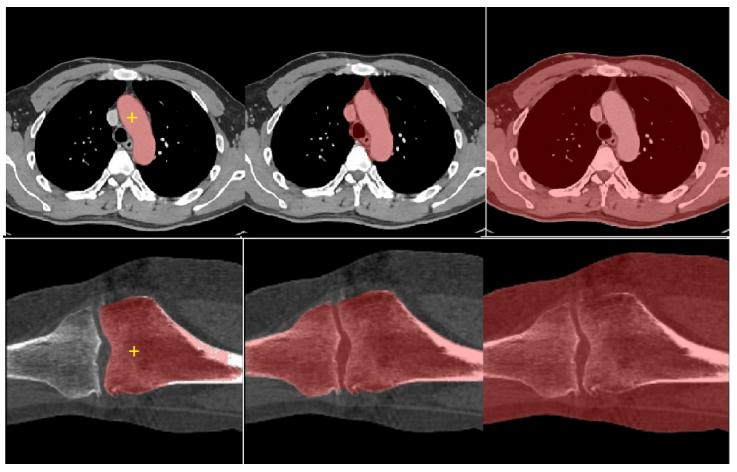
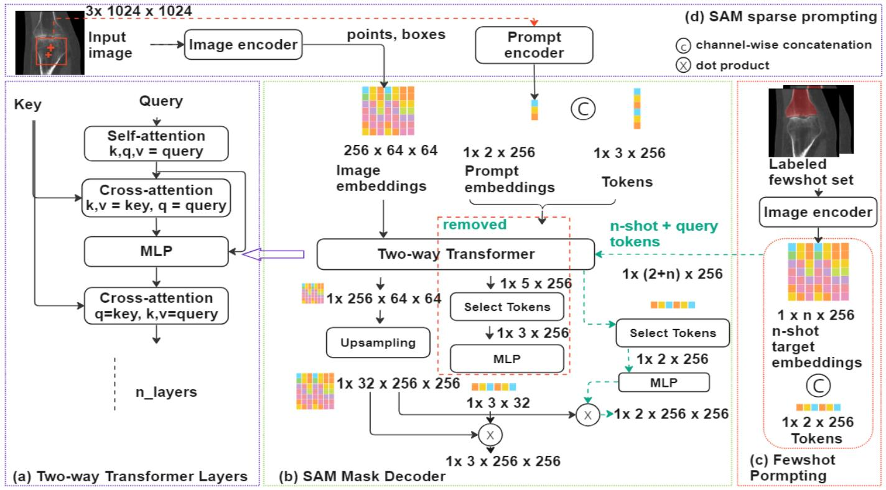

## [SAM Fewshot Finetuning for Anatomical Segmentation in Medical Images](https://arxiv.org/abs/2407.04651)

## Abstract

我们提出了一种直接而高效的少量样本微调策略，用于将“分割一切”（Segment Anything, SAM）模型适应于医学图像中的解剖结构分割任务。我们的新方法围绕重新构建 SAM 内的掩码解码器展开，利用从有限数量的标记图像（少量样本集合）中得出的少量样本嵌入作为查询被图像嵌入捕捉到的解剖对象的提示。这种创新性的重构极大地减少了对耗时的在线用户交互的需求，例如详尽地标记点和边界框以逐片提供提示。使用我们的方法，用户可以离线手动分割少数 2D 切片，而这些标注图像区域的嵌入则可作为在线分割任务的有效提示。我们的方法通过缓存机制专门训练掩码解码器，同时保持图像编码器冻结，从而优先保证微调过程的效率。重要的是，这种方法不仅限于体积医学图像，还可以通用应用于任何 2D/3D 分割任务。

为了全面评估我们的方法，我们在四个数据集上进行了广泛的验证，涵盖了两种模式下的六个解剖分割任务。此外，我们还对比分析了SAM内部不同的提示选项以及全监督的 nnU-Net。结果表明，与仅使用点提示的 SAM 相比，我们的方法展现了优越的性能（ IoU 指标提高了约50%），并且在减少所需标记数据量至少一个数量级的同时，实现了与全监督方法相当的表现。

## 1. Introductiona

医学成像如 CT、MRI 和 X 射线等是用于体内分析多种人体解剖结构的最有效技术。然而，即使是专家对解剖结构进行视觉评估也可能引入主观性、错误和显著延迟。因此，利用计算方法自动分析医学图像的兴趣日益增长。在这方面，自动解剖分割方法已成为必备工具，它能够在推导临床测量之前精确识别和描绘感兴趣区域（ROI）。

近年来，一些自动分割方法 [2, 3, 8, 12, 18, 19, 25] 在解决与手动分割相关的局限性方面取得了显著进展，从而提高了医学图像分析的可靠性、可重复性和效率。这些方法基于深度学习的最新进展，大多遵循 UNet 的设计以及 Transformer 架构。

目前，在医学图像中分割解剖结构的方法依赖于针对预定义解剖目标定制的任务特定神经网络。然而，当遇到不熟悉的或病变的解剖结构时，这些模型难以泛化。因此，从业者常常需要开发新模型，并进行新一轮的数据收集和标注，这对于如 CT 和 MRI 这样的大型体积医学数据集来说尤其昂贵。因此，利用预训练的分割基础模型来分割医学图像是一个基本的研究问题。这些预训练的基础模型应该具有丰富的模型容量以表示复杂的解剖结构，并且已经在多样和广泛的数据集上进行了训练。

实际上，分割基础模型已经成为迁移学习和领域适应的一个有价值框架，在主要自然图像基准测试中展示了出色的分割性能。与基于有限数据训练的小型模型相比，这些模型展现了全面的表征能力，表明它们在新任务上的潜在改进泛化能力。“分割一切”（Segment Anything, SAM）模型作为一种突出的分割基础模型，因其使用包含超过十亿个掩码的庞大数据集而获得了广泛应用的认可，展示了对未见任务生成精确对象掩码的令人印象深刻的零样本熟练度。

SAM 提供了多种提示选项：边界框、点、掩码或文本。通过这些提示方法，SAM 承诺减少为新任务微调和重新训练新模型所需的特定任务数据需求。然而，当将SAM 适应于分割如 CT 或 MRI 这样的体积医学图像时，提示可能会带来挑战。首先，SAM 本质上是一个 2D 模型。对于大规模 3D 体积扫描的分割，逐片添加点或框来标注区域仍然耗时。我们的实验表明，仅使用点提示在分割 CT 和 MRI 图像中的典型解剖结构时表现不佳。要实现良好的零样本性能，需要在每个对象区域或子区域上提供准确的边界框，这大大增加了提示的工作量。

其次，当解剖结构在 2D 截面视图中显示出相当大的形状变化或分布在多个不连续区域时，提示更加困难。此外，SAM 分割任何事物的能力本质上会导致模糊预测，特别是在解剖结构在 2D 视图中紧密层叠时。如图 1 所示，仅依靠单一点提示不足以准确分割 CT 图像中的主动脉（顶部）和膝关节（底部）。即使将边界框作为提示加入，准确区分主动脉与周围动脉仍然具有挑战性，因为边界框会覆盖所有邻近的解剖结构。在这种情况下，必须提供多个点并区分这些点是前景还是背景以排除周围的对象，这大大增加了提示的工作量。

最后，除了提供三种分割预测外，SAM 还结合了两个估计值，即交并比（IoU）和稳定性分数，帮助用户评估预测的可靠性。然而，这些测量可能不足以让用户自信地选择哪一个分割结果应用于最终应用。这种局限性在图 1 所示的两个例子中很明显，最后一列表示具有最高预测 IoU 和稳定性分数的分割预测。在这些例子中，观察到具有最高分数的预测往往对应于相对容易勾画的片段，通常可以通过简单的强度阈值处理实现。因此，仅仅依赖于 IoU 和稳定性分数可能导致次优分割。为了确保准确的结果，精确的提示和在三个预测中仔细选择变得至关重要，需要用户的参与。

**图 1**：

本文提出了一种少量样本微调策略，用于将 SAM 适应于医学图像中的解剖结构分割。重要的是，这一提议并不涉及引入新的网络架构或模型。相反，本研究中使用的所有组件均来自原始的 SAM。关键修改在于重构 SAM 的掩码解码器，使其能够接受少量样本嵌入作为提示，消除了位置编码的点、边界框或密集提示（如掩码）以及它们的提示编码器。微调过程专注于在特定分割任务的一小组标记图像上训练 SAM 的掩码解码器。与训练独立的神经网络相比，我们的微调过程计算效率更高。为了验证我们方法的有效性，我们将其与 SAM 提供的各种提示选项以及在所有可用标记图像上训练的全监督 nnU-Net 进行了全面评估比较。我们的评估涵盖了六种解剖结构。结果显示，所提出的少量样本微调方法在使用准确的边界框作为提示时，实现了与 SAM 相当的解剖结构分割性能，而在仅使用前景点作为提示时显著优于 SAM。

## 2. Related Work

自从 SAM 问世以来，最近的一些研究 [6, 11] 已经调查了其在医学图像分割基准测试中的性能，尤其是比较了各种提示选项。大多数这些研究表明，使用边界框作为提示通常比单独使用点能带来更好的性能，尽管这一发现根据数据集的不同而不一致。与正在进行的讨论相呼应，我们的论文深入研究了采用不同提示模式的 SAM 的复杂性，提供了进一步的见解和分析。

在将 SAM 适应于医学图像分割方面，MedSAM[17] 利用一个精心策划的包含来自 11 种不同模式的超过 20 万个掩码的医学图像数据集对 SAM 的掩码解码器进行了微调。值得注意的是，他们的微调过程仅专注于掩码解码器，而保持 SAM 的其余组件冻结。结果表明，与零样本 SAM 相比，在使用各种提示选项时分割性能有了显著提高。然而，MedSAM 的有效性尚未与全监督方法进行对比验证。此外，包括数据收集和计算时间在内的微调所需训练工作带来了实际挑战，影响了其方法的采用。

另一种方法，Med SAM Adaptor (MSA)[22]，通过引入一系列连接到原始 SAM 网络模块的适配器神经网络模块来增强 SAM。在训练过程中，SAM 模块保持不变，而适配器模块的参数得到更新以实现分割医学图像的目标。MSA 展示了在将 SAM 适应于医学领域的前景，证明了其在 19 个医学图像分割数据集上的有效性。然而，MSA 的训练过程仍然需要不小的代价，并且对于微调来说，相对较大的数据集收集是必要的。相比之下，我们提出的方法保持了 SAM 图像编码器的完整性，同时只专注于使用极少量（5-20）针对给定分割任务的标记图像微调掩码解码器。我们的方法显著减少了所需的训练工作量，并为将 SAM 适应于医学图像分割提供了一个实用的解决方案。

目前大多数将 SAM 适应于医学图像的方法仍然是基于提示的方法，要求用户在算法使用过程中提供准确的提示，这可能对于大型体积医学图像来说并不理想。

## 3. Method

本节首先简要描述 SAM 方法，然后介绍所提出的少量样本微调策略。

### 3.1. Segment Anything

Segment Anything 模型（SAM）是迄今为止在最大的分割数据集上训练的最先进的分割模型[16]。在发布时，SAM 在 23 个不同的数据集上进行了广泛的评估，涵盖了广泛的自然图像[16]。评估表明，SAM 在零样本应用中达到了显著的准确性，超越了其他交互式或特定于数据集的模型，而无需在未见数据集或分割任务上进行再训练或微调。

SAM 接收一个尺寸为 1024×1024 且具有 RGB 通道的 2D 图像作为输入。SAM 的第一步是利用其图像编码器，即一个 Vision Transformer[7,9]，从输入图像中提取图像嵌入。得到的图像嵌入是在 64×64 的下采样分辨率下获得的。SAM 结合用户输入提示，包括点、边界框和掩码，并将对象及其位置信息编码成提示嵌入，以识别和定位图像中的对象。这些提示嵌入作为查询用于掩码解码器，该解码器基于 MaskFormers[4, 5]。掩码解码器（如图2所示）采用注意力机制来捕捉查询（带有 tokens 的提示嵌入）与键（带有编码的位置信息的图像嵌入）之间的相关性。这使得能够检索存储在图像嵌入（值）中的相关信息。掩码解码器包含多层双向 Transformer，如图 2 (a) 所示。这些 Transformer 包含了自注意力和交叉注意力层，允许图像和提示嵌入相互关注对方的信息。

### 3.2. Prompting with SAM

SAM 提供了两种模式：自动模式和提示模式。在自动模式下，用户不需要提供任何输入。算法会在输入图像上生成一个均匀分布的点网格，这些点作为分割的提示。自动分割模式不适合解剖结构分割任务，因为它与解剖实体缺乏对齐，并且会分割图像中的任何对象。

一种更为针对性的方法是使用提示模式，它允许用户通过提供各种类型的提示（如点、边界框和掩码）与算法交互，以指示目标对象的位置（跳过基于文本的提示，因为我们在开源发布版中没有找到此功能）。在点提示中，用户可以提供多个点来指示前景和背景区域。另一种方法是提供边界框作为提示。用户可以指定边界框左上角和右下角的坐标来指示感兴趣的区域。这种方法在将 SAM 适应于医学图像分割时，相较于使用点提示，已被证明能产生更佳的结果[17]。

#### 3.2.1 Fewshot Fine-tuning for SAM Adaption

我们提出了一种少量样本微调方法，用于将SAM适应于从医学图像中分割解剖结构。与依赖用户提供的提示不同，我们的方法利用SAM的图像编码器从一组针对特定分割任务标记的少量样本图像中提取目标嵌入。

给定一个少量样本集 $\large D_L = (x_i, y_i) ^{N_L} i= 1$ ，其中 $N_L$ 是 $D_L$ 中标记图像的数量， $x_i$ 表示第 $i$ 张图像，而 $y_i$ 表示对应的分割真值。 $x_i$ 和 $y_i$ 都是尺寸为 $W \times H$ 的 2D 图像 $\large (\ x_i , y_i \in R^{W×H})$ 。我们首先在每张图像上运行 SAM 的图像编码器以获得 16 倍下采样分辨率 $(W^{\prime} = W/16, H^{\prime} = H / 16)$ 的图像嵌入 $\large z_i \in R^{256 \times W^{\prime} \times H^{\prime}}$ 。

为了使嵌入的分辨率与分割真值对齐，我们将对应的真值 $y_i$ 下采样为 $\hat{y}_i$ ， $\large \hat{y}_i \in R^{W^{\prime} \times H^{\prime}}$ 。对于每个解剖标签 $l$ ，我们通过仅在对应于标签 $l$ 的下采样掩码内的嵌入向量求平均来计算目标嵌入 $\large \hat{z}_i^l \in R^{256}$ ，应用公式 $\large \hat{z}_i = \sum[(\hat{y}_i = l) * z_i ] / \sum(\hat{y}_i = l)$ ，其中求和遍历 $\hat{y}_i$ 中的所有空间位置， $\large (\hat{y}_i = l)$ 是标签 $l$ 的二进制真值，∗ 表示逐元素乘法。最后，对于集合 $D_L$ 的所有少量样本目标嵌入都在  $\large R^{N_L \times C \times 256}$ 中，其中 $C$ 是标签的数量。

少量样本目标嵌入与查询 tokens 拼接作为修改后的掩码解码器输入的一部分；另一个输入是图像嵌入（参考图2(a)）。我们修改了掩码解码器以接受少量样本目标嵌入（如图2(b)中的绿色虚线所示），而不是用户定义的提示（如图2(a)中的红色虚线框所示）。实际上，唯一的改变是从双向 Transformer 层获取的输出 token 数量（两个 vs 三个 (原始 SAM 掩码解码器中的)），这也是传递给 MLP 的输入 tokens 数。查询 token 的使用具有与原始 Transformer 相同的直觉[21]。在我们的情况下，对于每个标签，我们使用两个 tokens 查询两个掩码（前景和背景），以表示一个一对其他剩余像素分类方案。在每一层，少量样本目标嵌入和图像嵌入都使用交叉注意力机制相互关注。这允许模型捕捉少量样本目标嵌入和图像嵌入在嵌入空间中的相关性。第一层之后，带有 tokens 的少量样本嵌入也进行了自注意力。这种自注意力机制有助于细化少量样本嵌入的表示，并结合少量样本集中跨嵌入的相关信息。

与原始 SAM 的掩码解码器相同，从双向 Transformer 层丰富后的图像嵌入被上采样并重塑到较低维度。这将图像嵌入的维度从 $R^{256}$ 减少到 $R^{32}$ ，使得分辨率重建的计算更加高效。相应地，少量样本目标嵌入和 tokens 也被重塑成相同的维度 $R^{32}$ ，以便与上采样的图像嵌入进行点积操作。由修改后的掩码解码器生成的每个解剖标签的最终分割预测在空间上调整回原始分辨率（1024×1024）后有两个通道（前景和背景）。

#### 3.2.2 Rationale Behind Fewshot Prompting

在 SAM 中，掩码解码器的设计类似于 MaskFormer 中的 Transformer 解码器，旨在使用部分由位置编码表示的键从图像嵌入（值）中检索相关信息。这一过程涉及基于用户提供的位置信息（如点或边界框）生成查询。这些位置编码（查询）随后与存储在图像嵌入中的位置编码（键）匹配。通过这样做，可以获取图像嵌入中与用户输入相对应的区域，并将其转换为分割预测。该机制允许 SAM 有效地利用用户提供的位置信息与图像嵌入之间的空间关系，以实现精确的分割。

在我们提出的方法中，消除了对提示编码器的需求，而是利用少量样本目标嵌入进行分割。目标嵌入的标签被传播到从测试图像中提取的嵌入上。我们的方法没有明确设计最近邻匹配标签传播方案，而是利用了 SAM 掩码解码器内双向 Transformer 层的能力，以促进少量样本目标嵌入和从测试图像中提取的图像嵌入之间的最佳匹配。目标嵌入充当查询，允许检索和转换由 SAM 图像编码器生成的图像嵌入中存储的信息，进而转化为分割预测。本质上，在双向 Transformer 层中目标嵌入和图像嵌入之间的交叉注意力图代表了嵌入空间中查询和键之间的成对相似性，而用于测量这些相似性的距离度量和映射技术则是通过微调过程学习得到的。

## 4. Experiments

## 5. Discussion & conclusion

本研究介绍了一种将 SAM 适应于医学图像（CT、MRI）中的解剖分割任务的方法。我们的方法消除了用户提示的需求，而依赖少量标记图像进行提示。我们将这种方法与基于提示的 SAM（点和框）及全监督的 nnU-Net 方法进行了比较。关键的是，准确的真值分割被用来生成 SAM 的边界框提示，这代表了高度理想化的提示，如果没有大量的标记工作，不可能为每个样本生成这样的提示。这种程度的提示可能是昂贵的，有时对于医学解剖结构分割来说是不可行的，特别是当处理如气道和血管等大型稀疏分布实体时。

值得注意的是，使用 5 张标记图像的微调方法在股骨和胫骨分割方面达到了与使用（理想化）边界框提示的 SAM 相当的结果，这表明有可能减少所需的标记工作量，同时仍然保持对解剖结构的精确分割。减少标记图像需求的同时保持良好性能是我们方法的一个关键优势。此外，通过缓存计算出的图像嵌入，微调过程变得高效，允许在重复运行中重用。实验结果表明，我们的方法在分割 CT 或 MRI 图像中的各种具有挑战性的解剖结构时的有效性，甚至可能仅用 5 张标记图像进行训练即可实现。最后，我们的少量样本 SAM 的应用不仅限于医学图像分割，还提供了一个通用框架，可用于医学图像和分割领域之外基于 tokens 查询的对象检测和分类任务。

