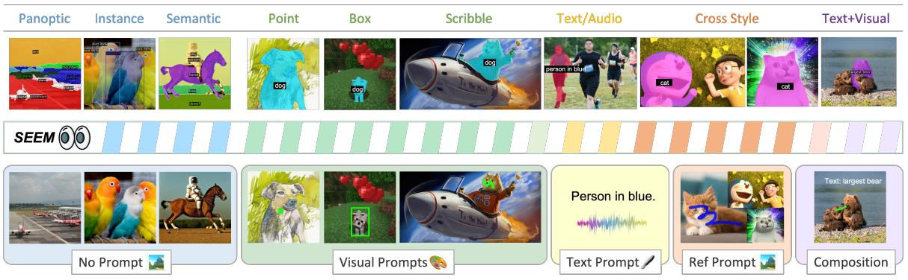
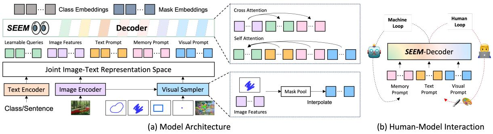
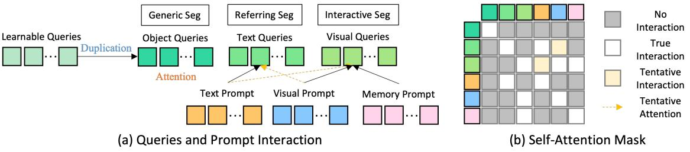
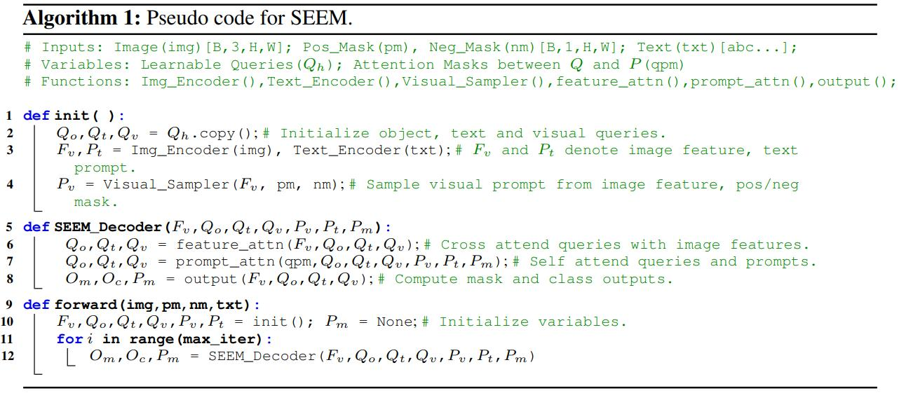
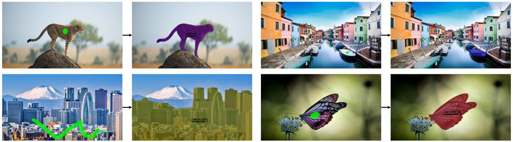
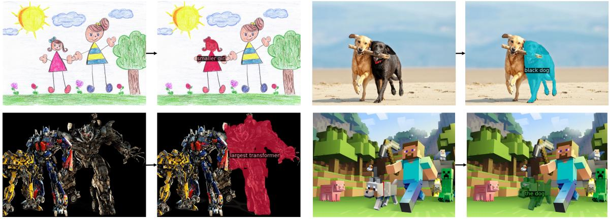
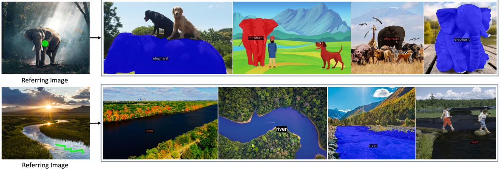
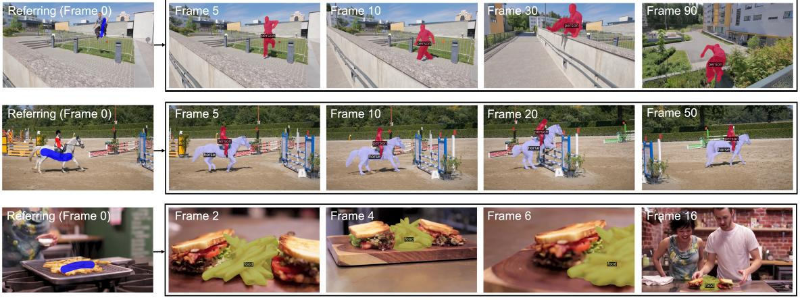

# [Segment Everything Everywhere All at Once](https://arxiv.org/abs/2304.06718)

**图 1**：SEEM 在没有提供提示的情况下，以开放集的方式支持通用分割任务——包括语义分割、实例分割和全景分割。SEEM 还支持以灵活的组合方式使用视觉、文本和指代区域提示，使其成为一个可提示和交互式的分割界面。

## Abstract

在这项工作中，我们提出了 SEEM，一个可提示和交互式的模型，用于在图像中同时分割所有事物，如图 1 所示。在 SEEM 中，我们提出了一种新颖的解码机制，该机制支持对所有类型的分割任务进行多样化的提示，旨在创建一个行为类似于大型语言模型 (LLM) 的通用分割接口 (interface)。更具体地说，SEEM 的设计基于四个期望：i) **多功能性**。我们引入了一种新的视觉提示来统一不同的空间查询，包括点、框、涂鸦和掩码，这可以进一步推广到不同的参考图像；ii) **组合性**。我们学习了文本和视觉提示之间的联合视觉语义空间，这有助于动态组合各种分割任务所需的两种提示类型；iii) **交互性**。我们进一步将可学习的记忆提示融入解码器，通过从解码器到图像特征的掩码引导的交叉注意力来保留分割历史；iv) **语义感知**。我们使用文本编码器将文本查询和掩码标签编码到同一个语义空间中，以实现开放词汇分割。我们进行了一项全面的实证研究，以验证 SEEM 在各种分割任务中的有效性。值得注意的是，我们的单个 SEEM 模型在交互式分割、通用分割、参考分割和视频对象分割等任务上，在 9 个数据集上以最低 1/100 的监督实现了具有竞争力的性能。此外，SEEM 展示了对新颖提示或其组合的卓越泛化能力，使其成为一个随时可用的通用图像分割接口。

## 1 Introduction

图像分割可以说是计算机视觉领域中最重要但也最具挑战性的问题。过去，我们在各种分割任务中取得了显著的进展，包括实例分割、语义分割和全景分割 [1, 2, 3, 4, 5, 6, 7]。最近，我们观察到在不同方面朝着更灵活的分割模型发展的明显趋势：1) 从封闭集到开放词汇分割。许多最近的工作提出利用对比学习方法或预训练的多模态基础模型（例如，CLIP [8]），使分割模型更能迁移到未见过的概念 [9, 10, 11, 12]；2) 从通用分割到参考分割。除了给定预定概念集彻底分割图像的通用分割外，基于语言的参考分割提供了一种用户友好的方式，用于分割由任意文本短语指代的特定区域 [13, 14, 15, 16, 17]；3) 从一次性分割到交互式分割。在实践中，分割模型不一定一次就能产生令人满意的掩码。因此，人们也在研究如何通过人与模型之间的密切交互逐步完善分割结果 [18, 19, 20, 21]。

尽管为设计更强大和可行的分割模型付出了上述努力，我们仍然缺乏一个通用的分割接口，该接口能够适应各种类型的人工提示并处理各个研究工作中研究的不同分割任务。相比之下，大型语言模型 (LLM) 已经成为语言任务的通用交互接口，从早期的模型如 GPT-3 [22] 和 T5 [23]，到通过高级提示 [25, 26, 27] 和思维链 [28, 29, 30] 增强的对话代理 [24]。在这项工作中，我们致力于创建一个通用的接口，以便在图像中同时分割所有事物。在这个接口上，我们的目标是以可提示的方式，用一个单一的模型统一所有分割任务。为了实现这个目标，我们在掩码解码器中提出了一种新的提示方案，该方案具有四个重要的特性：多功能性、组合性、交互性和语义感知。具体来说，我们建议**将点、掩码、文本、框，甚至来自另一张图像的参考区域编码到同一个联合视觉语义空间的提示中**。因此，我们的模型可以处理输入提示的任何组合，从而实现强大的组合性。为了实现交互性，我们进一步引入了记忆提示，用于浓缩先前的分割信息，然后与其他提示进行通信。至于语义感知，我们的模型可以为任何输出分割提供开放集的语义标签。

通过提出的提示方案，我们构建了一个名为 SEEM 的“分割一切、无处不在”的模型，该模型由一个简单的 Transformer 编码器-解码器架构 [31, 6] 和一个额外的文本编码器 [11, 32] 组成。在 SEEM 中，解码过程模仿了生成式 LLM，但具有多模态输入-多模态输出的接口。一个图像编码器和文本编码器用作提示编码器，以编码所有类型的查询，这些查询被馈送到解码器。具体来说，我们通过池化图像编码器中对应的视觉特征，将所有空间查询（即点、框、涂鸦和掩码）编码为视觉提示，并使用文本编码器将文本查询转换为文本提示。通过在各种分割任务上进行训练，我们的模型学会了处理各种提示，对齐视觉和文本提示，并通过它们之间的交叉注意力促进它们的协同作用。因此，我们的单个模型在预训练后在所有分割任务上都获得了具有竞争力的性能。由于所有 5 种不同类型的提示都映射到联合视觉语义空间，我们可以灵活地组合提示以消除歧义，从而获得更好的分割结果，并实现对未见过的用户提示的零样本适应。此外，我们的模型可以立即推广到使用示例图像分割作为提示的情况，并以零样本方式进行视频对象分割。除了强大的泛化能力外，与 SimpleClick [32] 等同类方法相比，SEEM 在交互式分割方面也更有效。由于我们将提示作为解码器的输入，因此在与人类进行多轮交互时，我们的模型只需要在开始时运行一次特征提取器，然后在每一轮进行轻量级的解码。最终，我们构建了一个分割接口，该接口使用单个预训练模型，可以分割具有语义的每个对象 (everything)，覆盖图像中的每个像素 (everywhere)，并支持所有可能的提示组合 (all at once)。总而言之，我们的贡献有三方面：

- 我们设计了一种新的提示方案，可以将各种用户意图编码到联合视觉语义空间的提示中，从而为各种分割任务提供了强大的灵活性，并具备对未见过的提示或其组合的泛化能力。
- 我们构建了 SEEM，一个通用的交互式分割接口，它将新设计的提示机制集成到一个轻量级的解码器中，用于所有分割任务，从而使模型具有多功能性、组合性、交互性和语义感知等特性。
- 我们进行了大量的实验和可视化，以表明我们的模型在许多分割任务上都具有强大的性能，包括开放词汇通用分割、交互式分割、参考分割以及使用组合提示的分割任务。

**图 2**：SEEM 解码器概述。(a) SEEM 将图像、文本和人类输入编码到联合视觉语义空间中，作为查询、特征和提示，然后将查询解码为类别和掩码嵌入。(b) 借助 SEEM 解码器，机器循环能够记住历史掩码信息，而人类循环则为下一轮提供新的修正。

## 2 Related Work

**交互式分割**。交互式分割是通过交互式地接收用户输入来分割对象的任务。这是一个长期存在的问题，并且取得了相当大的进展 [33, 34, 35, 20, 21, 36]。一般来说，交互类型可以采取各种形式，例如点击、框、多边形和涂鸦，其中基于点击的交互模型最为普遍。与我们的工作同期，SAM [36] 提出了一个可提示的分割模型，该模型在 1100 万张图像和 11 亿个掩码上进行了训练。它将用户交互作为通用分割的提示。尽管 SAM 展示了强大的零样本性能，但它产生的分割结果缺乏语义意义。此外，它的提示类型仅限于点、框和文本，而我们的模型还可以将来自另一张图像的参考区域作为提示输入。

**通用分割**。视觉概念的分割一直是计算机视觉领域的一个持续挑战，大量的文献 [37, 38, 39, 40] 证明了这一点。通用分割技术包括几个子任务，如实例分割、语义分割和全景分割 [4, 2, 3]，每个子任务都侧重于不同的语义级别。例如，语义分割旨在根据图像中每个像素对应的语义类别来识别和标记该像素 [41, 6, 42]。另一方面，实例分割涉及将属于同一语义类别的像素分组到单独的对象实例中 [4, 43, 7]。最近，基于 Transformer [44] 架构的 Detection Transformer (DETR) [31] 在分割 [45, 6, 7, 46, 47] 任务中取得了显著进展。然而，这些方法无法识别训练集中不存在的对象，这限制了模型的词汇量。

**统一视觉模型**。统一视觉模型 [11, 48, 49, 36, 50] 近年来因其在泛化到各种任务和灵活性方面的优势而备受关注。这些模型可以处理多个视觉任务或数据分布。其中，一些模型 [11, 48, 49] 使用单个模型同时训练多个任务，因此无需在每个目标任务上进行微调即可处理所有训练任务。另一方面，SAM [36] 和 SegGPT [50] 提出了使他们的模型能够以零样本方式处理新任务和数据分布的训练策略。第二种方法更受欢迎，因为它在训练期间无需解决任务之间的冲突。

## 3 Method

**图 3**： 训练和评估期间的查询和提示交互。(a) 可学习的查询被复制为对象查询、 grounding 查询和视觉查询，每个任务使用相同的权重集。(b) 任意两种类型的 tokens 之间的注意力掩码（在算法 1 中表示为 *qpm*）。“暂定”表示该交互没有经过训练，但无需任何修改即可进行推理。

### 3.1 Model Design

SEEM 采用通用的编码器-解码器架构，但也采用了一种复杂的查询和提示之间的交互方案，如图 2 (a) 所示。给定一个输入图像 $\mathbf{I} \in \mathcal{R}^{H \times W \times 3}$ ，首先使用图像编码器提取图像特征 $\mathbf{Z}$ 。然后，SEEM-Decoder 基于查询输出 $\mathbf{O}_h^m$ (掩码嵌入) 和 $\mathbf{O}_h^c$ (类别嵌入) 预测掩码 $\mathbf{M}$ 和语义概念 $\mathbf{C}$ ，这些查询输出与文本、视觉和记忆提示 $\langle \mathbf{P}_t, \textcolor{red}{\mathbf{P}_v, \mathbf{P}_m \rangle}$ 交互：
$$
\large \langle \mathbf{O}_h^m, \mathbf{O}_h^c \rangle = \text{Decoder} (\mathbf{Q}_h; \langle \mathbf{P}_t, \textcolor{red}{\mathbf{P}_v, \mathbf{P}_m} \rangle | \mathbf{Z}) \tag{1}
$$

$$
\large \mathbf{M} = \text{MaskPredictor} (\mathbf{O}_h^m) \tag{2}
$$

$$
\large \mathbf{C} = \text{ConceptClassifier} (\mathbf{O}_h^c) \tag{3}
$$

其中 $\mathbf{Q}_h$ 是可学习的查询， $\mathbf{P}_t, \mathbf{P}_v, \mathbf{P}_m$ 分别代表文本提示、视觉提示和记忆提示。在训练期间， $\mathbf{Q}_h$ 被复制用于通用分割、参考分割和交互式分割，如图 3 所示。相应的提示通过自注意力机制与其查询进行交互。在推理时，可学习的查询可以自由地与所有提示进行交互，从而实现零样本组合。我们的设计灵感来源于 X-Decoder [11] 的成功实践。然而，我们强调了公式 (1) 中以红色标记的差异，这些差异使得我们能够构建一个具有以下属性的通用图像分割模型：

**多功能性**。在 SEEM 中，我们引入了视觉提示 $\mathbf{P}_v$ 来处理所有非文本输入，例如点、框、涂鸦和来自另一张图像的参考区域。当仅使用文本提示无法识别正确分割时，这些非文本查询有助于消除用户的意图歧义。对于交互式分割，先前的工作要么将空间查询转换为掩码并将其馈送到图像骨干网络 [20]，要么为每种输入类型（点、框）使用不同的提示编码器 [36]。第一种方法在应用中可能过于繁重，因为每次交互都需要图像通过特征提取器。第二种方法难以推广到未见过的提示。为了解决这些限制，我们提出了一个视觉采样器（图 2 (a)），用于将各种非文本查询转换为位于同一视觉嵌入空间的视觉提示： 

$$
\large \mathbf{P}_v = \text{VisualSampler} (s, \hat{\mathbf{Z}}) \tag{4}
$$

其中 $\hat{\mathbf{Z}}$ 是从目标图像（即 $\hat{\mathbf{Z}} = \mathbf{Z}$ ）或参考图像中提取的特征图，而 $s \in \set{\text{points, box, scribbles, polygons}}$ 是用户指定的采样位置。我们首先通过点采样 [6] 从图像特征中池化相应的区域。对于所有视觉提示，我们从提示指定的区域中均匀地插值最多 512 个点特征向量。我们提出的方法的一个显著优点是，视觉提示与文本提示自然地对齐，因为我们的模型通过全景分割和参考分割持续学习一个共同的视觉语义空间。

**组合性。** 在实践中，用户可能会使用不同或组合的提示类型来表达他们的意图。因此，组合式的提示方法对于实际应用至关重要。然而，我们在模型训练过程中面临两个问题。首先，训练数据通常只涵盖单一类型的交互（例如，无提示、文本提示、视觉提示）。其次，尽管我们使用视觉提示来统一所有非文本提示并使其与文本提示对齐，但它们的嵌入空间本质上仍然不同。为了缓解这个问题，我们建议将不同类型的提示与不同的输出进行匹配。考虑到视觉提示 $\mathbf{P}_v$ 来自图像特征，而文本提示 $\mathbf{P}_t$ 来自文本编码器，我们通过将它们分别与掩码嵌入 $\mathbf{O}_h^m$ 或类别嵌入 $\mathbf{O}_h^c$ 进行匹配，来选择视觉和文本提示的匹配输出索引：
$$
\large ID_v \leftarrow \text{Match}(\mathbf{O}_h^m \cdot \mathbf{P}_v + \mathbf{IoU}_{mask}) \tag{5}
$$

$$
\large ID_t \leftarrow \text{Match}(\mathbf{O}_h^c \cdot \mathbf{P}_t + \mathbf{IoU}_{mask}) \tag{6}
$$

其中 $\mathbf{IoU}_{mask}$ 是真实掩码和预测掩码之间的 IoU。所提出的分离匹配方法优于仅将所有提示与 $\mathbf{O}_h^m$ 或 $\mathbf{O}_h^c$ 之一进行匹配的方法。

经过训练后，我们的模型熟悉所有提示类型，并支持各种组合，例如无提示、一种提示类型或使用相同模型和权重的视觉和文本提示。特别地，视觉和文本提示可以简单地连接起来并馈送到 SEEM-Decoder，即使模型从未以这种方式进行训练。

**交互性**。交互式分割通常无法一次完成，需要多轮交互进行细化，类似于 ChatGPT 等对话代理。在 SEEM 中，我们提出了一种名为记忆提示 $\mathbf{P}_m$ 的新型提示，并使用它们将上一次迭代的掩码知识传递到当前迭代。与先前使用网络编码先前掩码的工作 [20, 36] 不同，我们没有引入额外的模块，而只是简单地使用了几个记忆提示。这些记忆提示通过使用掩码引导的交叉注意力层 [6] 来编码历史信息：
$$
\large \mathbf{P}_m^l = \text{MaskedCrossAtt}(\mathbf{P}_m^{l-1}; \mathbf{M}_p | \mathbf{Z}) \tag{7}
$$

其中 $\mathbf{M}_p$ 是先前的掩码， $\mathbf{Z}$ 是图像特征图。通过这种方式，交叉注意力仅在先前掩码指定的区域内生效。更新后的记忆提示 $\mathbf{P}_m^l$ 然后通过自注意力机制与其他提示交互，以传递当前轮的历史信息。

**语义感知**。与先前不区分类别的交互式分割工作（如 Simple Click [20] 和同期工作 SAM [36]）不同，我们的模型以零样本方式为所有类型的提示组合生成掩码的语义标签，因为我们的视觉提示特征在联合视觉语义空间中与文本特征对齐。如图 3 所示，语义标签直接使用 $\mathbf{O}_h^c$ （视觉查询的输出）和文本嵌入计算得出。尽管**我们没有使用任何语义标签来训练交互式分割**，但得益于联合视觉语义空间，计算出的 logits 能够很好地对齐。

### 3.2 Model Pipeline and Loss Functions

我们在算法 1 中用 Pytorch 风格的伪代码总结了所提出方法的训练和评估流程。SEEM 使用全景分割、指代分割和交互式分割的损失的线性组合进行训练：

$$
\large \mathcal{L} = \alpha \mathcal{L}_{\text{c\_CE\_pano}} + \beta \mathcal{L}_{\text{m\_BCE\_pano}} + \gamma \mathcal{L}_{\text{m\_DICE\_pano}}  \\
\large + a \mathcal{L}_{\text{c\_CE\_ref}} + b \mathcal{L}_{\text{m\_BCE\_ref}} + c \mathcal{L}_{\text{c\_DICE\_ref}} \\
\large + a \mathcal{L}_{\text{c\_CE\_iseg}} + b \mathcal{L}_{\text{m\_BCE\_iseg}} + c \mathcal{L}_{\text{c\_DICE\_iseg}} \tag{8}
$$

其中 $\alpha = 2, \beta = \gamma = 5, a= 0.2, b = c = 2$ , CE、BCE 和 DICE 分别表示交叉熵损失、二元交叉熵损失和 Dice 损失。

## 4 Experiments

**数据集和设置**。SEEM 在三个任务上进行训练：全景分割、参考分割和交互式分割。全景分割和交互式分割在带有全景分割标注的 COCO2017 [51] 上进行训练。遵循 [11]，我们排除了 Ref-COCOg [52] 的验证集，总共得到 107K 张分割图像。对于参考分割，我们使用 Ref-COCO、Ref-COCOg 和 Ref-COCO+ 的组合进行 COCO 图像标注。我们评估通用分割（实例/全景/语义）、参考分割和交互式分割。

**图 4**： 基于点击/涂鸦的分割。SEEM 支持用户提供的任意格式的点击或涂鸦。此外，它同时为分割的掩码提供语义标签，这在 SAM [36] 中是不可能的。

**图 5**：文本到掩码或文本指代分割。指代的文本显示在掩码上。SEEM 适用于卡通、电影和游戏领域中的各种类型的输入图像。

**图 6**：使用 SEEM 进行**零样本**视觉参考分割。 给定一张带有简单空间提示的参考图像，SEEM 可以在不同的目标图像中分割出语义上相似的区域。

**图 7**：使用第一帧加一笔划进行**零样本**视频对象分割。 从上到下，视频分别是来自 DAVIS [73] 的 “parkour” 和 “horsejump-low”，以及来自 YouCook2 [74] 的 video 101。即使在由于模糊或剧烈形变导致外观发生显著变化的情况下，SEEM 也能精确地分割出指代的物体。

## 5 Conclusion

我们提出了 SEEM，它可以分割一切（所有语义）、无处不在（所有像素）和一次性完成（所有可能的提示组合）。除了执行通用的开放词汇分割外，SEEM 还可以交互式地接收用户提供的不同类型的视觉提示，包括点击、框、多边形、涂鸦、文本和来自另一张图像的指代区域。这些视觉提示通过提示编码器映射到联合视觉语义空间中，这使得我们的模型能够适应各种提示并灵活地组合不同的提示。大量的实验表明，我们的模型在多个开放词汇和交互式分割基准测试中取得了具有竞争力的性能。进一步的研究揭示了我们的模型在基于各种用户意图准确分割图像方面的强大泛化能力。我们希望我们的工作将成为迈向通用和交互式图像分割界面及更远目标的垫脚石。
