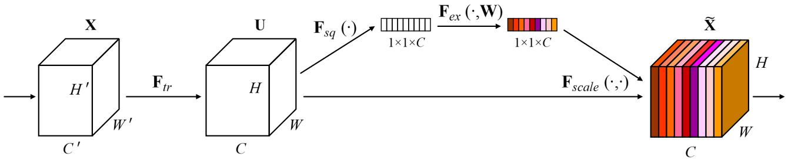

# [Squeeze-and-Excitation Networks](https://arxiv.org/abs/1709.01507)

## Abstract

卷积神经网络 (CNN) 的核心构建模块是卷积算子，它使网络能够通过在每一层的局部感受野内融合空间和通道维度信息来构建信息丰富的特征。 之前的广泛研究已经探索了这种关系的空间组成部分，力求通过增强 CNN 特征层级中空间编码的质量来加强其表征能力。 在这项工作中，我们转而关注通道关系，并提出一种新颖的架构单元，我们称之为“Squeeze-and-Excitation” (SE，**压缩和激励**) 块，它通过显式地建模通道之间的相互依赖性来自适应地重新校准通道维度的特征响应。 我们证明，这些 SE 块可以堆叠在一起形成 SENet 架构，从而在不同的数据集上实现极其有效的泛化。 我们进一步证明，SE 块以轻微的额外计算成本为现有的最先进 CNN 带来了显著的性能提升。 Squeeze-and-Excitation Networks 构成了我们 ILSVRC 2017 分类竞赛提交的基础，该提交赢得了第一名，并将 top-5 错误率降低至 2.251%，相对于 2016 年的获胜方案，相对改进幅度约为 25%。 模型和代码可在 https://github.com/hujie-frank/SENet 获取。

## 1 INTRODUCTION

卷积神经网络 (CNN) 已被证明是解决各种视觉任务的有效模型 [1], [2], [3], [4]。在网络中的每个卷积层，一组滤波器沿着输入通道表达邻域空间连接模式——在局部感受野内将空间和通道维度信息融合在一起。通过将一系列卷积层与非线性激活函数和下采样算子交错堆叠，CNN 能够生成捕获分层模式并获得全局理论感受野的图像表示。计算机视觉研究的核心主题是寻找更强大的表示，这些表示仅捕获图像中对于给定任务最显著的属性，从而提高性能。作为视觉任务中广泛使用的模型家族，新型神经网络架构设计的发展如今代表了这一探索的关键前沿。最近的研究表明，通过将学习机制整合到网络中，可以增强 CNN 生成的表示，这些学习机制有助于捕获特征之间的空间相关性。其中一种方法，因 Inception 架构系列 [5], [6] 而流行，将多尺度处理整合到网络模块中，以实现性能的提升。进一步的工作试图更好地建模空间依赖性 [7], [8] 并将空间注意力机制融入到网络结构中 [9]。

在本文中，我们研究了网络设计的一个不同方面——通道之间的关系。我们引入了一种新的架构单元，我们称之为 Squeeze-and-Excitation (SE) 块，其目标是通过显式地建模卷积特征通道之间的相互依赖性来提高网络生成的表示质量。为此，我们提出了一种机制，允许网络执行特征重校准，通过这种机制，网络可以学习使用全局信息来有选择地强调信息丰富的特征并抑制不太有用的特征。

SE 构建块的结构如图 1 所示。对于任何给定的变换 $\mathbf{F}_{tr}$ ，将输入 $\mathbf{X}$ 映射到特征图 $\mathbf{U}$ ，其中 $\mathbf{U} \in \mathbb{R}^{H \times W \times C}$ ，例如卷积，我们可以构建相应的 SE 块来执行特征重校准。特征 $\mathbf{U}$ 首先通过一个 squeeze 操作，该操作通过聚合特征图在空间维度 $(H \times W)$ 上的信息来生成一个通道描述符。此描述符的功能是生成通道维度特征响应的全局分布的嵌入，从而允许来自网络全局感受野的信息被其所有层使用。聚合之后是 excitation 操作，它采用简单自门控机制的形式，该机制将嵌入作为输入并生成一组通道维度的调制权重。这些权重被应用于特征图 $\mathbf{U}$ 以生成 SE 块的输出，该输出可以直接馈送到网络的后续层。

**图 1**：

通过简单地堆叠一系列 SE 块，就可以构建一个 SE 网络 (SENet)。 此外，这些 SE 块也可以用作网络架构中不同深度的原始块的直接替换（第 6.4 节）。 虽然构建块的模板是通用的，但它在网络不同深度执行的角色有所不同。 在较早的层中，它以类无关的方式激发信息丰富的特征，从而加强共享的低级表示。 在较后的层中，SE 块变得越来越专门化，并以高度类特定的方式响应不同的输入（第 7.2 节）。 因此，SE 块执行的特征重校准的益处可以在整个网络中累积。

新的 CNN 架构的设计和开发是一项困难的工程任务，通常需要选择许多新的超参数和层配置。 相比之下，SE 块的结构很简单，可以通过将其组件替换为 SE 对应组件，直接用于现有的最先进架构中，从而有效地提升性能。 SE 块的计算量也很小，仅略微增加了模型复杂性和计算负担。

为了提供这些论点的证据，我们开发了几种 SENet，并在 ImageNet 数据集 [10] 上进行了广泛的评估。 我们还展示了 ImageNet 之外的结果，表明我们的方法的优势不局限于特定的数据集或任务。 通过使用 SENet，我们在 ILSVRC 2017 分类竞赛中名列第一。 我们的最佳模型集成在测试集上实现了 2.251% 的 top-5 错误率。 与前一年的获胜方案（top-5 错误率为 2.991%）相比，这代表了大约 25% 的相对改进。

## 8 CONCLUSION

在本文中，我们提出了一种架构单元——SE 块，旨在通过使网络能够执行动态的通道维度特征重校准来提高网络的表征能力。 广泛的实验表明了 SENet 的有效性，SENet 在多个数据集和任务上都取得了最先进的性能。 此外，SE 块也揭示了先前架构在充分建模通道维度特征依赖性方面的不足。 我们希望这一见解可能对其他需要强大判别性特征的任务有所帮助。 最后，SE 块产生的特征重要性值可能对其他任务有用，例如用于模型压缩的网络剪枝。
