# [SegGPT: Segmenting Everything In Context](https://arxiv.org/abs/2304.03284)

## Abstract

我们提出了 SegGPT，一个用于根据上下文分割一切的通用模型。我们将各种分割任务统一起来，融入一个通用的上下文学习框架，该框架通过将不同类型的分割数据转换为相同的图像格式来适应这些数据。SegGPT 的训练被表述为一个上下文着色问题，每个数据样本都使用随机颜色映射。目标是根据上下文完成各种任务，而不是依赖特定的颜色。训练之后，SegGPT 可以通过上下文推理在图像或视频中执行任意分割任务，例如对象实例、物体、部件、轮廓和文本。SegGPT 在广泛的任务上进行了评估，包括少样本语义分割、视频对象分割、语义分割和全景分割。我们的结果在分割领域内和领域外的目标方面都显示出强大的能力，无论是定性还是定量地。

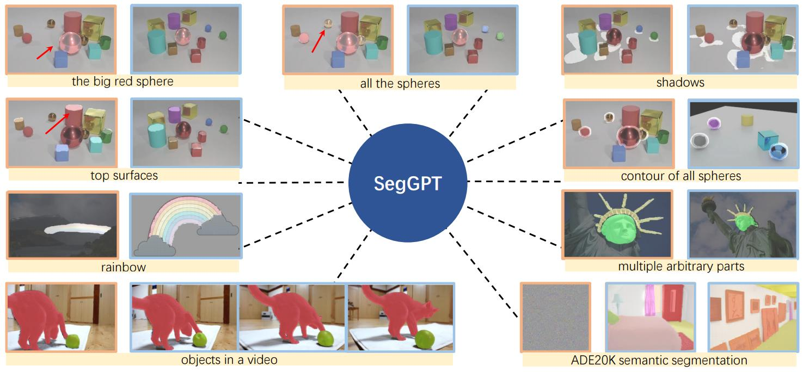

**图 1**：SegGPT 能够仅使用一个单一模型，通过上下文分割一切，该模型使用上下文示例来指示不同的任务。 对于每个样本，左侧的橙色框显示示例/提示图像及其对应的掩码，而右侧的蓝色框显示输入图像和生成的掩码输出。掩码表示附着在图像上的明亮区域。每个样本的标题（在黄色框中）仅用于解释。值得注意的是，SegGPT 可以执行任意对象分割（分割场景的不同组成部分，例如：大的红色球体、所有的球体、所有球体的轮廓、顶面和阴影），多部分分割（标志性自由女神像的特定部分），彩虹分割，无需在训练中使用视频的视频对象分割，以及通过可学习的提示调整实现的封闭集语义分割。更多示例见图 5。

## 1. Introduction

分割是计算机视觉中最基本的问题之一，其目标是在像素级别定位和重新组织有意义的概念，例如，前景、类别、对象实例等。近年来，我们见证了巨大的进步，在开发更准确和更快速的各种分割任务算法方面，例如前景分割 [41]、交互式分割 [51, 34]、语义分割 [32, 28, 54, 39]、实例分割 [18, 11, 2, 48] 和全景分割 [23, 5, 8]。

然而，这些专门的分割模型仅限于特定的任务、类别、粒度、数据类型等。当适应不同的设置时，必须训练一个新的模型，例如，分割一个新概念，或者在视频中分割对象而不是图像。这需要昂贵的标注工作，并且对于大量的分割任务来说是不可持续的。

在这项工作中，我们的目标是训练一个单一模型，该模型能够解决各种各样且不受限制的分割任务。主要挑战有两个：（1）在训练中整合那些非常不同的数据类型，例如：部件、语义、实例、全景、人物、医学图像、航空图像等；（2）设计一种可泛化的训练方案，该方案不同于传统的多任务学习，并且在任务定义上很灵活，能够处理领域外的任务。

为了应对这些挑战，我们提出了 SegGPT，一个用于根据上下文分割一切的通用模型。我们将分割视为视觉感知的一种通用格式，并将不同的分割任务统一到一个通用的上下文学习框架 [46] 中。该框架通过将不同类型的分割数据转换为相同的图像格式来适应这些数据。SegGPT 的训练被表述为一个上下文着色问题，每个数据样本都使用随机颜色映射。目标是仅根据上下文为相应的区域着色，例如类别、对象实例、部件等。通过使用随机着色方案，模型被迫参考上下文信息来完成分配的任务，而不是依赖特定的颜色。这使得训练方法更加灵活和通用。**训练的其余部分与 [46] 保持一致，使用原始的 ViT [42] 和一个简单的 $\text{smooth}-\ell1$ [17] 损失函数**。

训练之后，给定一些示例，例如对象实例、物体、部件、轮廓、文本等，SegGPT 能够通过上下文推理在图像或视频中执行各种分割任务。为了有效地组合上下文中的多个示例，我们提出了一种简单而有效的上下文集成策略，即**特征集成**，这可以帮助模型从多示例提示设置中获益。此外，SegGPT 可以方便地用作专门的模型，而无需更新模型参数，通过为特定的用例调整特定的提示，例如领域内的 ADE20K 语义分割。

我们的**主要贡献**如下：（1）我们首次展示了一个能够自动执行各种分割任务的单一通用模型。（2）我们直接（即不进行微调）在广泛的任务上评估了预训练的 SegGPT，包括少样本语义分割、视频对象分割、语义分割和全景分割。（3）我们的结果显示出强大的能力，在分割领域内和领域外的目标方面，无论是定性还是定量地。

然而，这项工作并非旨在声称取得了最新的技术水平或在所有基准测试中超越现有的专门方法，因为我们认为这可能不是通用模型的职责。

## 2. Related Work

### 2.1. Visual Segmentation

分割是计算机视觉中的一个基本问题，它涉及在像素级别定位和组织有意义的概念。分割任务的类型取决于概念的定义而变化，例如前景、类别或对象实例。例如，语义分割 [55] 涉及图像的像素级语义分类，而实例分割 [30] 旨在识别不同的对象实例及其类别。视频对象分割 [52, 37, 12] 的任务是在整个视频序列中分割一个特定的对象，仅给定第一帧的对象掩码。

以往的分割方法 [32, 28, 54, 39, 18, 11, 2, 48, 23, 5, 8] 专门为某些任务而设计，并且不能推广到切换任务或更改类别。本文介绍了一种通用接口，该接口通过适当的训练方案与所有分割任务兼容，一个单一的通用模型可以在领域内和领域外的分割任务上取得良好的性能，无论是定性还是定量地。

### 2.2. Vision Generalist

近年来，人们一直在努力使用基于 Transformer 的模型来统一视觉领域的不同任务，从而产生了几个视觉通用模型 [6, 7, 56, 33, 24]。DETR [5] 是最早采用 Transformer [42] 作为目标检测的特定任务头的模型之一。Pix2Seq 系列 [6, 7] 将视觉任务的输出空间定义为离散的，并以自回归的方式执行目标检测、实例分割、关键点估计和图像描述的任务。Unified-IO [33] 和 OFA [45] 以序列到序列的方式对视觉、视觉与语言以及自然语言处理任务进行联合建模，其中输入和输出都被定义为离散标记的序列。UViM [24] 将像素标记任务统一起来，例如全景分割、深度估计和着色，但为每个任务训练单独的模型。

尽管这些工作看起来都将不同的任务统一到相似的空间中，但它们实际上是通过某种硬性指示符（例如特殊标记）来完成每个任务的，这使得推广到新任务变得困难。相比之下，这项工作使用了一个上下文框架，该框架在任务定义上保持灵活性，并利用随机着色方案来防止模型崩溃为多任务学习解决方案，而是迫使其通过参考上下文信息来完成分配的任务。另一个不同之处在于任务的范围。这项工作主要关注视觉感知中的一个关键类别，即图像分割。

### 2.3. In-Context Visual Learning

GPT-3 [3] 将上下文学习的概念引入了深度学习，这使得一系列自然语言处理任务能够被表述为在给定提示和示例的情况下完成文本的问题。在计算机视觉领域，[1] 首次提出了一个上下文训练框架，该框架使用离散标记对视觉文章中的图表和信息图进行图像修复，证明了该框架在前景分割、单目标检测和着色方面的能力。Painter [46] 在连续像素上采用掩码图像建模，以使用监督数据集进行上下文训练，针对七个不同且具有挑战性的视觉任务，在这些任务上取得了极具竞争力的结果。

我们的工作建立在 Painter 框架之上，但由于分割任务在视觉感知中的核心作用，我们特别关注它。因此，这项工作统一了各种分割数据，包括语义分割、实例分割、部件分割，甚至像航空图像这样的特殊场景的分割数据。此外，我们设计了一个随机着色方案，该方案迫使模型参考上下文信息来完成分配的任务，但不会崩溃为多任务解决方案。由于分割任务和数据集的变异性小于深度/姿态估计，因此更容易共享内部结构，以有效地训练领域内任务，同时保持对领域外分割任务的泛化能力。

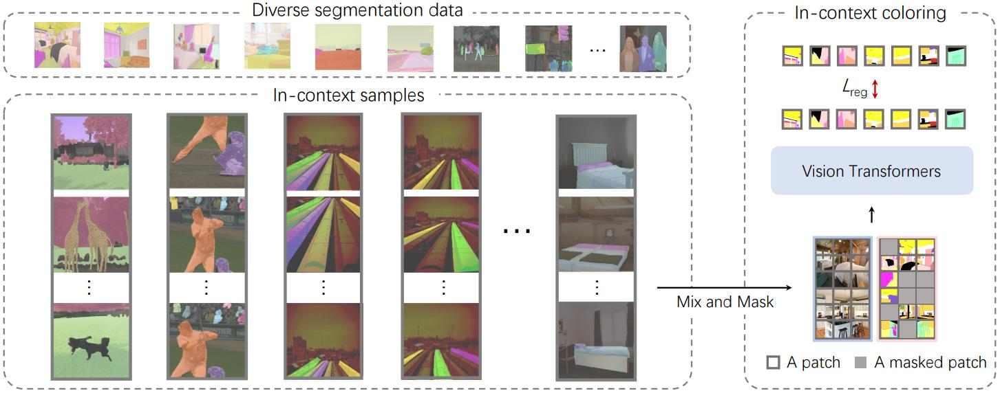

**图 2**：SegGPT 整体训练框架示意图。我们整合了各种分割数据，包括部件分割、语义分割、实例分割、全景分割、人物分割、医学图像分割和航空图像分割，并将它们转换为相同的图像格式。我们动态生成共享相似上下文的上下文样本，例如，每列中显示的重叠颜色表示相同的类别或相同的实例。我们采用通用的 Painter [46] 框架，以上下文着色作为训练目标，并使用随机着色方案进行更灵活和通用的训练。

## 3. Approach

SegGPT 是 Painter [46] 框架的一个特殊版本，它使得能够使用一个通用的 Painter 来分割一切，因此我们的模型命名为 SegGPT。这个训练框架将视觉任务的输出空间重新定义为“图像”，并将不同的任务统一到同一个图像修复问题中，即随机地掩盖任务输出图像并重建缺失的像素。为了保持简单性和通用性，我们没有对架构和损失函数进行任何修改，即原始的 ViT [13] 和一个简单的 $\text{smooth}-\ell1$ [17] 损失函数，但我们在上下文训练中设计了一种新的随机着色方案，以获得更好的泛化能力。

### 3.1. In-Context Coloring

在 Painter 的传统框架中，每个任务的颜色空间都是预先定义的，这导致解决方案崩溃为多任务学习。例如，对于语义分割，预先定义了一组颜色，并且每个语义类别都被分配了一个固定的颜色。类似地，在实例分割中，实例对象的颜色根据其位置类别分配，即颜色的数量等于空间位置的数量，这导致模型仅依赖颜色本身来确定任务，而不是使用分割之间的关系。

为了解决这个限制，我们提出了一种用于上下文着色的随机着色方案。我们首先随机采样另一张与输入图像具有相似上下文的图像，例如相同的语义类别或对象实例。接下来，我们从目标图像中随机采样一组颜色，并将每种颜色映射到一个随机的颜色。这导致了相应像素的重新着色。结果，我们得到了两对图像，它们被定义为一个上下文对。此外，我们引入了混合上下文训练方法，该方法使用混合示例来训练模型。这涉及到将多个具有相同颜色映射的图像拼接在一起。然后对得到的图像进行随机裁剪和调整大小，以形成一个混合上下文训练样本。这样做，模型学会了关注图像的上下文信息，而不是仅仅依赖特定的颜色信息来确定任务。

这种统一使我们能够以一致的方式利用所有分割数据集，仅根据特定任务改变数据采样策略。我们根据不同的数据类型定义不同的上下文。对于语义分割，我们随机采样类别。对于实例分割，对象实例以随机数进行采样。同一图像的不同视图，例如通过一组增强变换得到的图像，被视为上下文中的图像。在实现中，采样都是关于颜色的，例如，相同的颜色指的是相同的类别或相同的实例。

### 3.2. Context Ensemble

一旦训练完成，其全部能力便可在推理过程中释放出来。SegGPT 能够根据上下文进行任意分割，例如，使用一个单张图像及其目标图像的示例。目标图像可以是单色的（不包括背景），也可以是多色的，例如，一次性分割多个感兴趣的类别或对象。具体来说，给定一个待测试的输入图像，我们将其与示例图像拼接在一起，并输入到 SegGPT 中以获得相应的上下文预测。

为了提供更准确和具体的上下文，可以使用多个示例。例如，可以采用同一语义类别的多个示例，或者视频中的前几帧。为了有效地利用 SegGPT 模型的多个示例，我们提出了两种上下文集成方法。一种称为空间集成，即将多个示例连接成 n × n 的网格，然后下采样到与单个示例相同的大小。这种方法符合上下文着色的直觉，并且可以几乎零成本地提取多个示例的上下文语义信息。另一种方法是特征集成。多个示例在批处理维度中组合在一起并独立计算，只是在每个注意力层之后对查询图像的特征进行平均。这样，查询图像在推理过程中收集关于多个示例的信息。

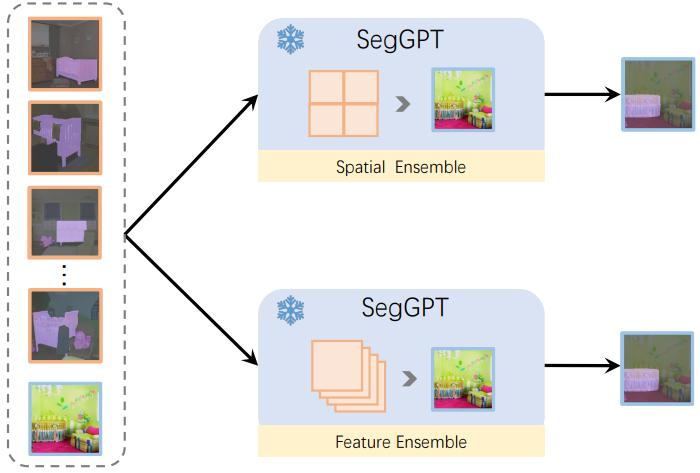

**图 3**：我们提出的用于多示例推理的上下文集成策略示意图：空间集成（上）和特征集成（下）。空间集成策略涉及将多个示例图像拼接在一起，然后调整大小到输入分辨率。特征集成策略在每个注意力层之后对查询图像的特征进行平均，使得查询图像聚合所有参考示例。

### 3.3. In-Context Tuning

SegGPT 能够在不更新模型参数的情况下适应独特的用例。我们冻结整个模型，并初始化一个可学习的图像张量作为输入上下文。训练期间仅更新这个可学习的图像张量。训练的其余部分保持不变，例如，相同的损失函数。调优后，我们取出学习到的图像张量，并将其用作特定应用程序的即插即用密钥。例如，给定一个具有固定对象类别的数据集，例如 ADE20K，我们可以为这个数据集训练一个定制的提示，而不会损害模型的通用性。或者，我们可以为特定场景（例如，你的公寓）优化一个提示图像，或者为特定人物（例如，Bert 的脸）优化一个提示图像。这为广泛的应用场景打开了机会。

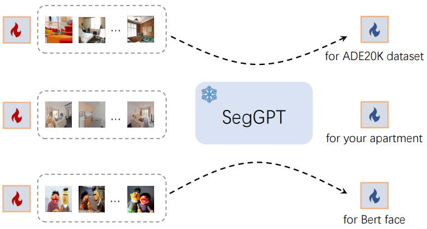

**图 4**：不同任务规范上的上下文调优示意图。对于上下文调优，我们冻结整个预训练模型，并且仅优化作为输入上下文的可学习图像张量。我们可以在特定数据集（ADE-20K 语义分割）、特定场景（你的公寓），甚至特定人物（Bert 的脸）上执行上下文提示调优。

## 4. Experiment

### 4.1. Training Data

我们的方法使用了各种各样的分割数据集，包括部件分割、语义分割、实例分割、全景分割、人物分割、视网膜血管分割和航空图像分割。与以往依赖手工标签合并来组合不同类型分割数据集的方法不同，我们的方法提供了一个统一的视角，消除了对数据集进行额外努力或调整的需求。特别是，当添加额外的数据集时，我们的方法不需要对架构或训练流程进行任何修改。

**ADE20K** [55] 为 150 个语义类别提供分割标签，总共有 2.5 万张图像，包括 2 万张训练图像、2 千张验证图像和 3 千张测试图像。

**COCO** [30] 是一个广泛使用的视觉感知数据集，支持实例分割、语义分割和全景分割。它包含 11.8 万张训练图像和 5 千张验证图像，其中有 80 个“物体”类别和 53 个“stuff”类别。

**PASCAL VOC** [14] 是一个经典的物体识别数据集。我们使用其增强的分割版本，该版本在 10582 张训练图像上提供了 20 个类别的标注。

**Cityscapes** [10] 专注于街景的场景理解。我们使用包含 19 个类别的语义分割标注的 2954 张训练图像。

**LIP** [26] 专注于人物的语义理解。我们使用包含 19 个人体部位类别分割标签的 30385 张训练图像。

**PACO** [38] 是一个新发布的数据集，提供了常见物体的部件和属性的标注。我们处理并使用了包含部件标注的 41807 张训练图像。

**CHASE DB1** [16]、**DRIVE** [40]、**HRF** [4] 和 **STARE** [20] 提供了视网膜血管分割的标注。我们通过随机裁剪来增强这些高分辨率的原始图像。

**iSAID** [49] 和 **loveDA** [44] 专注于航空图像的语义理解，分别包含 23262 和 2520 张训练图像，对应 15 个和 6 个语义类别。

### 4.2. One-Shot Training Details

对于分割任务，我们的方法采用了一个通用接口，我们强调我们只使用混合数据集训练一个通用模型，并在各种基准上评估了这个模型。遵循 [46]，我们使用了一个 Vision Transformer (ViT-L) 编码器 [13]，它有 3.07 亿个参数。我们使用来自 [46] 的预训练检查点作为初始化。我们采用了 AdamW 优化器 [22] 和余弦学习率调度器，基础学习率为 1e−4。权重衰减设置为 0.05。批大小为 2048。我们训练了 9 千次迭代，其中包含 1.8 千次迭代的预热期。我们使用了一系列数据增强方法，包括随机调整大小裁剪、颜色抖动和随机水平翻转。单个输入图像的大小为 448 × 448。

### 4.3. Qualitative Results

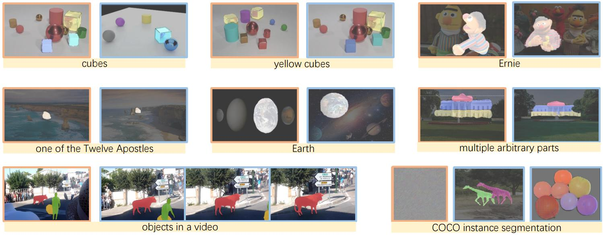

**图 5**：更多可视化结果。对于每个样本，左侧的橙色框显示示例/提示图像及其对应的掩码，而右侧的蓝色框显示输入图像和生成的掩码输出。掩码通过附着在图像上的明亮区域进行可视化。SegGPT 可以执行任意对象/部件分割（立方体、黄色立方体、厄尼、十二使徒之一、地球、多个任意部件），无需在训练中使用视频的视频对象分割，以及通过可学习的提示调整在 COCO 上进行封闭集实例分割。

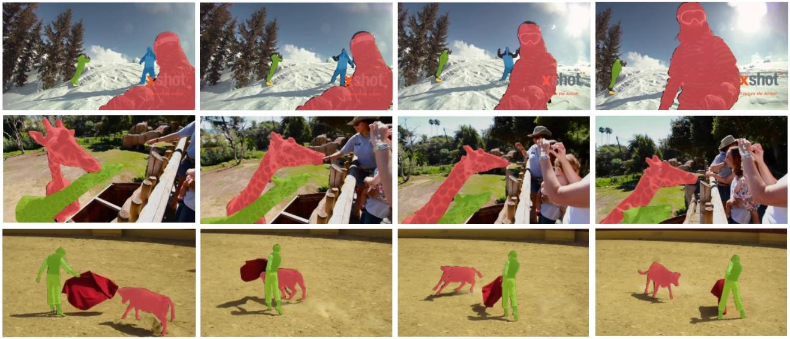

**图 6**：YouTube-VOS 2018 上视频对象分割的定性结果。

为了以直观的方式展示我们 SegGPT 的能力，我们可视化了选定图像在专门的任务提示下的任务输出，如图 1 和图 5 所示。这两张图包含了广泛的分割任务，例如具有不同粒度的任意部件/对象分割、文本分割、无需在训练中使用视频的视频对象分割，以及通过可学习的提示调整进行的封闭集实例/语义分割。图 6 展示了更多关于 YouTube-VOS 2018 数据集的视频对象分割的可视化结果。从这些可视化结果来看，SegGPT 展示了在广泛的任务范围内做出高度准确预测的能力，同时在任务定义上保持了极高的灵活性。

### 4.4. Comparison with Specialist Methods

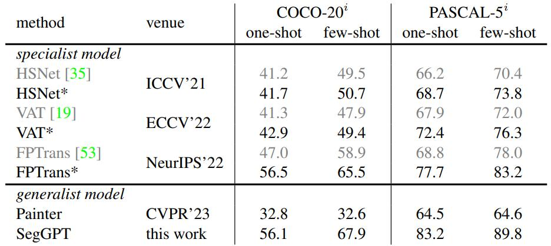

**表 1**：基于示例的语义分割在 COCO-20i 和 PASCAL-5i 上的定量结果。* 表示训练中的类别覆盖了测试中的类别。

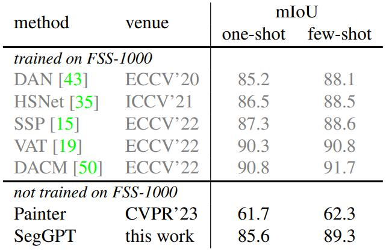

**表 2**： FSS-1000 上少量样本语义分割的定量结果。SegGPT 虽然没有在 FSS-1000 上进行训练，但仍取得了显著的成果。

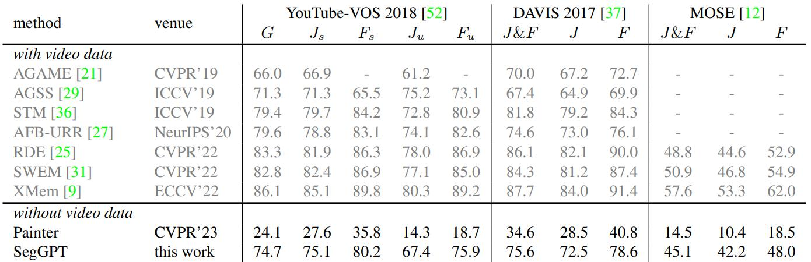

**表 3**：YouTube-VOS 2018、DAVIS 2017 和 MOSE 上的视频对象分割的定量结果。值得注意的是，Painter 和 SegGPT 在训练中没有使用任何视频数据。G 是 YouTube-VOS 2018 中“见过”和“未见过”类别的平均分数。

**少量样本语义分割。** 我们在两种少量样本语义分割设置下评估 SegGPT 的性能：领域内 COCO-20i / PASCAL-5i，以及领域外 FSS-1000。表 1 显示了 COCO20i / PASCAL-5i 上基于示例的语义分割结果。为了公平比较，我们还评估了在标有 * 的领域内类别上的专家模型。我们的结果表明，在这两个基准上，SegGPT 可以实现与最近发布的最新专家模型相当或明显更好的性能。请注意，现有技术 FPTrans 使用不同的样本数训练单独的模型。此外，SegGPT 以相当大的优势超越了通用模型 Painter [46]。

表 2 显示了在具有领域外类别的 FSS-1000 上的少量样本语义分割结果。与在 FSS-1000 上训练的专家模型相比，SegGPT 表现出极具竞争力的性能。值得注意的是，我们的模型根本没有在 FSS-1000 数据集上进行训练，但仍然取得了显著的成果，这证明了其有效性。

**视频对象分割。** 视频对象分割 (VOS) 是一项在视频帧中分割特定对象的任务。在这项工作中，我们专注于半监督视频对象分割设置，并在三个数据集的验证集上评估我们提出的方法 SegGPT：YouTube-VOS 2018 [52]、DAVIS 2017 [37] 和最近发布的具有挑战性的基准 MOSE [12]。我们使用视频对象分割中常用的两个指标进行评估：J 分数和 F 分数，我们使用官方评估服务器或工具评估我们的结果。

SegGPT 通过将第一帧及其对象掩码转换为上下文着色示例来执行视频对象分割。在测试当前帧时，我们使用其之前的 K 帧（如果有）来构建多个示例。这些帧的对象掩码已通过 FIFO 队列预测和存储。构建多个示例后，应用特征集成（在第 3.2 节中描述），预测结果将存储以供下一帧使用。我们在几个基准上评估了我们的模型，结果如表 3 所示。尽管我们的方法并非专门为此任务而训练，但它在这些数据集上取得了与专家模型相当的竞争性结果。例如，在 YouTube-VOS 2018 [52] 上，我们的方法以明显的优势超越了特定任务的方法 AGAME [21] 和 AGSS [29]。在专注于复杂场景的具有挑战性的 MOSE 基准上，SegGPT 甚至与最先进的方法 RDE 表现相当。

### 4.5. Ablation Study

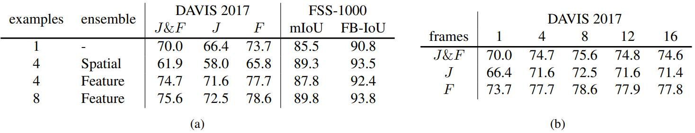

**表 4**：上下文推理中集成策略 (a) 和帧数 (b) 的消融研究。空间集成方法在 FSS-1000 数据集上表现良好，但在 DAVIS 2017 上性能有所下降。由于没有子采样，特征集成取得了更好的结果。

在这里，我们对两种上下文集成策略进行了消融实验，即空间集成和特征集成。结果如表 4a 所示。我们的研究结果表明，空间集成方法在 FSS-1000 数据集上表现良好，但在 DAVIS 2017 上性能有所下降。我们将此归因于空间集成对示例进行了子采样的事实。值得注意的是，与高分辨率的 DAVIS 数据集 (640×480) 相比，FSS-1000 数据集的图像分辨率较低 (224×224)，因此，子采样不会导致 FSS-1000 的显著信息损失。然而，我们观察到特征集成可以减少子采样带来的信息损失，并在 DAVIS 2017 上实现明显更好的性能。

我们还在 DAVIS 2017 上进行了不同帧数的消融实验，结果如表 4b 所示。随着帧数的增加，性能最初会提高，然后达到一个收益递减的点。特别是，我们观察到当使用 8 帧时，性能达到最佳。

### 4.6. In-Context Tuning

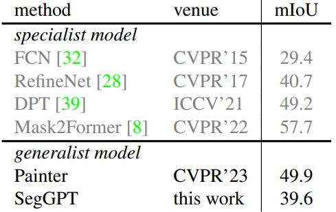

**表 5**：ADE20K 语义分割的结果。

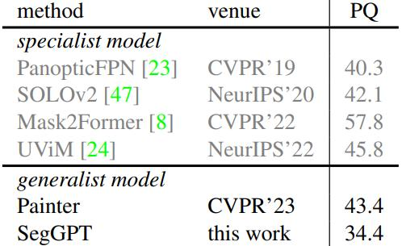

**表 6**：COCO 全景分割的结果。

上下文调优能够使用一组数据样本定制独特的应用。例如，为特定的数据集、场景甚至个人调整提示。具体来说，我们将任务提示定义为可学习的张量，冻结整个模型，然后使用相同的训练损失来优化任务提示。在这里，我们对具有挑战性的 ADE20K 语义分割和 COCO 全景分割进行了上下文调优。我们在相应的基准上评估了带有可学习提示的 SegGPT。

ADE20K 语义分割的结果如表 5 所示。我们的模型 SegGPT 取得了与 RefineNet 等专家模型相当的性能。然而，与通用模型 Painter 相比，我们的方法在 mIoU 上下降了 10.3 个百分点。这种现象可以通过引入随机颜色方案来解释，这使得模型更难将颜色用作领域内任务的简单指标。相反，模型需要依赖上下文示例来确定任务，这使得优化更加困难。类似地，表 6 显示了我们的 SegGPT 模型在 COCO 全景分割上的结果。在这里，我们再次观察到与通用模型 Painter 相比，PQ 下降了 9.0 个百分点。在特定基准上超越所有专家方法并非这项工作的目的，我们相信未来还有很大的改进空间。

## 5. Discussion and Conclusion

在这项工作中，我们提出了一个通用的分割模型，展示了如何设计合适的训练策略，以充分利用上下文视觉学习的灵活性。我们的模型在处理领域内和领域外的分割任务方面表现出强大的能力，包括对象实例、物体、部件、轮廓、文本分割等。

这项工作并非没有缺点。虽然我们的工作引入了一种新的随机着色机制，以提高上下文训练的泛化能力，但这使得训练任务本质上更加困难，这可能是我们在具有充足训练数据的领域内任务（例如 ADE20K 上的语义分割和 COCO 上的全景分割）中表现较差的原因。

展望未来，我们相信我们的方法有潜力成为一个强大的工具，通过利用上下文推理在任务定义上的灵活性，来实现图像/视频分割中更多样化的应用。扩大模型尺寸是我们计划追求以进一步提高性能的一个途径。使用更大的模型，可以捕获数据中更复杂的模式，这可能会带来更好的分割结果。然而，这带来了寻找更多数据的挑战。一种潜在的解决方案是探索自监督学习技术。我们希望我们的工作能够激励社区继续探索上下文学习在计算机视觉中的潜力。我们仍然乐观地认为，视觉领域中最好的“GPT-3 时刻”尚未到来。

## Appendix

### A. Additional Implementation Details

**训练**。我们在训练过程中使用了各种分割数据集。每个数据集的采样权重为：0.22（COCO 实例），0.15（ADE20K 语义），0.15（COCO 全景语义），0.07（Cityscapes 语义），0.07（COCO stuff 语义），0.07（LIP 人物语义），0.07（PASCAL VOC 语义），0.07（PACO 语义），0.06（iSAID 和 loveDA 航空语义），以及 0.06（CHASE DB、DRIVE、HRF 和 STARE 视网膜血管）。对于语义分割数据，我们使用 0.5 的概率将输入图像的变换作为上下文示例，然后进行随机颜色选择。对于实例分割数据，概率为 1.0，即我们总是使用同一图像的两个变换视图作为上下文对。几乎所有的分割子任务都可以分为两类，即分割一个类别或一个实例（不限于对象）。为了避免类别和实例之间的歧义，我们初始化了两个可学习的嵌入，它们分别与类别级和实例级着色任务相关联。

**评估**。对于现有基准上的定量评估，示例来自支持样本、训练集、视频的第一帧或学习到的提示。以 ADE20K 语义分割为例。给定一个经过调整的提示，我们直接将该提示与每个测试图像拼接在一起以获得预测结果。如果没有经过调整的提示，对于每个类别，我们从包含该类别的训练集中随机抽取几张图像。这些示例通过上下文集成一起使用，以获得所有测试图像中该类别的预测。

### B. Additional Results

