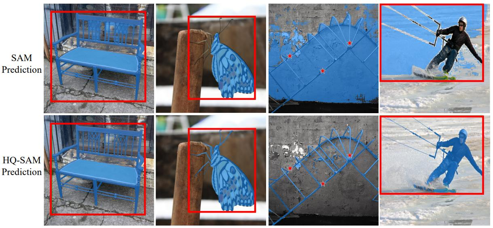
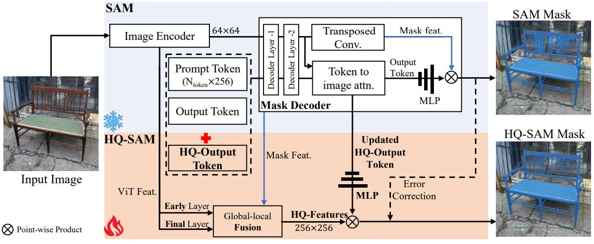

# [Segment Anything in High Quality](https://arxiv.org/abs/2306.01567)

## Abstract

最近的 Segment Anything Model（SAM）在扩展分割模型方面取得了重大突破，实现了强大的零样本能力和灵活的提示设计。尽管SAM是在 11 亿个掩码上进行训练的，但在许多情况下其掩码预测质量仍存在不足，尤其在处理具有复杂结构的物体时表现不佳。我们提出了 HQ-SAM，赋予 SAM 精确分割任意物体的能力，同时保持其原始的可提示设计、高效性和零样本泛化能力。我们的精心设计复用了 SAM 的预训练模型权重，仅引入极少量的额外参数和计算开销。我们设计了一个可学习的高精度输出标记（High-Quality Output Token），将其注入 SAM 的掩码解码器中，负责预测高质量掩码。与仅在解码器特征上应用不同，我们首先将这些特征与早期和最终的ViT特征进行融合，以提升掩码细节质量。为了训练新引入的可学习参数，我们从多个来源构建了一个包含44,000个精细标注掩码的数据集。HQ-SAM仅需在该44k掩码数据集上训练4小时（使用8块GPU）。我们在涵盖不同下游任务的10个多样化分割数据集上验证了HQ-SAM的有效性，其中8个数据集采用零样本迁移评估协议。我们的代码和预训练模型已开源：https://github.com/SysCV/SAM-HQ。

## 1 Introduction

对多样化物体的准确分割是广泛场景理解应用的基础，包括图像/视频编辑、机器人感知和 AR/VR 等领域。通过使用包含数十亿级掩码标签进行训练，Segment Anything Model（SAM）[21] 最近被发布为通用图像分割的基础视觉模型。SAM 能够通过接收由点、边界框或粗糙掩码组成的提示输入，在多样化场景中分割广泛的物体、部件和视觉结构。其零样本分割能力引发了快速的范式转变，因为它可以通过简单的提示被迁移至众多应用场景。

尽管 SAM 取得了显著性能，其分割结果在许多情况下仍不尽如人意。具体而言，SAM 存在两个关键问题：1）粗糙的掩码边界，甚至忽略对细长物体结构的分割（如图 1 所示）；2）在复杂场景中出现错误预测、掩码断裂或较大误差。这通常与 SAM 对细小结构的误判有关，例如图 1 最右侧列中的风筝线。此类失败案例严重限制了基础分割模型（如SAM）的适用性和有效性，尤其在需要高度精确图像掩码的自动化标注和图像/视频编辑任务中。

我们提出 HQ-SAM，其能够在不牺牲原始 SAM 的强大零样本能力和灵活性的前提下，预测出高精度分割掩码，即使在极具挑战性的情况下（如图 1 所示）。为保持效率和零样本性能，我们仅对 SAM 进行极小的适配，新增参数占比不足 0.5%，从而扩展其高精度分割能力。

**图 1**：

直接微调 SAM 解码器或引入新解码器模块会导致通用零样本分割性能显著下降。因此，我们提出了 HQ-SAM 架构，通过紧密集成并复用现有 SAM 结构，完整保留零样本性能。首先，我们设计了一个可学习的高精度输出标记（HQ-Output Token），将其与原始提示和输出标记共同输入 SAM 的掩码解码器。与原始输出标记不同，我们的 HQ-Output Token 及其关联的 MLP 层被训练以预测高质量分割掩码。其次，我们不仅复用 SAM 的解码器特征，还通过融合 ViT 编码器的早期和后期特征图，构建了优化的特征集，从而实现精准掩码细节。在训练过程中，我们冻结整个预训练的 SAM 参数，仅更新 HQ-Output Token、其关联的三层 MLP 以及一个小规模的特征融合模块。要学习精确分割，需要包含复杂精细几何结构物体的高精度掩码标注数据集。SAM 基于 SA-1B 数据集进行训练，该数据集包含1100 万张图像和由类似 SAM 模型自动生成的 11 亿个掩码。然而，该大规模数据集的使用成本高昂，且未能达到我们工作中追求的高精度掩码生成目标，如图 1 所示SAM的性能验证。因此，我们构建了一个名为 HQSeg-44K 的新数据集，包含 44,000 个极其精细的图像掩码标注。HQSeg-44K 通过合并六个现有图像数据集[35,29,26,38,8,46] 的高精度掩码标签构建而成，覆盖超过 1,000 种多样化语义类别。得益于较小规模的数据集和我们极简的集成架构，HQ-SAM 仅需在 8 块 RTX 3090 GPU 上训练4小时即可完成。

为验证 HQ-SAM 的有效性，我们进行了全面的定量和定性实验分析。我们在图 2 中提供了 SAM 变体[21,52]的性能-速度-模型规模综合对比。我们还在涵盖不同下游任务的 10 个多样化分割数据集上对比了 HQ-SAM 与 SAM 的性能，其中 8 个数据集采用零样本迁移评估协议，包括 COCO[31]、UVO[42]、SGinW[58]、LVIS[14]、HQ-YTVIS[20]、BIG[6]、COIFT[29]和HR-SOD[51]。这一严格评估表明，提出的 HQ-SAM 在保持零样本能力的同时，能够生成比 SAM 更高质量的掩码。

**图 3**：

