# [Rethinking Atrous Convolution for Semantic Image Segmentation](https://arxiv.org/pdf/1706.05587.pdf)

## Abstract

在这项工作中，我们重新审视了在语义分割中应用中的空洞卷积，它一种强大的工具，可以显式地调整滤波器的感受野和控制由深度卷积神经网络计算的特征表示的分辨率。为了解决多尺度的分割对象的问题 (同一张图上有多种尺度的分割对象)，我们设计了一种以串行或并行方式采用空洞卷积的模块，通过使用多种空洞率来捕获多尺度的上下文。此外，我们提出用编码全局上下文的图像级的特征来增强我们之前提出的空洞金字塔汇聚模块，它在多个尺度上探测卷积特征，并进一步提升性能。我们还详细阐述了实现细节，并分享了训练我们系统的经验。所提出的 "DeepLabv3" 系统在没有 DenseCRF 后处理的情况下，明显地超过了我们之前的 DeepLab 版本，并在 PASCAL VOC 2012 语义图像分割基准上取得了与其他最先进水平的模型可比较的性能。

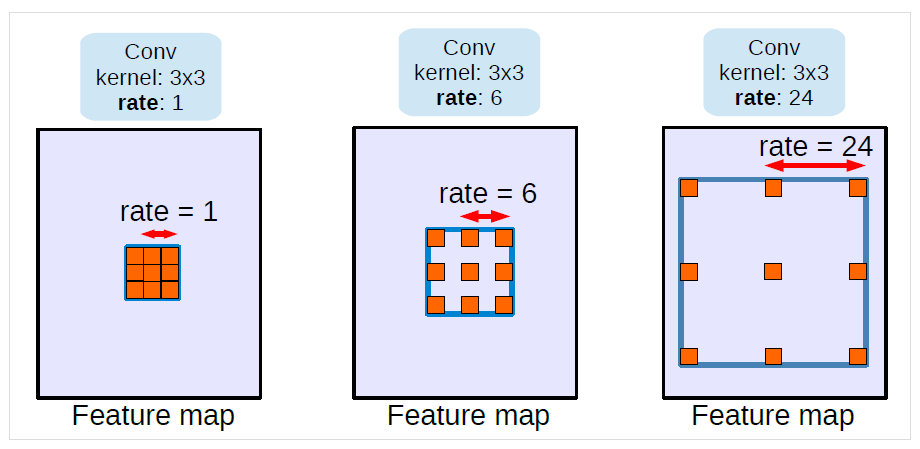

**图 1：** 内核大小为 $3 \times 3$ 和不同空洞率的空洞卷积。标准卷积对应于空洞率 $rate = 1$ 的空洞卷积。采用大的空洞率扩大了模型的感受野，使能在多个尺度的物体编码。

## 1. Introduction

对于语义分割任务，我们考虑在应用深度卷积神经网络 (DCNNs) 中的两个挑战。第一个是由连续的汇聚操作或卷积 striding 所导致的特征分辨率降低，汇聚和==卷积 striding (步长大于 1 的卷积)== 使得 DCNNs 能够学习越来越抽象的特征表示。然而，这种对于局部图像变换的不变性可能会阻碍密集预测任务，其需要详细的空间信息。为了解决这个问题，我们提倡使用空洞卷积，它已经被证明对语义图像分割是有效的。空洞卷积，也被称为扩张卷积，允许我们重新利用在 ImageNet 上预训练的网络提取更密集的特征映射，通过从最后几层中移除下采样操作，并上采样相应的滤波器核，相当于在滤波器权重直接插入孔 (法语：'trous')。通过空洞卷积，可以控制在 DCNNs 中计算的特征响应的分辨率，而不需要学习额外的参数。

另外一个困难来自于多尺度物体的存在。一些方法已经被提出来处理这个问题，在本文中我们主要考虑四类，如图 2 所示。首先，将 DCNN 应用于一个图像金字塔来提取每个尺度的输入的特征，不同尺度的物体在不同尺度的特征映射上变得明显。第二，编码器—解码器结构利用编码器部分的多尺度特征，并从解码器部分恢复空间分辨率。第三，额外的模块级联在原始网络上，用于捕获长距离的信息。特别地，使用 DenseCRF 对图像级两两相似性进行编码，同时级联地 develop 一些额外的卷积层以逐渐捕获远距离的上下文。第四，用带多种 rates 和多种感受野的滤波器或汇聚操作的空间金字塔汇聚探测到来的特征映射，从而捕获多个尺度的物体。

在本项工作中，我们重新审视了在级联模块和空间金字塔汇聚框架中应用空洞卷积，它允许我们有效地扩大滤波器的感受野，以合并多尺度的上下文。特别地，我们提出的模块由具有不同空洞率的空洞卷积和批量规范化层组成，我们发现 BN 对于训练也重要。我们尝试以级联或并行 (特别是空洞空间金字塔汇聚 (ASPP) 方法) 的方式布置模块 。我们讨论了在应用 $3 \times 3$ 空洞卷积时遇到的一个重要的实际问题，该卷积由于图像边界效应而不能捕获远距离信息，实际上简单地退化成 $1 \times 1$ 的卷积，并提出将图像级特征纳入到 ASPP 模块中。此外，我们详细阐述了实现细节，并分享了训练所提出模型的经验，包括一个简单但有效的 bootstrapping 方法，用于处理罕见的、精细标注的物体。最后，我们提出的模型 "DeepLabv3" 超过了我们之前的工作，在没有 DenseCRF 后处理的情况下，在 PASCAL VOC 2012 测试集上获得了 85.7% 的性能。

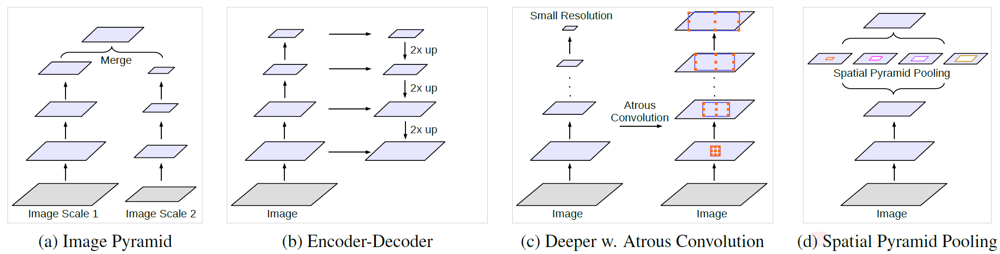

**图 2：** 捕获多尺度的上下文的替代架构。

## 2. Related Work

已有研究表明全局特征或者上下文的交互对于语义分割正确地分类像素是有益的。在本工作中，我们讨论四类全卷积网络 (FCNs) (见图 2 以说明)，它们利用上下文信息进行语义分割。

**图像金字塔：** 同样的模型，通常具有共享的权重，被应用于多尺度的输入。来自小尺度的输入的特征响应编码远距离的上下文，而大尺度的输入保留了小物体的细节。典型的例子包括 Farabet 等人的 [22]，它们通过一个拉普拉斯金字塔对图像进行变换，将每个尺度的输入喂给 DCNN，并合并来自所有尺度的特征映射。[19, 69] 从粗到细依次应用多尺度的输入，而 [55, 12, 11] 直接将输入 resize 到多个尺度并融合来自所有尺度的特征。这种类型的模型的主要缺点是，由于 GPU 内存有限，它不能很好地扩展到更大/更深的 DCNNs (例如像 [32, 91, 86] 这些模型)，因此它通常被应用在推理阶段。

**编码器—解码器：** 这种模型由两部分组成：(a) 编码器，特征映射的空间维度在逐渐减小，因此更远距离的信息在更深的编码器输出中更容易被捕获，(b) 解码器，物体的细节和空间维度在逐渐恢复。例如，[60, 64] 使用转置卷积学习低分辨率特征的上采样。SegNet 重用来自编码器的汇聚索引，并学习额外的卷积层来使特征响应变密集，而 U-Net 从编码器特征添加跳跃连接到相应的解码器激活，[25] 使用一个拉普拉斯金字塔来重建网络。最近，RefineNet 和 [70, 68, 39] 已经在一些语义分割基准上证明了基于编码器—解码器结构的模型的有效性。这种类型的模型也被用于目标检测。

**上下文模块：** 这种模型包含额外的以级联方式布置的模块来编码长距离的上下文。一种有效的方法是将 DenseCRF (带有高效的高维滤波算法) 与 DCNNs 结合。此外，[96, 55, 73] 提出联合地训练 CRF 和 DCNN 组件，而 [59, 90] 在 DCNNs 的 ==belief maps (即 DCNN 最后的特征映射，包含与预测类别数量相等的通道数)== 上使用一些额外的卷积层来捕获上下文信息。最近 [41] 提出学习一种通用的和稀疏的高维的卷积 (bilateral convolution)，[82, 8] 结合高斯条件随机场和 DCNNs 进行语义分割。

**空间金字塔汇聚：** 这种模型使用空间金字塔汇聚来捕获多个距离的上下文。ParseNet 利用图像级特征来获取全局上下文信息。DeepLabv2 [11] 提出空洞空间金字塔汇聚 (ASPP)，采用不同空洞率的、并行的空洞卷积来捕获多尺度的上下文。最近，金字塔场景解析网络 (PSP) 在多个网格尺度上执行空间汇聚，并在多个语义分割基准上展现出优秀的性能。还有其他基于 LSTM 聚合全局上下文的方法 [53, 6, 88]。空间金字塔汇聚也被用于目标检测。

在本工作中，我们主要探索将空洞卷积作为空间金字塔汇聚的一个上下文模块和工具。我们提出的框架在意义上来说是通用，它可以应用于任何网络。具体而言，我们复制了原始 ResNet 的最后一个块的几个副本，并以级联的方式排列它们，并重新审视了包含几个并行的空洞卷积的 ASPP 模块。请注意我们的级联模块直接应用于特征映射上，而不是 belief maps。对于提出的模块，我们在实验中发现使用批量规范化一起训练是重要的。为了进一步捕获全局特征，我们提出使用图像级特征来增强 ASPP，类似于 [58, 95]。

**空洞卷积：** 基于空洞卷积的模型已经在语义分割上得到积极地探索。例如，[85] 通过实验修改空洞率来捕获长距离信息，[84] 在 ResNet 的最后两个块中使用混合的空洞率，而 [18] 进一步提出学习变形卷积，用学习到的偏移量采样输入特征，推广了空洞卷积。为了进一步提升分割模型的准确性，[83] 利用了图像描述，[40] 利用了视频运动，[44] 加入了深度信息。此外，空洞卷积被 [66, 17, 37] 应用于目标检测。

## 3. Methods

在本节中，我们回顾如何应用空洞卷积来为语义分割提取密集的特征。然后我们讨论所提出的模块，它以级联或并行方式使用空洞卷积。

### 3.1. Atrous Convolution for Dense Feature Extraction

以全卷积 (即整个网络都是卷积、汇聚等) 的方式部署的深度卷积神经网络 (DCNNs) 已经被证明对语义分割任务是有效的。然而，在这些==网络的连续层中重复组合最大汇聚和 striding，会严重地降低所得到特征映射的空间分辨率==，在最近的 DCNNs [47, 78,32] 中，每个方向的分辨率通常为 32 倍。去卷积层 (或转置卷积) 已经被用于恢复空间分辨率。相反，我们主张使用空洞卷积，最初是为了在 [36] "算法 a trous" 方案中高效计算无抽样小波变换而开发的，且之前被 [26, 74, 66] 在 DCNN 的上下文中用过。

考虑二维信号，对于输出 $\boldsymbol{y}$ 每个位置 $i$ 和一个滤波器 $\boldsymbol{w}$，对输入特征映射 $\boldsymbol{x}$ 应用空洞卷积：

$$
\large \boldsymbol{y}[i] = \sum_k \boldsymbol{x}[i + r \cdot k] \boldsymbol{w}[k] \tag{1}
$$

其中空洞率 $r$ 对应于我们对输入信息进行采样的步长，这相当于将输入 $x$ 与上采样滤波器进行卷积，该滤波器通过在每个空间维度上两个连续的滤波器值之间插入 $r - 1$ 个 0 而产生 (因此得名空洞卷积，在法语中 trous 等同于英语中的 holes)。标准卷积是 $r = 1$ 时的一个特例，空洞卷积允许我们通过改变空洞率的值来自适应地修改感受野。如图 1 所示。

空洞卷积还允许我们显式地控制在全卷积网络中计算的特征响应的密集程度。这里，我们用 $output\_stride$ 表示输入图像的空间分辨率与最终输出的空分辨率的比值。对于部署用于图像分类的 DCNNs，最终的特征响应 (全连接层或全局汇聚之前) 比输入图像小 32 倍，因此 $output\_stride = 32$。如果想将 DCNNs 中计算的特征响应的空间密度翻倍 (即 $output\_stride = 16$)，则将最后一个降低分辨率的汇聚层或卷积层的步长 (stride) 设为 1，以避免信号降采样。然后，将所有后续的卷积层替换为空洞率 $r = 2$ 的空洞卷积层。这使得我们能够在不需要学习任何额外参数的情况下提取更密集的特征响应。详情请参考 [11]。

### 3.2. Going Deeper with Atrous Convolution

我们首先探索设计了以级联方式布置空洞卷积的模块。具体来说，我们复制了最后一个 ResNet 块 (图 3 中的 block4) 的几个副本，并以级联的方式排列它们。在这些块中有 $3 \times 3$ 的卷积，并且除了最后一个块，其他块中最后一个卷积的步长为 2，类似于原始的 ResNet。这个模型背后的动机是引入 striding 使得更容易在更深的网络中捕获远距离信息。例如，整个图像的特征可以被总结在最后一个小分辨率的特征映射中，如图 3 (a) 所示。然而，我们发现==连续的 striding 对语义分割是有害的 (见第 4 节中的表 1)，因为细节信息被严重破坏==，因此我们应用由 期望的 $output\_stride$ 值决定空洞率的空洞卷积，如图 3 (b) 所示，其中 $output\_stride = 16$。

在所提出的模型中，我们实验了级联到 block7 的 ResNet (即额外的 block5，block6，block7 作为 block4 的副本)，如果不应用空洞卷积，那么 $output\_stride = 256$。

#### 3.2.1 Multi-grid Method

受到使用一种不同大小网格的层级结构的多网格方法和随后的 [84, 18] 所激励，我们在所提出的模型中的 block4 到 block7 中采用不同空洞率。特别地，我们==将 $Multi\_Grid = (r_1, r_2, r_3)$ 定义为 block4 到 block7 内的三个卷积层 (每个 block 各有 3 个 conv) 的 unit rates。卷积层的最终空洞率等于 unit rate 和相应的空洞率 rate 的乘积==。例如，当 $output\_stride = 16$ 和 $Multi\_Grid = (1, 2, 4)$，block4 中三个卷积的空洞率分别是 $rate = 2 \cdot (1, 2, 4) = (2, 4,8)$。

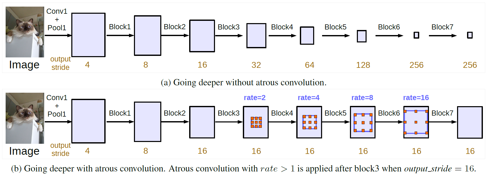

**图 3：** 不使用和使用空洞卷积的级联模块

### 3.3. Atrous Spatial Pyramid Pooling

我们重新审视了 [11] 中提出的空洞空间金字塔汇聚，其中四个并行的具有不同空洞率的空洞卷积被应用于特征映射上。ASPP 的灵感来自于空间金字塔汇聚的成功 [28,49,31]，该方法表明==在不同尺度上重新采样特征对于准确地和高效地分类任意尺度的区域是有效的==。不同于 [11]，我们在 ASPP 中包含了批量规范化 (BN)。

具有不同空洞率的 ASPP 有效地捕获了多尺度的信息。然而，我们发现随着采样率变得更大，有效的滤波器的权重 (应用于有效的特征区域上的而不是零填充上的权重) 的数量变得更少。当将具有不同空洞率的 $3 \times 3$ 的滤波器应用于 $65 \times 65$ 的特征映射时，这种效果如图 4 所示。在空洞率的值接近特征映射大小的极端情况下，$3 \times 3$ 的滤波器退化为一个简单的 $1 \times 1$ 的滤波器，而不是捕获整个图像的上下文，因为只有中心的滤波器权重是有效的。

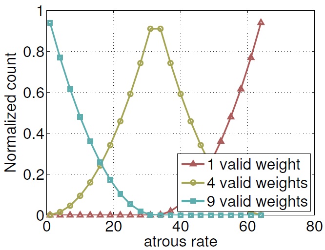

**图 4：** 随着空洞率 r 变化，在 $65 \times 65$ 的特征映射上的一个 $3 \times 3$ 的滤波器的有效权重的归一化后的计数。当空洞率较小时，所有 9 个滤波器的权重被应用于特征映射上的大部分的有效区域，而当空洞率变得更大时，$3 \times 3$ 的滤波器退化为一个 $1 \times 1$ 的滤波器，因为只有中心的权重是有效的。

为了解决这个问题并将全局上下文信息并入到模型，我们采用了类似于 [58, 95] 的 ==图像级特征== 。具体而言，我们对 ==模型的最后一个特征映射应用全局平均汇聚，将得到的图像级特征喂给一个 256 个滤波器的 $1 \times 1$ 的卷积 (和批量规范化)，然后双线性上采样到所希望的空间维度== 。最后，我们改进的 ASPP 由 (a) 一个 $1 \times 1$ 的卷积和 三个 $3 \times 3$ 的当 $output\_stride = 16$ 时空洞率为 $rates = (6,12,18)$ 的卷积 (全部都有 256 个滤波器和批量规范化)，和 (b) 图像级特征组成，如图 5 所示。请注意当 $output\_stride = 8$ 时空洞率加倍。然后，在生成最终的 logits 的最终 $1 \times 1$ 的卷积之前，将所有分支的结果被拼接起来，并传递给另外一个 $1 \times 1$ 的卷积 (也有 256 个滤波器和批量规范化)。

**ps：** logits 的意思是原生神经网络的最后一层的输出，在分类网络中即最后一个全连接层的输出，这里应该是最后每个像素的每个类别的输出，应用 $\rm argmax$ 后即可获得像素的类别。

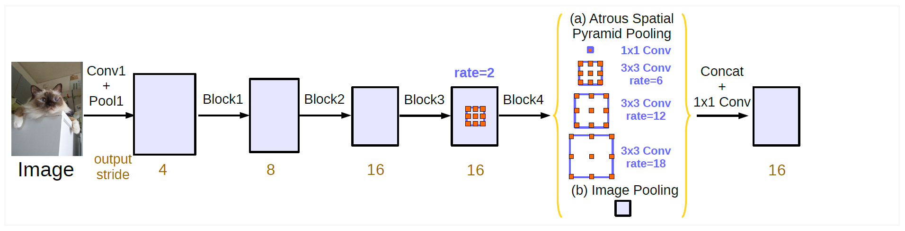

**图 5：** 带有空洞卷积的并行模块 (ASPP)，用图像级特征增强。

## 4. Experimental Evaluation

我们通过使用空洞卷积来提取密集特征来将在 ImageNet 上预训练的 ResNet 应用于语义分割。回想一下，$output\_stride$ 定义为输入图像的空间分辨率与输出分辨率的比值。例如，当 $output\_stride = 8$ 时，在原始 ResNet 中的最后两个块 (在我们的表示法中是 block3 和 block4) 分别包含 $rate = 2$ 和 $rate = 4$ 的空洞卷积。我们的实现是级建立在 TensorFlow 之上的。

我们在 PASCAL VOC 2012 语义分割基准上评估了所提出的模型，该基准包含 20 类前景物体和 1 类背景。原始的数据集包含 1,464 (train)，1,449 (val) 和 1,456 (test) 张像素级标注图像分别用于训练、验证和测试。该数据集通过 [29] 提供的额外标注进行了增强，从而得到了 10,582 张 (训练增强) 训练图像。性能是根据 21 个类的平均像素交并比 (IOU) 来衡量的。

### 4.1. Training Protocol

在本节中，我们将讨论我们训练协议的细节。

**学习率策略：** 类似于 [58, 11]，我们使用 "poly" 学习率策略，将初始学习率乘上 $power = 0.9$ 的 $(1 - \frac{iter}{max_\_iter}^{power})$ 。

**裁剪大小：** 按照原来的训练协议 [10, 11]，在训练期间从图像上裁剪图像块。为了使具有大空洞率的空洞卷积有效，需要较大的裁剪大小；否则，具有较大的空洞率的滤波器权重大部分被应用于零填充的区域。因此我们在 PASCAL VOC 2012 数据集上训练和测试时都使用 513 的裁剪大小。

**Batch normalization：** 我们在 ResNet 上添加的模块都包含批量规范化参数，我们发现训练这些参数也很重要。由于训练批量规范化参数需要较大的批量大小，我们使用 $output\_stride = 16$，并计算批量大小为 16 的批量规范化的统计信息 (mean 和 std？)。批量规范化参数用 $\rm decay = 0.997$ 进行训练。以初始学习率 $\rm lr = 0.007$ 在训练集上训练 30K 个迭代后，我们冻结批量规范化的参数，使用 $output\_stride = 8$ 和更小的基础学习率 $\rm lr = 0.001$ 在训练集上训练另外 30K 个迭代。请注意空洞卷积允许我们在不同的训练阶段控制 $output\_stride$ 而不需要学习额外的模型参数。还要注意的是 $output\_stride = 16$ 的训练比 $output\_stride = 8$ 的训练快几倍，因为中间的特征映射在空间上小四倍，但是以牺牲准确性为代价，因为 $output\_stride = 16$ 提供更粗糙的特征映射。

**上采样 logits：** 在我们之前的工作 [10, 11] 中，当 $output\_stride = 8$ 时目标真实值在训练期间被 8 倍下采样。我们发现保持真实值的完整性很重要，并替换成上采样最终的 logits，因为下采样真实值会移除精细的标注，导致没有细节的反向传播。

**数据增强：** 我们通过在训练期间随机缩放 (从 0.5 到 2.0 倍) 输入图像和随机左右翻转来应用数据增强。

### 4.2. Going Deeper with Atrous Convolution

我们首先实验了用级联的空洞卷积构建更多的块。

**ResNet-50：** 在表 1 中，我们实验了使用有 block7 (即额外 block5，block6 和 block7) 的 ResNet-50 时 $output\_stride$ 的影响。如表中所示，在 $output\_stride = 256$ (即完全没有空洞卷积) 的情况下，由于严重的信号降采样，性能要比其他的差很多。当 $output\_stride$ 变大并相应地应用空洞卷积时，性能从 20.29% 提升到 75.18%，表明空洞卷积在级联地构建更多的块进行语义分割时是必不可少的。

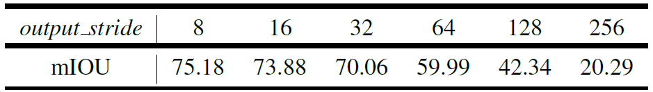

**表 1：** 当采用带有 block7 和不同 $output\_stride$ 的 ResNet-50 时，使用空洞卷积进一步深入探索。采用 $output\_stride = 8$ 可以得到更好的性能，但代价是更多的内存开销。

**ResNet-50 vs. ResNet-101：** 我们用更深的网络 ResNet-101 替换 ResNet-50，并改变级联块的数量。如表 2 所示，性能随着更多的块的加入而提升，但提升的幅度变得更小。值得注意的是，对 ResNet-50 使用 block7 轻微地降低了性能，但对于 ResNet-101 仍然有所提升。

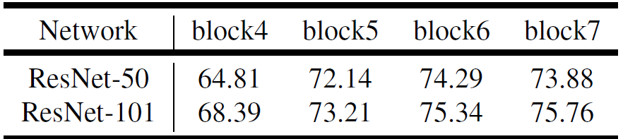

**表 2：** $output\_stride = 16$，使用具有不同数量的级联块的 ResNet-50 和 ResNet-101 时，使用空洞卷积进一步深入探索。网络结构 'block4'，'block5'，'block6' 和 'block7' 分别地添加额外的 0、1、2、3 个级联模块。采用更多的级联块通常可以提升性能。

**Multi-grid：** 在表 3 中，我们对有多个级联的添加的块的 ResNet-101 使用多网格方法。unit rates，$Multi\_Grid = (r_1, r_2, r_3)$，被应用于 block4 和其他所有的添加的块。如表所示，我们观察到 (a) 应用多网格方法的通常比普通版本 ( 其中 $(r_1, r_2, r_3) = (1,1,1)$ ) 更好，(b) 简单地将 unit rates 翻倍 ( 即 $(r_1, r_2, r_3) = (2,2,2)$ ) 是无效的，(c) 使用多网格在更深时提升性能。我们最好的模型是使用 block7 和 $(r_1, r_2, r_3) = (1, 2, 1)$ 。

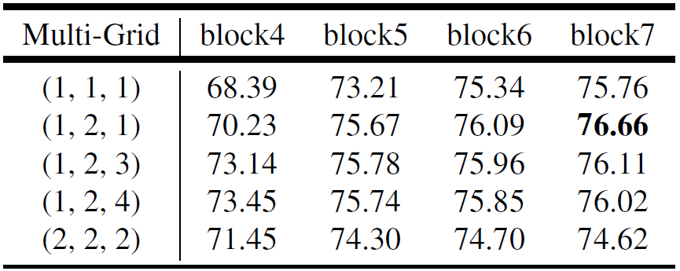

**表 3：** $output\_stride = 16$，对于具有不同数量的级联块的 ResNet-101 采用多网格方法。最好的模型性能以粗体显示。

**验证集上的推理策略：** 所提出的模型是用 $output\_stride = 16$ 训练的，然后在推理期间我们使用 $output\_stride = 8$ 来获得更精细的特征映射。如表 4 所示，有趣的是，当评估使用 $output\_stride = 8$ 的最佳级联模型时，性能比使用 $output\_stride = 16$ 的提高了 1.39%。通过对 scales = { 0.5,0.75,1.0,1.25,1.5,1.75 } 的多尺度输入和左右翻转的图像进行推理，进一步提高了性能。特别地，我们计算每个尺度和翻转图像的平均概率作为最终结果。

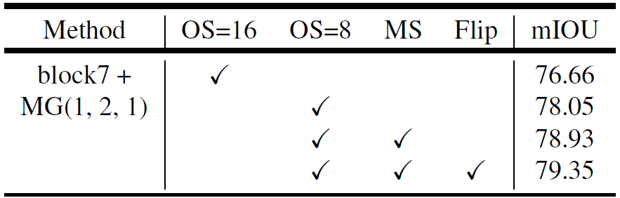

**表 4：** 验证集上的推理策略。**MG：** 多网格。**OS：** $output\_stride$ 。**MS：** 测试期间多尺度输入。**Flip：** 添加左右翻转的输入。

### 4.3. Atrous Spatial Pyramid Pooling

我们对空洞空间金字塔汇聚 (ASPP) 模块进行了实验，与 [11] 的主要区别是微调了批量规范化参数，并包含了图像级特征。

**ASPP：** 在表 5 中，我们实验了将 block4 中的多网格和图像级特征合并到改进的 ASPP 模块中的效果。我们首先固定 $ASPP = (6,12,8)$ (即对三个并行的 $3 \times 3$ 的卷积分支采用空洞率 $rates = (6,12,8)$)，并改变多网格的值。采用 $Multi\_Grid = (1,2,1)$ 比 $Multi\_Grid = (1,1,1)$ 更好，而在 $ASPP = (6,12,18)$ 的情况下，采用 $Multi\_Grid = (1,2,4)$ (查阅表 3 中的 'block4' 列) 可以得到进一步的提升。如果我们为远距离上下文额外采用另一个 $rate = 24$ 的并行分支，性能会略微下降 0.12%。另一方面，用图像级特征增强 ASPP 模块是有效的，最终性能达到 77.21%。

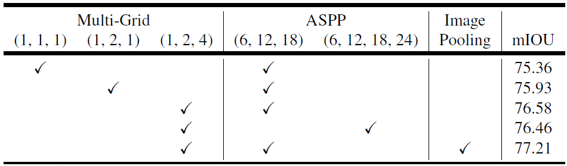

**表 5：** $output\_stride = 16$，带有多网格方法和图像级特征的空洞空间金字塔汇聚模块

**验证集上的推理策略：** 同样，一旦训练好模型，我们在推理过程中应用 $output\_stride = 8$。如表 6 所示，使用 $output\_stride = 8$ 比使用 $output\_stride = 16$ 带来 1.3% 的提升，采用多尺度输入和添加左右翻转的图像分别提升性能 0.94% 和 0.32%。使用 ASPP 的最佳模型的性能达到 79.77%，比使用级联空洞卷积模块的 (79.35%) 更好，因此被选择作为我们最终的模型，进行测试集的评估。

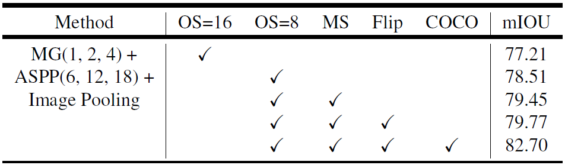

**表 6：** 验证集上的推理策略。**MG：** 多网格。**ASPP：** 空洞空间金字塔汇聚。**OS：** $output\_stride$ 。**MS：** 测试期间多尺度输入。**Flip：** 添加左右翻转的输入。**COCO：** 模型在 MS-COCO 上预训练。

**与 DeepLabv2 的比较：** 我们最好的级联模型 (表 4 中) 和 ASPP 模型 (表 6 中) (在都没有 DenseCRF 后处理或 MS-COCO 预训练的情况下) 已经在 PASCAL VOC 2012 验证集上超过了 DeepLabv2 ([11] 的表 4 中使用 DenseCRF 和 MS-COCO 预训练得到的 77.69%)。改进主要来于在自所提出的模型中包含并微调了批量规范化参数，并有了更好的方法编码多尺度上下文。

**附录：** 我们在附录中展示了更多的结果，例如，超参数的影响和 Cityscapes 的结果。

**定性结果：** 我们在图 6 中提供了我们最好的 ASPP 模型的定性可视化结果。如图 6 所示，我们的模型在没有任何 DenseCRF 后处理的情况下，能够很好地分割物体。

**失败模式：** 如图 6 最下面一排所示，我们的模型在分割 (a) 沙发和椅子，(b) 餐桌和椅子，(c) 罕见的物体时存在困难。

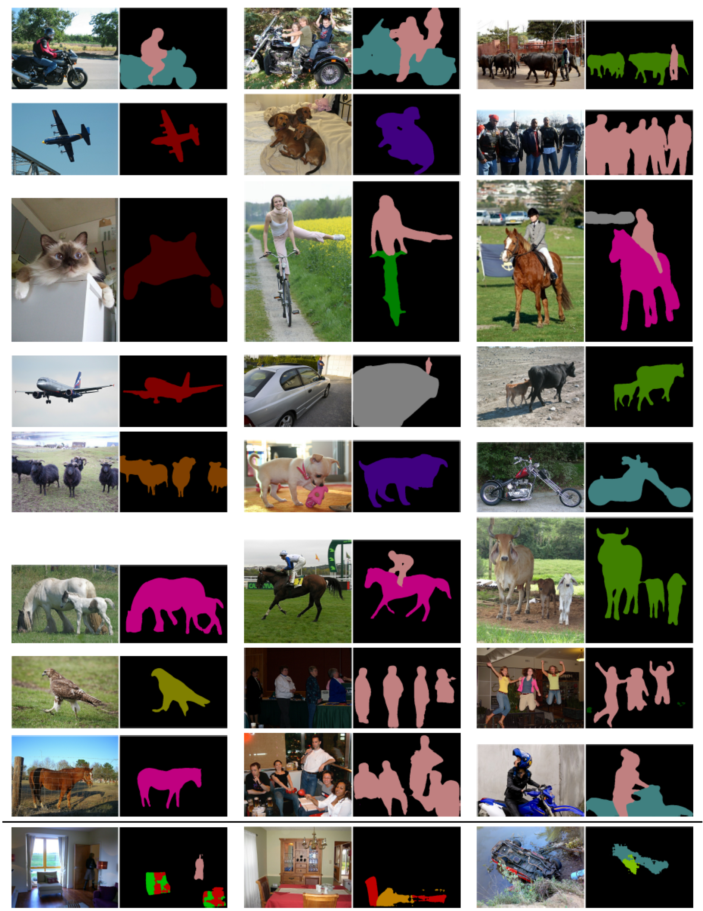

**图 6：** 使用我们最好的 ASPP 时的在验证集上的可视化结果。最后一行展示了一些失败模式。

**在 COCO 上预训练：** 为了与其他最先进的模型进行比较，我们进一步在 MS-COCO 数据集上预训练我们最好的 ASPP 模型。对于 MS-COCO *trainval_minus_minival* 集，我们只选择标注区域大于 1000 像素并包含 PASCAL VOC 2012 中定义的类的图像，从而产生大约 60K 图像用于训练。此外，PASCAL VOC 2012 中未定义的 MS-COCO 类均作为背景类。在 MS-COCO 数据集上预训练后，在训练期间使用 $output\_stride = 8$、多尺度输入和添加左右翻转图像时，我们所提出的模型在验证集上的性能达到 82.7%。当对 PASCAL VOC 2012 数据集进行微调时，我们使用更小的初始学习率 $lr = 0.0001$ 和 4.1 节中相同的训练协议。

**测试集结果和一个有效的 bootstrapping 方法：** 我们注意到 PASCAL VOC 2012 数据集比增强数据集 [29] 提供了更高质量的标注，特别是对于自行车类别。因此在测试集上评估之前，我们在官方的 PASCAL VOC 2012 训练验证集上进一步微调我们的模型。具体而言，我们的模型使用 $output\_stride = 8$ 进行训练 (以便保留标注细节) 并冻结批量规范化参数 (详情见 4.1 节)。此外，不像 [85,70] 那样执行像素困难样本挖掘，我们对困难样本图像采用 bootstrapping。特别地，我们在训练集中复制包含困难类别 (即自行车、椅子、桌子、盆栽和沙发) 的图像。如图 7 中所示，简单的 bootstrapping 方法对于自行车类别的分割是有效的。最后，我们的 "DeepLabv3" 在没有任何 DenseCRF 后处理的情况下，在测试集上取得了 85.7% 的性能，如表 7 中所示。

**在 JFT-300M 上预训练的模型：** 受到最近的工作 [79] 的启发，我们进一步使用了同时在 ImageNet 和 JFT-300M 数据集上预训练的 ResNet-101 模型，在 PASCAL VOC 2012 测试集上得到了 86.9% 的性能。

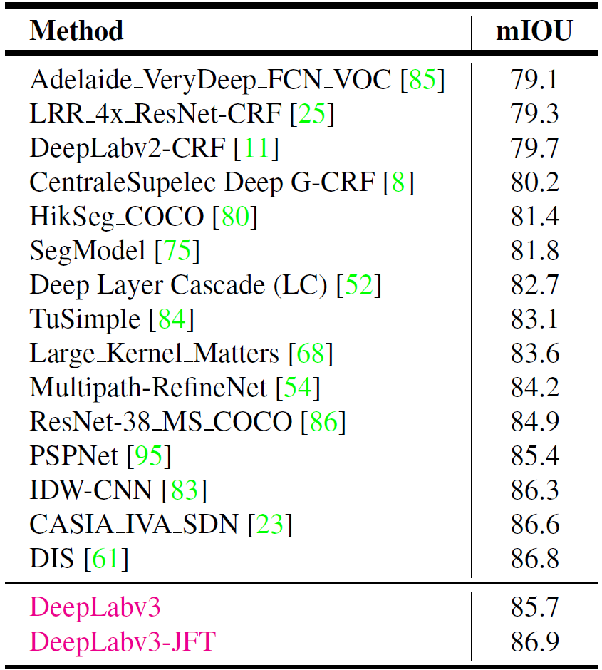

**表 7：** 在 PASCAL VOC 2012 测试集上的性能。

## 5. Conclusion

我们所提出的模型 "DeepLabv3" 使用有上采样滤波器的空洞卷积来提取密集的特征映射和捕获远距离上下文。具体而言，为了编码多尺度的信息，我们提出的级联模块逐渐地将空洞率翻倍，而我们提出的用图像级特征增强的空洞空间金字塔汇聚模块用多个采样率和有效感受野的滤波器探测特征。我们的实验结果表明所提出的模型显著地超过了之前的 DeepLab 版本，并在 PASCAL VOC 2012 语义图像分割基准上取得了与其他最先进的模型可比较的性能。

## A. Effect of hyper-parameters

在本节中，我们遵循与主论文一样的训练协议，并对一些超参数的影响进行实验。

**新的训练协议：** 正如主论文中提到的，我们对 [10,11] 中的训练协议做了三处主要的改变：(1) 更大的裁剪大小，(2) 训练期间上采样 logits 和 (3) 微调批量规范化。这里，我们定量测量这些变化的影响。如表 8 中所示，当采用主论文中新的训练协议设置时，DeepLabv3 在 PASCAL VOC 2012 验证集上的性能达到 77.21%。当不微调批量规范化训练 DeepLabv3 时，性能下降到 75.95%。如果我们不在训练期间上采样 logits (而是下采样真实值)，性能会下降到 76.01%。此外，如果我们使用更小的裁剪尺寸 (如 [10,11] 中的 321)，性能显著下降到 67.22%，这表明较小的裁剪尺寸导致的边界效应损害了 DeepLabv3 的性能，它在空洞空间金字塔汇聚模块中采用较大空洞率。

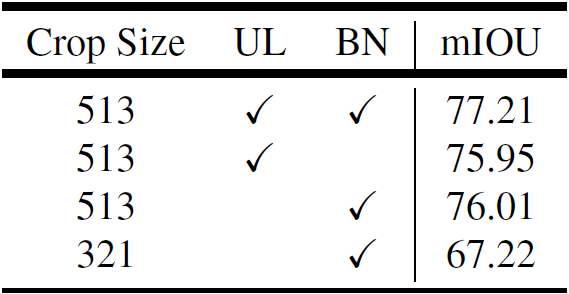

**表 8：** $output\_stride = 16$，训练期间的超参数对在 PASCAL VOC 2012 验证集上结果的影响。**UL：** 上采样 logits。**BN：** 微调批量规范化。

**不同的批量大小：** 由于使用微调批量规范化来训练 DeepLabv3 很重要，我们进一步实验了不同的批量大小的影响。如表 9 中所示，使用较小的批量大小对训练模型效率较低，而使用更大的批量大小可以获得更好的性能。

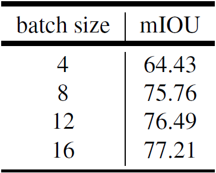

**表 9：** 在 PASCAL VOC 2012 验证集上批量大小的影响。在训练和评估时我们使用 $output\_stride = 16$。当用微调批量规范化参数训练模型时需要较大的批量大小。

**Output stride：** $output\_stride$ 的值决定了输出特征映射的分辨率，进而影响了我们在训练中可以使用的最大的批量大小。在表 10 中，我们定量地测量了在训练和在 PASCAL VOC 2012 验证集上评估时使用不同的 $output\_stride$ 的影响。我们首先固定评估的 $output\_stride = 16$，改变训练的 $output\_stride$ 并适合所有设置的最大可能的批量大小 (训练的 $output\_stride$ 为 8、16、32 时，我们适合的批量大小分别为 6、16、24)。如表 10 中最上面几行所示，使用训练 $output\_stride = 8$ 的性能仅达到74.45%，因为在此设置中我们无法适应大的批量大小，这在微调批量规范化参数时会降低性能。当使用训练的 $output\_stride = 32$，我们可以适应大的批量大小，但我们丢失了特征映射的细节。另一方面，使用训练的 $output\_stride = 16$ 达到最佳的平衡，并得到最好的性能。在表 10 中最下面的几行，我们增大评估的 $output\_stride = 8$。所有的设置都提升了性能，除了训练的 $output\_stride = 32$ 的那个。我们假设这个设置在训练时丢失了太多的特征映射的细节，因此即使在评估时采用 $output\_stride$，模型也无法恢复细节。

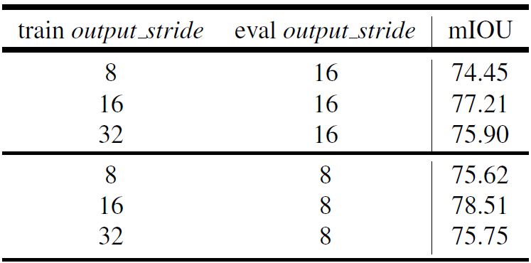

**表 10：** 在 PASCAL VOC 2012 验证集上 $output\_stride$ 的影响。训练时使用 $output\_stride = 16$ 对于评估 $output\_stride = 8$ 和 16 能获得更好的性能。

## B. Asynchronous training

在本节中，我们实验了 TensorFlow 异步训练 DeepLabv3。我们在 PASCAL VOC 2012 语义分割数据集上测量了使用多个副本训练的效果。我们的基线只使用一个副本，使用一个 K80 GPU 需要 3.65 天。如表 11 中所示，我们发现使用多个副本的性能与基线相比并没有下降。然而，使用 32 个副本的训练时间显著地减少到 2.74 小时。

## C. DeepLabv3 on Cityscapes dataset

