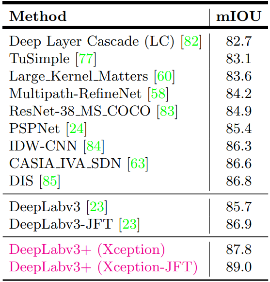

# [Encoder-Decoder with Atrous Separable Convolution for Semantic Image Segmentation](https://arxiv.org/pdf/1802.02611.pdf)

## Abstract

深度神经网络采用空间金字塔汇聚模块或编码器—解码器结构完成语义分割任务。前者能够编码多尺度的上下文信息，通过使用滤波器或在多种比率和多种有效感受野的汇聚操作来探测即将到来的特征，而后者可以通过逐步恢复空间信息来捕获更锐利的物体边界。在这项工作中，我们提出结合两种方法的优点。具体来说，我们提出的模型，DeepLabv3+，通过添加一个简单而有效的编码器模块来扩展 DeepLabv3，以精炼分割结果，特别是沿着物体边界的结果。我们进一步探索了 Xception 模型，并将深度可分离卷积应用到空洞空间金字塔汇聚和解码器模块，从而得到更快和更强的编码器—解码器网络。我们在 PASCAL VOC 2012 和 Cityscapes 数据集上证明了所提出的模型的有效性，在不进行任何后处理的情况下，测试集性能达到 89.0% 和 82.1%。我们的论文附带了一个所提出模型在 TensorFlow 上公开可用的参考实现：https://github.com/tensorflow/models/tree/master/research/deeplab

## 1 Introduction

语义分割的目标是为图像中的每个像素分配语义标签，是计算机视觉的基本课题之一。在基准任务上，基于完全卷积神经网络的深度卷积神经网络比依赖手工制作的特征的系统有显著的改进。在这项工作中，我们考虑两种类型的神经网络，它们使用空间金字塔汇聚模块或者编码器—解码器结构来进行语义分割，其中前者通过汇聚不同分辨率的特征来捕获丰富的上下文信息，而后者能够获得锐利的物体边界。

为了在多个尺度上捕获上下文信息，DeepLabv3 应用了多个并行的、不同 atrous rate 的空洞卷积 (称为空洞金字塔汇聚，或 ASPP)，而 PSPNet 在不同的网格尺度上执行汇聚操作。尽管在最后一个特征映射中编码了丰富的语义信息，但由于网络骨干中的汇聚或者带有 stridng 操作的卷积，与物体边界相关的详细信息丢失。通过应用空洞卷积提取更密集的特征映射可用缓解这一问题。然而，考虑到最先进的神经网络的设计和有限的 GPU 内存，在计算上无法提取比输入分辨率小 8 倍，甚至小 4 倍的输出特征映射。以 ResNet-101 为例，当应用空洞卷积提取比输入分辨率小 16 倍的输出特征时，最后 3 个残差块 (9 层) 内的特征会被扩大。更糟糕的是，如果期望输出特征的分辨率比输入小 8 倍，那么 26 个残差块 (76 层) 将受到影响。因此，如果为这种类型的模型提取更密集的输出特征，它的计算量很大。另一方面，编码器—解码器模型可用在编码器路径上进行更快的计算 (因为没有特征被扩大)，并在解码器路径上逐渐恢复尖锐的物体边界。试图结合这两种方法的优点，我们提出通过合并多尺度的上下文信息来丰富编码器—解码器网络中的编码器模块。

特别地，我们提出的模型，称为 DeepLabv3+，通过添加一个简单但有效的解码器模块来恢复物体的边界来扩展 DeepLabv3，如图 1 所示。丰富的语义信息被编码到 DeepLabv3 的输出中，使用空洞卷积允许人们根据计算资源的预算来控制编码器特征的密度。此外，解码器模块使精细的物体边界的恢复成为可能。

受到最近成功的深度可分离卷积的激励，我们也探索了这种操作，并通过采用类似于 [31] 的 Xception [26] 来完成语义分割任务，并将空洞可分离卷积应用到 ASPP 和解码器模块，在速度和准确性方面都有所提升。最后，我们在 PASCAL VOC 2012 和 Cityscapes 数据集上证明了所提出的模型的有效性，在没有任何后处理的情况下，获得了 89.0% 和 82.1% 的测试集性能，创下了一个新的最先进水平。

总而言之，我们的贡献是：

- 我们提出了一种新颖的编码器—解码器结构，采用 DeepLabv3 作为一个强大的解码器模块和一个简单但有效的解码器模块。
- 在我们模型结构中，可以**通过空洞卷积来任意控制提取到的编码器的特征的分辨率**，以权衡精度和运行时间，这是现有的编码器—解码器模型所不能的。
- 我们将 Xception 模型用于分割任务，并将深度可分离卷积应用到 ASPP 模块和解码器模块，从而产生更快和更强的编码器—解码器网络。
- 我们所提出的模型在 PASCAL VOC 2012 和 Cityscapes 数据集上获得了一个新的最先进的性能。我们还提供了设计选型和模型变体的详细分析。
- 我们在 https://github.com/tensorflow/models/tree/master/research/deeplab 上公开了所提出的模型基于 TensorFlow 的实现。

**图 1：** 我们使用编码器—解码器结构 (b) 改进了采用空间金字塔汇聚模块 (a) 的 DeepLabv3。所提出的模型，DeepLabv3+，包含了来自解码器模块的丰富的语义信息，而精细的物体的边界由简单但有效的解码器模块恢复。通过采用空洞卷积，解码器模块允许我们提取任意分辨率的特征。

## 2 Related Work

基于完全卷积神经网络 (FCNs) 的模型已经在几个分割基准上展示出了显著的提升。有一些模型变体被提出利用上下文信息分割来进行分割，包括采用多尺度输入 (即图像金字塔) 或采用概率的图形模型 (如带有高效推理算法的 DenseCRF)。在本工作中，我们主要讨论使用空间金字塔汇聚和编码器—解码器结构的模型。

**空间金字塔汇聚：** 如 PSPNet 或者 DeepLab 这类模型，在多个网格尺度上执行空间金字塔汇聚 (包括图像级的汇聚) 或者应用多个并行的、不同 rate 的空洞卷积 (被称为空洞空间金字塔汇聚，或者 ASPP)。这些模型通过利用多尺度的信息在多个分割基准上展现出了有希望的结果。

**编码器—解码器：** 编码器—解码器网络已经被成功地应用到许多计算机视觉任务，包括人体姿态估计、目标检测和语义分割。通常，编码器—解码器网络包含 (1) 一个逐渐降低特征映射和捕获更高级语义信息的编码器模块和 (2) 一个逐渐恢复空间信息的解码器模块。在此基础上，我们提出使用 DeepLabv3 作为编码器模块，并添加一个简单但有效的解码器模块来获得更锐利的分割。

**深度可分离卷积：** 深度可分离卷积或分组卷积，一种强大的操作，用于减少计算成本和参数数量并同时保持相似 (或略好) 的性能。这种操作已经在许多最近的网络设计中被采用。特别地，我们探索了与用于 COCO 2017 检测挑战提交的 [31] 相似的 Xception 模型，并在语义分割任务的准确性和速度方面都有所提升。

## 3 Methods

在本节中，我们简单地介绍了空洞卷积核深度可分离卷积。然后在讨论所提出的添加到解码器输出后的编码器模块之前，我们先回顾被用作我们的编码器模块的 DeepLabv3。我们还提出了一个改进的 Xception 模型，它进一步提升了性能，计算更快。

**图 2：** 我们提出的 DeepLabv3+ 通过使用一个编码器—解码器结构扩展了 DeepLabv3。解码器模块通过在多尺度上应用空洞卷积对多尺度的上下文信息进行编码，而简单但有效的解码器模块细化沿着物体边界的分割结果。

### 3.1 Encoder-Decoder with Atrous Convolution

**空洞卷积：** 空洞卷积推广了标准的卷积运算，是一种强大的工具，允许我们显式地控制深度卷积神经网络计算的特征的分辨率，并调整滤波器的感受野以捕获多尺度的信息。在二维信号的情况下，对于输出特征映射 $\boldsymbol{y}$ 每个位置 $i$ 和一个卷积滤波器 $\boldsymbol{w}$，空洞卷积以下列形式应用于输入特征映射 $\boldsymbol{x}$ 上：
$$
\large \boldsymbol{y}[i] = \sum_k \boldsymbol{x}[i + r \cdot k] \boldsymbol{w}[k] \tag{1}
$$

其中空洞率 $r$ 决定了我们对输入信号的采样步长。我们建议有兴趣的读者参考 [39] 以了解更多的细节。注意到标准卷积是一种空洞率 $r = 1$ 的特殊情况。通过改变空洞率 $r$，对滤波器的感受野进行自适应地调整。

**深度可分离卷积：** 深度可分离卷积，==将一个标准卷积分解为一个深度卷积，后面跟着一个逐点的卷积 (即 $1 \times 1$ 的卷积)==，极大地减少计算复杂度。具体而言，深度卷积在每个通道独立地执行一次空间卷积，而逐点的卷积被用于合并深度卷积的输出。在 TensorFlow 的深度可分离卷积的实现中，深度卷积 (即空间卷积) 支持空洞卷积，如图 3 所示。在本工作中，我们将得到的卷积称为 *空洞可分离卷积*，并发现**空洞可分离卷积在保持相似 (或更好) 性能的同时，显著地降低了所提出的模型的计算复杂度**。

**DeepLabv3 作为编码器：** DeepLabv3 采用空洞卷积来提取任意分辨率的深度卷积网络计算得到的特征。这里，我们==将 $output \ stride$ 表示为输入图像的空间分辨率与 (编码器) 最终输出分辨率 (全局汇聚或者全连接层之前) 的比值==。对于图像分类任务，最终特征映射的空间分辨率通常比输入图像的分辨率小 32 倍，因此 $output \ stride = 32$。对于语义分割任务，可以采用 $output \ stride = 16$ 或者 8 来进行更密集的特征提取，通过移除最后一 (或两) 个块中的 striding，并相应地应用空洞卷积 (例如，对于 $output \ stride = 8$，我们分别对最后两个块应用 $rate = 2$ 和 $rate = 4$)。此外，DeepLabv3 以图像级特征增强了空洞空间金字塔汇聚模块，它通过应用不同空洞率的空洞卷积在多个尺度上探测卷积的特征。我们使用原始的 DeepLabv3 的 logits 之前的最后一个特征映射作为我们所提出的编码器—解码器结构中的编码器的输出。请注意编码器的输出特征映射包含 256 个通道和丰富的语义信息。此外，通过应用空洞卷积，可以提取任意分辨率的特征，特征的分辨率取决于计算预算。

**所提出的解码器：** DeepLabv3 的编码器 (输出的) 特征通常以 $output \ stride = 16$ 来计算。在 [23] 的工作中，特征被 16 倍双线性上采样，这可以被认为是一个幼稚的 (naive) 解码器模块。然而，这个幼稚的 (naive) 解码器模块可能不能成功地恢复物体分割的细节。因此我们提出了一个简单但有效的解码器模块，如图 2 所示。编码器的特征首先经过 4 倍双线性上采样，然后与来自网络骨干的具有相同的空间分辨率的 (例如 ResNet-101 中 striding 之前的 Conv2) 相应的低级特征拼接起来。我们在低级特征上使用另外一个 $1 \times 1$ 的卷积来减少通道数，因为对应的低级特征通常包含大量的通道 (例如 256 或者 512)，这可能会超过丰富的编码器的特征 (在我们的模型中只有 256 个通道) 的重要性，并让训练变得更加困难。拼接之后，我们应用一些 $3 \times 3$ 的卷积来精炼特征，并接着另一个简单的 4 倍双线性上采样。我们在第 4 节中表明对编码器模块使用 $output \ stride = 16$ 可以在速度和精度之间取得最好的权衡。当对编码器模块使用 $output \ stride = 8$ 时，性能略微有所改善，但代价是额外的计算复杂度。

**图 3：** $3 \times 3$ 深度可分离卷积将一个标准的卷积分解成 (a) 一个深度卷积 (对每个输入通道应用一个滤波器) 和 (b) 一个逐点的卷积 (跨通道合并深度卷积的输出)。在本工作中，我们探索了 *空洞可分离卷积*，即在深度卷积中采用空洞卷积，如 (c) $rate = 2$。

### 3.2 Modified Aligned Xception

Xception 模型以很快的计算在 ImageNet 上展现出很好的图像分类结果。最近，MSRA 团队改进了 Xception 模型 (称为对齐的 Xception)，并进一步推动了在目标检测任务中的性能。在这些发现的激励下，我们朝着同样的方向努力，将 Xception 模型应用于图像语义分割任务。特别地，我们在 MSRA 的修改的基础上做了一些修改，即 (1) 与 [31] 中相似的更深 Xception，除了我们不修改 **entry flow** 的网络结构以获得快速的计算和内存效率，(2) 所有的最大汇聚操作都被有 strding 的深度可分离卷积替代，这使得我们能够应用空洞可分离卷积来提取任意分辨率的特征映射 (另一个选项是将空洞算法推广到最大汇聚操作)，(3) 在每个 $3 \times 3$ 的深度卷积之后添加额外的批量规范化和 ReLU 激活，类似于 MobileNet 设计 [29]。细节参见图 4。

**图 4：** 我们对 Xception 进行如下改进：(1) 更多的层 (除了 Entry flow 中的改变之外，其他与 MSRA 的修改相同)，(2) 所有的最大汇聚操作都被有 striding 的深度可分离卷积替代，(3) 在每个 $3 \times 3$ 深度卷积后添加额外的批量规范化和 ReLU，类似于 MobileNet。

## 4 Experimental Evaluation

我们使用 ImageNet-1k 预训练 ResNet-101 或者改进的对齐的 Xception 通过空洞卷积来提取密集的特征映射。我们的实现是建立在 TensorFlow 上的，并且是公开可用的。

所提出的模型在 PASCAL VOC 2012 语义分割基准上进行评估，该基准包含 20 个前景物体类别和 1 个背景类别。原始的数据集包含 1,464 (训练)，1,449 (验证) 和 1,456 (测试) 个像素级别的已标注的图像。我们通过由 [76] 提供的额外标注增强该数据集，从而得到 10,582 (训练增强) 训练图像。性能是通过平均 21 个类别的像素交并比 (mIOU) 来衡量的。

我们遵循与 [23] 相同的训练协议，建议有兴趣的读者参考 [23] 以了解细节。简而言之，我们采用相同的学习率计划 (即 "poly" 策略 [52] 和相同的初始学习率 0.007)，裁剪大小 $513 \times 513$，当 $output \ stride = 16$ 时微调批量规范化的参数，并在训练过程中使用随机缩放数据增强。请注意我们还在所提出的解码器模块中加入批量规范化。我们所提出的模型是端到端训练的，而不需要对每个组件进行分段的预训练。

### 4.1 Decoder Design Choices

我们将 "DeepLabv3 feature map" 定义为由 DeepLabv3 计算的最后一个特征映射 (即包含 ASPP 特征和图像级特征的特征)，==$[ k \times k, f]$ 定义为一个有 $f$ 个滤波器，核大小为 $k \times k$ 的卷积操作==。

当使用 $output \ stride = 16$ 时，基于 ResNet-101 的 DeepLabv3 [23] 在训练和评估时对 logits 进行 16 倍上采样。这种简单的双线性上采样可以被认为是一种幼稚的 (naive) 解码器设计，在 PASCAL VOC 2012 验证集上获得了 77.21% 的性能，比在训练期间不使用这种幼稚的解码器 (即在训练期间下采样真实值) 好 1.2%。为了改善这一基线，我们提出的模型 "DeepLabv3+" 在编码器的输出上添加了解码器模块，如图 2 所示。在解码器模块中，我们考虑三个地方进行不同的设计选择，即 (1) 用 $1 \times 1$ 的卷积来减少来自编码器模块的低级特征的通道，(2) 用 $3 \times 3$ 的卷积来获得更尖锐分割结果，(3) 应该使用哪些编码器的低级特征。

为了评估在解码器模块中 $1 \times 1$ 的卷积的影响，我们使用 $[3 \times 3, 256]$ 和 ResNet-101 网络骨干中的 Conv2 特征，即 res2x 残差块中的最后一个特征映射 (具体一点，我们使用 striding 之前的特征映射)。如表 1 所示，将来自编码器模块的低级特征映射的通道减少到 48 或 32 可以获得更好的性能。因此我们采用 $[1 \times 1, 48]$ 来减少通道。

**表 1：** PASCAL VOC 2012 验证集。解码器中用于减少来自编码器模块的低级特征映射的通道的 $1 \times 1$ 的影响。我们将解码器结果中其他组件固定为使用 $[3 \times 3, 256]$ 和 Conv2.

然后我们为编码器模块设计了 $3 \times 3$ 卷积结构，并在表 2 中报告了探索结果。我们发现在将 Conv2 特征映射 (string 之前) 与 DepLabv3 特征映射拼接之后，使用两个 $3 \times 3$ 的有 256 个滤波器的卷积比使用简单的一个或三个卷积更有效。将滤波器的数量从 256 更改为 128 或将内核大小从 $3 \times 3$ 更改为 $1 \times 1$ 会降低性能。我们还实验了在解码器模块中同时利用 Conv2 和 Conv3 特征映射的情况。这种情况下，解码器的特征映射逐次进行 2 倍上采样，首先与 Conv3 拼接起来，再与 Con2 拼接，每个 (拼接之后的的特征) 会由 $[3 \times 3, 256]$ 进行细化。整个解码过程类似于 U-Net/SegNet 的设计。然而，我们没有观察到显著的提升。因此，最后我们采用了非常简单但有效的==解码器模块：通过两个 $[3 \times 3, 256]$ 来细化 DeepLabv3 特征映射和通道减少的 Conv2 特征映射的拼接==。请注意我们提出的 DeepLabv3+ 模型有 $output \ stride = 4$。给定的有限的 GPU 资源，我们不再进一步追求更密集的输出特征映射 (即 $output \ stride < 4$)。

**表 2：** 当固定 $[1 \times 1,48]$ 来减少编码器特征的通道时解码器结构的影响。我们发现使用 Conv2 (striding 之前) 特征映射和两个额外的 $[3 \times 3, 256]$ 是最有效的。性能是在 VOC 2012 验证集上的。

### 4.2 ResNet-101 as Network BackBone

为了比较模型变体的准确性和速度，我们在表 3 中报告了在所提出的 DeepLabv3+ 模型中使用 ResNet-101 作为网络骨干的 mIOU 和乘加次数。由于空洞卷积，我们可以在训练和评估过程中使用单个模型获得不同分辨率的特征。

**表 3：** 使用 ResNet-101 时在 PASCAL VOC 2012 验证集上的推理策略。**train OS：** 训练时使用的 output stride。**eval OS：** 评估时使用的 output stride。**Decoder：** 采用所提出的解码器结构。**MS：** 评估时多尺度输入。**Flip：** 添加左右翻转的输入。

**基线：** 表 3 中第一个行块包含了 [23] 的结果，表明在评估时提取更密集的特征映射 (即 eval output stride = 8) 和采用多尺度的输入提升了性能。此外，添加左右翻转的输入使计算量翻倍，但性能提升略微。

**添加解码器：** 表 3 中第二个行块包含了使用所提出的解码器结构的结果。当使用 output stride = 16 或 8 时，性能分别由 77.21% 提升到 78.85% 或 78.51% 提升到 79.35%，以大约 20B 的额外计算开销为代价。当使用多尺度和左右翻转的输入时，性能得到进一步提升。

**更粗糙的特征映射：** 我们还实验了使用 train output stride = 32 来快速计算的情况 (即在训练时完全没有空洞卷积)。如表 3 中第三个行块所示，添加解码器带来了大约 2% 的提升，但只需要 74.20B 的乘加。然而，性能总是比我们使用 train output stride = 16 和不同的 eval output stride 值的情况低大约 1% 到 1.5%。因此我们更喜欢在训练或评估期间根据复杂度预算使用 output stride = 16 或 8。

### 4.3 Xception as Network Backbone

我们进一步使用更强大的 Xception 作为网络骨干。遵循 [31]，我们做了更多的改变，如 3.2 节所述。

**表 4：** 在ImageNet-1K 验证集上的但模型错误率。

**ImageNet 预训练：** 所提出的 Xception 网络使用与 [26] 中相似的训练协议在 ImageNet-1k 数据集上预训练。具体而言，我们使用 momentum = 0.9 的 Nesterov momentum 优化器，初始学习率为 0.05，每两轮衰减 0.94，权重衰减为 4e-5。我们使用 50 个 GPUs 进行异步训练，每个 GPU 的批大小为 32，图像大小为 $299 \times 299$。我们没有很努力地调超参数，因为目标是在 ImageNet 上预训练一个模型来进行语义分割。我们在表 4 中报告了在验证集上单模型的错误率，以及在相同训练协议下复现的 ResNet-101 的错误率。我们观察到当没有在改进的 Xception 中每个 $3 \times 3$ 深度卷积之后添加额外的批量规范化和 ReLU，Top1 和 Top5 的准确率下降了 0.75% 和 0.29%。

使用所提出的 Xception 作为网络骨干来进行语义分割的结果报告在表 5 中。

**表 5：** 使用 Xception 时在 PASCAL VOC 2012 验证集上的推理策略。**train OS：** 训练时使用的 output stride。**eval OS：** 评估时使用的 output stride。**Decoder：** 采用所提出的解码器结构。**MS：** 评估时多尺度输入。**Flip：** 添加左右翻转的输入。**SC：** 在 ASPP 和解码器模块中采用深度可分离卷积。**COCO：** 模型在 MS-COCO 上预训练。**JFT：** 模型在 JFT 上预训练。

**基线：** 我们首先在表 5 第一个行块中报告了没有使用所提出的解码器的结果，这表明，相比使用 ResNet-101，使用 Xception 作为网络骨干在 train output stride = eval output stride = 16 时性能提升约 2%。通过使用 eval output stride = 9，推理期间的多尺度输入和添加左右翻转输入能够获得进一步的提升。请注意我们没有采用多网格方法，我们发现它不能提升性能。

**添加解码器：** 如表 5 第二行块所示，对于所有不同的推理策略，当使用 eval output stride = 16 时，添加解码器带来 0.8% 的提升。这一提升在使用 eval output stride = 8 时变得更少。

**使用深度可分离卷积：** 受到深度可分离卷积的高效计算所激励，我们在 ASPP 和解码器模块中进一步采用了深度可分离卷积。如表 5 第三行块所示，乘加运算的计算复杂度明显地降低了 33% 到 41%，但 mIOU 性能差不多。

**在 COCO 上预训练：** 为了与其他最先进的模型进行比较，我们进一步在 MS-COCO 数据集上预训练了我们提出的 DeepLabv3+，这对于所有不同的推理策略都产生了大约 2% 的提升。

**在 JFT 上预训练：** 与 [23] 类似，我们也将提出的 Xception 模型在 ImageNet-1k 和 JFT-300M 上一起预训练，这带来额外 0.8% 到 1% 的提升。

**测试集结果：** 由于在基准评测中不考虑计算复杂度，因此我们选择最优性能的模型，并用 output stride = 8 进行训练，再冻结批量规范化的参数。最后，我们的 'DeepLabv3+' 在不使用 JFT 数据集预训练的情况下取得了 87.8% 和 89.0% 的性能。

**定性结果：** 我们在图 6 中提供了我们的最优模型的可视化结果。如图所示，我们的模型在不使用任何后处理的情况下能很好地分割物体。

**失败模式：** 如图 6 最后一行所示，我们的模型在分割 (a) 沙发 vs 椅子，(b) 严重遮挡的物体和 (c) 罕见的物体时存在困难。

### 4.4 Improvement along Object Boundaries

在本小节中，我们用 trimap 实验来评估分割的准确性，以量化所提出的解码器模块在物体边界附近的准确性。具体来说，我们对验证集上 'void' 标签的标注应用形态学膨胀，这通常发生在物体的边界附近。然后我们计算 "void"  标签膨胀条带内的像素 (称为 trimap) 的平均 IOU。如图 5 (a) 所示，对于 ResNet-101 和 Xception 网络骨干采用所提出的解码器，与幼稚的双线性上采样相比，性能有所提升。当膨胀条带较窄时，改善效果越明显。我们观察到在所图中所示的最小的 trimap 宽度处，ResNet-101 和 Xception 的 mIOU 性能分别提升 4.8% 和 5.4%。我们还在图 5 (b) 中可视化了使用所提出的解码器的效果。

**表 6：** 最优秀的模型的 PASCAL VOC 2012 测试集的结果。

**图 5：** (a) 当采用 train output stride = eval output stride = 16 时，mIOU 作为物体边界周围的条带的宽度的函数。**BU：** 双线性上采样。(b) 采用所提出的解码器模块与幼稚的双线性上采样 (记为 **BU**) 相比的定性结果。在示例中，我们使用 Xception 作为特征提取器，并且 train output stride = eval output stride = 16。

**图 6：** 在验证集上的可视化结果。最后一行展示了失败模式。

### 4.5 Experimental Results on Cityscapes

在本节中，我们在 Cityscapes 数据集 [3] 上实验 DeepLabv3+，这是一个包含 5000 张高质量的像素级标注的图像 (2975、500 和 1525 张分别用于训练集、验证集和测试集) 和大约 20000 张粗标注的图像的大型数据集。

如表 7 (a) 所示，在包含 ASPP 和图像级特征的 DeepLabv3 上采用所提出的 Xception 模型作为网络骨干 (记为 X-65)，在验证集上获得了 77.33% 的性能。添加所提出的解码器模块显著地提升性能到 78.79% (1.46% 的提升)。我们注意到，移除增强的图像级特征将性能提升到 79.14%，表明在 DeepLab 模型中，图像级特征在 PASCAL VOC 2012 数据集上更有效。我们还发现在 Cityscapes 数据集上，在 Xception 中的 entry flow 增加更多的层是有效的，就像 [31] 在目标检测任务中所做的一样。在更深的网络骨干上构建得到的模型 (在表中记为 X-71)，在验证集上获得了 79.55% 的最佳性能。

在验证集上找到最优的模型变体之后，我们在粗标注上进一步微调模型，以便与其他最先进的模型竞争。如表 7  (b) 所示，我们提出的 DeepLabv3+ 在测试集上获得了 82.1% 的性能，在 Cityscapes 上建立了一个新的最先进的性能。

**表 7：** (a) 使用 train_fine 集训练的 DeepLabv3+ 在 Cityscapes 验证集上的结果。(b) DeepLabv3+ 在 Cityscapes 测试集上的结果。**Coarse：** 额外使用 train_extra 集 (粗标注的)。这个表中只列出了一些最好的模型。

## 5 Conclusion

我们所提出的模型 "DeepLabv3+" 采用编码器—解码器结构，其中 DeepLabv3 被用于编码丰富的上下文信息，而一个简单但有效解码器模块被使用来恢复物体的边界。人们可以通过采用空洞卷积来提取任意分辨率的编码器特征，特征的分辨率取决于可用的计算资源。我们还探索了 Xception 模型和空洞可分离卷积，使所提出的模型更快和更强。最后，我们的实验结果表明，所提出的模型在 PASCAL VOC 2012 和 Cityscapes 数据集上建立了一个新的最先进的性能。
