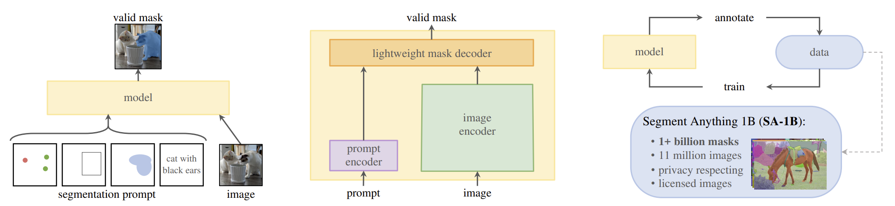

# [Segment Anything](https://scontent-sjc3-1.xx.fbcdn.net/v/t39.2365-6/10000000_900554171201033_1602411987825904100_n.pdf?_nc_cat=100&ccb=1-7&_nc_sid=3c67a6&_nc_ohc=Ald4OYhL6hgAX8yWDjN&_nc_ht=scontent-sjc3-1.xx&oh=00_AfBpxrxScdUihf-Qlu8w3Ar297hmetD0oaXXfhdaDIIKNg&oe=643306A7)

​              (a) 任务：可提示的分割                                               (b) 模型：分割一切的模型 (SAM)                                     (c) 数据：数据引擎 (上) 和数据集 (下)

**图1：** 我们的旨在通过引入三个相互关联的组件来构建一个用于分割的基础模型：一个可提示的分割任务，一个分割模型 (SAM) ，它为数据标注提供动力，并通过提示工程实现了对一系列任务的零样本迁移，以及一个数据引擎，用于收集 SA-1B，一个超过 10 亿个掩码的数据集。

**PS：** SAM 是一个通用的分割模型，它是交互式和自动分割两种经典方法的混合体。该模型旨在减少“任务特定建模专业知识、训练计算和定制数据注释”的需求。

## Abstract

我们介绍了 Segment Anything (SA) 项目：一个新的图像分割任务、模型和数据集。在数据收集循环中使用我们的高效模型，我们构建了迄今为止最大的分割数据集 (远远超过其他数据集) ，其中包含超过 10 亿个掩码和 1100 万张有许可的且尊重隐私的图像。该模型被设计和训练成可提示的，因此它可以==零样本迁移到新的图像分布和任务上==。我们在许多任务上对它的能力进行了评估，并发现其零样本性能令人印象深刻——经常可与先前的完全监督结果相竞争，甚至优于后者。我们正在 https://segment-anything.com 发布 Segment Anything Model (SAM) 和相应的包含 10 亿个掩码和 1100 万张图像的数据集 (SA-1B)，以促进计算机视觉基础模型的研究。

## 1. Introduction

在网络规模数据集上预训练的大型语言模型正在通过强大的零样本和少样本泛化能力彻底改变 NLP。 这些"基础模型" (foundation models)  可以泛化到超出训练期间所见的任务和数据分布。这种能力通常是通过提示工程实现的，其中手工制作的文本用于提示语言模型为手头的任务生成有效的文本响应。当使用来自网络的大量文本语料库进行缩放和训练时，这些模型的零样本和少样本性能与微调模型相比 (甚至在某些情况下匹配) 出奇地好。经验趋势表明，这种行为随着模型规模、数据集大小和总训练计算量的增加而改善。

基础模型也在计算机视觉领域进行了探索，尽管程度较小。也许最突出的工作是对齐来自网络的成对文本和图像。例如，[CLIP](https://arxiv.org/abs/2103.00020) 和 ALIGN 使用对比学习来训练对齐文本和图像这两种模态的编码器。一旦训练完成，工程化的文本提示就可以零样本泛化到新的视觉概念和数据分布的。此类编码器还可以与其他模块有效地组合，以支持下游任务，例如图像生成 (例如 DALL·E)。虽然在视觉和语言编码器方面取得了很大进展，但计算机视觉包括超出此范围的多种多样问题，并且对于其中许多问题，不存在丰富的训练数据。

在这项工作中，我们的==目标是构建一个图像分割的基础模型==。也就是说，我们寻求开发一个可提示的模型，并使用能够实现强大泛化的任务在大量的数据集上进行预训练。通过这个模型，我们旨在使用提示工程解决在新的数据分布上的一系列下游分割问题。

这个计划的成功取决于三个组成部分：任务、模型和数据。为了开发它们，我们解决了以下有关图像分割的问题：

1. 什么任务可以实现零样本泛化？
2. 对应的模型架构是怎样的？
3. 哪些数据可以为这项任务和模型提供支持？

这些问题是纠缠在一起的，需要一个综合性的解决方案。我们首先定义了一个可提示的分割任务，该任务足够通用，可以提供强大的预训练目标，并能够支持广泛的下游应用。这个任务需要一个支持灵活的提示，并能在交互的提示下实时输出分割掩模的模型。为了训练我们的模型，我们需要一个多样化、大规模的数据来源。不幸的是，没有用于分割的网络规模数据源。为了解决这个问题，我们构建了一个"数据引擎"，即我们在使用本文提出的高效模型协助数据收集和使用新收集的数据来改进模型之间进行反复迭代。接下来介绍每个相互关联的组件，然后是我们创建的数据集和证明我们方法有效性的实验。

任务。

## 参考

[10]: 