# [Segment Anything](https://arxiv.org/pdf/2304.02643.pdf)

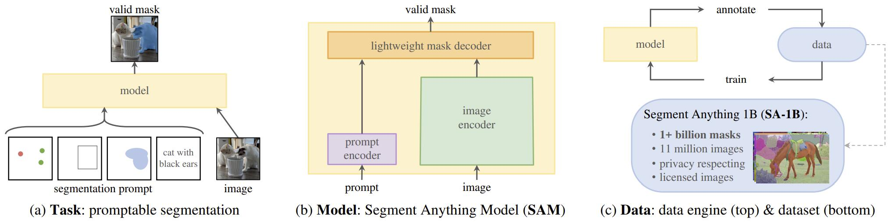

**图1：** 我们的旨在通过引入三个相互关联的组件来构建一个用于分割的基础模型：一个可提示的分割任务，一个分割模型 (SAM) ，它为数据标注提供动力，并通过提示工程实现了对一系列任务的零样本迁移，以及一个数据引擎，用于收集 SA-1B，一个超过 10 亿个掩码的数据集。

## Abstract

我们介绍了 Segment Anything (SA) 项目：一个新的图像分割任务、模型和数据集。在数据收集循环中使用我们的高效模型，我们构建了迄今为止最大的分割数据集 (远远超过其他数据集) ，其中包含超过 10 亿个掩码和 1100 万张有许可的且尊重隐私的图像。该模型被设计和训练成可提示的，因此它可以 ==零样本迁移到新的图像分布和任务上== 。我们在许多任务上对它的能力进行了评估，并发现其零样本性能令人印象深刻——经常可与先前的完全监督结果相竞争，甚至优于后者。我们正在 https://segment-anything.com 发布 Segment Anything Model (SAM) 和相应的包含 10 亿个掩码和 1100 万张图像的数据集 (SA-1B)，以促进计算机视觉基础模型的研究。

> Segment Anything 试图将图像分割提升到基础模型时代，新任务 (可提示分割)、模型 (SAM) 和数据集 (SA-1B)。SAM 是一个通用的分割模型，它是交互式和自动分割两种经典方法的混合体，通过预先计算图像嵌入，可以实现在 CPU 上实时交互分割。可提示分割训练的模型可以在推理时通过充当更大系统中的组件来执行新的、不同的任务。

## 1. Introduction

在网络规模数据集上预训练的大型语言模型正在通过强大的零样本和少样本泛化能力彻底改变 NLP。 这些"基础模型" (foundation models)  可以泛化到超出训练期间所见的任务和数据分布。这种能力通常是通过提示工程实现的，其中手工制作的文本用于提示语言模型为手头的任务生成有效的文本响应。当使用来自网络的大量文本语料库进行缩放和训练时，这些模型的零样本和少样本性能与微调模型相比 (甚至在某些情况下匹配) 出奇地好。经验趋势表明，这种行为随着模型规模、数据集大小和总训练计算量的增加而改善。

基础模型也在计算机视觉领域进行了探索，尽管程度较小。也许最突出的工作是对齐来自网络的成对文本和图像。例如，[CLIP](https://arxiv.org/abs/2103.00020) 和 ALIGN 使用对比学习来训练对齐文本和图像这两种模态的编码器。一旦训练完成，工程化的文本提示就可以零样本泛化到新的视觉概念和数据分布的。此类编码器还可以与其他模块有效地组合，以支持下游任务，例如图像生成 (例如 DALL·E)。虽然在视觉和语言编码器方面取得了很大进展，但计算机视觉包括超出此范围的多种多样问题，并且对于其中许多问题，不存在丰富的训练数据。

在这项工作中，我们的==目标是构建一个图像分割的基础模型==。也就是说，我们寻求开发一个可提示的模型，并使用能够实现强大泛化的任务在大量的数据集上进行预训练。通过这个模型，我们旨在使用提示工程解决在新的数据分布上的一系列下游分割问题。

这个计划的成功取决于三个组成部分：任务、模型和数据。为了开发它们，我们解决了以下有关图像分割的问题：

1. **什么任务可以实现零样本泛化？**
2. **对应的模型架构是怎样的？**
3. **哪些数据可以为这项任务和模型提供支持？**

这些问题是纠缠在一起的，需要一个综合性的解决方案。我们首先定义了一个可提示的分割任务，该任务足够通用，可以提供强大的预训练目标，并能够支持广泛的下游应用。这个任务需要一个支持灵活的提示，并能在交互的提示下实时输出分割掩码的模型。为了训练我们的模型，我们需要一个多样化、大规模的数据来源。不幸的是，没有用于分割的网络规模数据源。为了解决这个问题，我们构建了一个"数据引擎"，即我们在使用本文提出的高效模型协助数据收集和使用新收集的数据来改进模型之间进行反复迭代。接下来介绍每个相互关联的组件，然后是我们创建的数据集和证明我们方法有效性的实验。

**[任务](# 2. Segment Anything Task)：** 在自然语言处理和最近的计算机视觉中，基础模型是一个有希望的研究方，可以通过使用“提示”技术来执行新数据集和任务的零样本和少样本学习。受这一工作的启发，我们提出了**可提示的分割任务**，其==目标是在给定任意分割提示的情况下返回有效的分割掩码== (见图 1a) 。提示只是指定要在图像中进行分割的内容，例如，提示可以包括识别物体的空间或文本信息。要求有效的输出掩码意味着即使提示不明确并且可能指代多个物体 (例如，衬衫上的一个点可能表示衬衫或穿着它的人)，输出至少也应该是其中一个物体的合理掩码。我们将可提示的分割任务作为预训练目标，并通过提示工程来解决通用下游分割任务。

**[模型](# 3. Segment Anything Model)：** 可提示分割任务和实际使用目的对模型架构施加了约束。特别是，模型必须支持**灵活的提示**，需要分摊实时计算掩码以允许交互式使用，并且必须具有歧义感知能力。令人惊讶的是，我们发现一个简单的设计满足所有三个约束：一个强大的图像编码器计算图像嵌入 (embedding)，一个提示编码器嵌入提示，然后这两个信息源被组合在一个轻量级掩码解码器中，预测分割掩码。我们将这个模型称为 **Segment Anything Model**，或 **SAM** (见图 1b) 。通过将 ==SAM 分离为一个图像编码器和一个快速提示编码器/掩码解码器，相同的图像嵌入能在不同的提示下被重复使用== (并分摊其成本) 。==给定图像嵌入，提示编码器和掩码解码器在 Web 浏览器中根据提示预测出掩码需要约 50ms==。我们专注于点、框和掩码提示，并且还使用自由格式的文本提示呈现初始结果。为了使 SAM 具有歧义感知能力，我们设计它==为单个提示预测多个掩码，从而允许 SAM 能自然地处理歧义==，例如衬衫与人的例子。

**[数据引擎](# 4. Segment Anything Data Engine)：** 为了在新数据分布上取得很好的泛化，我们发现有必要在大量且多样化的掩码上训练 SAM，超出任何已经存在的分割数据集。虽然基础模型的典型方法是在线获取数据，但掩码并不富余，因此我们需要一种替代策略。我们的解决方案是构建一个“数据引擎”，即使用迭代中的模型的数据集注释协同开发模型 (见图 1c) 。我们的数据引擎有三个阶段：辅助手动、半自动和全自动。在第一阶段，SAM 协助标注者标注掩码，类似于经典的交互式分割设置。在第二阶段，SAM 可以通过提示可能的物体位置自动为物体子集生成掩码，而标注者专注于标注剩余的物体，帮助增加掩码多样性。在最后一个阶段中，我们使用前景点的规则网格提示 SAM，每个图像平均产生约 100 个高质量掩码。

**[数据集](# 5. Segment Anything Dataset)：** 我们的最终数据集 SA-1B 包含 10亿多个掩码，来自 1100 万个经过许可和隐私保护的图像 (见图 2) 。使用我们的数据引擎的最后一个阶段完全自动收集的 SA-1B 比任何现有分割数据集多 400 倍掩码，并且正如我们广泛验证的那样，这些掩码是高质量且多样性的。除了用于训练 SAM 以具有强鲁棒性和通用性之外，我们希望 SA-1B 成为构建新基础模型的研究的宝贵资源。

**[负责的 AI](# 6. Segment Anything RAI Analysis)：** 在使用 SA-1B 和 SAM 时，我们研究并报告潜在的公平关注点和偏差。SA-1B 中的图像涵盖了一系列地理和经济多样化的国家，我们发现 SAM 在不同人群中表现相似。我们希望这将使我们的工作在实际用例中更加公平。我们在附录中提供了模型和数据集卡。

**[实验](# 7. Zero-Shot Transfer Experiments):** 我们对 SAM 进行了广泛的评估。首先，使用 23 个多样化的新分割数据集，我们发现 SAM 从单个前景点产生的掩码质量很高，经常仅略微差于手动标注的真实标注。其次，我们使用提示工程在零样本迁移协议下对各种下游任务进行了一致的强定量和定性结果评估，包括边缘检测、物体候选生成、实例分割以及文本到掩码预测的初步探索。这些结果表明，SAM 可以与提示工程一起开箱即用，解决涉及超出了 SAM 的训练数据的物体和图像分布的各种任务。然而，仍有改进的空间，我们在第 8 节中讨论。

**Release：** 我们发布了 SA-1B 数据集以供研究目的，并在 https://segment-anything.com 上开放 SAM 的许可  (Apache 2.0) 。我们还通过在线示例展示了 SAM 的功能。

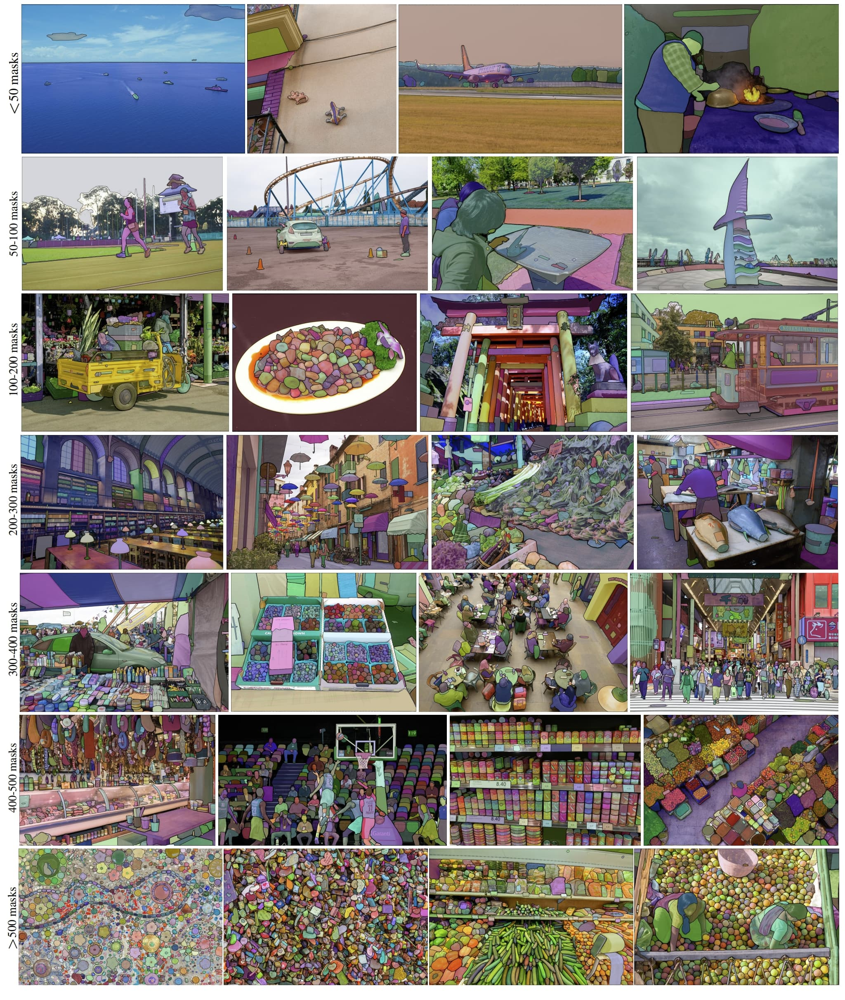

图 2： 来自我们新引入的数据集 SA-1B 的覆盖掩码的示例图像。SA-1B 包含 1100 万多样化、高分辨率、经过许可且保护隐私的图像和 11 亿高质量的分割掩码。这些掩码由 SAM 完全自动标注，并且如通过我们人工评级和众多实验验证的那样，是高质量和多样性的。我们按每个图像的掩码数量对图像进行分组以进行可视化 (平均每个图像有约 100 个掩码) 。

## 2. Segment Anything Task

我们从 NLP 中获得灵感，用下一个词元预测任务预训练基础模型和通过提示工程解决各种下游任务。为了构建分割的基础模型，我们旨在定义一个具有类似功能的任务。

**任务：** 首先将提示的概念从 NLP 转化到分割，其中==提示可以是一组前景/背景点、粗略的框或掩码、自由形式文本或者一般来说，任何指示在图像中进行分割的信息==。然后，可提示的分割任务是在给定任意提示的情况下返回有效的分割掩码。 “有效”掩码的要求仅意味着即使提示不明确并且可能指多个对象 (例如，回想一下衬衫与人的例子，并参见图 3) ，输出也至少应该是其中一个对象的合理掩码。这个要求类似于期望语言模型对模棱两可的提示输出连贯响应。我们选择这个任务，是因为它产生了一种自然的预训练算法和一个通过提示进行零样本迁移到下游分割任务的通用方法。

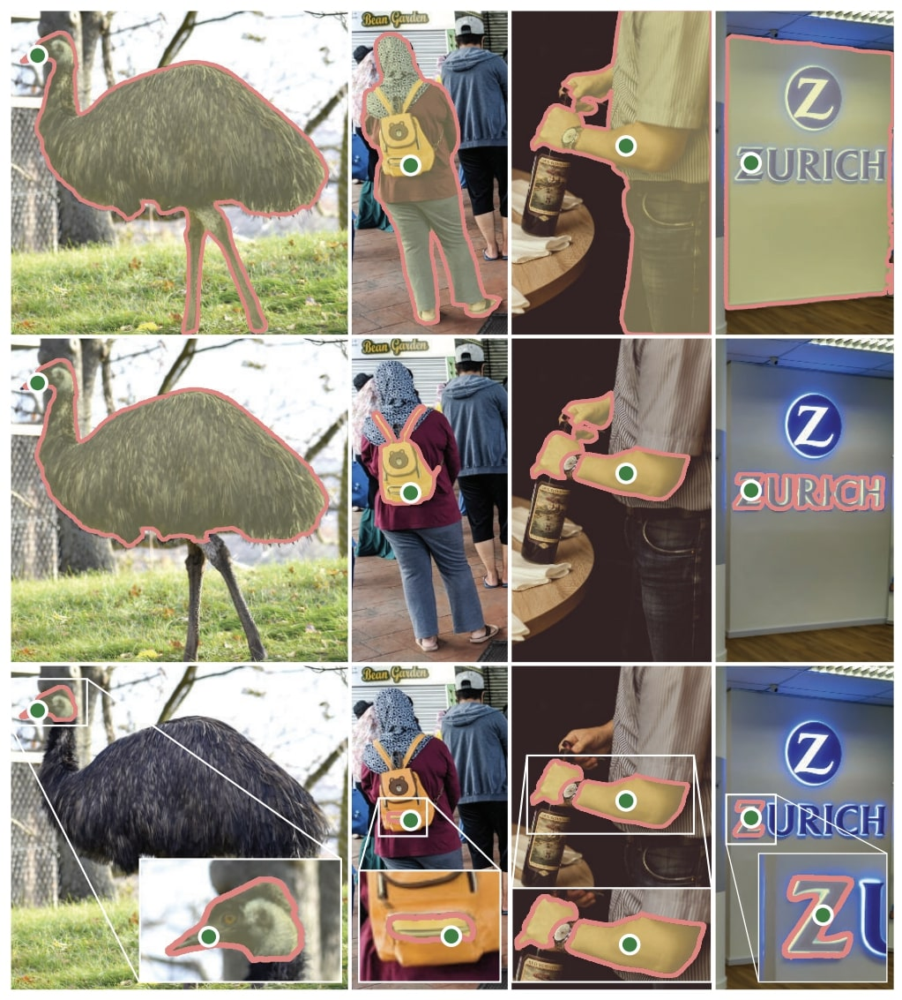

图 3：每列展示 3 个由 SAM 从一个有歧义的点提示 (绿色的圆) 生成的有效掩码。

**预训练：** 可提示分割任务提出了一种自然的预训练算法，该算法为每个训练样本模拟了一系列提示 (例如，点、框、掩码) ，并将模型的掩码预测与标注进行比较。我们从交互式分割中采用了这种方法，但是与交互式分割目的 (在足够多的用户输入后最终预测出有效的掩码) 不同，我们的目标是始终为任意提示预测出有效的掩码，即使提示是模棱两可的。这确保了预训练模型在涉及有歧义的用例时 (包括我们数据引擎所需的自动注释) 是有效的。我们发现在这个任务上表现良好是具有挑战性的，并且需要专门的建模和选择训练损失，我们将在第 3 节中讨论。

**零样本迁移：** 直觉上，我们的预训练任务赋予了模型在推理时对任意提示做出适当响应的能力，因此下游任务可以通过设计适当的提示来解决。例如，如果有一个猫的边界框检测器，则可以通过将检测器的框输出作为提示提供给我们的模型来解决猫的实例分割问题。一般来说，大量的实际分割任务都可以被视为提示。除了自动数据集标注外，我们在第 7 节中的实验中还探索了五个不同的示例任务。

**相关任务：** 分割是一个广泛的领域：有交互式分割、边缘检测、超像素化、对象候选生成、前景分割、语义分割、实例分割、全景分割等。我们的可提示分割任务的目标是产生一个功能广泛的模型，该模型可以通过提示工程适应许多 (尽管不是全部) 现有和新的分割任务。这种能力是任务泛化的一种形式。请注意，这与以前关于多任务分割系统的工作不同。在多任务系统中，单个模型执行一组固定的任务，例如联合语义、实例和全景分割，但训练和测试任务是相同的。我们工作中的一个重要区别是，==经过可提示分割训练的模型可以在推理时通过充当更大系统中的组件来执行新的、不同的任务==，例如，为了执行实例分割，可提示分割模型与现有物体检测器相结合。

**讨论：** 提示和组合是强大的工具，可以使单个模型以可扩展的方式使用，潜在地完成在模型设计时未知的任务。这种方法类似于其他基础模型的使用方式，例如，CLIP 如何成为 DALL·E 图像生成系统中文本-图像对齐组件。我们预计，由提示工程等技术驱动的可组合系统设计将比专门针对一组固定任务进行训练的系统实现更广泛的应用。从组合这个角度来比较可提示和交互式分割也很有趣：虽然交互式分割模型是为人类用户设计的，但为可提示分割训练的模型还可以被组合成更大的算法系统，正如我们将要展示的那样。

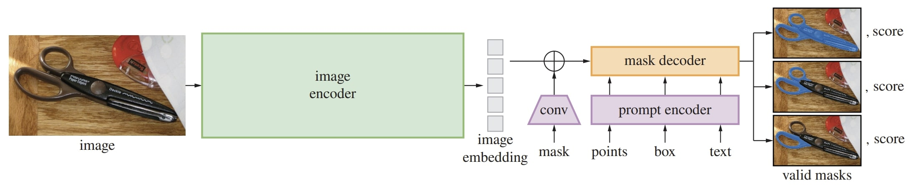

图 4：Segment Anything Model (SAM) 概述。一个重量级的图像编码器输出一个图像嵌入，然后可以通过各种输入的提示进行高效地查询，分摊开销实时产生物体掩码。对于对应超过一个物体的模棱两可的提示，SAM 可以输出多个有效的掩码和相关的置信度分数。

## 3. Segment Anything Model

接下来我们将描述可提示分割的 Segment Anything Model (SAM)。SAM 有三个组件，如图 4 所示：一个图像编码器、一个灵活的提示编码器和一个快速的掩码解码器。我们建立在 Transformer 视觉模型上，具有特定的折衷方案，以实现 (摊销) 实时性能。我们在这里从高层次描述这些组件，在[附录 A](# A. Segment Anything Model and Task Details) 中提供详细信息。

**图像编码器:** 受可扩展性和强大的预训练方法的启发，我们使用了==一个 MAE 预训练的 Vision Transformer (ViT)==，最低限度地适应处理高分辨率输入。图像编码器每次张图像运行一次，并且可以在提示模型之前应用。

**提示编码器：** 我们考虑两组提示：稀疏 (点、框、文本) 和密集 (掩码) 。我们通过位置编码和每个提示类型的学习嵌入相加来表示点和框，并使用来自 CLIP 的现成文本编码器来表示自由格式文本。密集提示 (即掩码) 使用卷积嵌入，并与图像嵌入逐元素相加。

**掩码解码器：** 掩码解码器高效地将图像嵌入、提示嵌入和输出词元映射到掩码。该设计受到 [DETR](https://arxiv.org/pdf/2005.12872v3.pdf) 和 [MaskFormer](https://arxiv.org/pdf/2107.06278.pdf) 的启发，采用了 ==Transformer 解码器块后跟着动态掩码预测头==。我们修改后的解码器块在两个方向上 (提示到图像嵌入和图像嵌入到提示) 使用提示自注意力和交叉注意力来更新所有嵌入。运行两个块后，我们上采样图像嵌入，并使用 MLP 将输出词元映射到一个动态线性分类器，然后在每个图像位置计算掩码前景概率。

**解决歧义：** 对于一个输出，如果给出一个模棱两可的提示，模型将平均多个有效掩码。为了解决这个问题，我们修改了模型，对于**单个提示预测多个输出掩码** (见图 3) 。我们发现 3 个掩码输出足以解决大多数常见情况 (嵌套掩码通常至多三层：整体、部分和子部分) 。在训练期间，我们仅在掩码上的最小损失反向传播。为了对掩码进行排名，模型为每个掩码预测置信度分数 (即估计的 IoU) 。

**效率：** 整体模型设计在很大程度上受效率驱动。给定预先计算的图像嵌入，提示编码器和掩码解码器在 Web 浏览器中，在 CPU 上运行时间约 50ms。这种运行时性能使模型能够进行无缝、实时的交互式提示。

**损失和训练：** 我们使用 DETR 中使用的 ==focal 损失和 dice 损失的线性组合==来监督掩码预测。我们使用混合的几何提示来训练可提示的分割任务 (有关文本提示，请参见 7.5 节) 。遵循 [[92][]、[37][]] 的方法，我们通过在每个掩码 11 轮中随机抽样提示来模拟交互式设置，从而使 SAM 能够无缝集成到我们的数据引擎中。

## 4. Segment Anything Data Engine

由于分割掩码在互联网上并不丰富，因此我们构建了一个数据引擎来收集我们的 11 亿掩码数据集 SA-1B。数据引擎有三个阶段：(1) 模型辅助人工标注阶段，(2) 混合了自动预测的掩码和模型辅助标注的半自动阶段，以及 (3) 模型生成掩码而无需标注员输入的完全自动阶段。我们将详细介绍每个阶段。

**辅助人工阶段：** 在第一阶段中，类似于经典的交互式分割，专业标注团队使用由 SAM 提供支持的基于浏览器的交互式分割工具通过单击前景/背景物体点标注掩码。可以使用像素级精确的“画笔”和“橡皮擦”工具来细化掩码。我们的模型辅助标注在浏览器内直接实时运行 (使用预先计算的图像嵌入)，从而实现了真正的交互体验。**我们没有施加语义约束来标注物体，标注者自由地标注“物品”和“事物”。**我们建议标注者标注他们可以命名或描述的对象，但没有收集这些名称或描述。标注者被要求按显著性的顺序标注对象，并鼓励一旦一个掩码需要超过 30 秒进行标注时跳过到下一张图片。

在此阶段开始时，使用常见的公共分割数据集对 SAM 进行了训练。在有足够的数据标注之后，SAM 仅使用新标注的掩码重新训练。随着收集到更多的掩码，图像编码器从 ViT-B 扩展到 ViT-H，且其他架构细节也发生了变化；我们总共重新训练了6次模型。随着模型的改进，每个掩码的平均标注时间从 34 秒降至 14 秒。我们注意到，14秒比 COCO 的掩码标注快 6.5 倍，并且仅比使用极端点标注边界框慢 2 倍。随着 SAM 的改进，每张图像的平均掩码数从 20 个增加到 44 个。总体而言，在此阶段我们从 12 万张图像中收集了430 万个掩码。

**半自动阶段：** 在这个阶段，我们旨在增加掩码的多样性，以提高我们的模型的分割一切物体的能力。为了让标注者关注不显著的物体，我们首先自动检测有信心的掩码。然后，我们向标注者呈现预先填充了这些掩码的图像，并要求他们标注任何其他未标注的物体。为了检测到有信心的掩码，我们使用一个通用的“对象”类别在所有第一阶段在掩码上训练了一个边界框检测器 Faster R-CNN。在这个阶段，我们在 18 万张图像中收集了额外 590 万个掩码 (总共 1020 万个掩码)。与第一阶段一样，我们周期性地 (5 次) 在新收集的数据上重新训练我们的模型。因为这些物体更具挑战性，每个掩码的平均注释时间回到了 34 秒 (不包括自动掩码)。每张图像的平均掩码数从 44 个增加到 72 个 (包括自动掩码)。

**完全自动阶段：** 在最后一个阶段，标注是完全自动的。这是由于我们的模型有两个主要的增强。首先，在这个阶段开始时，我们收集了足够多的掩码，包括来自上一个阶段的多样化掩码，极大地改善了模型。其次，在这个阶段，我们已经开发了具有歧义感知的模型，它允许我们即使在模棱两可的情况下也能预测有效的掩码。具体来说，我们用 $32 \times 32$ 的点的规则网格提示模型，并为每个点预测一组可能对应于有效对象的掩码。使用歧义感知模型，如果一个点位于部分或子部分上，我们的模型将返回子部分、部分和整个对象。我们的模型的 IoU 预测模块用于选择有信心的掩码；此外，我们只识别和选择稳定的掩码 (如果概率阈值化映射为 $0.5-\delta$ 和 $0.5+\delta$ 结果相似，则认为掩码稳定)。最后，在选择有信心和稳定的掩码之后，我们应用非极大值抑制 (NMS) 来过滤重复项。为了进一步提高较小掩码的质量，我们还处理了多个重叠的缩放图像裁剪。有关此阶段的更多详细信息，参见[附录 B](# B. Automatic Mask Generation Details)。我们将完全自动化的掩码生成应用于数据集中的全部 1100 万张图像，共产生了 11亿个高质量掩码。接下来，我们将描述和分析所得到的数据集 SA-1B。

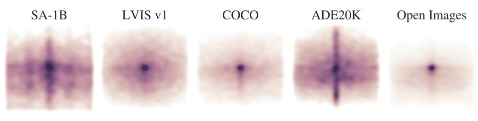

图 5：图像大小归一化的掩码中心分布

## 5. Segment Anything Dataset

我们的数据集 SA-1B 由 1100 万张多样化、高分辨率、经过许可和隐私保护的图像和 11 亿个由我们的数据引擎收集的高质量分割掩码组成。我们将 SA-1B 与现有数据集进行比较，并分析掩码的质量和属性。我们发布 SA-1B 以帮助计算机视觉基础模型的未来发展。我们注意到，SA-1B 将在一项用于某些研究用途根据有利的许可协议下发布，并保护研究人员。

**图像：** 我们从一家直接与摄影师合作的供应商获得了一组新的 1100 万张图像的许可。这些图像具有高分辨率 (平均 $3300 \times 4950$ 像素)，由此产生的数据大小可能会带来可访问性和存储方面的挑战。因此，我们发布了短边为1500 像素的下采样后的图像。即使在下采样后，我们的图像的分辨率也比许多现有的视觉数据集高得多 (例如，COCO 图像约为 $480 \times 640$ 像素) 。请注意，大多数模型今天都在使用更低分辨率的输入。请注意，当今大多数模型都在低得多的分辨率输入上运行。发布的图像中的人脸和车辆牌照已经被模糊处理。

**掩码：** 我们的数据引擎生成了 11 亿个掩码，其中 99.1% 是完全自动生成的。因此，自动生成的掩码的质量非常重要。我们直接将它们与专业标注进行比较，并查看与著名的分割数据集的相比各种掩码属性如何。正如下面的分析和第 7 节中的实验所证明的那样，我们的自动生成的掩码具有高质量且对于训练模型非常有效。受这些发现的激励，SA-1B 仅包括自动生成的掩码。

**掩码质量：** 为了估计掩码质量，我们随机抽样了500张图像 (约 5 万个掩码) ，并要求我们的专业标注员改善这些图像中所有掩码的质量。标注员使用我们的模型和像素级精确的“画笔”和“橡皮擦”编辑工具来完成这项工作。这个过程产生了一对自动预测的和专业校正后的掩码。我们计算了每一对之间的 IoU，并发现 94% 的掩码对之间 IoU 大于 90% (97% 的掩码对之间 IoU 大于 75%) 。相比之下，先前的工作估计标注者内部一致性为 85-91% IoU。我们在第 7 节中进行的实验通过人类评级证实，相对于各种数据集，掩码质量很高，并且在自动生成的掩码上训练 SAM 几乎与使用数据引擎生成的所有掩码一样好。

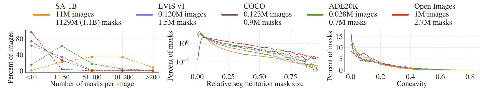

图 6：数据集掩码属性。图例引用了每个数据集中图像和掩码的数量。注意，SA-1B 的图像数量是现有的最大的分割数据集 Open Images 的 11 倍，掩码数量是其 400 倍。

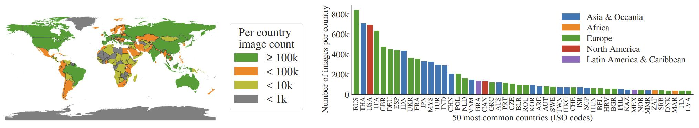

图 7：SA-1B 图像估计的地理分布。世界上大多数国家在 SA-1B 中都有超过 1000 张图像，而最多图像的三个国家来自世界不同地区。

**掩码属性：** 在图 5 中，我们将 SA-1B 中物体中心的空间分布与现有最大的分割数据集进行了比较。所有数据集中都存在常见的摄影师偏见。我们观察到，与 LVIS v1 和 ADE20K 这两个分布最相似的数据集相比，SA-1B 覆盖了更多的图像角落，而 COCO 和 Open Images V5 具有更显著的中心偏差。在图 6 (图例) 中，我们通过大小比较这些数据集。 SA-1B 的图像数量是第二大的 Open Images 的 11 倍，掩码数量是其 400倍。平均而言，它每张图像有 36 倍于 Open Images 的掩码数量。在这方面 (每张图掩码数量) 最接近的数据集 ADE20K 每张图像仍然少 3.5 倍掩码。图 6 (左) 绘制了每张图像的掩码数量分布。接下来，我们在图 6 (中) 中查看相对于图像的掩码大小 (掩码面积除以图像面积的平方根) 。由于我们的数据集每张图像都有更多掩码，因此它也倾向于包含更高比例的小型和中型相对大小的掩码。最后，为了分析形状复杂性，我们在图6 (右) 中查看掩码**凹度** (1 减去掩码面积除以掩码凸包面积) 。由于形状复杂性与掩码大小相关，因此我们通过首先从分组掩码大小进行分层抽样来控制数据集的掩码大小分布。我们观察到，我们的掩码凹度分布与其他数据集的凹度分布基本相似。

## 6. Segment Anything RAI Analysis

> 这一节机翻，没有进行校验。

接下来，我们通过调查使用SA-1B和SAM时可能存在的公平性问题和偏见，对我们的工作进行负责任的AI (RAI) 分析。我们关注SA-1B的地理和收入分布以及SAM在人们的受保护属性上的公平性。我们还提供了F中的数据集、数据注释和模型卡片。

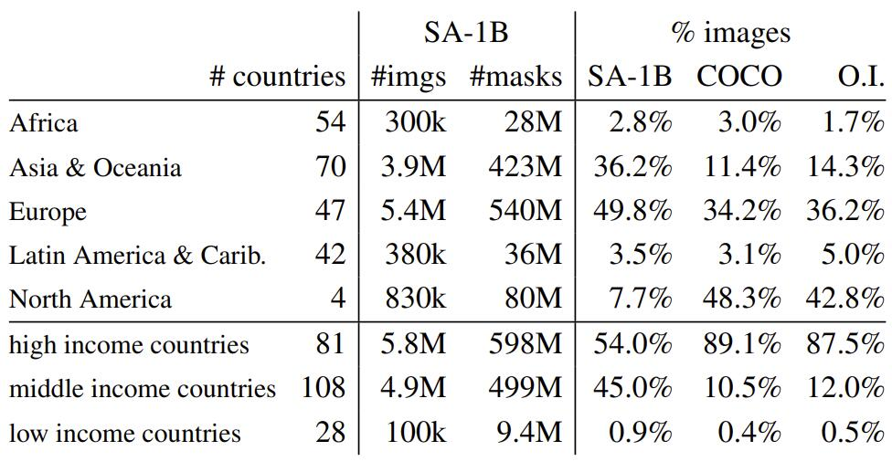

表 1：地理和收入代表性的比较。SA-1B 在欧洲、亚洲和大洋洲以及中等收入国家中的代表性更高。来自非洲、拉丁美洲和加勒比海地区以及低收入国家的图像在所有数据集中都占比较低。

**地理和收入代表性：** 我们使用标准方法 (见附录 C) 推断了拍摄国家的图像。在图7中，我们可视化了SA-1B中每个国家的图像计数 (左) 和最多图像的50个国家 (右) 。我们注意到前三个国家来自世界不同地区。接下来，在表1中，我们比较了SA-1B、COCO [66]和Open Images [60]的地理和收入代表性。SA-1B在欧洲、亚洲和大洋洲以及中等收入国家中拥有更高比例的图像。所有数据集都低估了非洲以及低收入国家。我们注意到，在SA-1B中，所有地区，包括非洲，至少有2800万个掩模，是任何先前数据集的总掩模数量的10倍以上。最后，我们观察到每张图像的平均掩模数 (未显示) 在地区和收入上是相当一致的 (94-108个/图像) 。

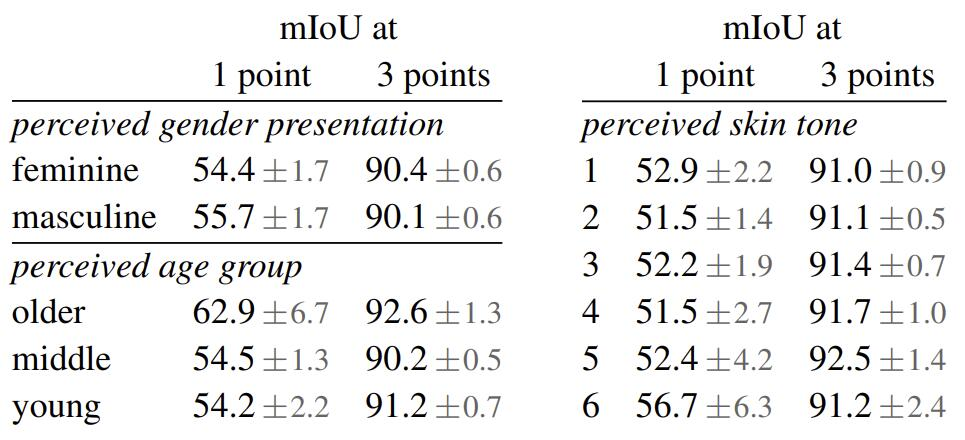

表 2：SAM 在感知性别表示、年龄组和肤色方面的人物分割的性能。显示95%置信区间。在每个分组中，除了老年人与中年人之间，所有置信区间都重叠。

**人物分割时的公平性：** 我们通过测量SAM在不同群体之间的性能差异，调查了在感知性别表现、感知年龄组和感知肤色方面可能存在的公平性问题。我们使用More Inclusive Annotations for People (MIAP) [87]数据集进行性别表现和年龄评估，使用专有数据集进行肤色评估 (见§C) 。我们的评估使用随机抽样1和3个点的模拟交互式分割 (见§D) 。表2 (左上) 显示了感知性别表现的结果。我们注意到女性在检测和分割数据集中被证明是低估的[115]，但观察到SAM在各组之间的表现相似。我们在表2 (左下) 中重复了感知年龄的分析，注意到那些被认为年轻和年长的人在大规模数据集中被证明是低估的[110]。SAM在那些被认为年长的人中表现最好 (尽管置信区间很大) 。最后，我们在表2 (右) 中重复了对感知肤色的分析，注意到那些肤色较浅的人在大规模数据集中被证明是过度代表，而肤色较深的人则被低估[110]。由于MIAP不包含感知肤色注释，因此我们使用一个包含感知Fitzpatrick皮肤类型[36]注释的专有数据集，该类型从1 (最浅肤色) 到6 (最深肤色) 。虽然平均值有所不同，但我们没有发现各组之间存在显著差异。我们认为我们的发现源于任务的性质，并承认当SAM用作更大系统中的组件时可能会出现偏差。最后，在§C中，我们将分析扩展到服装分割，在那里我们发现了跨感知性别表现存在偏差的迹象。

## 7. Zero-Shot Transfer Experiments

在本节中，我们使用 SAM 进行了零样本迁移实验。我们考虑五个任务，其中四个与用于训练 SAM 的可提示分割任务有很大不同。这些实验在训练期间未见的数据集和任务上评估 SAM (我们对“零样本迁移”的使用遵循 CLIP 中的用法)。数据集可能包括新颖的图像分布，例如水下或第一视角的图像 (例如图 8)，据我们所知，这些图像没有出现在 SA-1B 中。

我们的实验从测试可提示分割的核心目标开始：从任意提示生成有效掩码。我们强调单个前景点提示的挑战性场景，因为它比其他更具体的提示更容易产生歧义。接下来，我们提出了一系列实验，这些实验遍历了低、中、高级别的图像理解，并大致与该领域的历史发展平行。具体而言，我们提示 SAM 执行以下任务：(1) 执行边缘检测，(2) 分割所有内容，即对象候选生成，(3) 分割检测到的对象，即实例分割，以及 (4) 作为概念验证，根据自由形式文本分割对象。这四个任务与 SAM 接受训练并通过提示工程实现的提示分割任务有很大不同。我们的实验以消融实验结束。

**实现：** 除非另有说明：(1) SAM使用 MAE 预训练的 ViT-H 图像编码器，(2) SAM 在SA-1B上进行了训练，注意该数据集仅包括来自我们数据引擎的最终阶段的自动生成的掩码。其他所有有关模型和训练的详细信息，例如超参数，请参阅附录 A。

### 7.1 Zero-Shot Single Point Valid Mask Evaluation

**任务：** 评估从单个前景点分割对象。这个任务是不适当的，因为一个点可以指代多个对象。大多数数据集中的真实掩码不列举所有可能的掩码，这可能会使自动度量不可靠。因此，我们使用一项人类评估 (标注者从 1 (无意义) 到 10 (像素完美) 对掩码质量进行评分) 补充标准的 mIoU 度量 (预测掩码和真实掩码之间所有 IoU 的平均值)。有关更多详细信息，请参见附录 D.1、附录 E和附录 G。

默认情况下，我们从真实掩码的“中心”采样点 (在掩码的内部距离变换的最大值处)，遵循交互式分割中的标准评估协议。由于 SAM 能够预测多个掩码，因此我们默认仅评估模型最自信的掩码。基线都是单掩码方法。我们主要与 RITM 进行比较，RITM 是一种强大的交互式分割器，与其他强大的基线相比，它在我们的基准测试中表现最佳。

**数据集：** 我们使用了一个新编译的包含 23 个具有不同的图像分布的数据集的套件。图 8 列出了这些数据集，并展示了每个数据集的样本 (更多细节请参见附录表 7) 。我们使用所有 23 个数据集进行 mIoU 评估。对于人类评估，我们使用图 9b 中列出的子集 (由于此类研究的资源需求) 。该子集包括根据自动指标 SAM 优于或劣于 RITM 的数据集。

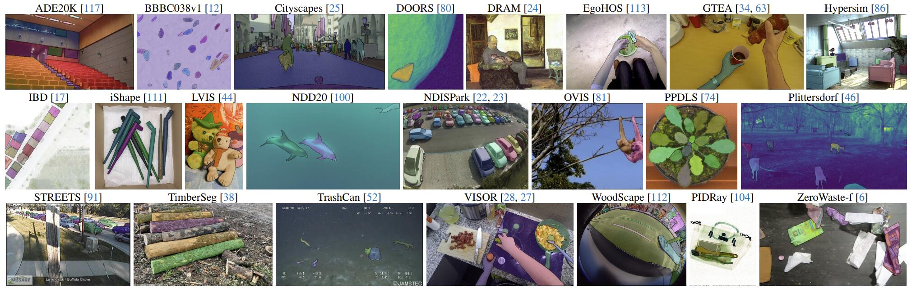

图 8：来自用于评估 SAM 的零样本迁移能力的 23 个多样化分割数据集的样本。

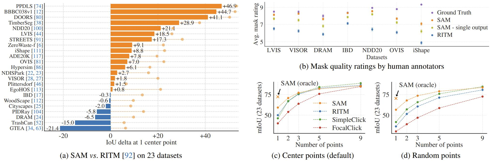

图 9：23 个数据集上点到掩码的评估。(a) SAM 和最强的单点分割器 RITM 的平均 IoU。由于存在歧义，单个掩码可能与真实掩码不匹配；圆圈显示 SAM 的 3 个预测中最相关的“oracle”结果。(b) 每个数据集的标注者对掩码质量评分的比较，1 (最差) 到10 (最佳)。所有方法都使用真实掩码中心作为提示。(c, d) 使用不同数量的点的 mIoU。 SAM 在1个点上显着优于先前的交互式分割器，更多点时和其他方法持平。1 个点时的低绝对 mIoU 是歧义导致。

**结果：** 首先，我们使用 mIoU 对 23 个数据集的完整套件进行自动评估。我们在图 9a 中将每个数据集的结果与 RITM 进行比较。SAM 在 23 个数据集中的 16 个数据集上都获得了更高的结果，最高可达 ~47 IoU。我们还提供了一个“oracle”结果，其中最相关的掩码是通过将 SAM 的 3 个掩码与真实注释进行比较来选择的，而不是选择最有信心的掩码。这揭示了歧义对自动评估的影响。特别是，在使用 oracle 执行歧义消解时，SAM 在所有数据集上均优于 RITM。

> oracle 就是把 3 个掩码和标注对比，选最好那个。:dog2:

人类评估的结果如图 9b 所示。误差条是平均掩码评分的 95% 置信区间 (所有差异都显著；细节见附录 E) 。我们观察到，标注者一致地对 SAM 的掩码质量评分明显高于最强基线 RITM。一个消融实验，SAM 的一个“不考虑模糊性”的版本，只有一个输出掩码，评分一直较低，但仍高于 RITM。SAM 的平均评分在 7 到 9 之间，对应的定性评分指南：“高分 (7-9) ：对象可识别，错误很小且很少 (例如，缺少小型、严重遮挡的断开组件等) 。”这些结果表明，SAM 已经学会从单个点中分割有效掩码。注意，在像 DRAM 和 IBD 这样的数据集中，SAM 在自动指标上表现较差，但在人类评估中获得了一致较高的评分。

图 9c 展示了额外的基线，SimpleClick 和 FocalClick，它们的单个点性能低于 RITM 和 SAM。随着点数从 1 增加到 9，我们观察到方法之间的差距减小。这是意料之中的，因为任务变得更容易；此外，SAM 未对非常高的 IoU 区域进行优化。最后，在图 9d 中，我们将默认中心点采样替换为随机点采样。我们观察到，SAM 与基线之间的差距增大，并且 SAM 能够在任一采样方法下取得可比较的结果。

### 7.2. Zero-Shot Edge Detection

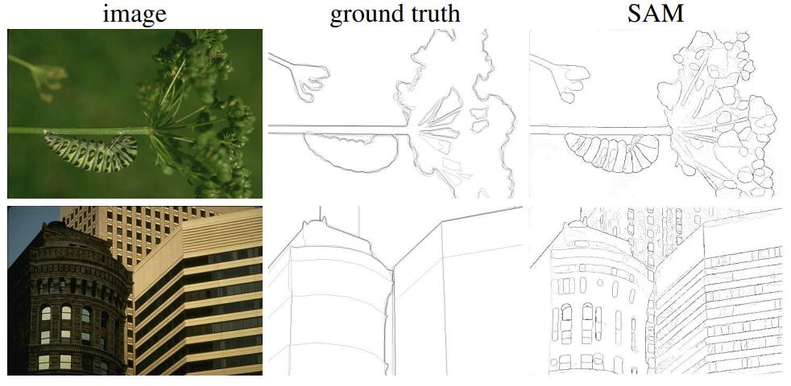

图 10：在 BSDS500 上的零样本边缘预测。SAM 未被训练用于预测边缘映射，也未在训练期间访问 BSDS 的图像或者标注。

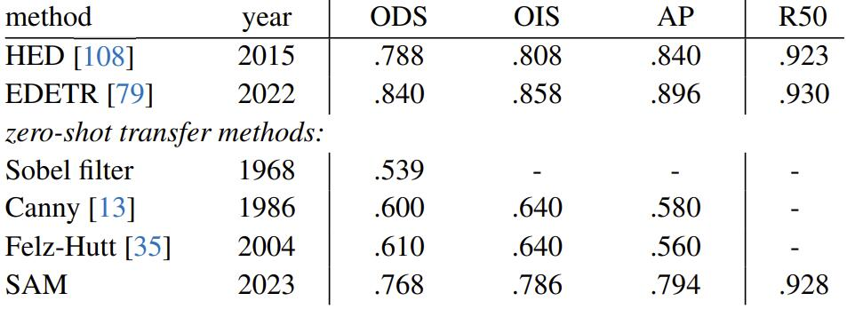

表 3：在 BSDS500 上零样本迁移至边缘检测。

**方法：** 我们使用 BSDS500 在边缘检测的经典低级任务上评估 SAM。我们使用简化版的自动掩码生成管道。具体而言，我们使用 $16×16$ 的前景点的规则网格提示 SAM，从而产生 768 个预测掩码 (每个点 3 个)。通过 NMS 删除冗余掩码。然后，使用未阈值化的掩模概率图的 Sobel 滤波和标准的轻量级后处理 (包括边缘 NMS) 计算边缘图 (详情见附录 D.2)。

**结果：** 我们在图 10 中展示了有代表性的边缘映射 (更多信息参见图 15)。定性地，我们观察到即使 SAM 没有针对边缘检测进行训练，它也会产生合理的边缘映射。与真实标注相比，SAM 预测了更多的边缘，包括 BSDS500 中未标注的敏感边缘。这种偏差在表 3 中定量反映出来：50％ 精度 (R50) 下的召回率很高，但代价是精度。SAM 自然落后于学习了 BSDS500 偏差 (即哪些边缘要抑制) 的最先进方法。尽管如此，与开创性的深度学习方法，例如 HED (也在 BSDS500 上训练) 相比，SAM 表现良好，并且比明显由于以前的零样本迁移方法，尽管这些方法已过时。

### 7.3. Zero-Shot Object Proposals

**方法：** 接下来，我们在中级任务目标候选生成上评估 SAM。该任务在目标检测研究中发挥了重要作用，是开创性系统的中间步骤。为了生成目标候选，我们运行了一个稍微修改的自动掩码生成管道版本，并将输出掩码作为候选 (细节见附录D.3)。

我们在 LVIS v1 上计算标准平均召回率 (AR) 指标。我们聚焦于 LVIS，因为它的大量类别提出了一个具有挑战性的测试。我们与实现为 ViTDet 检测器 (具有级联 Mask R-CNN ViT-H) 的强基线进行比较。我们注意到，这个“基线”对应于向游戏 AR 展示的“检测器伪装成提议生成器” (DMP) 方法，使其成为一个真正苛刻的比较。

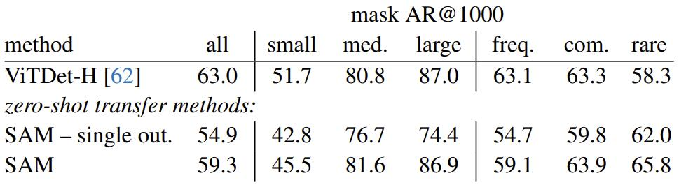

表 4：在 LVIS v1 上的目标候选生成。 SAM 被用于零样本，即它未被训练用于目标候选生成，也未访问 LVIS 的图像或标注。

**结果：** 在表 4 中，不出所料地看到使用 ViTDet-H 的检测作为对象候选总体上表现最好。但是，SAM 在几个指标上表现出色。值得注意的是，它在中等和大型物体以及罕见和常见物体上优于 ViTDet-H。实际上，SAM 只在小型对象和频繁对象方面落后于 ViTDet-H，在这些方面 ViTDet-H 可以轻松地学习 LVIS 特定的标注偏差，因为它是在LVIS 上进行训练的，与 SAM 不同。我们还与 SAM 的去除歧义感知版本进行比较，后者在所有 AR 指标上表现明显差于 SAM。

### 7.4. Zero-Shot Instance Segmentation

**方法：** 转向更高级的视觉中，我们使用 SAM 作为实例分割器的分割模块。实现很简单：我们运行一个目标检测器 (之前使用的 ViTDet) 并使用其输出框提示 SAM。这展示了在更大的系统中组合 SAM。

**结果：** 我们在表 5 中比较了 SAM 和 ViTDet 在 COCO 和 LVIS 上预测的掩码。查看掩码 AP 指标，我们观察到两个数据集上存在差距，其中 SAM 相对接近，尽管肯定落后于 ViTDet。通过可视化输出，我们观察到 SAM 的掩码通常比 ViTDet 更具有定性优势，边界更清晰 (请参见附录 D.4和图 16)。为了调查这一观察结果，我们进行了一项额外的人类评估，要求标注者使用之前的 1 到 10 质量评级上对 ViTDet 和 SAM 的掩码进行评分。在图 11 中，我们观察到 SAM 在人类评估中始终优于 ViTDet。

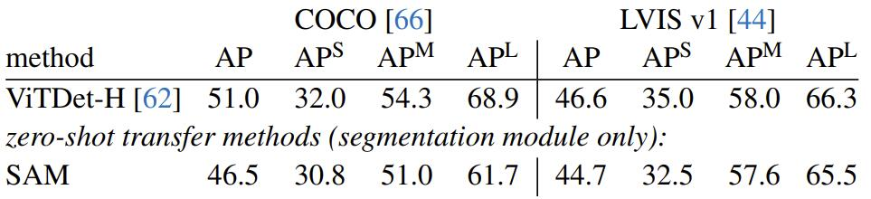

表 5：实例分割结果。SAM 使用 ViTDet 的框作为提示进行零样本分割。完全监督的 ViTDet 优于 SAM，但在更高质量的 LVIS 掩码上差距缩小。有趣的是，根据人类评分，SAM 优于 ViTDet (见图 11)。

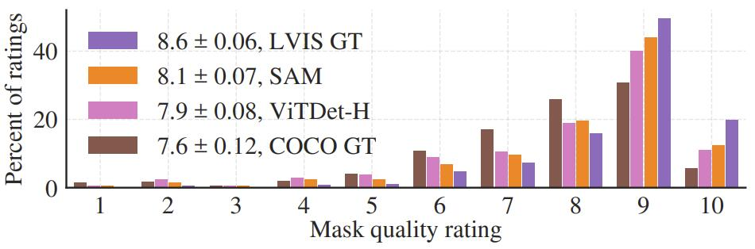

图 11：我们的人类评估中的 ViTDet 和 SAM 掩码质量评分分布，都使用 LVIS 的真实框。我们还报告了 LVIS 和 COCO 标注的质量。图例显示评分均值和 95% 置信区间。尽管其 AP 较低 (表 5)，但 SAM 的评分高于 ViTDet，这表明 ViTDet 利用了 COCO 和 LVIS 训练数据中的偏差。

我们假设在 COCO上掩码 AP 差距更大，标注质量相对较低 (由人类评估证实)，ViTDet 学习了 COCO 掩码的特定偏差。 SAM 是零样本方法，无法利用这些偏差 (通常不希望的)。LVIS 数据集具有更高质量的标注，但仍存在特定的特异性 (例如，掩码不包含孔，它们是通过简单多边形构造的) 和模态与非模态掩码的偏差。同样，SAM 没有接受过学习这些偏差的训练，而 ViTDet 可以利用它们。

### 7.5. Zero-Shot Text-to-Mask

**方法：** 最后，我们考虑一个更高级的任务：根据自由形式文本分割物体。这个实验是 SAM 处理文本提示的能力的概念验证。虽然我们在所有先前的实验中都使用了完全相同的 SAM，但对于这个实验，SAM 的训练过程被修改为使其具有文本感知能力，但不需要新的文本注释。具体而言，对于每个手动收集的面积大于 $100^2$ 的掩码，我们提取 CLIP 图像嵌入。然后，在训练期间，我们使用提取的 CLIP 图像嵌入提示 SAM，作为其第一个交互。这里的关键观察是，==因为 CLIP 的图像嵌入经过训练以与其文本嵌入对齐，所以我们可以使用图像嵌入进行训练，但使用文本嵌入推理==。也就是说，在推理时，我们通过 CLIP 的文本编码器运行文本，然后将生成的文本嵌入作为提示提供给 SAM (细节参见附录 D.5)。

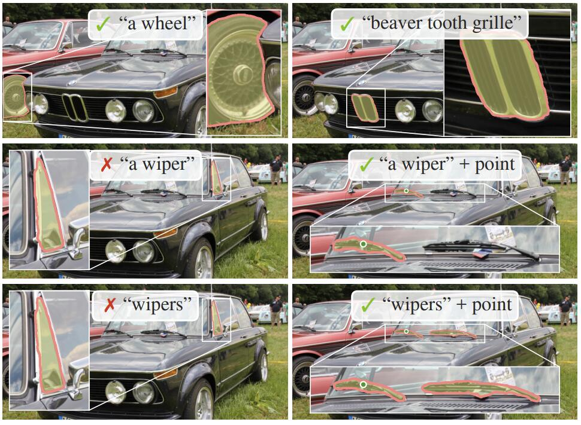

图 12：零样本文本到掩码。SAM 可以处理简单和微妙的文本提示。但 SAM 无法做出正确预测时，一个额外的点会有帮助。

**结果：** 我们在图 12 中展示了定性结果。SAM 可以根据简单的文本提示 (如“轮子”) 以及短语 (如“海狸齿格栅”) 分割对象。当 SAM 仅从文本提示中无法选择正确的对象时，一个额外的点通常会修复预测，类似于 PhraseClick。

### 7.6. Ablations

我们在单个中心点提示协议下对我们的 23 个数据集套件进行了多个消融实验。回忆一下，单个点可能是有歧义的，并且歧义可能不在标注中表示出来，标注仅包含每个点的单个掩码。由于 SAM 在零样本转移设置中运行，因此 SAM 的排名最高的掩码与数据标注指南产生的掩码之间可能存在系统偏差。因此，我们还报告了相对于标注的最佳掩码 (“oracle”)。

图 13 (左) 绘制了 SAM 在从数据引擎阶段累积数据时的性能。我们观察到每个阶段都会增加 mIoU。当使用所有三个阶段训练时，自动生成的掩码远远超过手动和半自动生成的掩码。为了解决这个问题，我们发现在训练期间通过对手动和半自动生成的掩码进行 10 倍过采样可以获得最佳结果。这种设置使训练变得复杂。因此，我们测试了第四种设置，仅使用自动生成的掩码。使用此数据，SAM 的性能仅略低于使用所有数据 (∼0.5 mIoU)。因此，默认情况下，我们仅使用自动生成的掩码以简化训练设置。 

在图 13 (中) ，我们查看数据量的影响。完整的 SA-1B 包含 1100 万张图像，我们将其均匀地子采样为 100 万和 10 万张图像进行消融。在 10 万张图像中，在所有设置下都观察到了大量 mIoU 下降。但是，在 100 万张图像中，约占完整数据集的 10％，我们观察到与使用完整数据集相当的结果。这一数据集仍然包括大约 1 亿个掩码，可能是许多用例的实际设置。

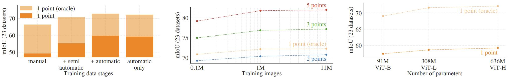

图 13：我们的数据引擎阶段，图像编码器缩放和训练数据缩放的消融实验。(左) 每个数据引擎阶段都会提升我们的 23 个数据集套件，并且仅使用自动生成的数据 (我们的默认设置) 进行训练可产生与使用所有三个阶段的数据相似的结果。 (中) 使用 ~10％ 的 SA-1B 和完整的 SA-1B 训练的 SAM 相当。我们默认使用所有 1100 万张图像进行训练，但使用 100 万张图像是合理的实际设置。(右) 缩放 SAM 的图像编码器显示出有意义但趋于饱和的收益。然而，在某些情况下，较小的图像编码器可能更受欢迎。

最后，图13 (右) 显示了使用 ViT-B，ViT-L 和 ViT-H 图像编码器的结果。 ViT-H 相对于 ViT-B 提升显著，但比 ViT-L仅有微小的提升。目前看来，进一步缩放图像编码器似乎没有意义。

> 意思是用 ViT-L 就足够了？有可能用其它 Transformer 结构的编码器，例如 Swin Transformer，能获得更好的结果吗？

## 8. Discussion

**基础模型：** 自机器学习早期以来，预训练模型已经被用于下游任务。随着对规模的越加强调，这种范式在最近几年变得越来越重要，并且这些模型最近被重新命名为“基础模型”：即“在大规模数据上进行训练，并可适用于各种下游任务的模型”。我们的工作很好地符合此定义，但我们注意到，图像分割的基础模型是一个天生有限范围，因为它代表了计算机视觉中重要但仅占一小部分的子集。我们还将我们的方法的一个方面与 [[8][]] 进行对比，后者强调自监督学习在基础模型中的作用。虽然我们的模型是用自监督技术 (MAE) 初始化的，但它绝大多数能力来自大规模监督训练。在数据引擎可以扩展可用标注的情况下，像我们这样的情况，监督训练提供了一种有效的解决方案。

**组合性：** 预训练模型甚至可以为超出训练时刻想象的新功能提供动力。一个著名的例子是CLIP [82]如何作为更大系统 (如DALL·E [83]) 中的组件使用。我们的目标是通过SAM使这种组合变得简单明了。我们通过要求SAM对各种分割提示预测有效的掩码来实现这一目标。效果是在SAM和其他组件之间创建可靠的接口。例如，MCC [106]可以轻松使用SAM对感兴趣的对象进行分割，并从单个RGB-D图像进行三维重建，从而实现对未见过对象的强泛化。在另一个例子中，可以使用可穿戴设备检测到的凝视点提示SAM，从而实现新的应用程序。由于SAM能够推广到新领域，例如自我中心图像，因此这些系统无需进行额外的培训即可工作。

**局限性：** 虽然 SAM 在一般情况下表现良好，但它并不完美。它可能会错过细微的结构，有时会产生不连贯的小组件的，并且不像更计算密集的方法“放大”那样清晰地产生边界。一般来说，专用的交互式分割方法在提供许多点时优于 SAM。与这些方法不同，==SAM 是为通用性和使用广度而不是高 IoU 交互式分割而设计的==。此外，SAM 可以实时处理提示，但是当使用重型图像编码器时，SAM 的整体性能并不是实时的。我们对文本到掩码任务的尝试是探索性的，并不完全可靠，尽管我们认为可以通过更多的努力来改进它。**虽然 SAM 可以执行许多任务，但尚不清楚如何设计实现语义和全景分割的简单提示**。最后，有一些特定领域的工具，在各自的领域中优于  SAM。

**结论：** Segment Anything 项目试图将图像分割提升到基础模型时代。我们的主要贡献使这一飞跃成为可能：一个新任务 (可提示分割)、一个模型 (SAM) 和一个数据集 (SA-1B)。SAM 是否达到基础模型的地位，取决于它在社区中的使用情况，但无论如何，我们都期望这项工作的视角、超过 10 亿个掩模的发布，以及我们的可提示分割模型将有助于铺平前进的道路。

## Appendix

目录：

- [A](# A. Segment Anything Model and Task Details): Segment Anything Model and Task Details
- [B](# B. Automatic Mask Generation Details): Automatic Mask Generation Details
- C: RAI Additional Details
- D: Experiment Implementation Details
- E: Human Study Experimental Design
- F: Dataset, Annotation, and Model Cards
- G: Annotation Guidelines

### A. Segment Anything Model and Task Details

**图像编码器：** 一般来说，图像编码器可以是任何输出 $C \times H \times W$ 图像嵌入的网络。出于可扩展性和强大的预训练访问的考虑，我们使用了一个 MAE 预训练的 Vision Transformer (ViT)，并最低限度地适应处理高分辨率输入，具体来说是==一个具有 $14 \times 14$ 窗口化注意力和四个等间距的全局注意力块的 ViT-H/16==，遵循 [ViTDet](https://arxiv.org/pdf/2203.16527.pdf)。==图像编码器的输出是输入图像大小的缩小 16 倍的嵌入==。由于我们的运行时目标是实时处理每个提示，因此我们可以承受高数量级的图像编码器 FLOPs，因为它们对只每个图像计算一次，而不是每个提示。

按照标准做法 (例如 [Copy-Paste augmentation](https://arxiv.org/pdf/2012.07177.pdf))，我们使用通过重新缩放图像并填充短边获得的 $1024 \times 1024$ 的输入分辨率。因此，图像嵌入为 $64 \times 64$ (1024 缩小 16 倍)。为了减少通道维度，按照 ViTDet 的方法，我们使用 $1 \times 1$ 卷积来获取 256 个通道，接着一个 $3 \times 3$ 卷积也有 256 个通道。每个卷积后面都接一个层归一化。

**提示编码器：** 稀疏提示被映射到如下的 256 维向量嵌入。一个点被表示为点的位置编码和两个指示点是在前景还是背景中的学习嵌入的其中之一的和。一个框被表示为一个嵌入对：(1) 它的左上角的位置编码与表示“左上角”的学习嵌入相加，(2) 相同的结构，但使用表示“右下角”的学习嵌入。最后，为了表示自由形式文本，我们使用 CLIP 中的文本编码器 (一般来说可以使用任意文本编码器) 。我们在本节的其余部分关注几何提示，在附录 D.5 中深入讨论文本提示。

密集提示 (即掩码) 与图像具有空间对应关系。我们以比输入图像低 4 倍的分辨率输入掩码，然后使用两个输出通道分别为 4 和 16 的 $2 \times 2$ ，步幅为 2 的卷积进一步缩小 4 倍。最后，用一个 $1 \times 1$ 卷积将通道维度映射到 256。每层之间由 GELU 激活和层归一化分隔。然后将掩码和图像嵌入逐元素相加。如果没有掩码提示，则在每个图像嵌入位置上叠加表示“无掩码”的学习嵌入。

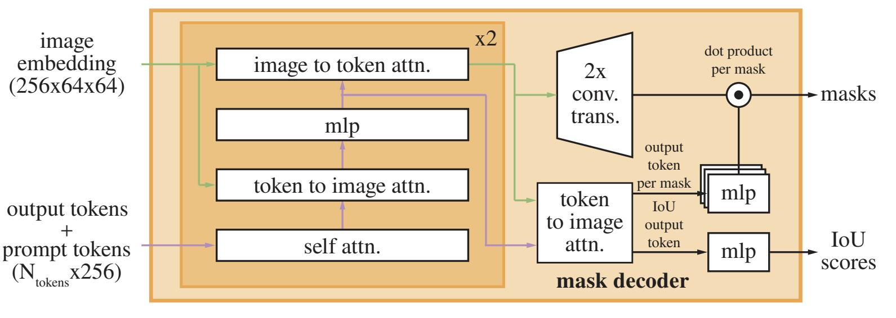

图 14：轻量级掩码解码器的细节。一个两层的解码器通过交叉注意力更新图像嵌入和提示词元。然后，图像嵌入被放大 2 倍，更新后输出词元被用于动态地预测掩码。(为了清晰起见，图中未显示：在每个注意力层中，将位置编码添加到图像嵌入中，并将整个原始的提示词元 (包括位置编码) 重新添加到词元 quries 和 keys。)

**轻量级掩码解码器：** 这个模块高效地将图像嵌入和一组提示嵌入映射到一个输出掩码。为了结合这些输入，我们借鉴了 Transformer 分割模型 DETR、MaskFormer 的灵感，并修改了一个标准的 Transformer 解码器。在应用我们的解码器之前，我们首先将一个用于解码器输出的学习后的输出词元嵌入插入到提示嵌入集合中，类似于 [ViT](https://arxiv.org/pdf/2010.11929.pdf) 中的 [class] 词元。为简单起见，我们将这些嵌入 (不包括图像嵌入) 统称为“词元”。

我们的解码器设计如图 14 所示。每个解码器层执行 4 个步骤：(1) 在词元上执行自注意力，(2) 从词元 (作为查询) 到图像嵌入的交叉注意力，(3) 一个逐点的 MLP 更新每个词元，以及 (4) 从图像嵌入 (作为查询) 到词元的交叉注意力。最后一步使用提示信息更新图像嵌入。在执行交叉注意力期间，将图像嵌入视为一组 $64^2$ 256 维向量的集合。每个自/交叉注意力和 MLP 都有残差连接、层归一化和训练时的 0.1 的 dropout。下一个解码器层采用来自上一层的更新后的词元和更新后的图像嵌入。我们使用两层解码器。

为了确保解码器可以访问关键的几何信息，每当它们参与一个注意力层时，位置编码都会添加到图像嵌入中。此外，每当它们参与一个注意力层时，整个原始提示词元( 包括它们的位置编码) 都会重新添加到更新后的标记中。这使得强烈依赖于提示词元的几何位置和类型。

运行解码器后，我们使用两个转置卷积层将更新后的图像嵌入上采样 4 倍 (现在相对于输入图像缩小了 4 倍) 。然后，词元再次参与到图像嵌入中。我们将更新后的输出词元嵌入传递给一个小型的 3 层 MLP，该 MLP 输出一个与上采样后的图像嵌入的通道维度匹配的向量。最后，我们在上采样后的图像嵌入和 MLP 的输出之间应用空间逐点乘积预测掩码。

Transformer 使用 256 的嵌入维度。Transformer MLP 块内有一个大的 2048 的维度，但 MLP 仅应用于相对较少 (很少大于20) 的提示词元。然而，在交叉注意力层中我们有一个 $64 \times 64$ 的图像嵌入，我们将查询、键和值的通道维度减小 2 倍到 128，以提高计算效率。所有注意力层都使用 8 个头。

用于放大输出图像嵌入的转置卷积是 $2×2$ ，步幅为 2，输出通道维度为 64 和 32，并具有 GELU 激活。它们由层归一化分隔。

**使模型能够识别歧义：** 如上所述，单个输入提示可能在某种意义上是模棱两可的，它对应多个有效的掩码，而模型将学习对这些掩码进行平均。我们通过一个简单的修改来消除这个问题：我们不是预测单个掩码，而是使用少量输出标记并同时预测多个掩码。默认情况下，我们预测三个掩码，因为我们观察到三个层 (整体、部分和子部分) 通常足以描述嵌套掩码。在训练期间，我们计算标注和每个预测掩码之间的损失 (稍后描述) ，但仅从最低的损失反向传播。这是用于具有多个输出的模型的常见技术。为了在应用程序中使用，我们希望排名预测的掩码，因此我们添加了一个小的头 (在额外的输出词元上操作) 来估计每个预测掩码与其覆盖的对象之间的 IoU。

当有多个提示时，模糊性要少得多，并且三个输出掩码通常会变得相似。==为了最小化训练中的退化损失的计算并确保单一无歧义掩码接收到正常梯度信号，当给出多个提示时，我们只预测一个掩码==。这是通过添加第四个输出词元 (用于额外的掩码预测的) 来完成的。这第四个掩码永远不会返回给单个提示，并且是返回给多个提示的唯一掩码。

**损失：** 我们==以 20:1 的比例线性组合 focal 损失和 dice 损失监督掩码预测==，遵顼 DETR、MaskFormer。与 DETR 和 MaskFormer 不同的是，我们观察到在每个解码器层之后的辅助的深度监督是无用的。IoU 预测头是通过 IoU 预测和预测掩码与标注掩码的 IoU 之间的均方误差损失进行训练的。它以恒定的缩放因子 1.0 叠加到掩码损失。

> $loss_{total} = 20 \times focal + 1 \times dice + 1 \times IoU$ 

**训练算法：** 遵循最近的方法 [[92][]、[37][]]，我们在训练期间模拟交互式分割设置。首先，为目标掩码以相等的概率随机选择前景点或边界框。点从标注掩码中均匀采样。框被视为标注掩码的边界框，每个坐标都加入标准差等于框边长的 10% 的随机噪声 (最多20个像素)。这个噪声属性是实例分割 (在目标对象周围产生一个紧密的框) 等应用程序和交互式分割 (可能会绘制一个松散的框) 之间的一个合理折衷。

在从第一个提示产生一个预测之后，后续点从前一个掩码预测和标注掩码之间的误差区域中均匀选择。如果误差区域是假阴性或假阳性，则每个新点都是前景或背景。我们还向我们的模型提供了上一次迭代的掩码预测作为额外提示。为了向下一次迭代提供最大信息，我们提供了未阈值化的掩码 logits 而不是二值化的掩码。当返回多个掩码时，传递到下一次迭代并用于采样下一个点的掩码是具有最高预测 IoU 的掩码。

我们发现在迭代采样 8 个点之后，收益递减 (我们测试过多达 16 个点)。此外，为了鼓励模型从提供的掩码中受益，我们还多使用了两个没有采样额外的点的迭代。其中一个迭代是随机插入在 8 个迭代采样点之间，另一个则始终在末尾。这样总共有 11 个迭代：1 个在初始输入提示采样，8 个迭代采样点和 2 个不提供新的外部信息给模型，以便它学习细化自己的掩码预测的迭代。我们注意到，使用相对较大的迭代次数是可能的，因为我们的轻量级掩码解码器只需要不到图像编码器的计算量的 1%，因此，每次迭代只会增加很小的开销。这与以前的交互式方法不同，以前的方法每个优化器更新时只执行一个或几个交互步骤。

**训练配方：** 我们使用 AdamW 优化器 ( $\beta_1 = 0.1, \beta_2 = 0.999$ ) 和线性学习率预热 250 次迭代和分段学习率衰减计划。预热后的初始学习率 (lr) 为 $8e^{-4}$ 。我们训练 90k 次迭代 (约为两轮 SA-1B) 并在 60k 迭代时将学习率衰减 10 倍，然后在 86666 迭代时再衰减 10 倍。批量大小是 256 张图像。为了规范化 SAM，我们将权重衰减 (wd) 设置为 0.1 并采用 0.4 的 drop path。我们使用 0.8 逐层的学习率衰减。没有使用数据增强。我们从一个 MAE 预训练的 ViT-H 初始化 SAM。由于大型图像编码器和 $1024 \times 1024$ 的输入大小，我们在 256 个 GPUs 分布式训练。为了限制 GPU 内存使用，我们每个 GPU 随机采样最多 64 个掩码进行训练。此外，我们发现轻微过滤 SA-1B 掩码以丢弃覆盖图像超过 90% 的掩码在质量上改善了结果。 

对于消融和其他训练变体 (例如，文本到掩码附录 D.5)，我们从上面的默认配方偏离如下。当仅使用第一和第二个数据引擎阶段的数据进行训练时，我们使用大规模尺度范围为 [0.1, 2.0] 的抖动对输入进行增强。直觉上，当训练数据更有限时，数据增强可能是有帮助的。对于 ViT-B 和 ViT-L 的训练，我们使用批量大小为 128 在128 个GPU上分布式训练 180k 次迭代。我们分别设置 $lr = 8e^{−4}/4e^{−4}$ ， $ld = 0.6/0.8$ ， $wd = 0.1$ 和 $dp = 0.6/0.4$ 用于 ViT-B/L。

> 下面都是机翻，没有进行校验。

### B. Automatic Mask Generation Details

在这里，我们讨论了数据引擎的完全自动阶段的细节，该阶段用于生成发布的SA-1B。

**裁剪：** 掩码是从完整图像上的 32×32 点的常规网格和 20 个额外的缩放图像裁剪中生成的，这些裁剪来自于 2×2 和 4×4 部分重叠的窗口，分别使用 16×16 和 8×8 常规点网格。原始高分辨率图像用于裁剪 (这是我们唯一使用它们的时间) 。我们删除了接触作物内部边界的掩码。我们在两个阶段中应用标准的贪婪基于框的 NMS (框用于效率) ：首先在每个作物内部，然后跨作物。在应用 NMS 时，我们使用模型预测的 IoU 对掩码进行排序。在跨作物应用 NMS 时，我们根据它们的源裁剪将掩码从最缩小 (即从 4×4 裁剪) 到最不缩小 (即原始图像) 进行排序。在两种情况下，我们都使用 0.7 的 NMS 阈值。

**过滤：** 我们使用了三个过滤器来提高掩码质量。首先，为了仅保留自信掩码，我们根据模型预测的 IoU 得分在 88.0 的阈值处进行了过滤。其次，为了仅保留稳定的掩码，我们通过在不同值处对其进行阈值处理来比较由同一基础软掩码生成的两个二进制掩码。仅当其对 -1 和 +1 阈值化掩码对之间的 IoU 等于或大于 95.0 时，我们才保留预测 (即从阈值化 logits 为 0 得到的二进制掩码) 。第三，我们注意到有时自动掩码会覆盖整个图像。这些掩码通常不太有趣，我们通过删除覆盖 95％ 或更多图像的掩码来过滤它们。所有过滤阈值都被选择为通过第 5 节中描述的方法由专业注释者判断的大量掩码和高掩码质量。

**后处理：** 我们观察到两种错误类型，这些错误类型可以通过后处理轻松缓解。首先，估计约 4％ 的掩码包括小的虚假组件。为了解决这些问题，我们删除了面积小于 100 个像素的连接组件（包括如果最大组件低于此阈值，则删除整个掩码）。其次，另外估计的 4％ 的掩码包括小的虚假孔。为了解决这些问题，我们填补了面积小于 100 个像素的孔。孔被识别为反转掩码的组件。

**自动生成掩码的模型：** 我们为完全自动掩码生成训练了 SAM 的特殊版本，以改善掩码生成属性而牺牲了一些推理速度。我们注意到我们的默认 SAM 和用于数据生成的 SAM 之间的差异：它仅在手动和半自动数据上进行了训练，它进行了更长时间的训练（177656 次迭代而不是 90k），使用大规模抖动数据增强[40]，模拟交互式训练仅使用点和掩码提示（没有框），并且在训练期间每个掩码仅采样 4 个点（将默认值从 9 降低到 4 加快了训练迭代并且对 1 点性能没有影响，尽管如果使用更多点进行评估，则会损害 mIoU），最后，掩码解码器使用了 3 层而不是 2 层。

**SA-1B 示例：** 我们在图 2 中展示了 SA-1B 的示例。更多示例请参见我们的数据集探索器。

### C. RAI Additional Details

### D. Experiment Implementation Details

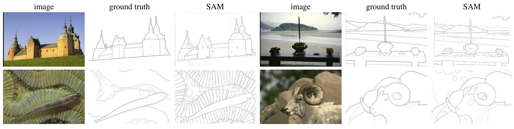

图 15：在 BSDS500 上的零样本边缘预测的额外的可视化。请注意，SAM 没有被训练来预测边缘图，并且在训练期间没有访问 BSDS 的图像和标注。

### E. Human Study Experimental Design

### F. Dataset, Annotation, and Model Cards

## 引用

[8]:  https://arxiv.org/pdf/2108.07258.pdf	"On the Opportunities and Risks of"
[14]: https://arxiv.org/pdf/2005.12872v3.pdf	"DETR"
[20]: https://arxiv.org/pdf/2107.06278.pdf	"MaskFormer"
[33]: https://arxiv.org/pdf/2010.11929.pdf	"ViT"
[37]: https://arxiv.org/pdf/2003.07932.pdf	"Getting to 99% Accuracy in Interactive Segmentation"
[53]: https://arxiv.org/pdf/1603.09382.pdf	"drop path"
[84]: https://arxiv.org/pdf/1506.01497.pdf	"Faster R-CNN:"
[92]: https://arxiv.org/pdf/2102.06583.pdf	"Reviving Iterative Training with Mask Guidance for Interactive"

