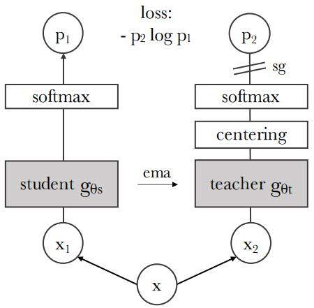

# Emerging Properties in Self-Supervised Vision Transformers

## Abstract

在本文中，我们质疑自监督学习是否为 Vision Transformer（ViT）[19]带来了与卷积神经网络（ConvNet）相比突出的新特性。 除了自监督方法特别适合这种架构的事实之外，我们还做出了以下观察：首先，自监督 ViT 特征包含关于图像语义分割的显式信息，这在监督 ViT 或 ConvNet 中并不明显。其次，这些特征也是优秀的 k-NN 分类器，使用小型 ViT 在 ImageNet 上达到 78.3% 的 top-1 准确率。我们的研究还强调了动量编码器[33]、多裁剪训练[10]和使用小补丁的 ViT 的重要性。我们将我们的发现应用到一个简单的自监督方法 **DINO** 中，将其解释为一种无标签的自蒸馏形式。我们通过在 ViT-Base 的线性评估中达到 80.1% 的 ImageNet top-1 准确率，展示了 DINO 和 ViT 之间的协同作用。

**图 1**：自监督训练的 $8 \times 8$ 补丁 Vision Transformer 的自注意力。我们观察最后一层头部 [CLS] token 的自注意力。该 token 未附加任何标签或监督。这些图显示模型自动学习类特定特征，从而实现无监督对象分割。

## 1. Introduction

Transformer [70] 近期作为一种替代卷积神经网络（ConvNet）的视觉识别方法 [19, 69, 83] 而兴起。它们的采用与受自然语言处理（NLP）启发的训练策略相结合，即在大规模数据上预训练并在目标数据集上微调 [18, 55]。由此产生的 Vision Transformer（ViT）[19]与 ConvNet 具有竞争力，但它们尚未展现出明显的优势：它们计算要求更高，需要更多的训练数据，并且它们的特征没有表现出独特的性质。

在本文中，我们质疑 Transformer 在视觉领域有限的成功是否可以解释为其预训练中监督的使用。我们的动机是，Transformer 在 NLP 领域取得成功的关键因素之一是使用自监督预训练，以 BERT [18] 中的闭合过程或 GPT [55] 中的语言建模的形式。这些自监督预训练目标使用句子中的单词来创建前置/代理任务 (pretext task)，提供比预测每个句子单个标签的监督目标更丰富的学习信号。类似地，在图像中，图像级监督通常将图像中丰富的视觉信息简化为从预定义的几千个物体类别中选择的一个概念 [60]。

虽然 NLP 中使用的自监督代理任务是特定于文本的，但许多现有的自监督方法已经展示了它们与卷积神经网络（ConvNet）相结合在图像上的潜力 [10, 12, 30, 33]。它们通常共享相似的结构，但具有不同的组件设计以避免平凡解（崩溃）或提高性能 [16]。在这项工作中，受这些方法的启发，我们研究了自监督预训练对ViT 特征的影响。特别有趣的是，我们发现了一些在监督 ViT 或 ConvNet 中未曾出现的有趣特性：

- 自监督 ViT 特征明确包含场景布局，特别是物体边界，如图 1 所示。该信息可以直接从最后一个块的自注意力模块中获取。
- 自监督 ViT 特征在一个基础的最近邻分类器（k-NN）上表现特别好，无需任何微调、线性分类器或数据增强，即可在 ImageNet 上达到 78.3% 的 top-1 准确率。

分割掩码的出现似乎是自监督方法共享的一个特性。然而，只有结合动量编码器[33]和多裁剪增强[10]等特定组件时，k-NN 的良好性能才会出现。我们的研究另一个发现是使用更小的补丁的 ViT 以提高特征质量。

总体而言，我们关于这些组件的重要性的发现促使我们设计了一种简单的自监督方法，可以解释为一种**无标签的知识蒸馏** [35] 形式。由此产生的框架 DINO，通过使用标准交叉熵损失直接预测教师网络（由动量编码器构建）的输出，简化了自监督训练。有趣的是，我们的方法仅需要对教师输出进行中心化和锐化即可避免崩溃，而其他流行的组件如预测器[30]、高级归一化[10]或对比损失[33]在稳定性或性能方面收益甚微。特别重要的是，我们的框架灵活且适用于 ConvNet 和 ViT，无需修改架构或调整内部归一化[58]。

通过在 ImageNet 线性分类基准上使用带有小补丁的 ViT-Base 达到 80.1% 的 top-1准确率，超越以前的自监督特征，我们进一步验证了 DINO 和 ViT 之间的协同作用。通过与 ResNet-50 架构的最新技术相匹配，我们还确认 DINO 适用于 ConvNet。最后，我们讨论了在计算和内存容量有限的情况下使用 DINO 与 ViT 的不同场景。特别是，使用 ViT 训练 DINO 仅需 2 台 8-GPU 服务器超过 3 天即可在 ImageNet 线性基准上达到 76.1%，这优于基于 ConvNet 的自监督系统，具有相当的尺寸和显著减少的计算需求[10, 30]。

**图 2**：无标签的自蒸馏。为了简单起见，我们以一对视图 $(x_1, x_2)$ 为例说明 DINO。 模型将输入图像的两种不同随机变换传递给学生网络和教师网络。 两个网络具有相同的架构但不同的参数。 教师网络的输出以批处理计算的平均值进行中心化。 每个网络输出一个 $K$ 维特征，该特征在特征维度上使用一个带温度系数的 softmax 进行归一化。 使用交叉熵损失测量它们的相似性。 我们对教师网络应用停梯度 (sg) 运算符，仅通过学生网络传播梯度。 教师网络的参数使用学生网络参数的指数移动平均 (EMA) 进行更新。

## 2. Related work

**自监督学习**。大量关于自监督学习的工作都集中在被称为实例分类 [12, 20, 33, 73] 的判别方法上，这些方法将每个图像视为一个不同的类别，并通过对它们进行数据增强来训练模型。然而，显式地学习一个分类器来区分所有图像 [20] 并不适用于大量图像。Wu 等人 [73] 提出了使用噪声对比估计器 (NCE) [32] 来比较实例而不是对它们进行分类。这种方法的一个缺点是它需要同时比较大量图像的特征。在实践中，这需要大批量 [12] 或内存库 [33, 73]。一些变体允许以聚类的形式自动分组实例 [2, 8, 9, 36, 42, 74, 80, 85]。

最近的工作表明，我们可以无需区分图像的情况下学习无监督特征。特别值得注意的是，Grill 等人 [30] 提出了一个称为 BYOL 的度量学习公式，其中通过将特征与动量编码器获得的表示进行匹配来训练特征。像 BYOL 这样的方法甚至可以在没有动量编码器的情况下工作，但代价是性能下降 [16, 30]。其他几项工作也呼应了这一方向，表明可以匹配更复杂的表示 [26, 27]，训练特征以匹配均匀分布 [6] 或使用白化 [23, 81]。我们的方法受到 BYOL 的启发，但使用一个不同的相似性匹配损失，并对学生和教师使用完全相同的架构。这样，我们的工作完成了 BYOL 提出的解释，即自监督学习是一种无标签的平均教师自蒸馏 [65] 的形式。

**自训练和知识蒸馏**。自训练旨在通过将一小部分初始标注传播到大量未标记实例来提高特征的质量。这种传播可以通过硬标签分配 [41, 78, 79] 或软标签分配 [76] 来完成。当使用软标签时，该方法通常被称为知识蒸馏 [7, 35]，主要用于训练一个小网络来模仿大网络的输出以压缩模型。Xie 等人 [76] 表明，蒸馏可以用于在自训练管道中将软伪标签传播到未标记数据，从而建立了自训练和知识蒸馏之间的重要联系。我们的工作建立在这个关系之上，并将知识蒸馏扩展到没有标签的情况。以前的工作还结合了自监督学习和知识蒸馏 [25, 63, 13, 47]，从而实现了自监督模型压缩和性能提升。然而，这些工作依赖于预训练的固定教师，而我们的教师是在训练过程中动态构建的。这样，知识蒸馏不再作为自监督预训练的后处理步骤，而是直接作为自监督目标。最后，我们的工作也与联合蒸馏 [1] 相关，其中学生和教师具有相同的架构，并在训练期间使用蒸馏。然而，联合蒸馏中的教师也从学生那里蒸馏，而在我们的工作中，教师是用学生的平均值更新的。

## 3. Approach

### 3.1. SSL with Knowledge Distillation

用于这项工作的框架 DINO 与最近的自监督方法 [10, 16, 12, 30, 33] 具有相同的总体结构。然而，我们的方法也与知识蒸馏 [35] 具有相似之处，我们从这个角度来呈现它。我们在图 2 中说明了 DINO，并在算法 1 中提出了伪代码实现。

知识蒸馏是一种学习范式，我们训练一个学生网络 $\large g_{\theta_s}$ 来匹配给定教师网络 $\large g_{\theta_t}$ 的输出，分别由 $\theta_s$ 和 $\theta_t$ 参数化。给定输入一张图像 $x$ ，两个网络都输出 $K$ 维的概率分布 $P_s$ 和 $P_t$ 。概率 $P$ 通过用 softmax 函数归一化网络 $g$ 的输出获得。更准确地说，

$$
\large P_s(x)^{(i)} = \frac{\exp(g_{\theta_s}(x)^{(i)} / \tau_s)}{\sum_{k=1}^K \exp(g_{\theta_s}(x)^{(k)} / \tau_s)}, \tag{1}
$$

其中 $\tau_s \gt 0$ 是一个控制输出分布锐度的温度参数， $P_t$ 的公式类似，温度为 $\tau_t$ 。给定一个固定的教师网络 $\large g_{\theta_t}$ ，我们通过最小化相对于学生网络参数 $\theta_s$ 的交叉熵损失来学习匹配这些分布：

$$
\large \min_{\theta_s} H(P_t(x), P_s(x)), \tag{2}
$$

其中 $H(a,b) = -a \log b$ 。
