# [Masked Autoencoders Are Scalable Vision Learners](https://arxiv.org/pdf/2111.06377.pdf)

## Abstract

本文证明了遮蔽的自编码器 (MAE) 是计算机视觉的可扩展的自监督学习器。我们的 MAE 方法很简单：屏蔽输入图像中的随机 patches，并重建缺失的像素。它基于两个核心设计。首先，我们开发了一个非对称的编码器—解码器结构，有一个编码器，仅对 patches 的可视子集进行操作 (没有 mask tokens)，还有一个轻量级解码器，从潜在的表示和 mask tokens 重建原始图像。其次，我们发现屏蔽高比例的输入图像 (例如75%)，会产生重要且有意义的自监督任务。这两种设计的耦合使我们能够有效地训练大型模型：我们加速了训练 (3倍或者更多) 并提高了准确性。作者的可扩展方法允许学习泛化良好的高容量模型：例如，在仅用 ImageNet-1K 数据的方法中，原生的 ViT-Huge 模型取得了最高的准确率 (87.8%)。下游任务的迁移表现胜过有监督的预训练，并显示出有希望的扩展行为。

## 1. Introduction

深度学习见证了能力和容量不断增长的架构的爆炸式增长。在硬件快速增长的帮助下，今天的模型能轻易地拟合一百万图像，并开始需要数亿 (通常无法公开访问) 标注图像。

这种对数据的需求已经通过自监督预训练在自然语言处理 (NLP) 中成功解决。基于 GPT 中的自回归语言建模和 [BERT](https://arxiv.org/pdf/1810.04805.pdf) 中的掩码自编码的解决方案在概念是很简单：它们移除一部分数据，然后学习预测移除的内容。这些方法现在可以训练包含超过一千亿参数的可泛化的 NLP 模型。

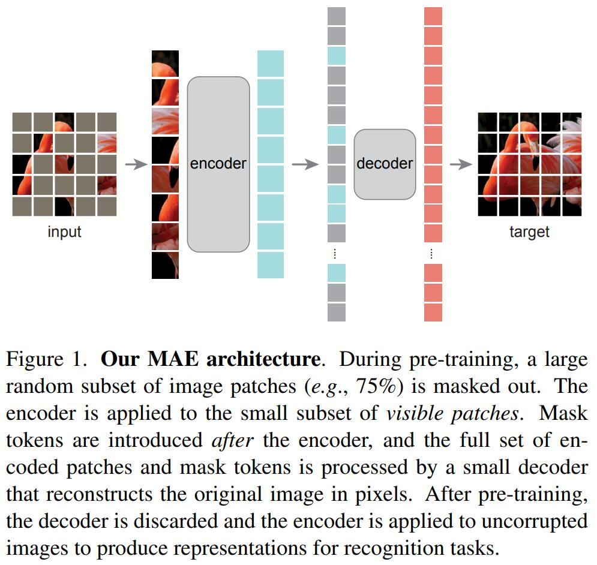

遮蔽的自编码器的思想，一种更通用的去噪自编码器的形式，自然且适用于计算机视觉。事实上，在 BERT 之前就有与视觉相关的研究。然而，尽管随着 BERT 的成功，对这个想法产生了浓厚的兴趣，但在视觉中自编码方法的进展落后于 NLP。作者问：是什么使视觉和语言之间的遮蔽自编码不同？作者试图从以下角度回答这个问题：

(i) 直到最近，架构还是不同的。在视觉方面，卷积网络在过去十年中占主导地位。卷积通常在规则的网格上操作，将诸如 mask tokens 或位置嵌入之类的"指示"集成到卷积网络中并不容易。然而，随着 [Vision Transformers (ViT)](https://arxiv.org/pdf/2010.11929.pdf) 的引入，这种架构差距已经得到解决，不应再成为障碍。

(ii) 语言和视觉的信息密度是不同的。语言是人类生成的具有高度语义的且信息密集的信号。当训练一个模型来预测每个句子中一些缺失的单词时，这个任务似乎会导致复杂的语言理解。相反，图像是具有大量空间冗余的自然信号——例如，通过对部分、对象和场景的很少的高级理解，可以从相邻的 patches 恢复缺失的 patches。为了克服这种差异，并鼓励学习有用的特征，作者展示了一个简单的策略在计算机视觉中效果良好：遮蔽很大一部分随机 patches。这种策略很大程度地减少了冗余，并创建了一项具有挑战性的自监督任务，需要超越低级图像统计的整体理解。要对作者的重建任务有一个定性的认识，参见图 [2](#figure 2) - [4](#figure 4)。

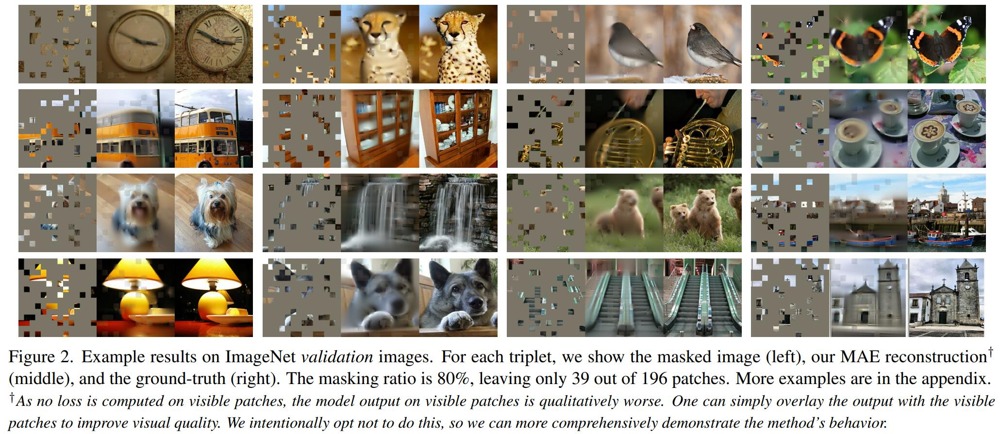

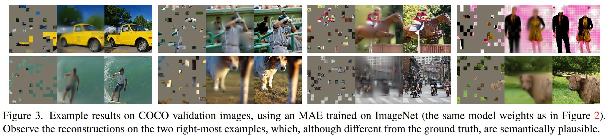

(iii) 自编码器的解码器，将潜在的表征映射回输入，在重建文本和图像中扮演着不同的角色。在视觉中，解码器重建像素，因此其输出的语义级别低于通常的识别任务。这与语言相反，解码器预测包含丰富语义信息的缺失的词。虽然在 BERT 中，解码器可能不重要 (一个 MLP)，但作者发现对于图像，解码器的设计在确定学习到的潜在的表征的语义级别中起着关键作用。

在此分析的驱动下，作者提出了一种简单、有效且可扩展的遮蔽自编码器 (MAE) 形式，用于视觉表征学习。MAE 从输入图像中遮蔽随机 patches，并在像素空间中重建缺失 patches。它具有非对称的编码器—解码器设计。编码器仅在 patches 的可视子集 (无 mask tokens) 进行操作，编码器是轻量级的，并从潜在表示和 mask tokens 重建输入 ([图 1](#figure1))。在作者的非对称编码器—解码器中将 mask tokens 转移到小型编码器会导致计算量大幅减少。在这种设计下，非常高的遮蔽率 (例如75%) 可以实现双赢：它优化了准确性，同时让编码器仅处理很小一部分 (例如25%)  patches。这可以将整体预训练时间减少 3 倍或者更多，并且同样减少内存消耗，使得能够轻松将 MAE 扩展到大模型。

MAE 学习非常大容量的模型，可以很好地泛化。通过 MAE 预训练，可以在 ImageNet-1K 上训练 ViT-Large/-Huge 等数据饥渴的模型，并提高泛化性能。使用原生的 ViT-Huge 模型，作者在 ImageNet-1K 微调取得了 87.8% 的准确率。这优于之前仅使用 ImageNet-1K 数据的所有结果。作者还评估了目标检测、实例分割和语义分割的迁移学习。在这些任务中，作者的预训练比在对应任务的有监督的预训练取得更好的结果，更重要的是，作者观察到通过扩大模型获得显著受益。这些观察结果与 NLP 中自监督预训练中的观察结果一致，作者希望能够在这域中探索类似的轨迹。

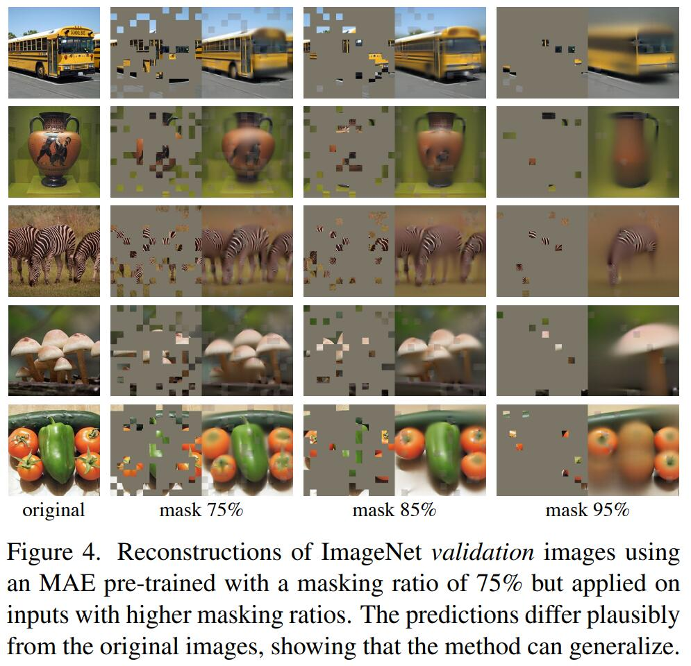

## 2. Related Work

遮蔽语言模型及其自回归对应物，如 BERT 和 GPT，是非常成功的 NLP 预训练方法。这些方法保留一部分输入序列，并训练模型预测缺失的内容。这些方法已经被证明具有出色的扩展性，并且大量证据表明，这些预训练的表征可以很好地泛化到各种下游任务。

自编码是一种学习表征的经典方法。它有一个将输入映射到潜在表征的编码器和一个重构输入的解码器。例如，PCA 和 k-means 是自编码器。去噪自编码器 (DAE) 是一类自编码器，它破坏输入信号，并学习重建原始的、未被破坏的信号。一系列方法可以被认为是不同损坏下的广义 DAE，例如，遮蔽像素和去除颜色通道。MAE 是去噪自编码的一种形式，但在许多方面与经典的 DAE 不同。

遮蔽图像编码方法从被掩码损坏的图像中学习表征。[Stacked Denoising Autoencoders](https://www.jmlr.org/papers/volume11/vincent10a/vincent10a.pdf) 的开创性工作将遮蔽作为 DAE 中的一种噪声类型。上下文编码器使用卷积网络修复大的缺失区域。受 NLP 成功的启发，最近相关的方法基于 [Transformers](https://arxiv.org/pdf/1706.03762v5.pdf)。iGPT 对像素序列进行操作，并预测未知的像素。ViT 论文研究用于自监督学习的遮蔽的 patches 预测。最近，BEiT 提出预测离散 tokens。

自监督学习方法已经在计算机视觉中广泛使用，通常侧重于不同的预训练代理任务。最近，对比学习很流行，它对两个或多个视图之间的图像相似性和不相似性 (或近相似性) 建模。对比和相关方法强依赖于数据增强。自动编码追求概念上不同的方向，它表现出不同的行为。

## 3. Approach

遮蔽自编码器 (MAE) 是一种简单的自编码方法，在给定的部分观察下重建原始信号。与所有的自编码器一样，MAE 有一个将观察到的信号映射到潜在的表征的编码器，和一个从潜在的表征恢复原始信号的解码器。不同于经典的自编码器，MAE 采用非对称设计，允许编码器仅对部分观察信号 (无 mask tokens) 进行操作，并用一个轻量级的解码器从潜在表示和 mask tokens 重建完整信号。[图 1](#figure1) 说明了这个想法。

Masking。遵循 ViT，作者将图像划分为规则的非重叠的 patches。然后对 patches 的子集采样，并屏蔽 (即删除) 剩余部分。采样策略很简单：按照均匀分布采样随机 patches，无需替换。作者简单地将其称为 "随机采样"。

具有高遮蔽率 (即移除 patches 的比例) 的随机采样很大程度上消除了冗余，从而创建了一个无法从可视的邻近 patches 外推来轻松解决的任务 (见图 [2](#figure2) - [4](#figure4))。均匀分布可防止潜在的中心偏差 (即图像中心附近有更多的遮蔽的 patches )。最后，高度稀疏的输入为设计高效的编码器创建了机会。

MAE 编码器。MAE 编码器是一个 ViT，但仅应用于可视的、未遮蔽的 patches 。就像在标准的 ViT 中一样，MAE 的编码器使用具有附加的位置嵌入的线性投影嵌入 patches，然后通过一系列的 Transformer blocks 处理结果集。然而，MAE 的编码器只对整个集合的一小部分 (例如25%) 进行操作。被遮蔽的 patches 被移除；不使用 mask tokens。这使得能仅用一小部分计算和内存来训练非常大的编码器。全部集合由轻量级解码器处理，描述如下。

MAE 解码器。MAE 解码器的输入是完整的 tokens，包括 (i) 编码后的可视 patches 和 (ii) mask tokens。见[图 1](#figure1)。每个 mask tokens 是一个共享的、学习后的向量，表示存在要预测的缺失 patch。作者在这个完整集合中的所有 tokens 附加了位置嵌入；没有这个，mask tokens 将没有关于它们在图像中的位置的信息。解码器有另一系列的 Transformer blocks。

MAE 解码器仅在预训练期间用于执行图像重建任务 (仅使用编码器生成用于识别的图像表征)。因此，可以以独立于编码器设计的方式灵活地设计解码器架构。作者试验了非常小的解码器，比编码器更窄、更浅。例如，默认的解码器每个 token 计算量比编码器少 10%。通过这种非对称设计，完整的 tokens 仅由轻量级解码器处理，这显著地减少预训练时间。

重建目标。MAE 通过预测每个遮蔽的 patch 的像素值来重建输入。解码器输出中的每个元素是一个表示一个 patch 的像素值向量。解码器的最后一层是线性投影，其输出通道的数量等于一个 patch 的像素值的数量。解码器的输出被重塑 (reshaped) 以形成重建图像。损失函数计算在像素空间中重建图像和原始图像之间的均方误差 (MSE)。仅在遮蔽的 patches 上计算损失，类似于 BERT。

作者还研究了一个变体，其重建目标是每个遮蔽的 patch 的归一化像素值。具体来说，计算一个 patch 中所有像素的均值和标准差，并使用它们来归一化这个 patch。在作者的使用中，使用归一化后的像素作为重建目标可提升表示质量。

简单实现。MAE 预训练可以高效地实现，不需要任何专门的稀疏操作。首先为每个输入 patch 生成 token (通过具有附加的位置嵌入的线性投影)。接着随机打乱 tokens 列表，并根据遮蔽比例移除列表的最后一部分。此过程为编码器生成 tokens 的一个小子集，相当于无替换地采样 patches。编码之后，将 mask tokens 的列表添加至编码后的 patches 列表，然后 unshuffle 整个列表 (反转随机打乱操作) 以将所有的 tokens 于其目标对齐。解码器应用于此完整的列表 (附加了位置嵌入)。如前所述，不需要稀疏操作。这个简单实现引入的开销可以忽略不计，因为 shuffle 和 unshuffle 操作很快。

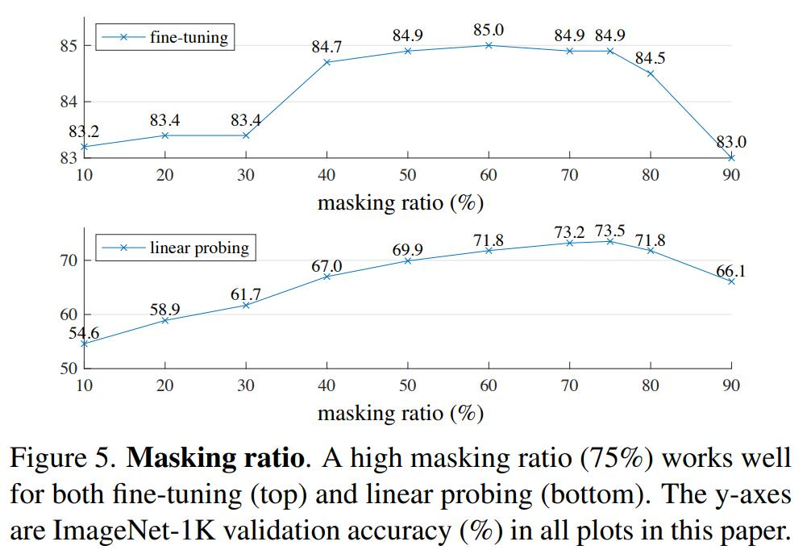

## 4. ImageNet Experiments

作者在 ImageNet-1K 训练集上进行自监督预训练。然后进行有监督的训练来评估 (i) 端到端微调或 (ii) 线性探测的表现。作者报告了单 $224 \times 224$ 裁剪的 top-1 验证精度。详情见附录 A.1。

**Baseline：ViT-Large**。作者在消融实验中使用 ViT-Large (ViT-L/16) 作为主干。ViT-L 非常大 (比 ResNet-50 大一个数量级) 并且容易过拟合。以下是从头开始训练的 ViT-L 与从基线 MAE 微调的对比：

| scratch, original | scratch, our impl. | baseline MAE |
| :---------------: | :----------------: | :----------: |
|       76.5        |        82.5        |     84.9     |

注意到从头开始训练有监督的 ViT-L 很重要，并且需要一个具有强正则化的配方 (82.5%，见附录 A.2)。尽管如此，MAE 预训练还是有很大的改进。此处微调仅针对 50 epochs (而从头开始要 200 个)，这意味微调精度很大程度取决于预训练。

### 4.1. Main Properties

使用[表 1](#table 1) 的默认设置消融 MAE。观察到几个非常有趣的特性。

遮蔽比例。[图 5](#figure5) 展示了遮蔽比例的影响。最佳比例高得惊人。75%的比例对线性探测和微调都有利。这种表现与 BERT 相反，后者的典型遮蔽比例是 15%。75%的遮蔽比例也远高于计算机视觉中相关工作的遮蔽比例 (20% 到 50%)。

该模型推测缺失 patches 以产生不同的但合理的输出 ([图 4](#figure4))。它使物体和场景的完全形态变得有意义，这不能简单地通过延伸线条或纹理来完成。作者假设这种类似推理的行为与学习有用的表征有关。

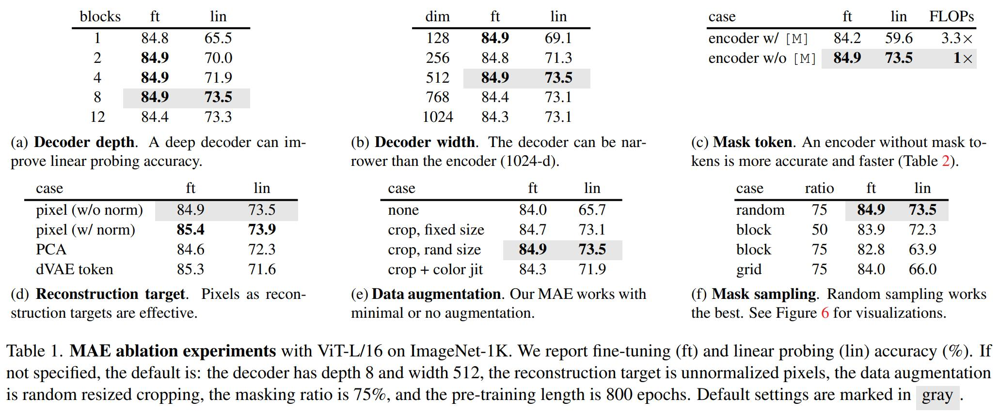

[图 5](#figure5) 还展现了线性探测和微调结果遵循不同的趋势。对于线性探测，准确率随着遮蔽比例稳步提升，直到最高点：准确率差距高达 20% (54.6% vs 73.5%)。对于微调，结果对遮蔽比例不那么敏感，并在很宽范围的遮蔽比例 (40%-80%) 表现良好。图 5 中所有的微调结果都优于从头开始训练 (82.5%)。

解码器设计。MAE 的解码器可以灵活设计，如表 1a 和 1b 所示。

[表 1a](#table1) 改变解码器深度 (Transformers blocks 的数量)。足够深的解码器对于线性探测很重要。这可以通过像素重建任务和识别任务之间的差距来解释：自编码器中的最后几层更专门用于重建，与识别的相关性较低。一个合理深度的解码器可以解释重构特殊化，让潜在的表征在一个更抽象的水平。这种设计可以在线性探测上产生8%的提升 ([表 1a](#table1)，'lin')。但是，如果使用微调，则可以调整编码器的最后几层以适应识别任务。解码器的深度对改进微调的影响较小 ([表 1a](#table1)，'ft')。

有趣的是，具有 single-block 的解码器通过微调表现得很好 (84.8%)。注意到，单个 Transformer block 是将信息从可视 tokens 传播到 mask tokens 的最低要求。这么小的解码器可以进一步加速训练。

在[表 1b](#table1) 作者研究了解码器宽度 (通道数)。作者默认使用 512-d，它在微调和线性探测表现良好。更窄的解码器也适用于微调。

总的来说，默认的 MAE 的解码器是轻量级的。它有 8 个 blocks，宽度为 512-d ([表 1](#table1) 中的灰色部分)。与 ViT-L (24 blocks，1024-d) 相比，它每个 tokens 仅有 9% FLOPs。因此，虽然解码器处理全部的 tokens，它仍然占整体计算的一小部分。

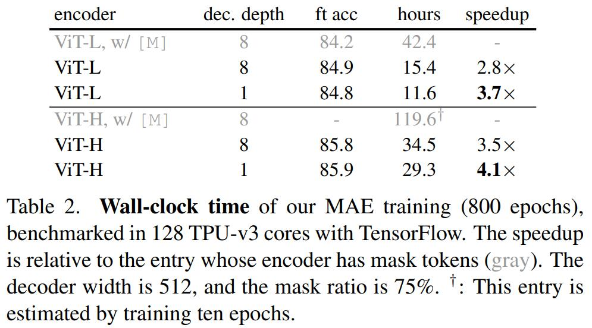

Mask token。MAE 的一个重要设计是跳过编码器中的 mask token，之后将其应用到轻量级的解码器中。表 1c 研究了这种设计。

如果编码器使用 mask tokens，它性能会更差：在线性探测中它的精度下降 14%。在这种情况下，预训练和部署之间存在差距：该编码器在预训练的输入中有很大一部分 mask tokens，而这在未损坏图像中不存在。这种差距可能会降低部署的精度。通过从编码器中移除 mask tokens，限制编码器始终看到真实的 patches，从而提高精度。

此外，通过跳过编码器中的 mask token，极大地减少了训练的计算。在[表 1c](#table1) 中，将整体的 FLOPs 减少了 3.3 倍。这使得在作者的实现中加速了 2.8 倍实际时间 (见[表 2](#table2))。对于一个更小的解码器 (1-block)，更大的编码器 (ViT-H) 或两者，实际时间甚至更大 (3.5—4.1 倍)。注意到，对于 75% 的遮蔽比例，加速能大于 4 倍，部分原因是自注意力的复杂度是二次的。此外，内存大大减少，可以训练更大的模型或者通过大批量训练加速。时间和内存效率使 MAE 有利于训练非常大的模型。

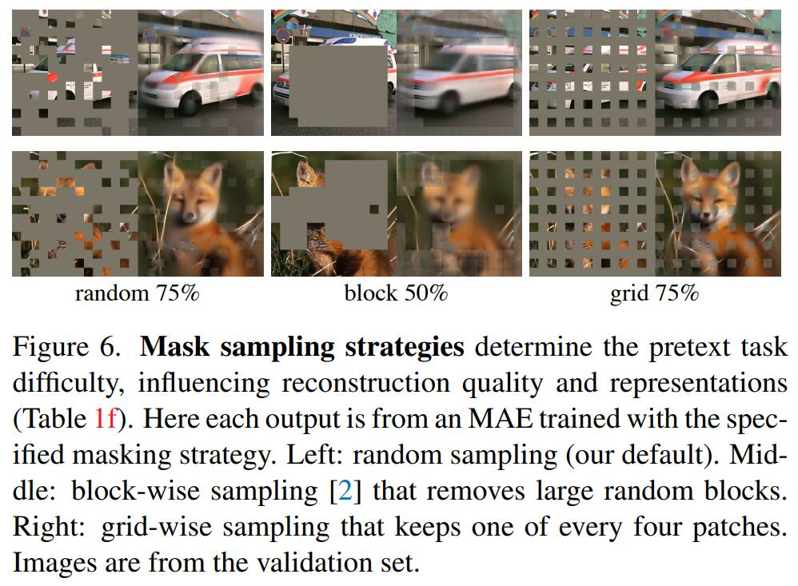

重建目标。作者在[表 1d](#table1) 中比较了不同的重建目标。到目前为止，结果基于没有 (逐个 patch) 归一化的像素。使用归一化的像素可提高准确率。这种逐个 patch 的归一化局部增强了对比度。在另一个变体中，作者在 patch 空间中执行 PCA，并使用最大的 PCA 系数作为目标。这样做会降低准确率。两个实验都表明高频成分在 MAE 中有用。

作者还比较了一个预测 tokens 的 MAE 变体，即 BEiT 中使用的目标。特别是对于这个变体，作者使用了  DEALLE 预训练的 dVAE 作为 tokenizer，遵循 BEiT。这个 MAE 的解码器使用交叉熵损失预测 token indices。这种 tokenization 比未归一化的像素提升了 0.4% 的微调准确率，但与归一化的像素相比没有优势。它也降低了线性探测的精度。在第 5 节中，作者进一步展示了这种 tokenization 在迁移学习中是不必要的。

基于像素的 MAE 比 tokenization 更简单。dVAE tokenizer 需要额外一个预训练阶段，这可能取决于额外的数据 ([250M 图像](https://arxiv.org/pdf/2102.12092.pdf))。dVAE 的编码器是一个大型卷积网络 (ViT-L 40% 的 FLOPs)，并增加了重要的开销。使用像素不会遇到这些问题。

数据增强。[表 1e](#table1) 研究了数据增强对 MAE 预训练的影响。

MAE 使用仅裁剪增强效果很好，无领是固定大小还是随机大小 (都有随机水平翻转)。添加颜色抖动降低结果，因此不在其他实验中使用它。

令人惊讶的是，即使没有数据增强 (仅中心裁剪，没有翻转)，MAE 也表现良好。这一特性与对比学习和相关方法截然不同，后者严重依赖于数据增强。据观察，对于 BYOL 和 SimCLR，使用仅裁剪增强分别降低13% 和 28% 的准确率。另外，没有证据表明对比学习可以在没有增强的情况下工作：图像的两个视图是相同的，可以很容易地满足一个简单的解决方案。

在 MAE 中，数据增强的角色主要由随机遮蔽来完成 (下一个消融实验)。每次迭代 masks 都不同，因此无论数据增强如何，它们都会生成新的训练样本。遮蔽让代理任务更难，需要更少的增强来正则化训练。

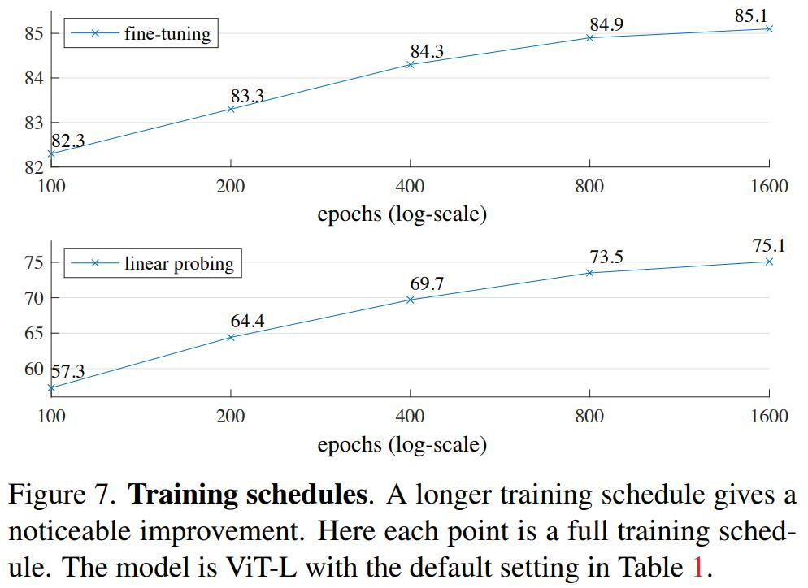

Mask 采样策略。在[表 1f](#table1) 中，作者比较了不同的 mask 采样策略，如[图 6](#figure6) 所示。

BEiT 中提出的 block-wise 遮蔽策略倾向于移除大的 blocks ([图 6 中](#figure6))。使用 block-wise 遮蔽的 MAE 在 50% 的比例下工作得相当好，但在 75% 的比例性能下降。这项任务比随机采样更难，因为观察到更高的训练损失。重建也更模糊。

作者还研究了 grid-wise 采样，规则地保留每 4 个 patches 中的 1 个 ([图 6 右](#figure6))。这是一项更简单的任务，有更低的训练损失。重建更加清晰。但是表征质量更低。

简单随机采样最适合 MAE。它允许更高的遮蔽比例，这能提供更大的加速收益，同时还享有良好的准确率。

训练计划表。到目前为止，作者的消融实验是基于 800 epochs 的预训练。[图 7](#figure7) 展示了训练计划长度的影响。随着训练时间延长准确率稳步提升。事实上，作者在 1600 epochs 时也没观察到线性探测精度的饱和。这种行为与对比学习方法不同，例如，MoCo v3 在 ViT-L 的 300 epochs 时饱和。注意到，MAE 编码器在每个 epoch 仅看到 25% 的 patch，而在对比学习中，编码器每个 epoch 看到 200% (两个裁剪) 或甚至更多 (多个裁剪) patches。

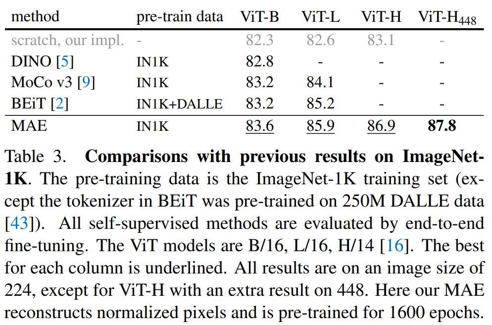

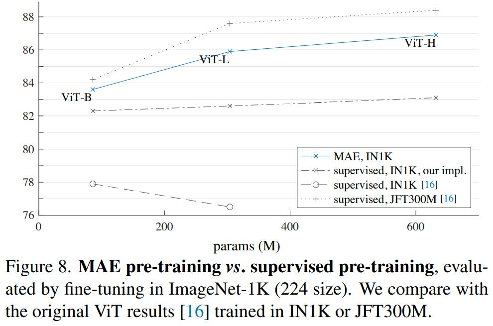

### 4.2. Comparisons with Previous Results

与自监督方法比较。在[表 3](#table3)，作者比较了自监督的 ViT 模型的微调结果。对于 ViT-B，所有方法表现都很接近。对于 ViT-L，这些方法之间的差距更大，这表明更大模型的挑战是减少过拟合。

MAE 能轻松扩展，并从更大的模型中已经展现出稳定提升。作者使用 ViT-H (224 尺寸) 获得了 86.9% 的准确率。通过使用 448 尺寸微调，仅使用 IN1K 数据取得了 87.8% 的准确率。此前在仅使用 1N1K 的所有方法中最好的准确率是 87.1% (512 尺寸)，基于高级网络。在竞争激烈的 INIK 基准 (无外部数据) 中，作者以显著的优势改进了最先进技术。结果基于原始的 ViT，作者预计先进的网络会表现更好。

与 BEiT 相比，MAE 更准确，同时更简单和更快。与 BEiT 预测 tokens 相反，MAE 重建像素：BEiT 报告在使用 ViT-B 重建像素时降低了 1.8%。MAE 不需要 dVAE 预训练。此外，由于[表 1c](#table1) 中的原因，MAE 比 BEiT 快很多 (每个 epoch 3.5 倍)。

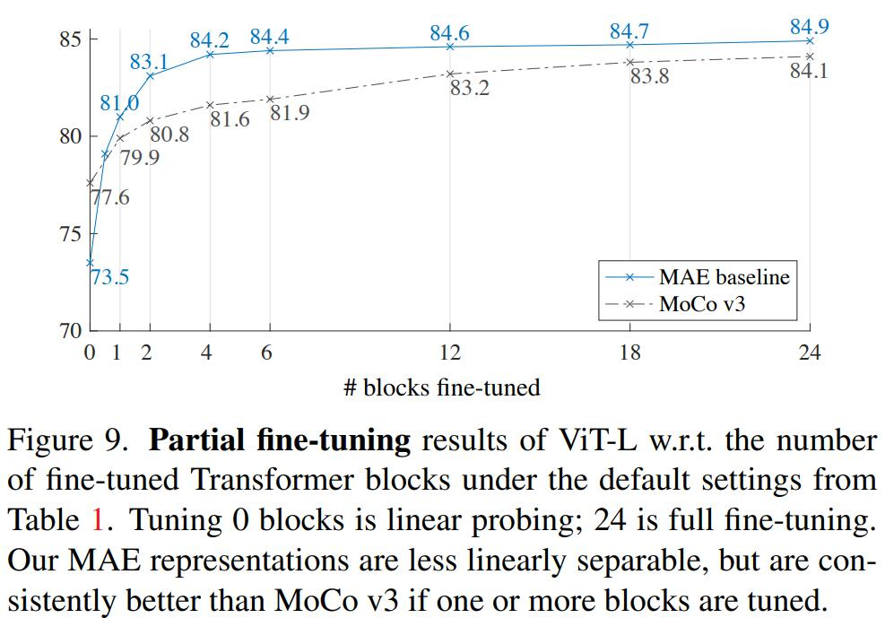

[表 3](#table3) 中的 MAE 模型经过 1600 个 epoch 的预训练以获得更好的准确率 ([图 7](#figure7))。即便如此，如果它们在相同的硬件中训练，MAE 的总预训练时间少于其他所有方法。例如，对于 ViT-L，使用同样的 128 个 TPU-v3 核心，MAE 训练 1600 个 epochs 时间是 31 小时，而 MoCo v3 训练 300 个 epochs 时间是 36 小时。

与有监督预训练比较。在原始的 ViT 论文中，ViT-L 在训练 IN1K 时性能下降。见[图 8](#figure8)。作者改进的有监督配方更适合从头开始训练 ([图 8](#figure8)，"our impl"；见 A.2)，但准确率已饱和。

作者仅使用 IN1K 的 MAE 预训练，能泛化得更好：对于更高容量的模型从头开始训练收益更大。它遵循类似于 [16] 中 JFT-3000M 有监督预训练的趋势。这个比较表明 MAE 能帮助扩大模型大小。

### 4.3. Partial Fine-tuning

[表 1](#table1) 表明线性探测和微调结果很大程度不相关。线性探测在过去几年中一直是一种流行的规约；然而，它错过了追求强大但非线性的特征的机会——这正是深度学习的优势。作为中立，作者研究了部分微调规约：冻结其他层，微调最后几层。这种规约也用于早期工作。

[图 9](#figure9) 展示了结果。值得注意的是，仅微调一个 Transformer block 即可将准确率从 73.5% 显著提高到 81.0%。此外，如果只微调最后一个 block 的一半 (例如，它的 MLP 子块)，能获得 79.1%，比线性探测好得多。这种变体本质上是微调 MLP 头。微调一些 blocks (例如，4 或 6) 可以获得不错的精度，与冻结主干相比，这仍然是一个小型的微调头。

在[图 9](#figure9) 作者还与 MoCo v3 做了比较，这是一种 ViT-L 结果可用的对比方法。它比 MAE 具有更高的线性探测精度。然而，它所有的局部微调结果都比 MAE 差。调整 4 个 blocks 时差距是 2.6%。这些结果表明，MAE 表征的线性可分性较差，但它们是更强的非线性特征，并且在调整非线性头时表现良好。

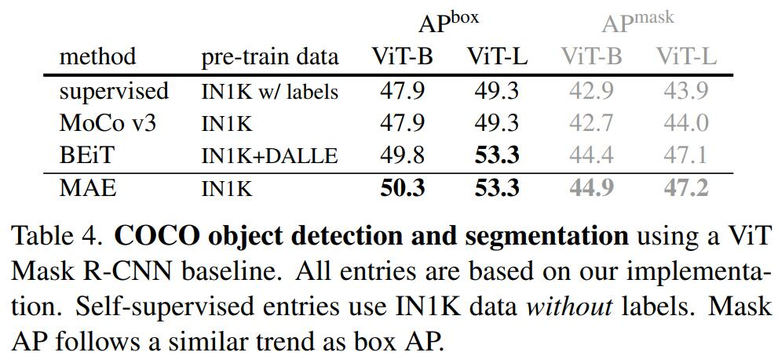

这些观察结果表明，线性可分性不是评估表征质量的唯一标准。还观察到，线性探测和迁移学习的性能的相关性不是很好，例如，用于目标检测。据作者所知，在 NLP 中不经常用线性评估对预训练进行基准测试。

## 5. Transfer Learning Experiments

作者在 COCO 上评估了目标检测和分割的迁移学习，在 ADE20K 上评估了语义分割。作者使用[表 3](#table3) 中的预训练模型。

目标检测和分割。作者在 COCO 上端到端地微调 [Mask R-CNN](https://arxiv.org/pdf/1703.06870.pdf)。ViT 主干适用于 [FPN](https://arxiv.org/pdf/1612.03144.pdf) (见附录 A.3)。作者将此目标检测系统应用于[表 4](#table4) 中所有条目。作者汇报了目标检测的 box AP 和实例分割的 mask AP。

与有监督预训练相比，MAE 在所有配置下表现更好 ([表 4](#table4))。使用较小的 ViT-B，MAE 比有监督预训练高 2.4 个点 (50.3 vs 47.9，$AP^{box}$)。更重要的是，使用更大的 ViT-L，MAE 预训练比监督预训练高 4.0 个点 (53.3 vs 49.3)。

基于像素的 MAE 优于或等于基于 token 的 BEiT，但 MAE 更简单、更快。MAE 和 BEiT 都比 MoCo v3 好，MoCo v3 和有监督预训练相当。

语义分割。作者 ADE20K 上用的 UperNet 遵循 BEiT 中的代码。详情在 A.4 中。[表 5](#table5) 表明，MAE 显著提高了 ViT-L 的迁移结果，比有监督的高 3.7 个点 (53.6 vs 49.9)。基于像素的 MAE 胜过基于 token 的BEiT。这些观察结果与在 COCO 中的一致。

Pixels vs. tokens。[表 6](#table6) 给出了像素和 tokens 作为 MAE 的重建目标的全面比较。虽然使用 dVAE tokens 比 使用未归一化的像素更好，但它在统计上类似于作者研究的所有任务和模型中仅使用归一化的像素。这再次表明 MAE 不需要 tokenization。

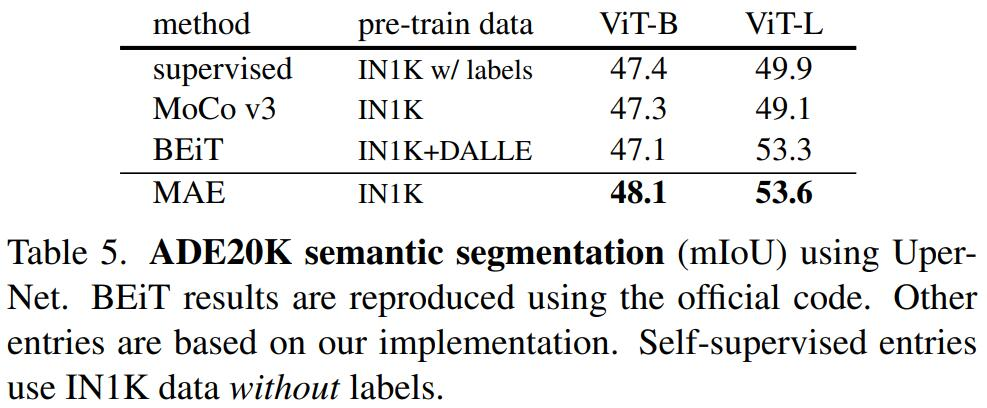

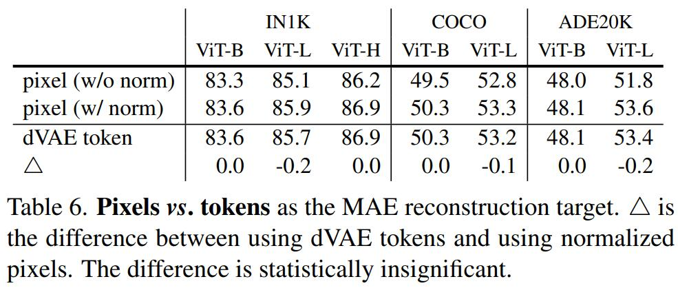

## 6. Discussion and Conclusion

可扩展的简单算法是深度学习的核心。在 NLP 中，简单的自监督学习方法可从指数缩放模型中收益。在计算机视觉中，尽管自监督取得了进展，但实际预训练的范式主要是有监督的。在这项研究中，作者在 ImageNet 和迁移学习中观察到一种自编码器——一种类似于 NLP 中技术的自监督方法，提供可扩展的好处。视觉中的自监督学习显现在可能走上与 NLP 类似的轨迹。

另一方面，作者注意到图像和语言是不同本质的信号，必须谨慎处理这种差异。图像只是记录光照，没有将语义分解成视觉中词的类比。作者没有尝试移除对象，而是删除最可能不形成语义分割的随机 patches。同样，MAE 重建像素，而不是语义实体。尽管如此，作者观察到 (例如，[图 4](#figure4)) MAE 推理复杂的整体重建，表明它学习到许多视觉概念，即语义。作者假设这种行为是通过 MAE 内部丰富的隐藏表征发生的。作者希望这个观点能激发未来的工作。

更广泛的影响。所提出的方法根据训练数据集学到的统计信息预测内容，因此将反映这些数据中的偏差，包括具有负面社会影响的偏差。改模型可能会生成不存在的内容。在基于这项工作生成图像时，这些问题值得进一步研究和考虑。

<!-- 完成标志, 看不到, 请忽略! -->
