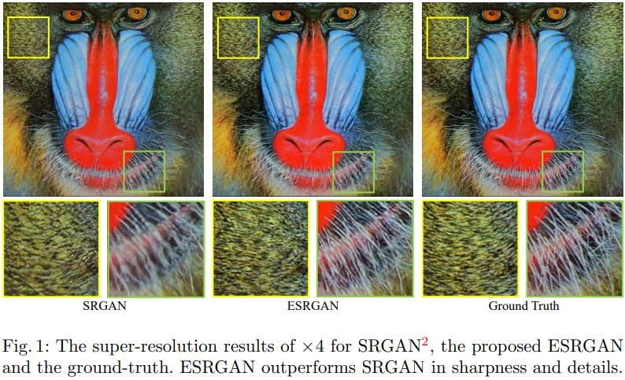
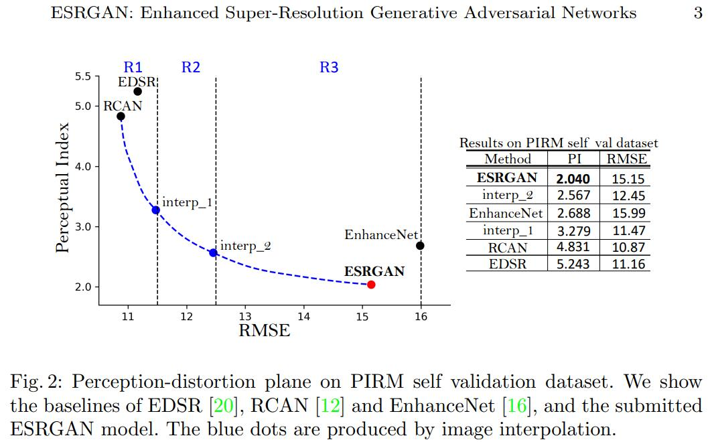
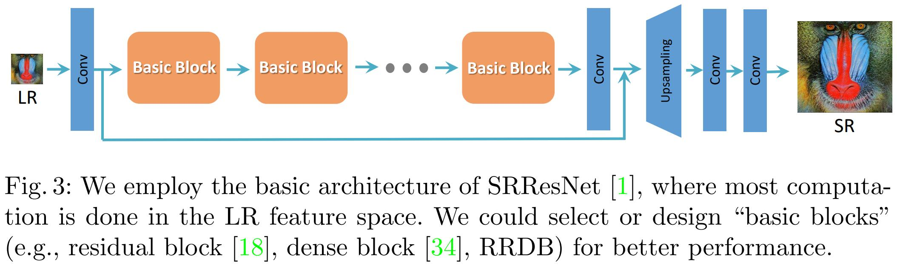
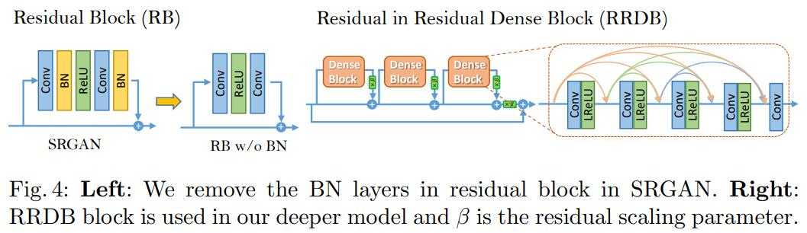
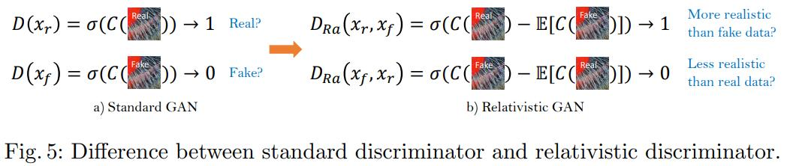
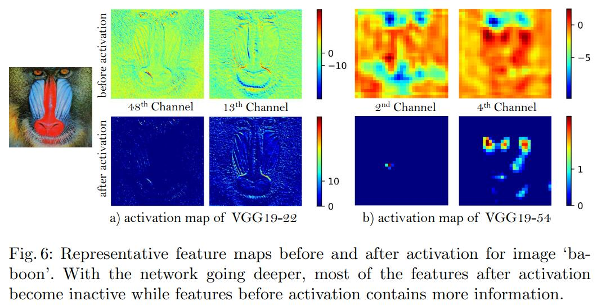
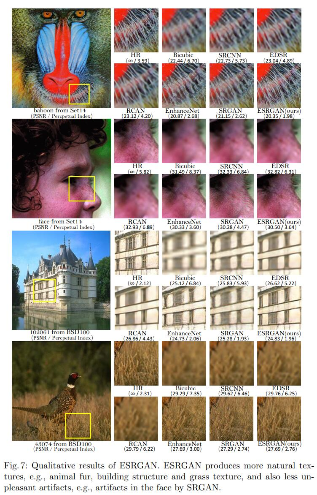
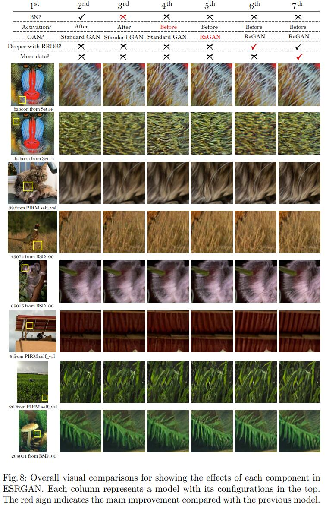
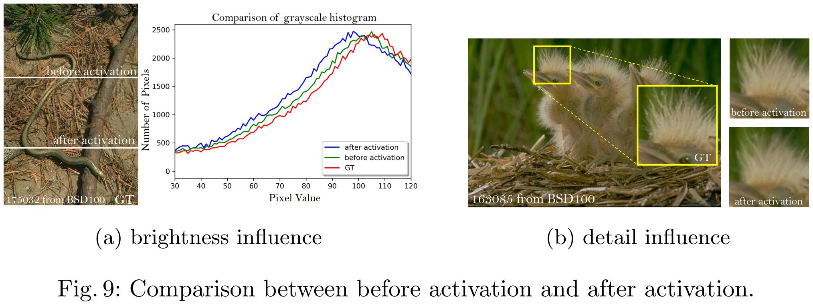
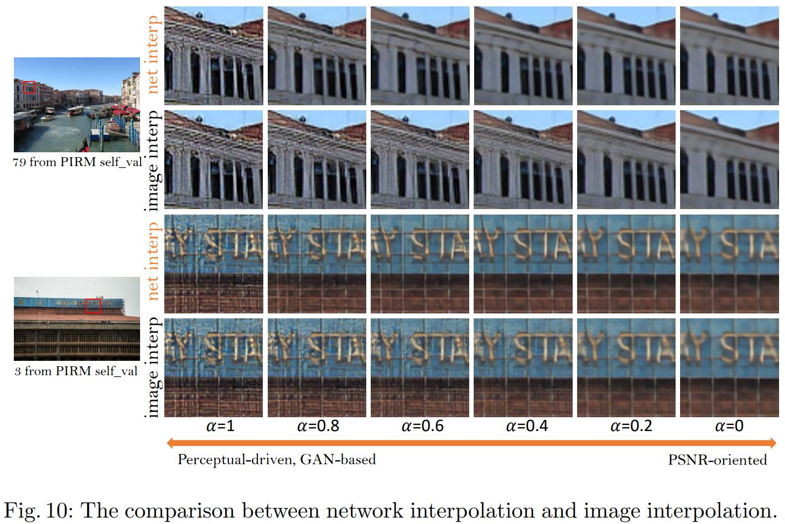

[toc]

# [ESRGAN: Enhanced Super-Resolution Generative Adversarial Networks](https://arxiv.org/pdf/1809.00219v2.pdf)

## Abstract

超分辨率生成对抗网络 ([SR-GAN](https://arxiv.org/pdf/1609.04802.pdf)) 是一项开创性的工作，能够在单张图像超分辨率期间逼真的纹理。然而，生成的细节往往伴随着令人不悦的人工产物。为进一步增强视觉质量，作者深入研究了 SRGAN 的三个关键组成部分——网络架构、对抗性损失和感知损失，并改进它们的每一个以推导出增强型 SRGAN (ESRGAN)。特别地，作者引入了没有批量归一化 (BN) 的 Residual-in-Residual Dense Block (RRDB) 作为基本的网络构建单元。此外，作者借鉴了 [relativistic GAN](https://arxiv.org/pdf/1807.00734.pdf) 的思想，让鉴别器预测相对真实性而不是绝对真实性。最终，作者通过使用激活函数之前的特征来改善感知损失，这可以为亮度一致性和纹理恢复提供更强的监督。受益于这些改进，提出的 ESRGAN 始终以比 SRGAN 更逼真和自然的纹理取得更好的视觉质量，并在 **PIRM2018-SR** 挑战中获得第一名。[代码可用](https://github.com/xinntao/ESRGAN)

## 1 Introduction

单幅图像超分辨率 (SISR) 作为一个基础的低阶视觉问题，越来越受到研究界和 AI 公司的关注。 SISR 旨在从一幅低分辨率 (LR) 的图像中恢复高分辨率 (HR) 的图像。由于 Dong 等人提出的开创性工作 SRCNN，深度卷积网络 (CNN) 方法带来了蓬勃发展。各种网络架构设计和训练策略持续不断地改善 SR 的性能，特别是峰值信噪比 (PSNR)。然而，因为 PSNR 指标从根本上与人类观察者的主观评价不一致，这些面向 PSNR 的方法往往在没有足够的高频细节的情况下，输出过于平滑的结果。

已经提出几种感知驱动的方法来提高 SR 结果的视觉质量。例如，[感知损失](https://arxiv.org/pdf/1603.08155.pdf)被提出来，在特征空间而不是在像素空间中优化超分辨率模型。将[生成对抗网络](https://arxiv.org/pdf/1406.2661.pdf)引入 SR 来鼓励网络支持看起来更像自然图像的解决方案。[进一步结合语义图像以改善恢复的纹理细节](https://arxiv.org/pdf/1804.02815.pdf)。追求视觉质量上令人愉悦的结果的里程碑之一是 SRGAN。基本模型由[残差块](https://arxiv.org/pdf/1512.03385.pdf)构建，并在 GAN 框架中使用感知损失优化。通过所有这些技术，相对于面向 PSNR 的方法，SRGAN 显著地提升了重建的整体视觉质量。

然而，如[图 1](#figure1) 所示，SRGAN 结果和真实结果之间仍然存在明显差距。在本研究中，作者重新审视了 SRGAN 的关键组件，并在三个方面改进了模型。第一，作者通过引入具有更高容量和更容易训练的 Residual-in-Residual Dense Block (RDDB) 来改进网络结构。作者还移除了[Enhanced Deep Residual Networks for Single Image Super-Resolution](https://arxiv.org/pdf/1707.02921.pdf)中的[批量归一化 (BN)](https://arxiv.org/pdf/1502.03167.pdf) 层，并使用残差缩放和更小的初始化来使训练非常深的网络更容易。第二，作者使用 Relativistic average GAN (RaGAN) 改进鉴别器，它学习判断 “一幅图像是否比其他更加真实” 而不是 “一幅图像是真的还是假的”。实验表明，这种改进有助于生成器恢复更加逼真的纹理细节。第三，作者通过使用激活函数之前的 VGG 特征而不是像 SRGAN 在激活函数之后，提出一种改进的感知损失。作者凭经验发现调整后的感知损失提供了更加清晰的边界和更多视觉上令人愉悦的结果，如 4.4 节中所示。大量的实验表明，被称为 ESRGAN 的增强型 SRGAN，在清晰度和细节方面一致优于最先进的方法 (见[图 1](#figure1) 和[图 7](#figure7))。

作者采用 ESRGAN 的变体参加 PRIM-SR 挑战。该挑战是第一个以感知质量感知方式的超分辨率比赛，其作者声称失真和感知质量是相互矛盾的。感知质量是由非参考度量的 Ma's score 和 NIQE 来判断的。即感知指标 $=\frac{1}{2}((10 - Ma) + NIQE)$。低的感知指标代表更好的感知质量。

如[图 2](#figure2) 所示，感知失真平面被划分为由均方根误差(RMSE)上的阈值定义的三个区域，每个区域中获得最低的感知指标的算法成为该区域的冠军。主要关注区域3，因为作者目标是将感知质量提升到一个新的高度。由于上述改进和一些在 Sec. 4.6 讨论的调整，作者提出的 ESRGAN 在 PIRM-SR 挑战中以最好的感知指标赢得第一名。

为了平衡视觉质量和 RMSE/PSNR，作者进一步提出了网络插值策略，可以不断调整重建风格和平滑度。另一种选择是图像插值，直接逐像素地对图像插值。作者采用这种策略来参与区域1和区域2。网络插值和图像插值策略和它们的不同之处将在 Sec. 3.4 中讨论。

## 2 Related Work

作者专注于解决 SR 问题的深度神经网络方法。作为一项开创性工作，Dong 等人提出了 SRCNN 以端到端的方式来学习低分辨率到高分辨率图像的映射。后来，该领域出现了各种各样的网络架构，例如具有残差学习的深度神经网络、拉普拉斯金字塔结构、残差块、循环学习、dense 连接网络、深度反向投影和残差 dense 网络。特别地，Lim 等人通过移除残差块中中不必要的 BN 层，并扩大模型大小，提出 EDSR 模型，取得了显著的改进。Zhang 等人提出在 SR 中使用高效的残差 dense 块，并且他们进一步探索了具有通道注意力的更深的网络，取得了最好的 PSNR 性能。除了监督学习，其他如强化学习和无监督学习的方法也被引入来解决通用图像恢复问题。

一些方法被提出来稳定训练非常深的模型。例如，残差路径被开发出来稳定训练和提升性能。残差缩放第一次被Szegedy 使用，并用于 EDSR。对于通用深度网络，He 等人为没有 BN 的 VGG 风格的网络提出一种鲁棒的初始化方法。为了推动训练一个更深的网络，作者开发了一种紧凑并高效的 residual-in-residual dense 块，有助于提升感知质量。

感知驱动的方法也被提出来提升超分辨结果的视觉质量。基于更接近感知相似度的想法，感知损失被提出来通过最小化特征空间的误差而不是像素空间的，来提高视觉质量。上下文损失被开发用于使用关注特征分布的目标函数，而不是仅仅比较外观的，来生成具有自然图像统计信息的图像。Ledig 等人提出使用感知损失和对抗损失来帮助属于自然图像的结果。Sajjadi 等人开发一种类似的方法，并进一步探索了局部纹理匹配损失。基于这些工作，Wang 等人提出空间特征变换，有效地结合将语义先验合并到图像中，并改善恢复的纹理。

在所有文献中，照片真实性通常是通过 GAN 对抗训练来获取的。最近有很多工作专注于开发更加有效的 GAN 框架。[WGAN](https://arxiv.org/pdf/1701.07875.pdf) 提出最小化一种合理且高效的 Wasserstein 距离的近似，并通过权重裁剪规范化鉴别器。鉴别器的其他改进的正则化，包括梯度裁剪和频谱归一化。相对论鉴别器不仅仅用于增加生成数据是真实的概率，也同时用于减少真实数据是真实的概率。在本项工作中，作者通过采用更加有效的相对论平均 GAN 来增强 SRGAN。

超分辨率算法通常由几种广泛使用的失真测量来评估，如 PSNR 和 SSIM。然而，这些指标从根本上与人类观察者的主观评价不一致。无参考测量用于感知质量评估，包括 Ma's score 和 NIQE，两者都被用于计算 PIRM-SR 挑战中的感知指数。在最近一项研究中，Blau 等人发现失真和感知质量互相矛盾。

## 3 Proposed Methods

作者主要的目标是改善超分辨率的整体感知质量。在本节中，作者首先描述提出的网络架构，然后讨论鉴别器和感知损失的改进。最后，作者描述了平衡感知质量和 PSNR 的网络插值策略。

### 3.1 Network Architecture

为了进一步提升 SRGAN 复原的图像的质量，作者主要对生成器 G 的结构做了两个修改：1) 移除所有 BN 层；2) 用提出的 Residual-in-Residual Dense Block (RRDB) 替换原始的基础块，它结合了如[图 4](#figure4) 所示的多层残差网络和全连接。

在不同的面向 PSNR 的任务中 (包括[超分辨率](https://arxiv.org/pdf/1707.02921.pdf)和[去模糊](https://arxiv.org/pdf/1612.02177.pdf))，移除所有 BN 层已经被证明可以提升性能和减少感知计算复杂度。BN 层在训练期间的使用小批量样本的均值和方差对特征归一化，并在测试期间使用整个训练集的估计的均值和方差。当训练集和测试集的统计数据差异很大时，BN 层往往会引入令人不悦的伪影，并限制泛化能力。作者凭经验观察到，在网络更深并在 GAN 框架下训练时，BN 层更可能带来伪影。这些伪影偶尔会出现在迭代和不同设置中，违背了在训练上稳定的性能的需求。因此，移除 BN 层帮助改善泛化能力，并减少计算复杂度和内存。

作者保留了 SRGAN 的高级架构设计 (见[图 3](#figure3))，并使用新的基础块，即[图 4](#figure4) 所示的 RRDB。基于更多的层和连接总是提升性能的观察，提出的 RRDB 采用比原始 SRGAN 中的残差块更深的和更复杂的结构。具体来说，如[图 4](#figure4) 所示，提出的 RRDB 具有残差中残差的结构，其中残差学习被用于不同的层。[Multilevel Residual Networks](https://arxiv.org/pdf/1608.02908.pdf) 提出了类似的网络结构，也采用了多层的残差网络。然而，作者的 RRDB 不同于它，在主路径使用了全连接，网络容量得益于全连接变得更大。

除了改进架构，作者还利用一些技术使训练非常深的网络更容易：1) 残差缩放，即在把残差加到主路径之前，先乘以 0~1 的常数来缩小残差，来防止不稳定；2) 更小的初始化，作者凭经验发现，初始参数方的差变小时，残差结构越容易训练。更多的讨论可以在补充材料中找到。

训练细节和提出的网络的有效性将在 Sec. 4 介绍。

### 3.2 Relativistic Discriminator

除了改进生成器的结构，作者还增强了基于相对 GAN 的鉴别器。与 SRGAN 中的标准鉴别器 D 估计输入图像 $x$ 是真实和自然的概率不同，相对鉴别器尝试预测真实图像 $x_r$ 比虚假图像 $x_f$ 更加真实的概率，如[图 5](#figure5) 所示。

具体来说，作者用相对平均鉴别器替换标准鉴别器 RaD，表示为 $D_{Ra}$ 。SRGAN 中的标准鉴别器可以表示为 $D(x) = \sigma(C(x))$，其中 $\sigma$ 是 sigmoid 函数，而 $C(x)$ 是未变换的鉴别器的输出。然后将 RaD 用公式表示为 $D_{Ra}(x_r,x_f) = \sigma(C(x_r) - E_{x_f}[C(x_f)])$，其中 $E_{x_f}[\cdot]$ 表示对一个小批量中的所有假数据求平均的操作。然后鉴别器的损失定义为：
$$
L^{Ra}_D = - E_{x_r}[\log(D_{Ra}(x_r,x_f))] - E_{x_f}[\log(1-D_{Ra}(x_f,x_r))] \tag{1}
$$
生成器的对抗性损失呈对称形式：
$$
L^{Ra}_{G}=- E_{x_r}[\log(1 -D_{Ra}(x_r,x_f))] - E_{x_f}[\log(D_{Ra}(x_f,x_r))] \tag{2}
$$
其中 $x_f = G(x_i)$ 和 $x_i$ 代表输入的低分辨率图像。观察到，生成器的对抗性损失包含 $x_r$ 和 $x_f$。因此，生成器在对抗性训练中受益于来自生成数据和真实数据的梯度，而 SRGAN 仅生成部分有效。在 Sec. 4.4 中，作者将展示鉴别器的这种修改有助于学习更锐利的边缘和更精细的纹理。

### 3.3 Perceptual Loss

作者通过在激活之前对特征进行约束，而不是如 SRGAN 在激活之后，开发出一种更有效的感知损失 $L_{percep}$ 。

基于更接近感知相似性的想法，Johnson 等人提出了感知损失，并在 SRGAN 中进行了扩展。感知损失先前定义在预训练深度网络的激活层，使两个激活后的特征的距离最小化。与惯例相反，作者提出使用激活层之前的特征，这将解决原始设计的两个缺点。首先，激活后的特征非常稀疏，特别是经过很深的网络后，如[图 6](#figure6) 所示。例如，“狒狒”图像经过 [VGG19-54](#3) 层之后激活的神经单元平均百分比仅仅 11.17%。稀疏的激活提供弱监督，因此导致较差的性能。其次，使用激活后的特征也会导致重建的亮度与真实图像不一致，如 Sec.4.4 所示。

因此，生成器的整体损失为：

$$
L_G = L_{percep} + \lambda L^{Ra}_{G} + \eta L_{1} \tag{3}
$$

其中 $L_{1} = E_{x_i}\Vert G(x_i) - y \Vert_1$ 内容损失，评估复原图像 $G(x_i)$ 和真实值 $y$ 之间的 $L_1$ 范数距离，而 $\lambda, \eta$ 是平衡不同损失项的系数。

作者还在 PIRM-SR 挑战中探索了感知损失的一个变种。  与常用的采用 VGG 网络进行图像分类训练的感知损失相比，作者开发了一种更适合 SR 的感知损失——MINC 损失。它基于用于材料识别的 VGG 网络微调，侧重于纹理而不是物体。尽管 MINC 损失带来的感知指数的增益微不足道，作者仍然相信探索侧重纹理的感知损失对 SR 至关重要。

VGG19-54 的 54 表示特征在第五个最大池化之前的第四个卷积层获取，代表高级特征，类似地，22 表示低级特征。

### 3.4 Network Interpolation

为了去除基于 GAN 方法中令人不快的噪声，同时保持良好的感知质量，作者提出了一种灵活和有效的策略——网络插值。具体来说，作者首先训练一个面向 PSNR 的网络 $G_{PSNR}$，然后通过微调获得一个基于 GAN 的网络 $G_{GAN}$。作者对这两个所有对应的参数进行插值，得到一个插值后的模型 $G_{INTERP}$，其参数为：
$$
\theta^{INTERP}_{G} = (1-\alpha) \ \theta^{PSNR}_G + \alpha \ \theta^{GAN}_G \tag{4}
$$
其中 $\theta^{INTERP}_G$，$\theta^{PSNR}_G$ 和 $\theta^{GAN}_G$ 分别是 $G_{INTERP}$，$G_{PSNR}$ 和 $G_{GAN}$ 的参数，$\alpha \in [0,1]$ 是插值参数。

所提出的网络插值有两个优点。第一，插值后的模型能够以任意可行的 $\alpha$ 产生有意义的结果，而不会引入伪影。其次，可以不重新训练模型而不断平衡感知质量和保真度。

作者还探索了替代方法来平衡面向 PSNR 和基于 GAN 的方法的影响。例如，可以直接插值他们的输出图像 (逐像素) 而不是网络参数。然而，这种方法无法在噪声和模糊之间取得很好的权衡，即插值后的图像要么太模糊，要么带有伪影 (见 Sec. 4.5)。另外一种方法是调整内容损失和对抗损失的权重，即等式 ([3](#Eq3)) 中的 $\lambda$ 和 $\eta$。但是这种方法需要调整损失权重和微调网络，因此对实现对图像风格的连续控制成本太高。

## Experiments

### 4.1 Training Details

在 SRGAN 之后，所有的实验都 LR 和 HR 图像之间以 $\times 4$ 的比例因子进行。作者使用 MATLAB 双三次核函数对 HR 图像进行下采样来获得 LR 图像。小批量大小设为 16。裁剪后的 HR patch 空间大小为 $128\times128$。作者观察到训练更深的网络受益于更大的 patch 大小，因为扩大感受野有助于捕获更多语义信息。但是，它花费更多训练时间和消耗更多计算资源。在面向 PSNR 的方法中也观察到这种现象 (见补充资料)。

训练过程分为两个阶段。首先，训练用 L1 损失训练一个面向 PSNR 的模型。学习率初始化为 $2 \times 10^{-4}$，每 $2 \times 10^5$ 个小批量更新衰减 2 倍。然后用训练后的面向 PSNR 模型作为生成器的初始化。用等式 ([3](#Eq3)) 中的损失训练生成器，使用 $\lambda = 5 \times 10^{-3}$  和 $\eta = 1 \times 10^{-2}$。学习率设为 $1 \times 10^{-4}$，并在 [50k, 100k, 200k, 300k] 次迭代时减半。使用逐像素损失进行预训练有助于基于 GAN 的方法获得视觉上更好的结果。原因是：1) 它可以为生成器避免不希望的局部最优；2) 经过预训练，鉴别器一开始就接受相对较好的超分辨率图像，而不是极端的假图像 (黑色或者噪声图像)，这有助于它更多地关注纹理鉴别。

对于优化，作者使用 Adam，其中 $\beta = 0.9$，$\beta = 0.999$。作者交替更新生成器和鉴别器直到模型收敛。作者为生成器使用了两种设置——其中一个包含 16 个残差块，其容量与 SRGAN 相似，另一种是具有 23 个 RRDB 块更深的模型。作者用 PyTorch 框架实现模型，并使用 NVIDIA Titan Xp GPUs 训练。

### 4.2 Data

对于训练，作者主要使用 DIV2K 数据集，这是用于图像恢复任务的高质量 (2K 分辨率) 数据集。除了包含 800 张图像的 DIV2K 训练集之外，作者还寻找具有丰富多样纹理的其他数据集。为此，作者进一步使用了由 Flickr2K 网站上收集的 2650 张 2K 高分辨率组成的 Flickr2K 数据集和 OutdoorSceneTraining (OST) 数据集来丰富训练集。作者凭经验发现使用具有更丰富纹理的大数据集有助于生成器产生更自然的结果，如[图 8](#figure8) 所示

作者在 RGB 通道训练模型，并用随机水平翻转和 90° 旋转增强训练数据集。作者在广泛使用的基准数据集——Set5，Set14，BSD100，Urban100 和 PIRM 自验证数据集 (PIRM-SR 挑战中提供的)，评估了他的模型。

### 4.3 Qualitative Results

作者在几个公共基准数据集上将他的最终模型与最先进的面向 PSNR 的方法 (包括 SRCNN，EDSR 和 RCAN) 以及感知驱动的方法 (包括SRGAN 和 EnhanceNet) 进行比较。由于没有有效的和标准的感知质量度量，作者在[图 7](#figure7) 展示了一些定性结果。PSNR (在YCbCr 颜色空间的亮度通道上评估) 和 PIRM-SR 挑战中用的感知指数也被提供用于参考。

从[图 7](#figure7) 可以看出，作者提出的 ESRGAN 在清晰度和细节方面都优于之前的方法。例如，ESRGAN 可以产生比面向 PSNR 的方法更清晰和更自然的狒狒胡须和草纹理 (见图 43074)，后者往往会产生模糊的结果，也比基于 GAN 的方法好，其纹理不自然并且包含令人不快的噪声。ESRGAN 能够在建筑中生成更详细的结构 (见图 102061)，而其他方法要么无法产生足够的细节 (SRGAN)，要么添加不必要的纹理 (EnhanceNet)。此外，以前基于 GAN 的方法有时会引入伪影，例如 SRGAN 会在脸上增加皱纹。作者的 ESRGAN 消除了这些伪影并产生了自然的结果。

### 4.4 Ablation Study

为了研究提出的 ESRGAN 中每个组件的影响，作者逐步修改了基线模型并比较它们的差异。整体视觉上比较如[图 8](#figure8) 所示。每列代表一个模型，其配置显示在顶部。红色标志表示与之前的模型相比的主要改进。详细讨论如下。

移除 BN。作者首先移除所有 BN 层以获得稳定和一致的，没有伪影的表现。它不会降低性能，但可以节省计算资源和内存使用。对于某些情况，可以从[图 8](#figure8) 中的第 2 列和第 3 列 (例如图 39) 观察到轻微的改进。此外，作者观察到当网络更深和更复杂时，具有 BN 层的模型更可能引入令人不快的伪影。这些实例可以在补充材料中找到。

激活之前的感知损失。作者首先证明使用激活前的特征能使重建图像的亮度更加准确。为了消除纹理和颜色的影响，作者用高斯核滤波图像，并绘制其灰度对应物的直方图。[图 9a](#figure9) 显示了每个亮度值的分布。使用激活后的特征使分布向左倾斜，导致输出更暗，而使用激活前的特征会导致更准确的亮度分布，更接近真实情况。

可以进一步观察到，使用激活前的特征有助于产生更清晰的边缘和更丰富的纹理，如[图 9b](#figure9) (见鸟羽) 和[图 8](#figure8) (见第 3 列和第 4 列)，因为激活前的密集特征提供比稀疏激活更强的监督。

RaGAN。RaGAN 使用一个改进的相对鉴别器，这被证明是有利于学习更清晰的边缘和更详细的纹理。例如，在[图 8](#figure8) 的第 5 列，生成的图像比左侧的图像更清晰，纹理更丰富 (见狒狒，图 39 和图 43074)。

带有 RRDB 的更深的网络。带有所提出的 RRDB 的更深的网络可以进一步提升恢复的纹理，特别是对于像[图 8](#figure8) 中图 6 的屋顶，因为深的模型有很强的表征能力来捕获语义信息。此外，作者还发现更深的模型能减少如[图 8](#figure8) 中图20 这样令人不快的噪声。

与声称更深的模型越来越难训练的 SRGAN 相比，作者的更深的模型在易于训练的情况下显示出了其优越的性能，这要归功于上述的改进，特别是所提出的没有 BN 层的 RRDB。

### 4.5 Network Interpolation

作者比较了网络插值和图像插值策略在平衡面向 PSNR 模型和基于 GAN 的方法的结果方面的影响。作者在这两种方案上都应用了简单的线性插值。插值参数 $\alpha$ 以 0.2 的间隔从 0 到 1 中选择。

如[图 10](#figure10) 所示，纯基于 GAN 的方法产生清晰的边缘和丰富的纹理，但有一些令人不快的伪影，而纯面向 PSNR 的方法输出卡通风格的模糊图像。通过采用网络插值，在保持纹理的同时减少了令人不快的伪影。相比之下，图像插值无法有效地去除这些伪影。

有趣的是，在[图 10](#figure10) 种观察到网络插值策略提供了一种平衡感知质量和保真度的平衡控制。

### 4.6 The PIRM-SR Chanllenge

作者采用 ESRGAN 的一个变体来参加 PIRM-SR 挑战。具体来说，作者使用提出的具有 16 个残差块的 ESRGAN，并根据经验进行一些修改以迎合感知指数。1) MINC 损失作为感知损失的一种变体使用，如 Sec. 3.3 所述。尽管感知指数增益甚小，作者仍然认为探索专注于纹理的感知损失对 SR 至关重要。2) 用于学习感知指数的原始数据集也被用于训练；3) 由于 PSNR 的限制，使用了高达 $\eta = 10$ 的高权重 $L_1$ 损失；4) 作者也使用反向投影作为后处理，可以提高 PSNR，有时会降低感知指数。

对于需要更高 PSNR 的区域 1 和 2，作者在 ESRGAN 的结果和面向 PSNR 的方法 RCAN 的结果直接使用图像插值。图像插值方案获得了降低的感知指数 (越低越好)，但作者通过使用网络插值方案观察到了更令人愉悦的结果。作者所提出的 ESRGAN 模型在 PIRM-SR 挑战中 (区域3) 以最佳感知指数取得了第一名。

### 5 Conclusion

作者提出了一个 ESRGAN 模型，比之前 SR 方法获得更好的感知质量。该方法在感知指数方面取得了 PIRM-SR 挑战的第一名。作者指定了一种新颖的架构，包含一些没有 BN 层的 RDDB 块。另外，还采用了包括残差缩放和更小初始化在内的有用技术来促进所提出的深度模型的训练。作者还介绍了使用相对 GAN 作为鉴别器，它学习判断一幅图像是否比另一幅更加真实，指导生成器恢复更详细的纹理。此外，作者还使用激活前的特征来增强感知损失，提供更强的监督，从而恢复更准确的亮度和逼真的纹理。

# ESRGAN: Enhanced Super-Resolution Generative Adversarial Networks Supplementary File

Abstract。在这份补充文件中，作者首先在第 1 节中展示了更多批量归一化 (BN) 相关的伪影示例。然后在第 2 节中介绍几种有助于非常深的模型的有用技术。第 3 节和第 4 节中分别描述不同数据集和训练 patch 尺寸的影响分析。最好，在第 5 节，为视觉比较提供了更多的定性结果。

## 1 BN artifacts

