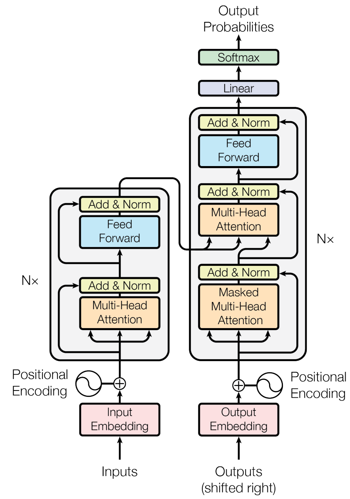
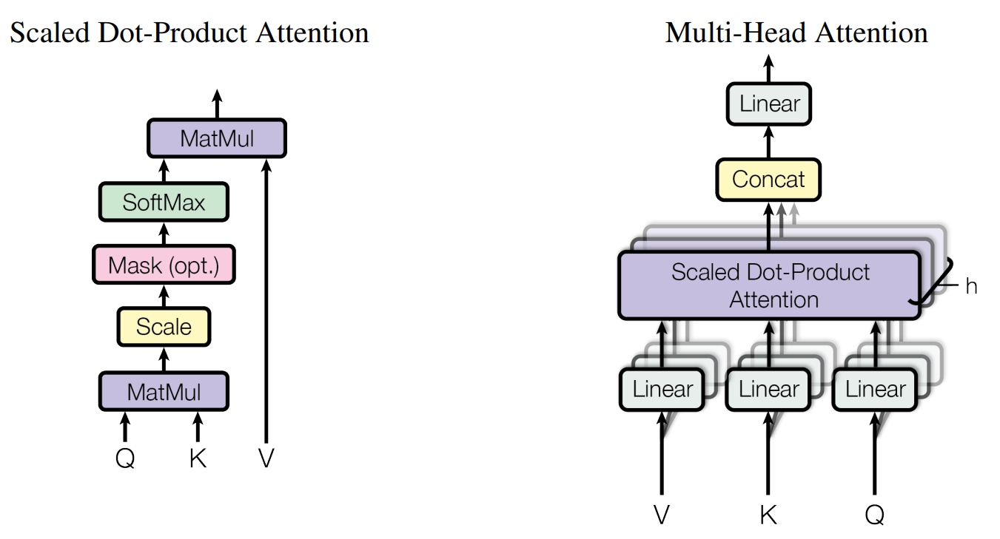
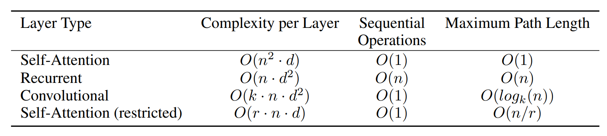
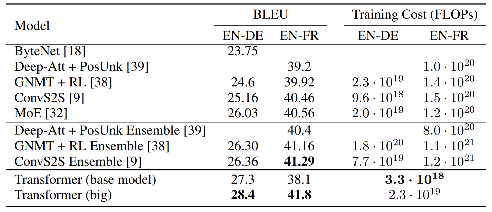
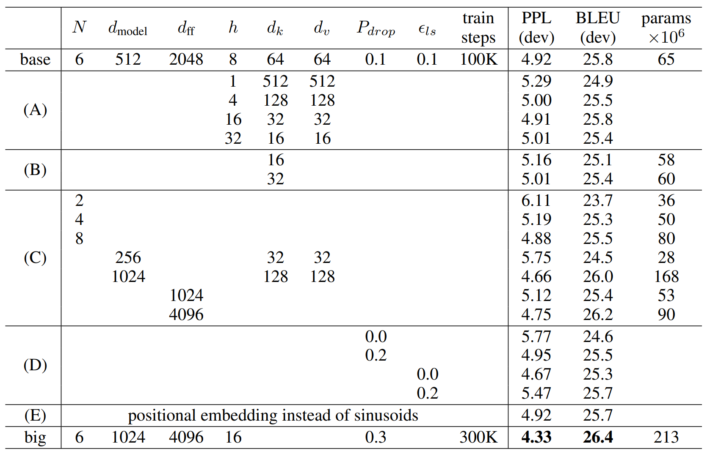
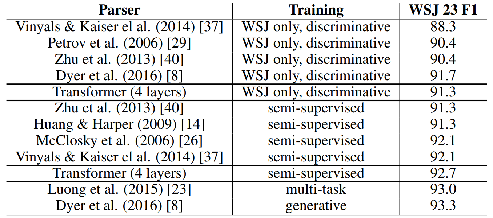

# [Attention Is All You Need](https://arxiv.org/abs/1706.03762)

## Abstract

主流的序列转导模型基于复杂的循环神经网络或卷积神经网络，其中包括一个编码器和一个解码器。表现最佳的模型还通过注意力机制连接编码器和解码器。我们提出了一种新的简单网络架构，即 Transformer，它完全基于注意力机制，完全摒弃了循环和卷积。在两项机器翻译任务上的实验表明，这些模型在质量上更优越，同时更易于并行化，并且训练时间显著减少。我们的模型在 WMT 2014 英德翻译任务上达到了 28.4 BLEU，比现有的最佳结果（包括集成模型）提高了 2 个 BLEU 以上。在 WMT 2014 英法翻译任务上，我们的模型在八个 GPU 上训练了 3.5 天后，以 41.8 的 BLEU 分数创造了新的单模型最佳记录，这只是文献中最佳模型训练成本的一小部分。我们通过将 Transformer 成功应用于具有大量和有限训练数据的英语成分句法分析，证明了其在其他任务上也具有良好的泛化能力。

## 1 Introduction

循环神经网络，特别是长短期记忆 [13] 和门控循环 [7] 神经网络，已被公认为序列建模和转导问题（如语言建模和机器翻译 [35, 2, 5]）中最先进的方法。此后，许多研究工作继续推动循环语言模型和编码器-解码器架构的界限 [38, 24, 15]。

循环模型通常沿着输入和输出序列的符号位置进行计算分解。通过将位置与计算时间步对齐，它们根据前一个隐藏状态 $h_{t-1}$ 和位置 $t$ 的输入生成一系列隐藏状态 $h_t$ 。这种固有的顺序性阻碍了训练样本内的并行化，在序列较长时，这变得至关重要，因为内存限制了跨样本的批处理。最近的工作通过分解技巧 [21] 和条件计算 [32] 在计算效率方面取得了显著改进，同时在后者的情况下也提高了模型性能。然而，顺序计算的基本约束仍然存在。

注意力机制已成为各种任务中引人注目的序列建模和转导模型不可或缺的一部分，它允许对依赖关系进行建模，而不考虑它们在输入或输出序列中的距离 [2, 19]。然而，除了少数情况 [27] 外，这种注意力机制通常与循环网络结合使用。

在这项工作中，我们提出了 Transformer，一种避免了循环并完全依赖注意力机制来绘制输入和输出之间全局依赖关系的模型架构。Transformer 允许显著更多的并行化，并且在 8 个 P100 GPU 上训练短短十二个小时后，就可以在翻译质量方面达到新的最佳水平。

## 2 Background

减少顺序计算的目标也构成了 Extended Neural GPU [16]、ByteNet [18] 和 ConvS2S [9] 的基础，所有这些模型都使用卷积神经网络作为基本构建块，并行计算所有输入和输出位置的隐藏表示。在这些模型中，关联来自两个任意输入或输出位置的信号所需的操作数量随着位置之间距离的增加而增加，对于 ConvS2S 呈线性增长，对于 ByteNet 呈对数增长。这使得学习远距离位置之间的依赖关系更加困难 [12]。在 Transformer 中，这被减少到常数数量的操作，虽然代价是由于对注意力加权位置进行平均而导致有效分辨率降低，我们通过 3.2 节中描述的多头注意力来抵消这种影响。

自注意力，有时也称为内部注意力，是一种注意力机制，它关联单个序列的不同位置以计算该序列的表示。自注意力已成功用于各种任务，包括阅读理解、摘要总结、文本蕴含和学习与任务无关的句子表示 [4, 27, 28, 22]。

端到端记忆网络基于循环注意力机制而不是序列对齐的循环，并且已被证明在简单语言问答和语言建模任务上表现良好 [34]。

然而，据我们所知，Transformer 是第一个完全依赖自注意力来计算其输入和输出表示的语言转录模型，而不使用序列对齐的 RNN 或卷积。在以下各节中，我们将描述 Transformer，阐述自注意力的动机，并讨论其相对于 [17, 18] 和 [9] 等模型的优势。

## 3 Model Architecture

大多数有竞争性的神经序列转录模型都采用编码器-解码器结构。其中，编码器将一个由符号表示组成的输入序列 $(x_1,\cdots,x_n)$ 映射到一个连续表示序列 $\bold{z} = (z_1, \cdots, z_n)$。给定 $\bold{z}$，解码器随后逐个元素地生成一个由符号组成的输出序列 $(y_1,\cdots,y_m)$ ，每次一个元素。在每个步骤中，模型都是自回归的 [10]，在生成下一个符号时，将之前生成的符号作为附加输入。

Transformer 遵循这种整体架构，编码器和解码器都使用堆叠的自注意力层和逐点全连接层，分别如图 1 的左半部分和右半部分所示。

**图 1：** Transformer-模型架构

### 3.1 Encoder and Decoder Stacks

**编码器**：编码器由一个 N = 6 个相同的层的堆叠组成。每层有两个子层。第一层是一个多头自注意力机制，而第二层是一个简单的，逐位置完全连接的前馈网络。我们在两个子层周围都采用了残差连接 [11]，接着是层归一化 [1]。即每个子层的输出是 $\text{LayerNorm}(x + \text{Sublayer}(x))$，其中 $\text{Sublayer}(x)$ 是由子层自身实现的函数。为了方便这些残差连接，模型中的所有子层以及嵌入层都产生维度 $d_{\text{model}} = 512$ 的输出。

**解码器**：解码器也是由一个 N = 6 个相同的层的堆叠组成。除了每个编码器层中的两个子层之外，解码器还插入了第三个子层，该子层对编码器堆栈的输出执行多头注意力。与编码器类似，我们在每个子层周围采用残差连接，然后使用层归一化。我们还修改了解码器堆栈中的自注意力子层，以防止位置注意到后续位置 **(避免在生成当前时刻输出时，看见当前时刻之后的输入，以确保训练和预测行为一致)**。这种掩码，结合输出嵌入被偏移了一个位置，确保了位置 $i$ 的预测仅能够依赖位置小于 $i$ 的已知输出。

### 3.2 Attention

注意力函数可以被描述为将一个查询 (query) 和一组键值 (key-value) 对映射到一个输出。其中查询、键、值和输出都是向量。这个输出是根据值的加权和计算得出的，分配给每个值的权重则通过一个兼容性函数（compatibility function）计算，该函数衡量查询与对应键的匹配程度。

**图 2：** (左) 缩放的点积注意力。(右) 由几个并行运行注意力层组成的多头注意力。

#### 3.2.1 Scaled Dot-Product Attention

我们将我们特别关注的注意力称为 "缩放的点积注意力"（图 2）。输入由 $d_k$ 维的查询和键，和 $d_v$ 维的值组成。我们计算查询与所有的键的点积，将结果除以 $\sqrt{d_k}$ ，并应用 softmax 函数来获得值的权重。

实践中，我们同时在一组查询上计算注意力函数，将它们打包成一个矩阵 $Q$ 。键和值也打包成矩阵 $K$ 和 $V$ 。我们计算输出矩阵如下：
$$
\large \text{Attention}(Q,K,V) = \text{softmax}(\frac{QK^T}{\sqrt{d_k}})V \tag{1}
$$
最常用的两个注意力函数是加性注意力 [2] 和点积 (乘性) 注意力。点积注意力与我们的算法相同，除了缩放因子 $\frac{1}{\sqrt{d_k}}$。加性注意力使用一个具有单一隐藏层的前馈网络计算兼容性函数。虽然这两种方法的理论复杂度相似，但实际上点积注意力更快且空间效率更高，因为它能用高度优化的矩阵乘法代码来实现。

当 $d_k$ 的值较小时，这两种机制的表现相似，但当 $d_k$ 较大时，加性注意力优于没有缩放的点积注意力 [3]。我们怀疑当 $d_k$ 较大时，点积的幅度会变得很大，将 softmax 函数推到了梯度极小的区域。为了抵消这种影响，我们用 $\frac{1}{\sqrt{d_k}}$ 对点积进行缩放。

#### 3.2.2 Multi-Head Attention

与其使用维度为 $d_{\text{model}}$ 的键、值和查询执行单一的注意力函数，我们发现将查询、键和值分别通过 $h$ 个不同的、学习到的线性投影，映射到 $d_k,d_k,d_v$ 维会更有益。然后在每个这些投影后的查询、键和值上，我们并行地执行注意力函数，产生 $d_v$ 维的输出值。这些值被连接起来并再次进行投影，从而得到最终的值，如图 2 所示。

多头注意力机制使模型能够同时关注不同位置处多个表示子空间的信息。对于单头注意力，其平均化操作会抑制这种多空间联合建模的能力。
$$
\large \text{MultiHead}(Q,K,V) = \text{Concat}(\text{head}_1,\cdots,\text{head}_h)W^O \\
\large \text{where} \ \text{head}_i = \text{Attention}(QW^Q_i,KW^K_i,VW^V_i)
$$
其中投影参数矩阵 $\large W^Q_i \in \mathbb{R}^{d_{\text{model}} \times d_k}, W^K_i \in \mathbb{R}^{d_{\text{model}} \times d_k}, W^V_i \in \mathbb{R}^{d_{\text{model}} \times d_v}, W^O \in \mathbb{R}^{hd_v \times d_{\text{model}}}$ 。

在这项工作中，我们采用 $h = 8$ 个并行的注意力层，或称为 "头"。对于每一个，我们使用 $d_k = d_v = d_{\text{model}} / h = 64$。由于每个头的维度减少，总体的计算成本与使用完整维度的单头注意力的计算成本相似。

#### 3.2.3 Applications of Attention in our Model

Transformer 以三种不同的方式使用多头注意力：

- 在 "编码器-解码器注意力" 层，查询来自前一解码器层，记忆键 (memory  keys) 和值来自编码器的输出。这使得解码器中的每个位置都可以关注输入序列中的所有位置。这模拟了序列到序列模型 (如 [38, 2, 9]) 中经典的编码器-解码器注意力机制。
- 编码器包含自注意力层。在自注意力层中，所有的键、值和查询都来自相同的地方，在本例中是编码器中前一层的输出。编码器中的每个位置都能处理编码器的前一层中的所有位置。
- 类似地，解码器中的自注意力层允许解码器中的每个位置关注解码器中直到并包括该位置的所有位置。我们需要阻止解码器中向左的信息流动，以保持其自回归特性。我们通过在缩放点积注意力内部，将 softmax 输入中对应于非法连接的所有值屏蔽掉（设置为 $-\infty$ ）来实现这一点。详见图 2。

### 3.3 Position-wise Feed-Forward Networks

除了注意力子层，我们的编码器和解码器中的每个层都包含一个全连接的前馈网络，它独立地并同等地应用在每个位置。它由两个线性变换组成，中间夹着一个 ReLU 激活。
$$
\text{FFN}(x) = \max(0, xW_1 + b_1)W_2 + b_2 \tag{2}
$$
虽然这些线性变换在不同位置上是相同的，但它们在不同层之间使用不同的参数。另一种描述它的方式是将其视为两个核大小为 1 的卷积。输入和输出的维度是 $d_{\text{model}} = 512$，内层的维度是 $d_{ff} = 2048$ 。

### 3.4 Embeddings and Softmax

与其他序列转录模型相似，我们使用学习到的嵌入将输入词元和输出词元转换为 $d_{\text{model}}$ 维向量。我们也使用常规的学习到的线性变换和 softmax 函数将解码器输出转换为下一个词元的预测概率。在我们的模型中，我们在两个嵌入层和 softmax 前的线性变换之间共享相同的权重矩阵，与 [30] 相似。在嵌入层中，我们将这些权重乘以 $\sqrt{d_{\text{model}}}$ 。

### 3.5 Positional Encoding

由于我们的模型不包含循环和卷积，为了让模型能够利用序列的顺序信息，我们必须注入一些关于词元在序列中相对或绝对位置的信息。为此，我们在编码器和解码器堆栈的底部，将**位置编码** (positional encodings) 添加到输入嵌入中。位置编码的维度与嵌入的维度 $d_{\text{model}}$ 相同，因此两者可以相加。位置编码有很多选择，学习的和固定的。

在本工作中，我们使用不同频率的 sine 和 cosine 函数：
$$
\large PE(pos,2i) = sin(pos/10000^{2i/d_{\text{model}}}) \\
\large PE(pos,2i+1) = cos(pos/10000^{2i/d_{\text{model}}})
$$
其中 $pos$ 是位置， $i$ 是维度。也就是说，位置编码的每一维度对应着一个正弦波。波长从 $2\pi$ 到 $10000 \cdot 2\pi$ 形成一个几何级数。我们选择这个函数是因为我们假设它能让模型很容易地学习通过相对位置进行注意力，因为对于任意固定偏移 $k$ ，$PE_{pos+k}$ 可以被表示为 $PE_{pos}$ 的一个线性函数。

我们还尝试了使用学习到的位置嵌入 [9] 作为替代，发现这两个版本产生了几乎相同的结果 (见表 3 行 (E))。我们选择正弦版本是因为它可能允许模型外推到比训练期间遇到的更长的序列长度。

**表 1：** 对于不同层类型的最大路径长、每层的复杂度和最小的时序性操作数。$n$ 是序列长度，$d$ 是表示的维度，$k$ 是卷积核的大小，$r$ 是受限的自注意力的领域大小。

## 4 Why Self-Attention

在本节中，我们将自注意力层与常用于将可变长度符号表示序列 $(x_1,\dots,x_n)$ 映射到等长序列 $(z_1,\dots,z_n)$ 的循环层和卷积层进行比较，其中 $x_i,z_i \in \mathbb{R}^d$，例如在典型的序列转导编码器或解码器中的隐藏层。为了说明我们使用自注意力的动机，我们考虑了三个理想特性。

其一是每层的总计算复杂度。另一个是可以并行化的计算量，通过所需的最少顺序操作数来衡量。

第三个是网络中长距离依赖之间的路径长度。学习长距离依赖是许多序列转导任务中的一个关键挑战。影响学习此类依赖能力的一个关键因素是前向和反向信号在网络中必须遍历的路径长度。输入和输出序列中任意位置组合之间的这些路径越短，就越容易学习长距离依赖 [12]。因此，我们还将比较由不同层类型组成的网络中任意两个输入和输出位置之间的最大路径长度。

如表 1 所示，一个自注意力层用常数级的顺序操作将所有的位置连接起来，而循环层需要 $O(n)$ 的顺序操作。在计算复杂度方面，当序列的长度 $n$ 小于表示的维度 $d$ 时，自注意力层比循环层更快，这在机器转录的最先进的模型中所使用的句子表示 (如 word-piece  [38] 和 byte-pair [31] 表示) 中是最常见的情况。为了提升涉及非常长的序列任务的计算性能，自注意力可以被限制为只考虑输入序列中以各自的输出位置为中心的大小为 $r$ 的领域。这将提升最大的路径长度到 $O(n/r)$。我们计划在未来的工作进一步研究这种方法。

一个核宽度 $k < n$ 的单卷积层不会连接所有的输入和输出位置对。在连续的内核的情况下，要这样做需要堆叠 $O(n/k)$ 个卷积层，或者在使用空洞卷积 [18] 的情况下需要 $O(log_k(n))$ ，这会增加网络中任意两位置之间的最长路径的长度。卷积层通常比循环层贵 $k$ 倍。可分离的卷积 [6] 将复杂度大大降低到 $O(k \cdot n \cdot d + n \cdot d^2)$ 。然而，即使 $k = n$，可分离的卷积的复杂度也等于自注意力层和逐点的前馈层的组合，后者是我们模型中采用的方法。

作为额外的好处，自注意力可以产生更具可解释性的模型。我们检查我们模型中的注意力的分布，并在附录中展示和讨论了示例。不仅单个注意力头明显学习执行不同的任务，许多似乎表现出与句子句法和语义结构相关的行为。

## 5 Training

本节描述我们模型的训练机制。

### 5.1 Training Data and Batching

我们使用标准的 WMT 2014 英德数据集进行了训练，该数据集包含大约 450 万个句子对。句子使用字节对编码 [3] 进行编码，该编码有一个约 37000 个词元的共享源-目标词汇表。对于英法翻译，我们使用了更大的 WMT 2014 英法数据集，该数据集包含 3600 万个句子，并将词元拆分为一个 32000 个词片的词汇表 [38]。句子对按近似序列长度进行批处理。每个训练批次包含一组句子对，其中包含大约 25000 个源词元和 25000 个目标词元。

### 5.2 Hardware and Schedule

我们在一台有 8 块 NVIDIA P100 GPUs 的机器上训练我们的模型。对于使用本文中描述的超参数的基础模型，每个训练 step 大约需要 0.4 秒。我们基础模型总共训练 100,000 steps 或 12 小时。对于我们的大模型 (在表 3 底部的行中描述)，step 时间是 1.0 秒。大模型训练了 300,000 steps (3.5 天)。

### 5.3 Optimizer

我们使用 Adam 优化器 [20]，其中 $\beta_1 = 0.9, \beta_2 = 0.98, \epsilon = 10^{-9}$。我们按下列公式在训练过程中改变学习率：
$$
\large lrate = d_{\text{model}}^{-0.5} \cdot \min(step\_num^{-0.5}, step\_num \cdot warmup\_steps^{-1.5}) \tag{3}
$$
这对应于在最初的 $warmup\_steps$ 训练步骤中，学习率线性增加，之后与 steps 数的平方根成反比地减小。我们使用 $warmup\_steps = 4000$ 。

### 5.4 Regularization

我们在训练期间采用三种类型的正则化：

**Residual Dropout**  我们将 dropout [33] 应用于每个子层的输出，然后将它与子层的输入相加并归一化。此外，我们将 dropout 应用于堆叠的解码器和编码器中的嵌入和位置编码的和。对于基础模型，我们使用 $P_{drop} = 0.1$ 。

**Label Smoothing**  训练期间，我们采用 $\epsilon_{ls} = 0.1$ 的标签平滑 [36]。这让人困惑，因为模型学到了更多的不确定，但提高了准确性和 BLEU 分数。

**表 2：**  Transformer 以一部分训练成本在 English-to-German 和 English-to-French newstest2014 测试上取得比之前的 state-of-the-art 模型更好的 BLEU 分数。

## 6 Results

### 6.1 Machine Translation

在 WMT 2014 English-to-German 翻译任务中，大型的 Transformer 模型 (表 2 中的 Transformer (big)) 比之前报告的最好的模型（包括集成模型）好超过 2.0 BLEU，建立了新的 state-of-the-art BLEU 分数 28.4。这个模型的配置展示在表 3 的底部的行。训练在 8 块 P100 GPUs 中花费 3.5 天。甚至我们的基础模型都超过了所有以前发布的模型和集成，而其训练成本仅为任何竞争模型的一小部分。

在 WMT 2014 English-to-French 翻译任务中，我们的大型模型取得了 41.0 的 BLEU 分数，胜过之前发布的所有的单一模型，其训练成本不到先前最先进模型的四分之一 $1/4$ 。对于 English-to-French，Transformer (big) 模型训练使用 dropout rate 为 $P_{drop} = 0.1$ 而不是 0.3。

对于基础模型，我们通过平均最后 5 个检查点获得了一个单一模型，这些检查点每 10 分钟写入一次。对于大模型，我们平均最后的 20 个检查点。我们使用波束大小为 4 和长度惩罚 $\alpha = 0.6$ [38] 的波束搜索。这些超参数是在开发集上进行实验后选定的。我们在推理期间将最大输出长度设置为输入长度 $+50$，但在可能的情况下提前终止。

表 2 总结了我们的结果，并将我们的翻译质量和训练成本与文献中的其他模型架构进行了比较。我们通过将训练时间、使用的 GPUs 数量和每个 GPU 持续的单精度浮点运算能力的评估相乘来评估训练一个模型所需的浮点运算量。

### 6.2 Model Variations

为了评估 Transformer 不同组件的重要性，我们以不同的方式改变了我们的基础模型，测量在开发集、newstest 上 English-to-German 的性能的变化。我们使用前一节所述的束搜索，但没有检查点平均。我们在表 3 中展示了这些结果。

在表 3 行 (A) 中，我们改变注意力头的数量和注意力键和值的维度，保持计算量不变，如 3.2.2 节所述。虽然单头注意力比最好的设置差 0.9 BLEU，但过多的头也会导致质量下降。

在表 3 行 (B) 中，我们观察到减少注意力键的大小 $d_k$ 会损害模型质量。这表明决定性的兼容能力是不容易的，一个比点积更复杂的兼容函数可能是有益的。我们在行 (C) 和 (D) 中进一步观察到，正如期望的那样，模型越大越好，并且 dropout 对于避免过拟合是非常有帮助的。在行 (E) 中，我们使用学习后的位置嵌入替换我们的正弦位置编码，并观察到与基础模型几乎一致的结果。

**表 3：** Transformer 架构的变体。为列出的值与基础模型的值相同。所有的指标是在 English-to-German 开发集，newstest2013 上的。所列出的困惑度是每个单词的，按照我们的字节对编码的，并且不应该与每个单词的困惑度进行比较。

**表 4：** Transformer 很好地泛化到英语句法分析 (结果是在 WSJ 的第 23 节上的)

### 6.3 English Constituency

为了评估 Transformer 是否能够泛化到其他任务，我们在英语句法分析上进行了实验。这个任务提出了明确的挑战：输出受到强烈的结构的约束，并且远远长于输入。此外，RNN 序列到序列的模型还没有在小数据上取得 state-of-the-art 的结果。

我们在 Wall Street Journal (WSJ) of the Penn Treebank，大约 40K 训练句子上训练了一个 $d_{model} = 1024$ 的  4 层 Transformer。我们还在一个半监督的环境里面训练了它，使用了更高的置信度和 BerkeleyParser 语料库，大约有 1700 万句子。我们对仅用 WSJ 的环境使用了一个有 16K 的词元的词表，对半监督的环境使用了一个有 32K 词元的词表。

在第 22 节的开发集上，我们只进行了少量的实验来选择 dropout、注意力和残差、学习率和束大小，其他所有的参数都保持跟 English-to-German 基础翻译模型一致。推理期间，我们将最大的输出长度增加到输入长度 $+300$。对于仅 WSJ 和半监督的环境，我们都使用了束大小为 21 和 $\alpha = 0.3$。

表 4 中的结果表明，尽管缺少特定任务的调优，我们的模型还是表现得令人惊讶地好，产生了结果比之前报告的所有模型都好，除了 Recurrent Neural Network Grammar [8]。

与 RNN 序列到序列模型相比，Transformer 甚至在仅 40K 句子的 WSJ 训练集上训练时也优于 BerkeleyParser。

## 7 Conclusion

本工作中，我们提出了 Transformer，第一个完全基于注意力的序列转录模型，用多头自注意力替换了编码器-解码器架构中最常用的循环层。

对于翻译任务，Transformer 能比基于循环层或卷积层的架构显著地训练得更快。在 WMT 2014 English-to-German 和 WMT 2014 English-to-French 翻译任务中，我们取得了一个新的 state-of-the-art。在前一个任务中，我们最好的模型胜过所有之前报告的集成 (ensembles)。

我们对基于注意力的模型的未来感到兴奋，并计划将其应用到其他任务。我们计划将 Transformer 扩展到涉及文本以外的输入和输出形态的问题，并研究局部的、受限的注意力机制，以有效地处理大量的输入和输出，如图像、音频和视频。使生成的不那么时序化是我们的另一研究目标。
