# [VRP-SAM: SAM with Visual Reference Prompt](https://arxiv.org/abs/2402.17726)

## Abstract

在本文中，我们提出了一种新颖的视觉参考提示 (Visual Reference Prompt) (VRP) 编码器，该编码器使 Segment Anything 模型 (SAM) 能够利用带注释的参考图像作为分割的提示，从而创建了 VRP-SAM 模型。本质上，VRP-SAM 可以利用带注释的参考图像来理解特定对象，并在目标图像中执行特定对象的分割。值得注意的是，VRP 编码器可以支持各种参考图像的标注格式，包括**点、框、涂鸦和掩码**。VRP-SAM 通过扩展其多功能性和适用性，同时保留 SAM 的固有优势，在 SAM 框架内取得了突破，从而增强了用户友好性。为了增强 VRP-SAM 的泛化能力，VRP 编码器采用了元学习策略。为了验证 VRP-SAM 的有效性，我们对 Pascal 和 COCO 数据集进行了广泛的实证研究。值得注意的是，VRP-SAM 在视觉参考分割方面取得了最先进的性能，且仅需极少的学习参数。此外，VRP-SAM 展示了强大的泛化能力，使其能够执行对未见过对象的分割，并实现跨域分割。源代码和模型将在 https://github.com/syp2ysy/VRPSAM 上提供。

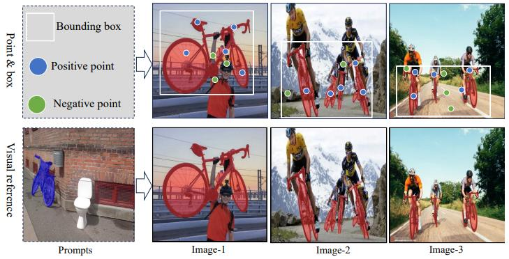

**图 1**：在处理大量图像时，SAM 内置的点和框提示模式与视觉参考提示的比较。所有提示均由用户提供。

## 1. Introduction

最近，Segment Anything 模型 (SAM) [13] 已成为图像分割领域的基础视觉模型。SAM 在包含数十亿标签的大规模数据集上进行训练，在通用分割领域展现了卓越的多功能性。SAM 的独特之处在于其人机交互设计，允许基于用户提供的提示进行分割，这些提示可以是点、边界框或粗略的掩码。这一独特的特性使 SAM 成为一个强大的工具，能够适应各种任务和需求 [12, 50]。

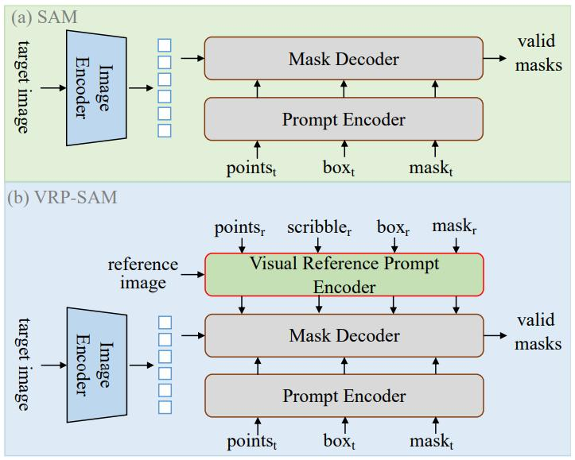

**图 2**：SAM 和 VRP-SAM 的比较。VRP-SAM 引入了一个视觉参考提示编码器，可以接受点、涂鸦、框和掩码格式的带注释参考图像，与 SAM 相比提供了显著的增强。

然而，SAM 现有的提示格式在实际应用中面临着重大挑战，尤其是在处理复杂场景和大量图像时。如图 2(a) 所示，SAM 依赖于用户提供的提示（点、框、粗略掩码）来分割目标图像中的对象，这要求用户对目标对象有全面的了解。在实际应用中，尤其是在复杂场景中，用户对目标对象的熟悉程度会显著影响提供特定提示的有效性。此外，不同图像中目标对象的位置、大小和数量的变化，需要为每张图像定制不同的提示。如图 1 所示，以分割“自行车”为例，用户需要为每张图像定制不同的提示，这显著影响了 SAM 的效率。因此，我们建议集成视觉参考提示以克服这些限制，并增强 SAM 的适应性。

视觉参考提示是带注释的参考图像，这些图像描绘了用户期望分割的对象。如图 1 所示，通过简单地提供一个带有自行车的视觉参考提示，我们可以在不同的图像中分割自行车，而无需用户为每张图像提供特定的提示。这显著提高了 SAM 的效率，同时减少了对用户对象熟悉度的依赖。为了实现这个目标，一些方法 [19, 48] 结合了语义相关模型 [9, 25] 来建立参考-目标的相关性，从而获得目标对象的伪掩码。在此之后，设计了一种采样策略，从伪掩码中提取一组点和边界框，作为 SAM 分割目标图像的提示。这些方法忽略了伪掩码中的假阳性，并且对超参数高度敏感。因此，它严重依赖于伪掩码的质量，并且泛化能力较差。

为此，我们提出了一种简单有效的视觉参考提示 (VRP) 编码器，该编码器使用元学习技术，并与 SAM 集成以创建 VRP-SAM。它利用带注释的参考图像作为提示，来分割目标图像中语义相似的对象。如图 2(b) 所示，VRP 编码器接受各种标注格式的输入，包括点、涂鸦、框和掩码。具体来说，VRP 编码器引入了一个语义相关的模型，将参考图像和目标图像编码到同一空间中。遵循元学习方法，我们首先从参考图像的注释信息中提取目标对象的原型，从而增强目标对象在两张图像中的表示。遵循元学习方法，首先从带注释的参考图像中生成目标对象（用户的标记）的原型，旨在突出参考图像和目标图像中的此类目标实例。然后，我们引入了一组可学习的查询，以从注意力增强的参考特征中提取目标对象的语义线索。然后，这些查询与目标图像交互，生成可供掩码解码器使用的提示嵌入，以分割目标图像中语义特定的对象。基于 SAM 固有能力的基础，VRP-SAM 增强了模型的视觉参考分割能力。视觉参考提示 (VRP) 的引入不仅使提示多样化，使模型能够快速分割具有相同语义的对象，而且还引入了元学习机制，显著提升了模型的泛化能力，尤其是在处理新颖对象和跨域场景时。

为了定量评估 VRP-SAM 的泛化能力，我们遵循小样本分割中常用的数据集配置，并在 Pascal-5i 和 COCO-20i 数据集上评估我们的 VRP-SAM。大量的实验表明，VRP-SAM 克服了 SAM 在提示格式上的限制，实现了高效的视觉参考分割。它显著优于基于采样的方法，在 Pascal-5i 和 COCO-20i 数据集上取得了最先进的结果。此外，我们提供了确凿的证据，表明 VRP-SAM 在处理未知对象和跨域场景方面表现出色。我们的实验表明，VRP-SAM 基于语义实现了对大量图像的快速分割。此外，元学习原理的融入显著增强了其泛化能力，使其适用于各种场景。

## 2. Related Work

### 2.1. Application of SAM

Segment Anything 模型 (SAM) [13] 是 Meta 最近推出的一个类别无关的交互式分割模型。它利用用户引导的指令进行分割，例如点、边界框和粗略的掩码。目前，SAM 有两种主要的应用方法。一种是将 SAM 的分割结果作为先验信息来辅助下游任务。例如，Inpaint Anything (IA) [45] 和 Edit Everything [40] 利用 SAM 的分割结果在掩码区域内进行图像编辑和修复 [43, 49]。此外，SEPL [5] 采用 SAM 的分割结果来增强弱监督分割任务 [27, 31] 中的伪标签。此外，SAM 的分割结果还作为先验信息用于裂缝和火山坑检测等任务 [1, 8]。

第二种方法是通过各种提示组合来引导 SAM 进行分割。例如，在视觉参考分割 [32] 的背景下，Matcher [19] 从伪掩码中采样点和框，并利用 SAM 来细化这些伪掩码。TAM [42] 应用于目标跟踪任务，它使用点提示来初始化目标掩码，然后使用 SAM 来细化低质量的掩码。此外，SAMAug [6] 引入了一种专为 SAM 设计的视觉点增强方法，有助于自动图像标注。这些例子说明了 SAM 在不同任务中的有效性。然而，现有方法受到 SAM 现有提示模式的限制，并且在面对复杂对象和不熟悉的场景时可能会遇到困难。为了打破这些限制，我们为 SAM 设计了一个视觉提示编码器，从而将其适用性扩展到更广泛的场景。

### 2.2. Visual reference segmentation

视觉参考分割 [32, 34, 50] 旨在利用参考图像引导目标图像的分割。这项任务的目标是利用语义标注的参考图像，来指导目标图像中与参考图像中对象或区域具有相同语义的部分的分割。在当前的研究中，方法可以大致分为两类：基于原型的方法和基于特征匹配的方法。基于原型的方法，如 PFENet [34]、PANet [37] 和 CWT [21]，通常侧重于区分具有不同类别特定特征的原型。另一方面，ASGNet [15] 通过增加原型的数量来提高分割性能。另一种基于特征匹配的方法 [22, 36] 利用参考图像和目标图像之间的像素级相关性，以显著提高分割性能，如 CyCTR [46] 和 HDMNet [26] 等方法所示。此外，现代大型视觉模型 [2, 38, 50] 已将视觉参考分割视为一项主要任务，因为它在处理复杂对象和未知场景方面起着不可或缺的作用。然而，需要注意的是，SAM [13] 不具备执行此任务的能力，这突显了引入 VPR-SAM 的必要性。

## 3. Preliminary

在本节中，我们首先回顾 Segment Anything 模型的架构。然后，我们阐述本文的问题设定。

### 3.1. SAM Architecture

SAM 是一种交互式分割模型，由图像编码器、提示编码器和掩码解码器组成。给定目标图像 $\large I_t$ 和一些几何提示，SAM 首先采用一个 Vision Transformer (ViT) [35] 作为图像编码器来提取图像特征。随后，提示编码器用于生成从用户提供的点、框或掩码导出的提示嵌入。最后，掩码解码器整合图像特征和提示嵌入，并以类别无关的方式生成高质量的掩码。

据我们所知，当前基于 SAM 的研究仍然依赖于几何提示进行分割。到目前为止，还没有人尝试引入新的提示形式来增强 SAM。我们设计了一种新颖的视觉参考提示，以扩展 SAM 的视觉参考分割能力。

### 3.2. Problem Formulation

视觉参考分割旨在分割目标图像中与参考图像中带注释的对象具有相同语义的对象。具体来说，设 $\large I_t$ 表示目标图像， $\large I_r$ 表示参考图像。给定参考图像 $\large I_r$ 及其注释 $\large M_r^i$ ，其中 $i$ 表示带注释对象的类别，我们利用此信息来分割目标图像中属于类别 $i$ 的所有区域。根据注释的粒度，参考图像有四种注释格式：点、涂鸦、框和掩码。点注释涉及在目标上提供特定的点，涂鸦需要用任意曲线勾勒目标区域，框对应于目标周围的边界框，而掩码为整个目标提供像素级的注释。

## 4. VRP-SAM

VRP-SAM 扩展了 SAM 的功能以执行视觉参考分割，且不影响其原始功能。我们提出了一种训练高效的视觉参考提示编码器，该编码器首先可以适应各种粒度的视觉参考，其次，直接将这些视觉参考编码为提示嵌入，而不是几何提示。然后，这些提示嵌入直接输入到 SAM 的掩码解码器中，从而生成目标掩码。

如图 3 所示，VRP 编码器由特征增强器和提示生成器组成。接下来，我们将深入探讨 VRP 编码器和损失函数的细节。

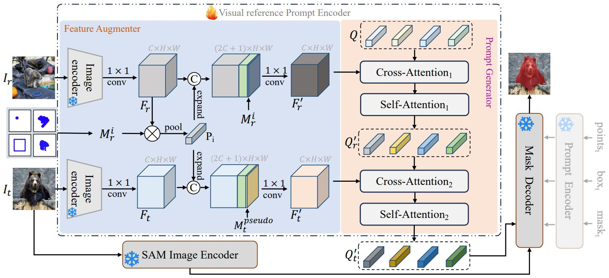

**图 3**：提出的 VRP-SAM 框架。我们的方法通过扩展 VRP 编码器，使 SAM 能够执行视觉参考分割。它将各种粒度的视觉参考作为输入，并将这些视觉参考编码为提示嵌入。我们的 VRP 编码器由特征增强器和提示生成器组成。

### 4.1. Feature Augmenter

受元学习的启发，特征增强器将参考标注 $M_r^i$ 分别编码到参考图像和目标图像的特征中。此过程旨在区分前景和背景表示。为了捕获参考图像和目标图像之间的语义相关性，我们在 VRP 编码器中引入了一个语义感知的图像编码器，将它们编码到同一个潜在空间中。为了防止 VRP 编码器过拟合，我们在训练阶段冻结图像编码器。这确保了在捕获语义相关性和防止 VRP 编码器过度专门化之间取得平衡。

特征增强器如图 3 所示。最初，利用语义感知的图像编码器（例如 ResNet-50），我们分别编码 $I_r$ 和 $I_t$ ，得到特征图 $F_r \in \mathbf {R}^{C \times H \times W}$ 和 $F_t \in \mathbf {R}^{C \times H \times W}$  。随后，我们使用掩码 $M_r^i$ 从 $F_r$ 中提取对应于类别 $i$ 的原型特征 $P_i$  。此过程可以概括如下： 

$$
\large P_i = MaskAvgPool(F_r, M_r^i) \tag{1}
$$

其中 $M_r^i$ 表示以下注释格式之一：点、涂鸦、框或掩码。为了增强关于类别 $i$ 的上下文信息，我们将原型特征和掩码与 $F_r$ 和 $F_t$ 连接起来。 $F_r$ 与掩码 $m_i$ 连接，$F_t$ 与伪掩码 $\large m_{i}^{\text {pseudo}}$ 连接。 $\large m_{i}^{\text {pseudo}}$ 是使用一种常见的无训练方法获得的，详细描述在附录中提供。随后，我们采用共享的 1 × 1 卷积层来降低增强特征的维度。此过程可以概括如下：

$$
\large F_r^{\prime} = Conv(concat(F_r,P_i,m_i)) \tag{2}
$$

$$
\large F_t^{\prime} = Conv(concat(F_t,P_i,m_i^{\text {pseudo}})) \tag{3}
$$

最终，我们获得增强的图像特征 $F_r^{\prime}  \in \mathbf {R}^{C \times H \times W}$ 和 $F_t^{\prime} \in \mathbf {R}^{C \times H \times W}$ ，它们具有关于类别 $i$ 的增强的上下文信息。因此，增强的特征包含类别 $i$ 的前景表示和其他类别的背景表示。随后，我们将增强的特征输入到提示生成器中，以获得一组视觉参考提示。

### 4.2. Prompt Generator

提示生成器的目的是为 SAM 掩码解码器获得一组视觉参考提示嵌入。如图 3 所示，该过程首先引入一组可学习的查询，表示为 $Q \in \mathbf{R}^{N \times C}$ ，其中 $N$ 表示视觉参考提示的数量。这些查询首先与参考特征 $F_r^{\prime}$ 交互，通过交叉注意力层和自注意力层获得类别特定的信息：

$$
\large Q_r^{\prime} = \text {SelfAttn}_1(\text {CrossAttn}_1(Q, F_r^{\prime})) \tag{4}
$$

在此，我们获得一组查询 $Q_r^{\prime}$ ，这些查询拥有关于要分割对象的信息。随后，我们采用交叉注意力使这些查询与目标图像特征交互，以获得目标图像中的前景信息。在此之后，使用自注意力层更新查询，生成一组与 SAM 的表示对齐的提示 $Q_t^{\prime}$ ：

$$
\large Q_t^{\prime} = \text {SelfAttn}_2(\text {CrossAttn}_2(Q_r^{\prime}, F_t^{\prime})) \tag{5}
$$

最终的 $Q_t^{\prime}$ 作为 SAM 的视觉参考提示嵌入，具备引导目标图像中前景分割的能力。通过将这组视觉参考提示嵌入输入到掩码解码器中，可以获得目标图像中类别 $i$ 的掩码 $M_t^{i}\in \mathbf {R}^{1 \times H \times W}$ 。

### 4.3. Loss Function

我们采用二元交叉熵 (BCE) 损失和 Dice 损失来监督视觉参考提示编码器的学习。BCE 损失确保像素级的准确性，而 Dice 损失为像素级分割提供额外的上下文信息。因此，VRP-SAM 的总损失为：

$$
\huge 
\begin{matrix}
L_{\text {total}} = \underbrace {- \frac {1}{N} \sum_{i=1}^{N} \left [ y_i \log (p_i) + (1 - y_i) \log (1 - p_i) \right ]}\\{\text {BCE Loss}} \\
+ \underbrace {1 - \frac {2 \sum _{i=1}^{N} (p_i \cdot y_i)}{\sum_{i=1}^{N} p_i^2 + \sum_{i=1}^{N} y_i^2}}\\{\text {Dice Loss}} 
\end{matrix}
(6)
$$

其中 $N$ 表示像素总数， $y_i$ 是像素 $i$ 的真实标签， $p_i$ 是像素 $i$ 属于该对象的预测概率。通过结合这两个损失，我们全面考虑了准确性和上下文效应，从而更有效地引导视觉参考提示编码器生成精确的分割结果。

## 5. Experiments

### 5.1. Setting

**数据集**：为了验证 VRP-SAM 的分割性能和泛化能力，我们遵循小样本设置 [14, 32, 46] 在 COCO-20i [24] 和 PASCAL-5i [29] 数据集上进行了广泛的实验。具体来说，我们将两个数据集中的所有类别组织成 4 个子集 (folds)。对于每个子集 (fold)，PASCAL-5i [29] 包含 15 个用于训练的基础类别和 5 个用于测试的新类别，而 COCO-20i [24] 包含 60 个训练基础类别和 20 个测试新类别。为了评估模型性能，我们在每个 fold 中随机抽取了 1000 个参考-目标图像对。在每个 fold 中，由于上述数据集缺乏点、涂鸦和框标注的标签，我们遵循 SEEM [50] 的方法，通过基于参考真实掩码随机模拟用户输入来生成这些标注标签。

**实现细节**：在视觉参考提示编码器中，我们使用 VGG-16 [3] 和 ResNet-50 [9] 作为图像编码器，并使用 ImageNet [28] 预训练权重进行初始化。我们采用 AdamW 优化器 [20] 以及余弦学习率衰减策略来训练 VRP-SAM。具体来说，在 COCO-20i 数据集上，我们进行了 50 个 epoch 的训练，初始学习率为 1e-4，批大小为 8。对于 PASCAL-5i 数据集，模型训练了 100 个 epoch，初始学习率为 2e-4，批大小为 8。在 VRP 中，查询的数量默认设置为 50，所有实验的输入图像大小都需要调整为 512 × 512。遵循 SEEM [50]，在训练期间，我们基于掩码标注获取点、涂鸦和框的标注。我们在附录中提供了此过程的详细描述。为了确保公平比较，VRP-SAM 仅与之前使用基于平均交并比 (mIoU) 的视觉参考提示的工作 [16, 26, 38] 进行比较。

### 5.2. Comparison with the State-of-the-art

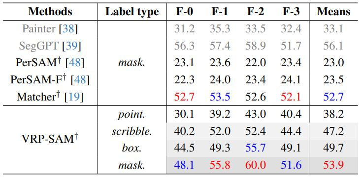

**表 1**：与其他基础模型的比较。在 COCO-20i 上的 one-shot 语义分割结果。灰色表示该模型是由域内数据训练。† 表示该方法使用 SAM。

**与其他基础模型的比较**。利用基础模型可以实现小样本分割。我们比较了使用 Painter [38]、SegGPT [39] 和 SAM 作为基础模型进行小样本分割的各种方法，并在 COCO-20i 数据集上提供了评估指标。如表 1 所示，VRP-SAM 在未对新类别进行训练的情况下实现了 53.9% 的平均 mIoU，与 SegGPT 相当。请注意，SegGPT 的训练数据包含 COCO 中的所有类别。此外，我们的 VRP-SAM 优于其他基于 SAM 的方法，包括 Matcher [19]，后者采用 DINOv2 [25] 预训练的 ViT-L [35] 作为图像编码器。

**与小样本方法的比较**。为了验证 VRP-SAM 的有效性，我们将其与 COCO-20i 和 PASCAL-5i 数据集的新类别上的最先进的小样本分割器进行了比较。为了确保公平比较，VRP-SAM 在每个 fold 中分别进行训练和测试，确保训练集和测试集之间没有类别重叠。表 2 中的结果表明，VRP-SAM 在 COCO-20i 和 PASCAL-5i 上取得了最先进的结果，mIoU 分别为 53.9 和 71.9。值得注意的是，当使用 VGG-16 作为 VRP 的图像编码器时，VRP-SAM 在 COCO-20i 和 PASCAL-5i 数据集上实现了 48.0 和 68.7 的 mIoU 分数。这表明 VRP-SAM 仅使用 1.6M 个可学习参数就在新类别上取得了最佳性能，突显了其强大的泛化能力。

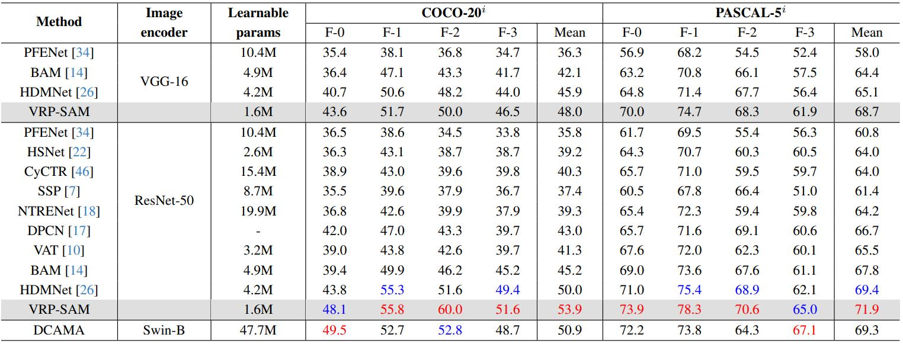

**表 2**：在 COCO-20i 和 PASCAL-5i 上的 one-shot 语义分割的表现。红色和蓝色分别表示最优和次优的结果。

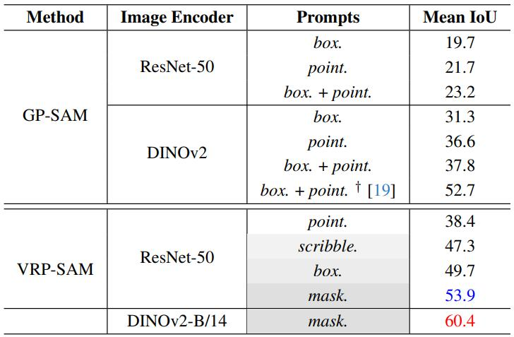

**表 3**：与几何提示的比较。几何提示从伪掩码随机采样所得。†表示 [19] 中提出的精心设计的采样策略。

### 5.3. Comparison with Geometric Prompts

在本文中，我们设计了视觉参考提示来表示目标信息。与 SAM 提供的几何提示 (GP) 不同，我们的 VRP 更加灵活和鲁棒。我们进行了比较 GP 和 VRP 的实验，以验证我们方法的优越性（见表 3）。在 GP-SAM 实验中，我们首先按照 [34] 的方法使用图像编码器为目标图像生成伪掩码，然后从伪掩码中获取点或边界框 2 作为几何提示。实验结果一致表明，我们的 VRP 始终优于 GP 方法。我们在图 4 中可视化了 GP-SAM 和我们的 VRP-SAM 的分割结果。可视化结果表明，GP 方法容易生成假阳性提示，从而显著影响分割性能。相比之下，我们的 VRP 有效地避免了此类问题。

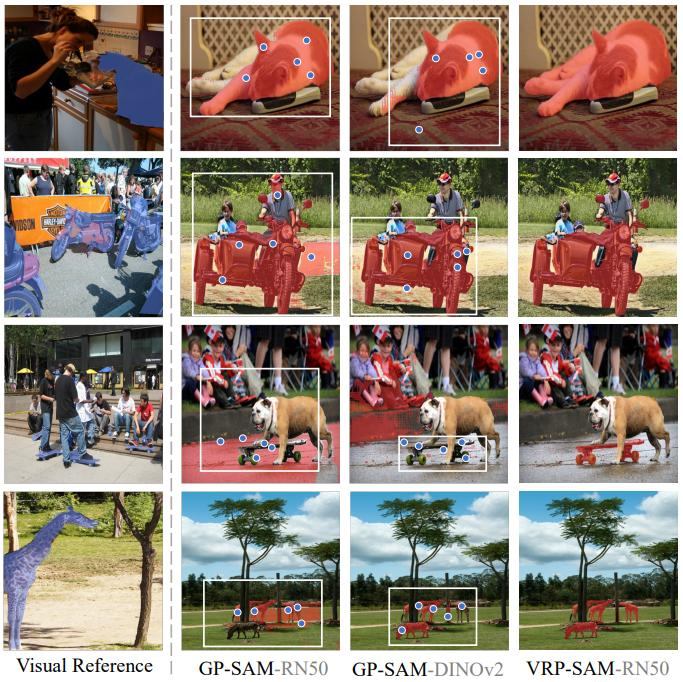

**图 4**：VPR-SAM 和 GP-SAM 的可视化结果。

### 5.4. Generalization Evaluation

**领域迁移**：接下来，我们评估 VRP-SAM 在领域迁移场景中的有效性，该场景要求训练集和测试集之间存在显著的领域差异。遵循先前的工作 [22, 33, 34]，我们在 COCO-20i 上进行训练，并在 PASCAL-5i 上进行测试，其中训练集中的类别与测试集中的类别不重叠。表 4 中的结果（代表四个 folds 的平均值）清楚地表明 VRP-SAM 在领域迁移场景中具有优越的性能。值得注意的是，使用涂鸦标注的 VRP-SAM 比 FP-Trans [47] 高出 2.8%，而使用掩码标注的 VRP-SAM 比 DGPNet [11] 高出 5.8%。这证实了 VRP-SAM 强大的泛化能力及其在领域迁移场景中的有效性。

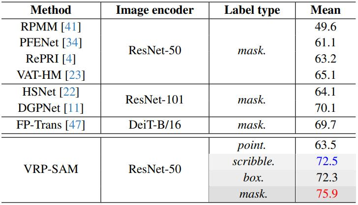

**表 4**：从 COCO-20i 到 PASCAL-5i 的领域迁移下的评估 (平均 IoU %)

**可视化**：为了评估 VRP-SAM 在不同图像风格上的泛化能力，我们从网络上收集了一组目标图像，涵盖了各种类型，如自然景观、艺术作品和复杂环境。视觉参考提示 (VRP) 从 COCO 数据集中选择，用于指导这些目标图像的分割。不同图像风格上的分割结果如图 5 所示。这表明 VRP-SAM 能够熟练地适应各种图像风格，准确地描绘目标对象。值得注意的是，VRP-SAM 在处理水墨风格的图像方面表现出色，展现了精细的分割性能。这有力地强调了 VRP-SAM 在面对未知风格的图像时的鲁棒性和有效性。

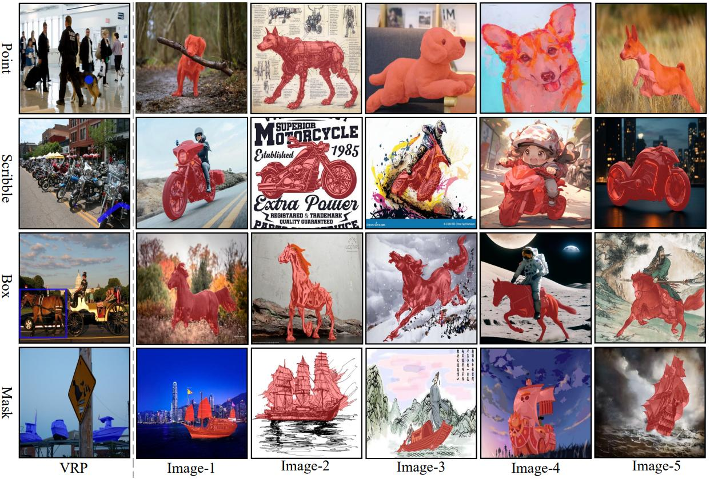

**图 5**：展示了 VRP-SAM 在不同图像风格上的定性结果。目标图像来源于网络。

### 5.5. Ablation Study

为了验证 VRP-SAM 的有效性，我们在 PASCAL-5i 数据集上进行了广泛的消融研究。选择 ResNet-50 作为 VRP 的图像编码器，以确保实验的一致性。这些实验旨在彻底调查 VRP-SAM 在各种条件下的性能。

**损失函数**：为了评估二元交叉熵 (BCE) 损失和 Dice 损失对 VRP-SAM 的影响，我们在 PASCAL-5i 数据集上进行了实验。表 5 中的结果表明，单独使用 BCE 损失或 Dice 损失时，性能相当。值得注意的是，当两种损失函数结合使用时，VRP-SAM 取得了最佳性能。这强调了 BCE 损失和 Dice 损失在引导 VRP-SAM 生成更鲁棒和准确的掩码方面的重要性。BCE 损失确保精确的像素级分类，而 Dice 损失有助于对象的准确空间定位。在 VRP-SAM 中同时使用 BCE 损失和 Dice 损失可以最大限度地发挥它们的互补优势。

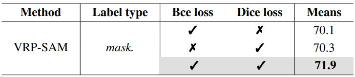

**表 5**：VRP-SAM 不同损失函数的消融实验。

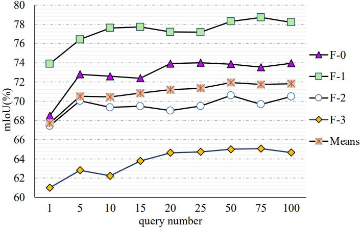

**图 6**：VRP-SAM 不同 query 数量的消融实验。x 轴表示 queries 的数量，y 轴表示模型的性能。

**查询数量**：在图 6 中，我们对不同查询数量对 VRP-SAM 性能的影响进行了全面的分析。我们观察到，增加查询数量与分割质量的提高之间存在正相关关系。然而，一旦查询数量超过 50，性能增益开始减小。这种现象表明，50 个查询为模型提供了充足的有效指导，而进一步增加查询数量并不会带来显著的改进，导致性能饱和。为了在保持高性能的同时最小化模型的可学习参数，我们将 VRP-SAM 中的查询数量设置为 50。这个决定在指导信息和模型效率之间取得了最佳平衡。

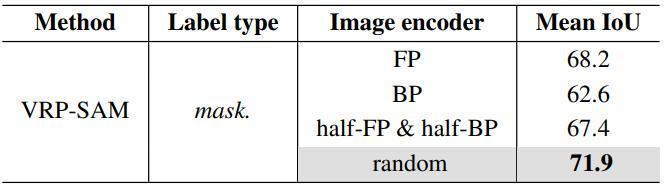

**表 6**：VRP-SAM 的 query 不同初始化方法的消融实验。

**查询初始化**：在表 6 中，我们比较了各种查询初始化策略，例如随机初始化、前景原型 (FP)、背景原型 (BP) 以及前景和背景各占一半的混合原型 (half-FP & half-BP)。令人惊讶的是，随机初始化优于所有其他策略，展现出卓越的性能。这种意想不到的结果可以归因于复杂的分割任务和数据集的对象多样性。随机初始化使模型能够探索更广泛的状态，避免潜在的局部最小值。相比之下，基于原型的初始化，无论是前景、背景还是它们的组合，都可能引入偏差，限制了模型对不同对象特征的适应性。

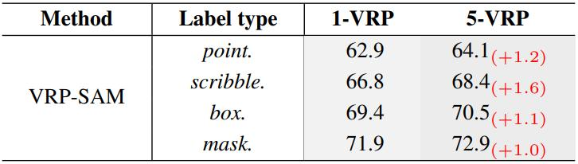

**表 7**：VRP-SAM 少量视觉参考的消融实验。

**VRP 数量**：在我们对视觉参考提示数量对分割结果的影响的研究中，我们探索了使用少量视觉参考提示的方法。这种方法涉及向 VRP 编码器发送多个视觉参考提示，生成多个提示嵌入。这些嵌入被连接起来并转发到掩码解码器，从而生成最终的掩码。表 7 中的结果显示，随着视觉参考提示数量的增加，分割性能得到了显著提升。结果强调了结合多个视觉参考提示的积极影响，增强了模型准确捕捉与目标对象相关的复杂细节和细微差别的能力。多样化的提示贡献了丰富的上下文信息，有助于更全面地理解对象的特征，并生成精确而细致的分割掩码。

## 6. Conclusion

在本文中，我们提出了 VRP-SAM，它是通过集成视觉参考提示 (VRP) 编码器实现的 SAM 框架的创新扩展。这一新增功能使 SAM 能够利用视觉参考提示进行引导式分割。核心方法包括通过 VRP 编码器编码带注释的参考图像，然后该编码器与目标图像交互，在 SAM 框架内生成有意义的分割提示。VRP 编码器与 SAM 的无缝融合产生了 VRP-SAM，增强了模型的通用性和适应性。VRP-SAM 克服了 SAM 现有提示格式带来的限制，尤其是在复杂场景和大型数据集方面。引入的视觉参考提示，包括点、框、涂鸦和掩码标注，提供了一种灵活的解决方案，扩展了模型的适用性。大量的实证研究表明，VRP-SAM 在视觉参考分割方面取得了最先进的性能，且仅需极少的学习参数。值得注意的是，VRP-SAM 展示了强大的泛化能力，在对新颖对象和跨域场景的分割任务中表现出色。

## Appendix

### A. Additional Implementation Details

**训练**：为了捕获参考图像和目标图像之间的语义相关性，我们在视觉提示编码器中引入了一个语义相关性模型。具体来说，我们验证了 VRP-SAM 在 VGG16 [3]、ResNet-50 [9] 和 DINOv2 [25] 上的有效性。遵循先前的工作 [32, 34]，我们利用图像编码器的中层特征来保留更精细的细节，而高层特征用于为目标图像生成伪掩码。例如，在 ResNet-50 的情况下，中层特征对应于第 3 和第 4 个块，而高层特征从第 5 个块中提取。

在视觉参考编码器的特征增强器中，通过比较参考图像和目标图像的高层特征来评估像素级相似度图，从而计算目标图像的伪掩码。我们保留每个像素的最大相似度，并使用最小-最大归一化将相似度图归一化到 [0, 1] 范围。此相似度图用作目标图像的伪掩码。我们遵循 SEEM [50] 的方法，其中点参考提示涉及从真实标签 (GT) 中随机采样 (1, 20) 个点，涂鸦参考提示使用 [44] 中提出的自由形式训练掩码生成算法随机生成，得到 (1, 20) 个涂鸦，而框参考提示通过从 GT 中提取对象边界框获得。

**评估**：为了对所采用的基准进行定量评估，我们采用了与训练策略相同的方法来获取关于点、涂鸦和框的视觉参考提示。对于点和涂鸦，我们随机选择了 (1, 20) 作为提示。在视觉实验中，我们展示了仅使用一个点或涂鸦的 VRP-SAM 的性能。当使用 N 个视觉参考提示进行推理时，我们利用视觉参考提示编码器生成 N 组查询。随后，这 N 组查询被连接起来并输入到掩码解码器中。

### B. Datasets Setting

为了量化 VRP-SAM 对未见物体的泛化能力，我们采用了小样本分割的数据设置，将 COCO 和 PASCAL 数据集中的所有类别组织成四个 folds。对于每个 fold，PASCAL-5i [29] 包含 15 个用于训练的基础类别和 5 个用于测试的新类别，而 COCO-20i [24] 包含 60 个训练基础类别和 20 个测试新类别。表 8 和表 9 详细列出了每个 fold 中 PASCAL-5i 和 COCO-20i 的测试类别，其中训练类别由其他 folds 的测试类别组合而成。此外，为了评估 VRP-SAM 在领域迁移方面的性能，我们在 COCO-20i 上进行训练，并在 PASCAL-5i 上进行测试。为了确保训练类别和测试类别之间没有重叠，我们对 PASCAL 数据集进行了新的划分，表 10 详细描述了 PASCAL 新划分的 folds。

### C. More experiments

#### C.1. Comparison with the State-of-the-art

为了展示 VRP-SAM 的卓越性能，我们在 COCO-20i 数据集上进行了实验，并将其与最先进的方法进行了比较。如表 11 所示，当在 VRP-SAM 中采用 DINOv2-B [25] 作为图像编码器时，我们观察到了出色的结果，尤其是在首次超越 SegGPT [39] 方面——SegGPT 是一种利用在域内数据集上训练的图像编码器的方法。此外，使用 ResNet-50 作为图像编码器仍然取得了 53.9 的显著平均 IoU，优于当前大多数方法。这些发现证实了 VRP-SAM 在不同编码器上的多功能性和鲁棒性，巩固了其在视觉参考分割任务中的优越性。

#### C.2. Different label type

我们对参考图像的标签类型进行了消融研究，探讨了它们在使用 VGG-16 和 ResNet-50 的情况下对 VRP-SAM 结果的影响。表 12 展示了研究结果，表明随着标注精度的提高，性能逐渐提升，尤其是在从点到掩码的转变过程中。具体来说，从点标注过渡到掩码标注显著提升了 VRP-SAM 的性能，大约提升了 15 个 mIoU。这突显了标注粒度对 VRP-SAM 性能的关键影响。

#### C.3. Comparison on base set

为了评估 VRP-SAM 在已训练类别上的性能，我们从 COCO-20i 的训练集中随机选择了 1000 个参考-目标图像对。这个子集用于测试 VRP-SAM 在其已训练类别上的性能。我们将每个 fold 中用于训练的类别组成的测试集称为基础集。如表 13 所示的实验结果表明，VRP-SAM 在基础集上的表现优于在新类别集上的表现。这种改进归因于 VRP-SAM 在训练期间获得了关于基础类别的特定知识，从而提高了在这些类别上的性能。此外，使用 DINOv2 作为图像编码器显著提高了 VRP-SAM 在基础集上的性能。这种改进归因于 DINOv2 的特征表示更擅长捕获复杂的语义关系，从而提高了模型在已知类别上的性能。

#### C.4. Compare with text-guided SAM

文本引导的 SAM 也可以根据类别名称分割目标对象，从而实现与 VRP-SAM 类似的功能。为了验证这一点，我们在 PASCAL-5i 设置下与现有的文本引导 SAM 进行了比较。如表 14 所示的实验结果表明，文本引导的 SAM 的性能较差。这不仅表明 SAM 是一个语义无关的分割模型，而且突出了 VRP-SAM 的优越性。

#### C.5. Results on more application scenarios

在上述专注于典型对象分割任务的实验中，我们对 VRP-SAM 进行了全面的评估。接下来，我们验证 VRP-SAM 在非典型对象分割任务中的有效性。具体来说，我们对部件分割和视频对象分割任务都进行了实验。结果如表 15 和表 16 所示。结果证实了 VRP-SAM 在部件分割和视频对象分割领域具有良好的性能。我们相信这些发现进一步支持了 VRP-SAM 在各种应用中的多功能性。

### D. Limitation and future works

目前，我们仅在小样本语义分割任务中展示了 VRP-SAM 的有效性。将 VRP-SAM 扩展到更多视觉任务，例如视频对象分割和目标跟踪，还需要进一步研究。我们将其留作未来的工作。
