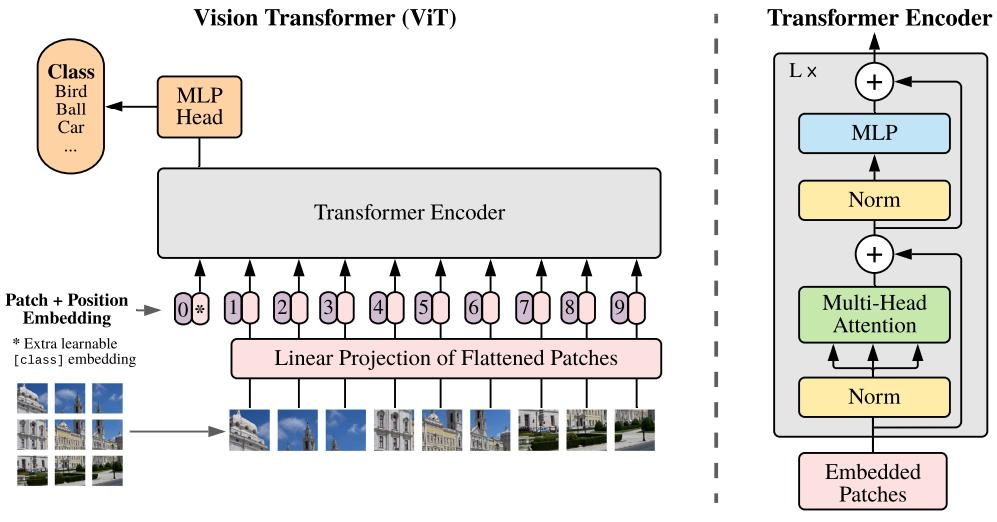
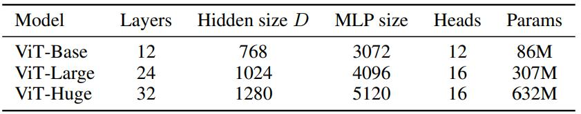
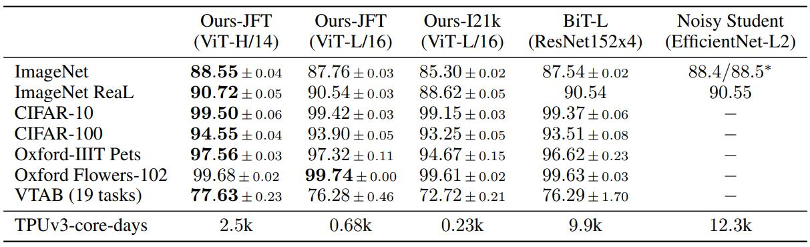
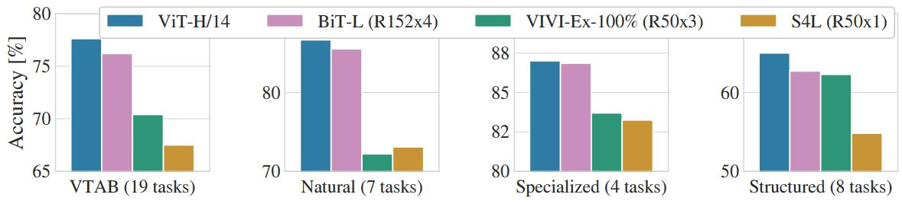

# [AN IMAGE IS WORTH 16X16 WORDS: TRANSFORMERS FOR IMAGE RECOGNITION AT SCALE](https://arxiv.org/abs/2010.11929)

## Abstract

虽然 Transformer 架构已成为自然语言处理任务的实际标准，但其在计算机视觉领域的应用仍然有限。在视觉领域，注意力机制要么与卷积网络结合应用，要么用于替代卷积网络的某些组件，同时保留其整体结构。我们表明，这种对 CNN 的依赖并非必需，直接应用于图像块序列的纯 Transformer 在图像分类任务上可以表现得非常好。当在大量数据上进行预训练并迁移到多个中小型图像识别基准测试（ImageNet、CIFAR-100、VTAB 等）时，Vision Transformer (ViT) 与最先进的卷积网络相比取得了优异的结果，同时训练所需的计算资源大幅减少。

## 1 INTRODUCTION

基于自注意力的架构，特别是 Transformer (Vaswani 等人，2017)，已成为自然语言处理（NLP）领域的首选模型。主流方法是在大型文本语料库上进行预训练，然后在较小的特定任务数据集上进行微调 (Devlin 等人，2019)。得益于 Transformer 的计算效率和可扩展性，训练参数超过千亿 (Brown 等人，2020; Lepikhin 等人，2020) 的超大规模模型成为可能。随着模型和数据集的增长，性能仍未出现饱和迹象。

然而，在计算机视觉领域，卷积架构仍占据主导地位 (LeCun 等人，1989; Krizhevsky 等人，2012; He 等人，2016)。受 NLP 成功的启发，多项工作试图将类 CNN 架构与自注意力相结合 (Wang 等人，2018; Carion 等人，2020)，其中一些完全替代了卷积 (Ramachandran 等人，2019; Wang 等人，2020a)。后者的模型虽然理论上高效，但由于使用了专门的注意力模式，尚未在现代硬件加速器上有效地进行扩展。因此，在大规模图像识别领域，经典的 ResNet 类架构仍然是最先进的 (Mahajan 等人，2018; Xie 等人，2020; Kolesnikov 等人，2020)。

受 Transformer 在 NLP 中扩展成功的启发，我们尝试将标准的 Transformer 直接应用于图像，并进行尽可能少的修改。为此，我们将图像分割成图像块，并将这些图像块的线性嵌入序列作为 Transformer 的输入。图像块的处理方式与 NLP 应用中的 token (单词) 相同。我们在监督学习的方式下，在图像分类任务上训练该模型。

当在像 ImageNet 这样大小适中的数据集上训练时，如果缺乏强正则化，这些模型产生的准确率较低，比同等大小的 ResNet 低几个百分点。这种看似令人沮丧的结果可能是预料之中的：Transformer 缺乏 CNN 固有的归纳偏置，例如平移不变性和局部性（locality），因此在数据量不足时泛化能力不佳。

然而，如果在更大的数据集（14M-300M 图像）上进行训练，情况就改变了。我们发现大规模训练胜过归纳偏置。我们的 Vision Transformer (ViT) 在进行足够规模的预训练并迁移到数据点较少的任务时，取得了优异的结果。当在公开的 ImageNet-21k 数据集或内部的 JFT-300M 数据集上进行预训练时，ViT 在多个图像识别基准测试上接近或超过了当前最先进水平。特别是，最佳模型在 ImageNet 上达到了 88.55% 的准确率，在 ImageNet-ReaL 上达到 90.72%，在 CIFAR-100 上达到 94.55%，在包含 19 个任务的 VTAB 套件上达到 77.63%。

## 2 RELATED WORK

Transformer 模型最初由 Vaswani 等人于 2017 年提出，用于机器翻译，此后成为许多自然语言处理 (NLP) 任务的最先进方法。大型基于 Transformer 的模型通常在大规模语料库上进行预训练，然后针对手头的任务进行微调：BERT (Devlin 等人，2019) 使用去噪自监督预训练任务，而 GPT 系列工作则使用语言建模作为其预训练任务 (Radford 等人，2018; 2019; Brown 等人，2020)。

将自注意力机制简单地应用于图像将需要每个像素关注所有其他像素。随着像素数量的平方级成本，这无法扩展到实际的输入尺寸。因此，过去已经尝试了在图像处理背景下应用 Transformer 的几种近似方法。Parmar 等人 (2018) 仅在每个查询像素的局部邻域应用自注意力，而不是全局应用。这种局部的多头点积自注意力块可以完全替代卷积 (Hu 等人，2019; Ramachandran 等人，2019; Zhao 等人，2020)。在另一项工作中，Sparse Transformers (Child 等人，2019) 采用可扩展的全局自注意力近似方法，以便适用于图像。另一种扩展注意力的方法是在不同大小的块中应用它 (Weissenborn 等人，2019)，在极端情况下仅沿单个轴应用 (Ho 等人，2019; Wang 等人，2020a)。这些专门的注意力架构中有许多在计算机视觉任务上展示了有希望的结果，但在硬件加速器上高效实现需要复杂的工程。

与我们的工作最相关的是 Cordonnier 等人 (2020) 的模型，该模型从输入图像中提取 2×2 大小的图像块，并在其上应用完整的自注意力。这个模型与 ViT 非常相似，但我们的工作更进一步，证明大规模预训练使得普通的 Transformer 可以与最先进的 CNN 竞争（甚至优于后者）。此外，Cordonnier 等人 (2020) 使用了 2×2 像素的小图像块大小，这使得模型仅适用于小分辨率图像，而我们也处理中等分辨率图像。

将卷积神经网络 (CNN) 与各种形式的自注意力机制相结合也引起了广泛关注，例如通过增强特征图进行图像分类 (Bello et al., 2019)，或者通过使用自注意力机制进一步处理 CNN 的输出，例如用于目标检测 (Hu et al., 2018; Carion et al., 2020)、视频处理 (Wang et al., 2018; Sun et al., 2019)、图像分类 (Wu et al., 2020)、无监督目标发现 (Locatello et al., 2020) 或统一的文本-视觉任务 (Chen et al., 2020c; Lu et al., 2019; Li et al., 2019)。

另一个最近相关的模型是 image GPT (iGPT) (Chen et al., 2020a)，它在降低图像分辨率和色彩空间后，将 Transformer 应用于图像像素。该模型以无监督的方式作为生成模型进行训练，然后可以对生成的表示进行微调或线性探测以评估分类性能，在 ImageNet 上实现了 72% 的最高准确率。

我们的工作进一步丰富了在比标准 ImageNet 数据集更大规模上探索图像识别的研究。使用额外的数据源可以在标准基准测试中取得最先进的结果 (Mahajan et al., 2018; Touvron et al., 2019; Xie et al., 2020)。此外，Sun et al. (2017) 研究了 CNN 性能如何随数据集大小扩展，而 Kolesnikov et al. (2020) 和 Djolonga et al. (2020) 对来自 ImageNet-21k 和 JFT-300M 等大规模数据集的 CNN 迁移学习进行了实证探索。我们也关注后两个数据集，但我们训练的是 Transformer，而不是先前工作中使用的基于 ResNet 的模型。

**图 1**：模型概述。我们将图像分割成固定大小的图像块，对每个图像块进行线性嵌入，添加位置嵌入，然后将得到的向量序列输入到标准的 Transformer 编码器。为了执行分类，我们采用标准方法，即在序列中添加一个额外的可学习的“分类token”。Transformer 编码器的示意图灵感来自于 Vaswani 等人 (2017)的工作。

## 3 METHOD

在模型设计上，我们尽可能地遵循了原始 Transformer (Vaswani et al., 2017) 的结构。这种刻意简化的设置有一个优势，那就是可扩展的自然语言处理 (NLP) Transformer 架构及其高效的实现几乎可以“开箱即用”。

### 3.1 VISION TRANSFORMER (VIT)

模型的概述如图 1 所示。标准 Transformer 接收一维的词元嵌入序列作为输入。为了处理二维图像，我们将图像 $\large \mathbf{x} \in \mathbb{R}^{H \times W \times C}$ 重塑为一个扁平化的二维图像块序列 $\large \mathbf{x}_p \in \mathbb{R}^{N \times (P^2 \cdot C)}$ ，其中 (H,W) 是原始图像的分辨率，C 是通道数，(P,P) 是每个图像块的分辨率，而 $N=HW/P^2$ 是最终的图像块数量，同时也作为 Transformer 的有效输入序列长度。Transformer 在其所有层中使用恒定的潜向量 (latent vector) 大小 D，因此我们将图像块扁平化，并通过一个可训练的线性投影（公式1）将其映射到 D 维。我们将此投影的输出称为图像块嵌入。

与 BERT 的 [class] token 类似，我们在嵌入式图像块序列的开头添加一个可学习的嵌入 $\large (\mathbf{z}_0^0 = \mathbf{x}_{\text{class}})$ ，其在 Transformer 编码器输出端的状态 $(\mathbf{z}_L^0)$ 作为图像表示 $\mathbf{y}$（公式4）。在预训练和微调期间，一个分类头都连接到 $\mathbf{z}_L^0$ 。该分类头在预训练时由一个带有一个隐藏层的多层感知机 (MLP) 实现，在微调时则由一个单独的线性层实现。

位置嵌入被添加到图像块嵌入中以保留位置信息。我们使用标准的可学习一维位置嵌入，因为我们没有观察到使用更高级的二维感知位置嵌入会带来显著的性能提升（附录 D.4）。由此产生的嵌入向量序列作为编码器的输入。

Transformer 编码器 (Vaswani et al., 2017) 由交替的多头自注意力层 (MSA，见附录 A) 和 MLP 模块（公式 2, 3）组成。在每个模块之前应用层归一化 (LN)，在每个模块之后应用残差连接 (Wang et al., 2019; Baevski & Auli, 2019)。

多层感知机（MLP）包含两层，使用GELU非线性激活函数。

$$
\large \mathbf{z}_0 = [ \mathbf{x}_{\text{class}} ; \mathbf{x}_p^1 \mathbf{E}; \mathbf{x}_p^2 \mathbf{E}; \cdots ; \mathbf{x}_p^N \mathbf{E}; ] + \mathbf{E}_{pos}, \ \mathbf{E} \in \mathbb{R}^{(P^2 \cdot C) \times D}, \ \mathbf{E}_{pos} \in \mathbb{R}^{(N+1) \times D} \tag{1}
$$

$$
\large \mathbf{z}_{\ell}^{\prime} = \text{MSA}(\text{LN}(\mathbf{z}_{\ell - 1})) + \mathbf{z}_{\ell - 1}, \ \ell = 1 \cdots L \tag{2}
$$

$$
\large \mathbf{z}_{\ell} = \text{MLP}(\text{LN}(\mathbf{z}_{\ell}^{\prime})) + \mathbf{z}_{\ell}^{\prime}, \ \ell = 1 \cdots L \tag{3}
$$

$$
\large \mathbf{y} = \text{LN}(\mathbf{z}_L^0) \tag{4}
$$

**归纳偏置**。我们注意到，与 CNNs 相比，Vision Transformer 具有少得多的图像特有的归纳偏置。在 CNNs 中，局部性、二维邻域结构和平移不变性被硬编码到整个模型的每一层中。在 ViT 中，只有 MLP 层是局部的和具备平移不变性的，而自注意力层是全局的。二维邻域结构的使用非常少：仅在模型开始时通过将图像切割成图像块，以及在微调阶段调整不同分辨率图像的位置嵌入（如下所述）时使用。除此之外，初始化时的位置嵌入不包含关于图像块二维位置的信息，并且图像块之间的所有空间关系都必须从头开始学习。

**混合架构**。作为直接使用原始图像块的替代方案，输入序列可以由 CNN（LeCun等人，1989）的特征图构成。在这种混合模型中，图像块嵌入投影 $\mathbf{E}$ （公式1）应用于从 CNN 特征图提取的图像块。作为一种特殊情况，图像块的空间尺寸可以是 1x1，这意味着输入序列是通过简单地展平特征图的空间维度并投影到Transformer 的维度而获得的。分类输入嵌入和位置嵌入的添加方式如上所述。

### 3.2 FINE-TUNING AND HIGHER RESOLUTION

通常，我们会在大型数据集上预训练 ViT，然后将其微调到（较小的）下游任务。为此，我们移除预训练好的预测头，并连接一个零初始化 $D \times K$ 的前馈层，其中 $K$ 是下游类别的数量。通常，在比预训练更高的分辨率下进行微调会更有益（Touvron et al., 2019; Kolesnikov et al., 2020）。当输入更高分辨率的图像时，我们保持图像块大小不变，这将导致有效序列长度变大。Vision Transformer 可以处理任意序列长度（受限于内存），然而，预训练的位置嵌入可能不再有意义。因此，我们根据预训练位置嵌入在原始图像中的位置，对其进行二维插值。请注意，这种分辨率调整和图像块提取是唯一将关于图像二维结构的归纳偏置手动注入到 Vision Transformer 中的地方。

## 4 EXPERIMENTS

我们评估了 ResNet、Vision Transformer (ViT) 和混合模型的表征学习能力。为了解每种模型的数据需求，我们在不同大小的数据集上进行预训练，并评估了许多基准任务。在考虑模型预训练的计算成本时，ViT 表现非常出色，以更低的预训练成本在大多数识别基准上达到了最新技术水平。最后，我们进行了一项使用自监督的小型实验，结果表明自监督 ViT 未来前景可期。

### 4.1 SETUP

**表 1**：Vision Transformer 模型变体的详细信息。

**数据集**。为了探究模型的可扩展性，我们使用了包含 1 千个类别和 130 万张图像的 ILSVRC-2012 ImageNet 数据集（下文中我们称之为 ImageNet），其超集ImageNet-21k，包含 2.1 万个类别和 1400 万张图像（Deng et al., 2009），以及JFT（Sun et al., 2017），包含 1.8 万个类别和 3.03 亿张高分辨率图像。我们根据 Kolesnikov et al. (2020) 的方法，对预训练数据集相对于下游任务的测试集进行了去重。我们将这些数据集上训练的模型迁移到多个基准任务上：ImageNet 的原始验证标签和清理后的 ReaL 标签（Beyer et al., 2020）、CIFAR-10/100（Krizhevsky, 2009）、Oxford-IIIT Pets（Parkhi et al., 2012）和 Oxford Flowers-102（Nilsback & Zisserman, 2008）。对于这些数据集，预处理遵循 Kolesnikov et al. (2020) 的方法。

我们还在 19 项任务的VTAB分类套件（Zhai et al., 2019b）上进行评估。VTAB 使用每个任务 1000 个训练样本，评估低数据量向多样化任务的迁移能力。这些任务分为三组：自然——类似于上述的Pets、CIFAR等任务；专业——医学和卫星图像；以及结构化——需要几何理解的任务，如定位。

**模型变体**。我们将 ViT 的配置基于 BERT（Devlin et al., 2019）所使用的配置，如表 1 所示。“Base” 和 “Large” 模型直接沿用了 BERT 的配置，我们额外增加了更大的 “Huge” 模型。下文我们将使用简写符号来表示模型大小和输入图像块大小：例如，ViT-L/16 表示 “Large” 变体，输入图像块大小为 16×16。请注意，Transformer 的序列长度与图像块大小的平方成反比，因此图像块大小较小的模型计算成本更高。

对于基线 CNNs，我们使用 ResNet（He et al., 2016），但将批量归一化层（Ioffe & Szegedy, 2015）替换为组归一化（Wu & He, 2018），并使用了标准化卷积（Qiao et al., 2019）。这些修改改善了迁移能力（Kolesnikov et al., 2020），我们将修改后的模型命名为 “ResNet (BiT)”。对于混合模型，我们将中间特征图输入到 ViT 中，图像块大小为 1 “像素”。为了实验不同的序列长度，我们或者 (i) 取常规 ResNet50 的第四阶段输出，或者 (ii) 移除第四阶段，在第三阶段放置相同数量的层（保持总层数不变），并取此扩展第三阶段的输出。选项 (ii) 会导致序列长度增加 4 倍，并且 ViT 模型的计算成本更高。

**训练与微调**。 我们使用 Adam 优化器（Kingma & Ba, 2015）训练所有模型，包括 ResNets，其中 $\beta_1 = 0.9, \beta_2 = 0.999$ ，批量大小为 4096，并应用 0.1 的高权重衰减，我们发现这对于所有模型的迁移都很有帮助（附录 D.1 显示，与常见做法相反，在我们的设置中，Adam 对 ResNets 的效果略好于 SGD）。我们使用线性学习率热身和衰减，详情见附录 B.1。微调时，我们对所有模型使用带有动量的 SGD，批量大小为 512，详见附录 B.1.1。对于表 2 中的 ImageNet 结果，我们在更高分辨率下进行了微调：ViT-L/16 使用 512 分辨率，ViT-H/14 使用 518 分辨率，并且使用了因子为 0.9999 的Polyak & Juditsky (1992) 平均法（Ramachandran et al., 2019; Wang et al., 2020b）。

**评估指标**。我们报告下游数据集上的结果，可以是少样本准确率或微调准确率。微调准确率衡量模型在相应数据集上微调后的性能。少样本准确率是通过解决一个正则化最小二乘回归问题获得的，该问题将一部分训练图像的（冻结的）表征映射到 $\set{−1,1}^K$ 目标向量，其中 K 是下游类别的数量。这种公式化方法允许我们获得闭式精确解。虽然我们主要关注微调性能，但在微调成本过高的情况下，有时会使用线性少样本准确率进行快速即时评估。

### 4.2 COMPARISON TO STATE OF THE ART

**表 2**：与流行图像分类基准上的最新技术水平进行比较。我们报告了准确率的均值和标准差，这些结果是对三次微调运行取平均得到的。在 JFT-300M 数据集上预训练的 Vision Transformer 模型在所有数据集上都优于基于 ResNet 的基线模型，同时预训练所需的计算资源大幅减少。在较小的公共 ImageNet-21k 数据集上预训练的 ViT 也表现良好。*Touvron et al. (2020) 中报告的略微提升的 88.5% 结果。

**图 2**：自然、专业和结构化任务组中 VTAB 表现的细分。

我们首先将我们最大的模型——ViT-H/14 和 ViT-L/16 与文献中最新的 CNNs 比较。第一个比较对象是 Big Transfer (BiT) (Kolesnikov et al., 2020)，它使用大型ResNets 进行监督式迁移学习。第二个是 Noisy Student (Xie et al., 2020)，这是一个大型 EfficientNet，在 ImageNet 和移除了标签的 JFT-300M 上使用半监督学习进行训练。目前，Noisy Student 是 ImageNet 上的最新技术水平，而 BiT-L 在此处报告的其他数据集上是最新技术水平。所有模型都在 TPUv3 硬件上训练，我们报告每个模型的预训练所需的 TPUv3 核心天数，即用于训练的 TPU v3 核心数量（每芯片2个）乘以训练天数。

表 2 显示了结果。在 JFT-300M 上预训练的较小的 ViT-L/16 模型在所有任务上都优于 BiT-L（在相同数据集上预训练），同时训练所需的计算资源大幅减少。更大的模型 ViT-H/14 进一步提升了性能，尤其是在更具挑战性的数据集上——ImageNet、CIFAR-100 和 VTAB 套件。有趣的是，这个模型的预训练计算量仍然远低于先前的最新技术水平。然而，我们注意到预训练效率不仅可能受架构选择影响，还受其他参数影响，例如训练计划、优化器、权重衰减等。我们在 4.4 节中对不同架构的性能与计算量进行了对照研究。最后，在公共 ImageNet-21k 数据集上预训练的 ViT-L/16 模型在大多数数据集上也表现良好，同时预训练所需的资源较少：使用标准的 8 核云 TPUv3 大约 30 天即可训练完成。

图 2 将 VTAB 任务分解为各自的组别，并与此基准上的先前 SOTA 方法进行比较：BiT，VIVI – 在 ImageNet 和 Youtube 上共同训练的 ResNet (Tschannen et al., 2020)，以及 S4L – 在 ImageNet上 的监督加半监督学习 (Zhai et al., 2019a)。ViT-H/14 在自然任务和结构化任务上优于 BiT-R152x4 和其他方法。在专业任务上，排名前两位的模型性能相似。

### 4.3 PRE-TRAINING DATA REQUIREMENTS

在大型 JFT-300M 数据集上预训练时，Vision Transformer 表现良好。与 ResNets 相比，ViT 对视觉的归纳偏置较少，那么数据集大小有多关键？我们进行了两系列实验。

首先，我们在规模不断增加的数据集上预训练ViT模型：ImageNet、ImageNet-21k 和 JFT-300M。为了提升在较小数据集上的性能，我们优化了三个基本正则化参数——权重衰减、dropout 和标签平滑。图 3 显示了在 ImageNet 上微调后的结果（在其他数据集上的结果显示在表5中）。当在最小的数据集 ImageNet 上预训练时，尽管进行了（适度）正则化，ViT-Large 模型的表现不如 ViT-Base 模型。在 ImageNet-21k 上预训练时，它们的性能相似。只有使用 JFT-300M，我们才能看到大型模型的全部优势。图 3还 显示了不同大小的 BiT 模型所涵盖的性能区域。BiT CNNs 在 ImageNet 上优于 ViT，但在更大的数据集上，ViT 反超。

其次，我们在 9M、30M 和 90M 的随机子集以及完整的 JFT-300M 数据集上训练我们的模型。我们不对较小的子集进行额外的正则化，并对所有设置使用相同的超参数。通过这种方式，我们评估模型的内在属性，而不是正则化的影响。但是，我们确实使用了早停，并报告了训练期间达到的最佳验证准确率。为了节省计算量，我们报告少样本线性准确率，而不是完整的微调准确率。图 4 包含了结果。在较小数据集上，计算成本相当的 Vision Transformer 比 ResNets 更容易过拟合。例如，ViT-B/32 略快于 ResNet50；它在 9M 子集上表现差得多，但在 90M+ 子集上表现更好。ResNet152x2 和 ViT-L/16 的情况也是如此。这个结果强化了卷积归纳偏置对于较小数据集有用的直觉，但对于更大的数据集，直接从数据中学习相关模式是足够的，甚至是有益的。

总的来说，ImageNet 上的少样本结果（图 4）以及 VTAB 上的低数据量结果（表 2）对于极低数据量迁移看起来很有前景。进一步分析 ViT 的少样本特性是未来工作的一个令人兴奋的方向。

### 4.4 SCALING STUDY

我们通过评估从 JFT-300M 迁移的性能，对不同模型进行了对照扩展研究。在这种设置下，数据大小不是模型性能的瓶颈，我们可以评估每种模型的性能与预训练成本的关系。模型集合包括：7 个 ResNets，分别是经过 7 个 epochs 预训练的 R50x1、R50x2、R101x1、R152x1、R152x2，以及经过 14 个 epochs 预训练的 R152x2 和 R200x3；6 个 Vision Transformers，分别是经过 7 个 epochs 预训练的 ViT-B/32、B/16、L/32、L/16，以及经过 14 个 epochs 预训练的 L/16 和 H/14；还有 5 个混合模型，分别是经过 7 个 epochs 预训练的 R50+ViT-B/32、B/16、L/32、L/16，以及经过 14 个 epochs 预训练的 R50+ViT-L/16（对于混合模型，模型名称末尾的数字代表的是 ResNet 骨干网络中的总下采样率，而不是图像块大小）。

图 5 包含了迁移性能与总预训练计算量之间的关系（计算成本的详细信息见附录 D.5）。每个模型的详细结果在附录表 6 中提供。可以观察到一些规律。首先，在性能/计算权衡方面，Vision Transformer 优于 ResNets。达到相同性能（在 5 个数据集上的平均）所需的计算量，ViT 大约比 ResNets 少 2 到 4 倍。其次，在计算预算较低时，混合模型的性能略优于 ViT，但对于大型模型，这种差异消失了。这个结果有些令人惊讶，因为人们可能会期望卷积局部特征处理能够在任何规模下辅助 ViT。第三，Vision Transformer 在尝试的范围内似乎没有饱和，这激励着未来的扩展努力。

### 4.5 INSPECTING VISION TRANSFORMER

为了开始理解 Vision Transformer 如何处理图像数据，我们分析了它的内部表征。Vision Transformer 的第一层将展平的图像块线性投影到低维空间（公式1）。图 7（左）显示了学到的嵌入滤波器的主成分。这些成分类似于每个图像块内精细结构的低维表征的合理基函数。

在投影之后，一个学到的位置嵌入被添加到图像块表征中。图 7（中）显示模型学会了在位置嵌入的相似性中编码图像内的距离，即距离较近的图像块倾向于具有更相似的位置嵌入。此外，还出现了行-列结构；同一行/列中的图像块具有相似的嵌入。最后，对于更大的网格，有时会出现正弦结构（附录 D）。位置嵌入学会表示二维图像拓扑这一事实解释了为什么手工制作的二维感知嵌入变体没有带来改进（附录 D.4）。

自注意力机制使得 ViT 即使在最低层也能整合整个图像的信息。我们研究了网络在多大程度上利用了这种能力。具体来说，我们根据注意力权重，计算信息整合在图像空间中的平均距离（图 7，右）。这种“注意力距离”类似于 CNN 中的感受野大小。我们发现，一些注意力头在最低层就已经关注到图像的大部分区域，这表明模型确实利用了全局整合信息的能力。其他注意力头在低层中始终具有较小的注意力距离。这种高度局部化的注意力在 Transformer 之前应用 ResNet 的混合模型中不那么明显（图 7，右），表明它可能起到与 CNN 中早期卷积层类似的作用。此外，注意力距离随网络深度的增加而增加。从全局来看，我们发现模型关注与分类在语义上相关的图像区域（图 6）。

### 4.6 SELF-SUPERVISION

Transformer 在自然语言处理（NLP）任务上表现出色。然而，它们的成功很大程度上不仅源于出色的可扩展性，还源于大规模的自监督预训练（Devlin et al., 2019; Radford et al., 2018）。我们还对用于自监督的掩码图像块预测进行了初步探索，模仿了 BERT 中使用的掩码语言建模任务。通过自监督预训练，我们较小的 ViT-B/16 模型在 ImageNet 上达到了 79.9% 的准确率，相较于从头开始训练，这是一个显著的 2% 的提升，但仍然落后于监督预训练 4%。附录 B.1.2 包含更多详细信息。我们将对比学习预训练（Chen et al., 2020b; He et al., 2020; Bachman et al., 2019; Henaff et al., 2020）的探索留给未来的工作。

## 5 CONCLUSION

我们探索了 Transformer 在图像识别领域的直接应用。与以往在计算机视觉中使用自注意力机制的工作不同，除了初始的图像块提取步骤之外，我们没有在架构中引入图像特有的归纳偏置。相反，我们将图像解释为一系列图像块，并由自然语言处理（NLP）中使用的标准 Transformer 编码器进行处理。这种简单但可扩展的策略，当与在大数据集上的预训练相结合时，表现出惊人的良好效果。因此，Vision Transformer 在许多图像分类数据集上达到或超越了最新技术水平，同时预训练成本相对较低。

尽管这些初步结果令人鼓舞，但仍存在许多挑战。其中之一是将 ViT 应用于其他计算机视觉任务，例如检测和分割。我们的结果，结合 Carion 等人（2020）的研究成果，表明了这种方法的前景。另一个挑战是继续探索自监督预训练方法。我们的初步实验表明自监督预训练带来了改进，但自监督预训练与大规模监督预训练之间仍存在巨大差距。最后，进一步扩展 ViT 可能会带来性能的提升。

## APPENDIX

### A MULTIHEAD SELF-ATTENTION

